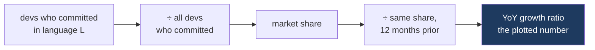

[Yesterday I argued]() that a type system is what lets a generator be searched rather than trusted, and that the argument rested on one controlled experiment and my own uncontrolled experience. David Tolnay has since published something closer to a natural experiment: eight years of language adoption across Meta's codebase, derived from the source-control tables that back the company's internal dashboards.[^1]

Five languages surge simultaneously around February–March 2026. Tolnay dates the cause without hedging: "This timeframe correlates with the uptake in agentic coding among Meta engineers in Q1 of 2026."

Four of the five are statically typed. That is worth taking seriously, and it is also worth reading the metric carefully before taking it too seriously, because the shape of the metric determines what the flat lines mean.

## What the chart measures

The methodology matters more than usual here, so it is worth stating precisely.

For each language, count the developers who committed code in it during a 90-day window. Divide by the total developers who committed anything in that window, which gives a market share and cancels out changes in company size. Then divide that share by the same language's share in the window ending twelve months earlier. The twelve-month spacing cancels seasonal effects — winter holidays, summer vacation — that Tolnay notes are well established in this dataset.

Three properties follow, and all three shape the conclusions.

The unit is a developer, not a line or a commit. Someone who writes one file in a language counts the same as someone who writes it full time.

The output is a ratio. A language's own history is the denominator, so the plotted number says nothing about size.

Participation is the thing being tracked. The chart measures how many people touched a language, not how much of it exists or how much work went through it.

## Five languages moved at once

Against that background, the pattern is unambiguous.

**TypeScript** sits at +1200% year over year, cropped off the top of the chart. It had been niche at Meta, under a tenth of the Flow/JavaScript userbase, and closed that gap in months.

**Rust** is second. It is the only language that has outpaced company growth for the entire eight-year period, never once dipping below +0%. And the volume claim is the one that does not depend on ratios at all: "Meta engineers have written twice as much first-party Rust code so far this year than in the previous 9 years combined."

**Swift, JavaScript and Go** complete the group, though Tolnay discounts one of them himself. The JavaScript growth, he notes, "consists predominantly of configuration files like “eslint.config.js” in TypeScript projects, not of any substantial new JavaScript projects." That is TypeScript's shadow rather than a JavaScript revival.

Then the sentence that makes the whole thing a finding rather than an anecdote: "Other than TypeScript, Rust, Swift, JavaScript, and Go, every other language on the chart is uncorrelated or at best slightly correlated with AI adoption."

So the languages whose adoption moved when agentic coding arrived were, discounting the config-file artifact, TypeScript, Rust, Swift and Go. Every one of them is statically typed, and three of the four are memory-safe by construction.

## A growth ratio hides the base

Here is where a reader can go badly wrong, and where I nearly did.

Hack, C++ and Python are flat. Tolnay calls them "immune to trends" — the three most used languages at Meta, all tracking company growth to within about ±7%. It is tempting to line that up against yesterday's argument and conclude that AI did not help with C++ and Python.

That conclusion does not follow, for a reason that is arithmetic rather than interpretive. These are the largest languages at Meta. A ratio divides by the base, so the larger the base, the smaller the ratio produced by a given amount of new work. If C++ has a hundred times the participation of Rust — a plausible order of magnitude at a company whose infrastructure is C++, though not a number the article supplies — then a 1% increase in C++ participation is comparable in absolute terms to a doubling of Rust, and one of those shows up as a vertical line while the other is invisible inside the noise band.

Flat does not mean idle. It means the derivative of the share is near zero, which at Meta's scale is entirely consistent with C++ absorbing more absolute engineering effort in 2026 than every surging language on the chart put together. Tolnay says as much in different words when he describes these three as saturating their addressable market: a language everyone already uses has no share left to gain.

The same arithmetic cuts the other way at the top of the chart. TypeScript's +1200% is computed against a base under a tenth of Flow/JavaScript's. Twelve hundred percent of a small number is a moderate number. It is a real and fast move — closing a tenfold gap in months is not nothing — but it is not twelve times the JavaScript ecosystem's worth of new TypeScript.

And because the unit is developers rather than volume, the metric counts dabbling at full weight. Tolnay's own explanation for TypeScript says so plainly: engineers and managers "are producing all kinds of dashboards and personal widgets in TypeScript that they never would have bothered to do without AI." A manager who ships one dashboard enters that window as a TypeScript developer.

## What survives

Strip out everything the metric cannot support and two things remain standing.

The first is Rust's volume claim, which is not a ratio. Twice as much first-party Rust this year as in the preceding nine years combined is a statement about how much code exists, immune to base effects and immune to the dabbling problem. Nobody produces that by writing personal dashboards.

The second is the correlation itself. Whatever the magnitudes, five languages inflected in the same quarter, that quarter is the one agentic coding landed, and the rest of the chart did not move. The confounds I have raised affect how large the effect is. They do not explain why the effect selected these languages.

That selection is the part I find hard to dismiss. If cheap code generation simply produced more code everywhere, the lift would be broad. It was not broad. It concentrated in languages where a compiler can reject a wrong program before it runs.

## Why these languages

The mechanism from yesterday's post predicts exactly this shape, so let me state the prediction rather than claim the data proves it.

A generator with a nonzero error rate is only useful in proportion to how cheaply its output can be checked. In TypeScript, Rust, Swift and Go, a large class of mistakes is a compile error, which is a machine-readable signal that goes back into the loop and drives it toward something that works. In Python the same mistake is a runtime failure at best and silently wrong output at worst, and the loop has nothing to converge against but tests you also have to write.

TypeScript deserves particular attention here, because it is the weakest type system in the surging group and it surged the hardest. Its checker is unsound by design — `any` defeats it, assertions defeat it, and the types are erased before anything runs. It still catches the overwhelming majority of what a model gets wrong in JavaScript: misspelled properties, wrong argument order, null where an object was expected, a renamed field left stale at three of its four call sites. A partial checker applied to a language whose alternative is no checker at all is an enormous improvement in the density of usable feedback, and it costs nothing to adopt incrementally.

Which is also why I would not read the C++ line as evidence against the mechanism even setting the saturation problem aside. C++ has a checker; the trouble is what it declines to check.

## What this does not show

The article measures adoption. It says nothing about whether the resulting code is good, whether it survived review, whether it is still running, or whether the Rust written this year is better than the C++ that was not. A count of developers touching a language is a coarse instrument, and every reading above inherits that coarseness.

It also cannot separate two explanations that both predict the same curves. Developers may be reaching for typed languages because generated code succeeds more often there. Or agentic coding may have lowered the cost of starting anything at all, and new projects at Meta in 2026 happen to start in TypeScript, Rust, Swift and Go for reasons of ordinary fashion, tooling and mandate. The dashboards remark supports the second reading. Rust's volume number fits the first better than the second.

The measurement that would separate them is the one nobody publishes, and it is the same one I asked for yesterday: defect rates in generated code, cut by language, controlled for task. Until that exists, this is a strong correlation with a plausible mechanism, arriving from a direction independent of the experiments I cited before. That is worth more than my own impressions and less than proof, and I would rather say so than round it up.

---

## References

[^1]: **Programming language adoption patterns at Meta.** David Tolnay, 11 August 2026. Derived from Meta's code review and source control tables covering all code changes submitted by Meta employees. Methodology: for each 90-day window, the count of developers committing in a language is divided by the total developers committing in any language to give a market share, then divided by the same language's share in the window ending twelve months prior; the twelve-month spacing cancels seasonal variation. All quotations in this post are from that article. ([x.com/dtolnay](https://x.com/dtolnay/article/2087229652293337160))

---

*Disclaimer: Researched and drafted with AI assistance (Claude Opus 5). Direction, technical judgment, and final edits are mine. Every figure and quotation here comes from Tolnay's article; I have no access to Meta's underlying data and cannot check the numbers. The hundred-to-one illustration of C++ against Rust is my own order-of-magnitude guess used to make an arithmetic point, not a figure from the article. The mechanism I offer for why these particular languages moved is a hypothesis consistent with the data rather than a result the data establishes.*
