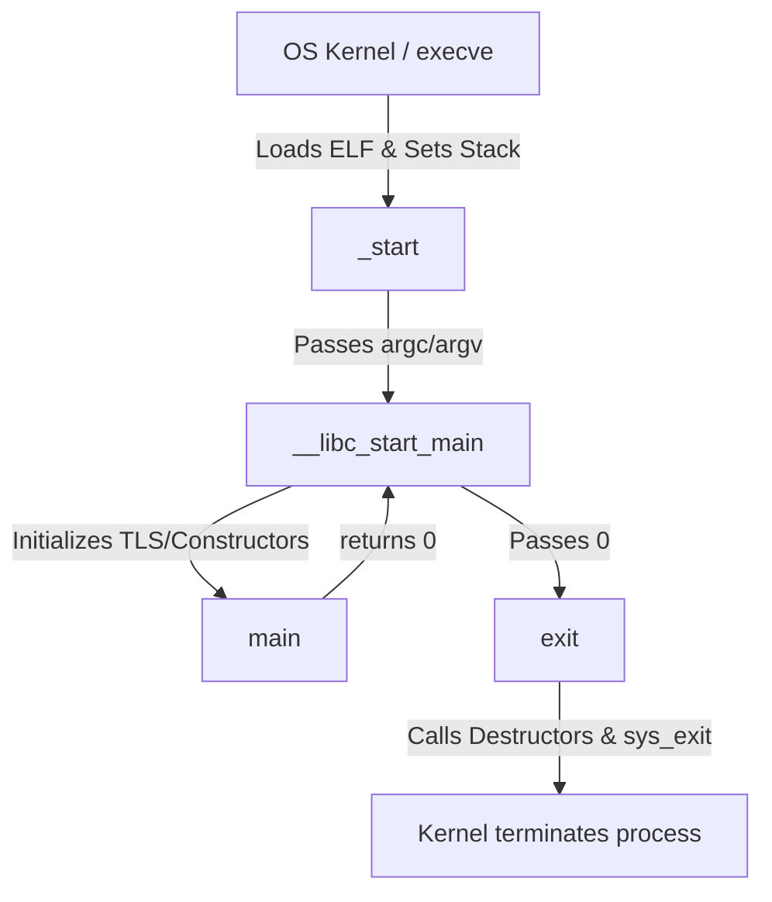
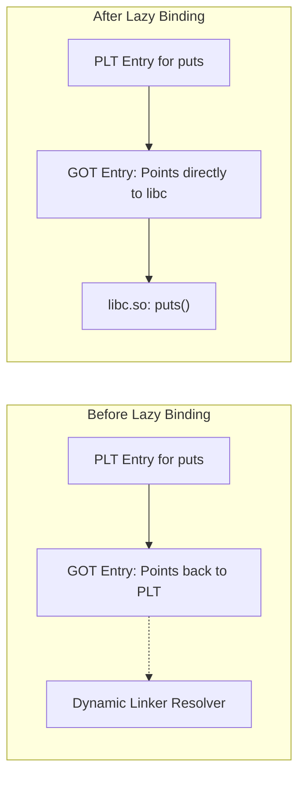

When you write the absolute simplest C program—one that does nothing but exit successfully—you might expect the compiled output to be trivial.

```c
int main() { 
    return 0; 
}
```

However, executing this program involves a highly intricate dance coordinated between the compiler, the linker, the C runtime (CRT), and the operating system's loader. Let's peel back the abstraction layers to understand exactly what happens before and after `main` executes.



## 1. The True Entry Point: `_start`

Contrary to popular belief, `main` is not the first thing executed when you run a C program. 

When the linker stitches your program together, it includes startup code provided by the C standard library (e.g., `crt1.o` in glibc). This object file defines a symbol named `_start`. 

The linker employs a specific mechanism to designate this as the entry point.

Under the hood, the linker uses a default linker script (which contains a directive like `ENTRY(_start)`). During the final linking phase, it resolves the virtual memory address of the `_start` symbol and explicitly writes this address into the `e_entry` field of the resulting ELF file's header (the `Elf64_Ehdr` structure). You can inspect this yourself by running `readelf -h a.out | grep "Entry point address"`.

When the operating system (specifically the `execve` syscall) loads your binary into memory, it parses the ELF header, extracts the `e_entry` address, and sets the CPU's instruction pointer (`%rip` on x86-64) to that exact address. Thus, execution officially begins at `_start`, not `main`. 

The `_start` routine itself is written in pure assembly because it has to deal with the raw state of the machine exactly as the kernel left it.

## 2. Setting Up the Stack Pointer and Environment

Before `_start` is executed, the OS kernel (via the `execve` system call) has already set up the initial execution environment. 

When the kernel maps your program into memory, it populates the top of the stack with crucial data. The memory layout looks exactly like this:

```text
+-------------------------+ High Addresses
| Environment Strings     |
| Argument Strings        |
+-------------------------+
| NULL                    |
| Auxiliary Vector (Elf64)|
| NULL                    |
| envp pointers           |
| NULL                    |
| argv pointers           |
| argc                    | <-- %rsp points here
+-------------------------+ Low Addresses
```

When `_start` wakes up, the stack pointer (`%rsp`) points directly to `argc`. The kernel didn't execute user-space instructions to do this; instead, during `execve`, it manually constructed this stack layout in memory and set the initial CPU `%rsp` register to point at its top before transitioning to user mode.

If we were to write our own raw, freestanding `_start` routine (bypassing `__libc_start_main` entirely) to manually call `main` and then trap to the OS to exit, it would look exactly like this:

```nasm
.global _start
.text

_start:
    ; 1. Mark the deepest stack frame
    xor ebp, ebp    ; Clear the frame pointer
    
    ; 2. Extract argc and argv from the stack
    pop rdi         ; Pop the top of the stack into %rdi. This is 'argc'.
    mov rsi, rsp    ; Since argc was popped, %rsp now points directly at 'argv'.
                    ; Move this address into %rsi.
    
    ; 3. Stack Alignment
    ; The System V ABI requires a 16-byte aligned stack before function calls.
    and rsp, -16    ; Mask the lowest 4 bits (equivalent to 0xfffffffffffffff0)
    
    ; 4. Call our C function
    call main       ; main(argc, argv)
                    ; The return value of main is left in %eax
    
    ; 5. Trap into the kernel to gracefully exit
    mov edi, eax    ; Move main's return value into %edi (1st arg for syscall)
    mov eax, 60     ; Syscall number 60 is 'sys_exit' on x86-64 Linux
    syscall         ; Trap into the kernel to tear down the process
    
    ; 6. Failsafe halt (the kernel should never return here)
    hlt
```

In a standard C program, instead of calling `main` and `sys_exit` directly like our raw assembly above, `_start` passes `argc`, `argv`, and the environment pointers to `__libc_start_main`. 

Here is a pseudo-C representation of what `__libc_start_main` actually does under the hood:

```c
int __libc_start_main(
    int (*main) (int, char**, char**), 
    int argc, 
    char **argv,
    void (*init) (void), 
    void (*fini) (void)
) {
    // 1. Setup Thread Local Storage (TLS) and stack security cookies
    __pthread_initialize_minimal();
    __cxa_atexit(fini, NULL, NULL); // Register global destructors
    
    // 2. Call global constructors (.init_array)
    init();

    // 3. Jump to the user's main function
    int result = main(argc, argv, __environ);

    // 4. Pass the return code to exit()
    exit(result);
}
```

That glibc function initializes the C library environment, sets up thread-local storage, calls global constructors, and *then* finally calls your `main` function before routing its return value to `exit()`.

### Static vs. Dynamic Linking

Before the loader even enters the picture, it's important to distinguish how the program was compiled:
- **Statically Linked:** The compiler stitches `crt1.o` and the entirety of the C library (`libc.a`) directly into your single binary. The resulting executable is massive but highly portable—it doesn't rely on the dynamic loader at all. The OS jumps straight to `_start`, and execution begins entirely in user-space.
- **Dynamically Linked (Default):** The compiler inserts placeholder references to `libc.so`. The binary is tiny, but it cannot run on its own. The OS must map a dynamic loader into memory alongside your program to resolve those placeholders before `_start` is executed.

## 3. How the Loader Steps In

Before your binary's code even runs, the program must be loaded into memory. When you execute the program, the kernel reads the ELF header. If the program is dynamically linked (which it is by default on modern systems), the kernel notices an `INTERP` segment.

This segment specifies the dynamic linker/loader (often `/lib64/ld-linux-x86-64.so.2`). The kernel maps both your program and the dynamic loader into memory, but it passes control to the **loader** first.

The loader:
1. Resolves dynamic symbols (like functions from `libc.so`).
2. Performs relocations.
3. Finally, jumps to the `_start` address of your executable.

## 4. Handling the Return Code

Once `__libc_start_main` has initialized threading, global constructors, and security cookies, it finally calls your `main(argc, argv, envp)` function. 

Your `main` function executes its single instruction: `return 0;`. In assembly, this simply moves `0` into the `%eax` register and issues a `ret` instruction.

```nasm
main:
    xor eax, eax  ; Set return value to 0
    ret           ; Return to __libc_start_main
```

When `main` returns, control flows back to `__libc_start_main`. The C library captures the value left in `%eax` (which is `0`) and uses it to determine the process exit code.

## 5. The Final Act: `exit()`

`__libc_start_main` takes the return value from `main` and immediately passes it to the `exit()` function. 

You might think returning `0` immediately kills the process, but `exit()` has a lot of housekeeping to do:
1. It walks through the list of functions registered via `atexit()` and `on_exit()` and calls them in reverse order.
2. It calls global destructors (for C++ objects or C functions marked with `__attribute__((destructor))`).
3. It flushes and closes all open standard I/O streams (like `stdout`).

Finally, `exit()` invokes the `_exit()` system call (specifically, `exit_group` on Linux) to trap into the kernel. The kernel then reclaims the memory, closes file descriptors, and notifies the parent process that the program has terminated with status `0`.

## 6. PIC vs. Non-PIC Behavior

The complexity of this sequence depends heavily on whether the program is compiled as Position Independent Code (PIC).

### Non-PIC Executables
In the old days, executables were linked to a fixed absolute memory address (often `0x400000` on x86-64). The compiler could hardcode absolute memory addresses for function calls and global variables. The loader's job was simple: map the file to that exact address and run it.

### PIC and PIE (Position Independent Executable)
Modern compilers build programs as PIC/PIE by default for security (to enable ASLR - Address Space Layout Randomization). Because the binary can be loaded at *any* random memory address, the compiler cannot use absolute addresses. 

Instead:
- The compiler uses **RIP-relative addressing** (addressing data relative to the current instruction pointer).
- To call external functions (like those in `libc`), it uses the **PLT (Procedure Linkage Table)** and **GOT (Global Offset Table)**. 

When your PIE program is loaded, the dynamic linker must fix up the GOT so that indirect jumps to shared library functions point to the correct randomized addresses. This adds significant overhead to the loader's execution before `_start` even begins, making our simple `return 0;` program dependent on a highly sophisticated dynamic linking mechanism.

## 7. Cross-Platform Considerations

While this post focuses heavily on Linux and x86-64, the fundamental concepts remain similar across operating systems and architectures, though the specific implementations differ drastically:

- **Windows:** Instead of ELF, Windows uses the **PE (Portable Executable)** format. The entry point is typically `mainCRTStartup` or `WinMainCRTStartup` (provided by the MSVC CRT). The loader is the Windows NT kernel loader, which resolves DLL imports via the Import Address Table (IAT)—the Windows equivalent of the GOT/PLT.
- **macOS:** Apple platforms use the **Mach-O** binary format and the `dyld` dynamic linker. The entry point structure is similar, but `dyld` operates significantly differently than Linux's `ld.so`, especially with recent optimizations like `dyld3` closure caches.
- **ARM64 (AArch64):** On modern ARM architectures, the kernel does not rely as heavily on the stack to pass the initial state. Instead of popping `argc` directly off the stack like x86-64, the ARM64 ABI dictates that initial state and auxiliary vectors are passed differently, primarily leveraging the massive pool of general-purpose registers before dropping into `_start`.

## 8. Executing a System Call with `puts("Hello, World!")`

If we graduate from `return 0;` to actually printing something, we usually add `printf("Hello, World!\n");`. Interestingly, modern compilers (like GCC and Clang) will optimize a simple constant `printf` ending in a newline directly into a call to `puts("Hello, World!")`. 

The execution of that `puts` call requires dynamic resolution. Since `puts` lives in the shared C library (`libc.so`), the compiler doesn't know its memory address at compile time. 

Here is the exact sequence of events when `puts` is called in a dynamically linked PIE binary:

1. **The PLT Stub**: The `call puts` instruction in your code actually jumps to a small piece of trampoline code in the **PLT (Procedure Linkage Table)**.
2. **Lazy Binding**: By default, Linux uses "lazy binding" (unless compiled with `-z now`). The very first time `puts` is called, its address isn't in the **GOT (Global Offset Table)** yet. Instead, the GOT entry points right back into the PLT stub.
3. **The Dynamic Linker Resolver**: The PLT pushes a relocation index onto the stack and jumps to the dynamic linker's resolver function (e.g., `_dl_runtime_resolve`). The dynamic linker looks up the true memory address of `puts` in the loaded `libc.so` memory space and dynamically overwrites the GOT entry with that exact address.
4. **Execution**: The resolver then transfers control to the actual `puts` function. On all subsequent calls to `puts`, the PLT stub jumps directly to the function via the now-populated GOT entry, bypassing the resolver entirely.



5. **The System Call**: Deep inside `libc`, `puts` handles appending a newline to your string and eventually invokes the `write` system call (syscall number `1` on x86-64), targeting File Descriptor `1` (`stdout`). 

```nasm
    ; A raw representation of the underlying write syscall
    mov rdi, 1                  ; File descriptor 1 (stdout)
    lea rsi, [rip + string_ptr] ; Pointer to "Hello, World!\n"
    mov rdx, 14                 ; Length of the string
    mov eax, 1                  ; sys_write syscall number
    syscall                     ; Trap to the kernel to push characters to the terminal
```

Only after the kernel handles the character buffer and prints it to your terminal does control return to user-space, where your program can finally hit that `return 0;`.

---

## References

For those who want to dive directly into the source code to see how these abstractions are implemented in the real world, here are some excellent starting points:

- **glibc `sysdeps/x86_64/start.S`**: The actual assembly implementation of `_start` for x86-64 in the GNU C Library. ([Source Code](https://sourceware.org/git/?p=glibc.git;a=blob;f=sysdeps/x86_64/start.S))
- **glibc `csu/libc-start.c`**: The C source for `__libc_start_main`, illustrating how the CRT sets up thread-local storage, constructors, and invokes your `main` function. ([Source Code](https://sourceware.org/git/?p=glibc.git;a=blob;f=csu/libc-start.c))
- **System V Application Binary Interface (x86-64)**: The definitive specification detailing exactly how the stack, registers, and memory must be formatted by the kernel before `_start` executes. ([GitLab](https://gitlab.com/x86-psABIs/x86-64-ABI))
- **Linux Syscall Reference**: A quick reference for mapping x86-64 system call numbers (like `1` for `sys_write` and `60` for `sys_exit`). ([Table](https://blog.rchapman.org/posts/Linux_System_Call_Table_for_x86_64/))

The next time you compile an empty `main` function or print a simple greeting, take a moment to appreciate the monumental software stack—the compiler, the linker, the CRT, the dynamic loader, and the kernel—all working in perfect harmony under the hood.

## Architectural Challenges in Heterogeneous Systems

Armed with the knowledge of how loaders, stack initialization, and ABI constraints operate on a single machine, how would you design the execution flow for a "Hello, World!" program in a heterogeneous system—where a host processor is responsible for bootstrapping and launching the binary on an entirely different target architecture?

## Acknowledgements

I would like to dedicate this post to [Elliott Hughes](https://www.linkedin.com/in/elliott-hughes-96294773/) and [Reid Tatge](https://www.linkedin.com/in/reidtatge/), as I learned most of these deep systems-level intricacies from/because-of them.

*Disclaimer: This article was generated by prompting Gemini 3.1 Pro.*
