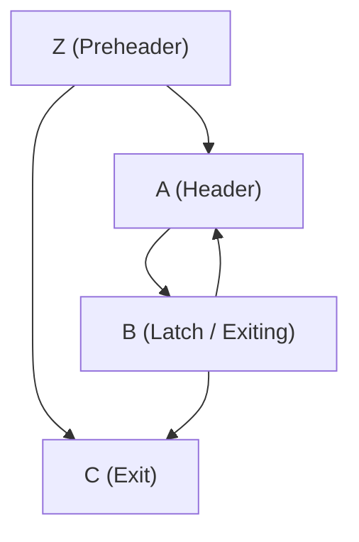
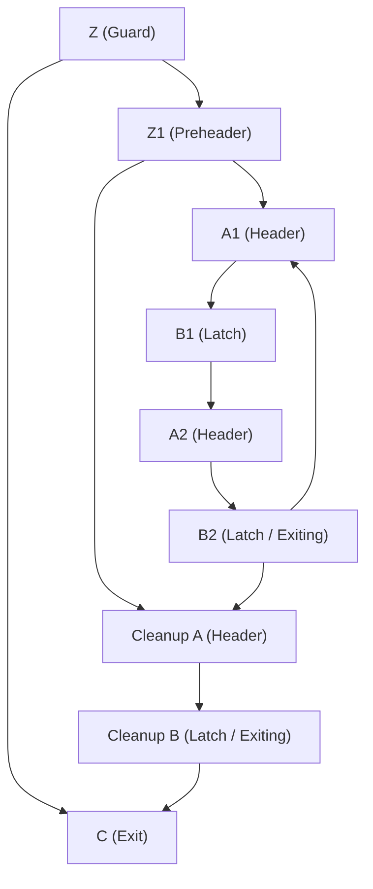

# The Surging Importance of Loop Unrolling in the ML Era

If you have a massive compute architecture—whether it's a modern wide-SIMD vector engine, a Tensor Core array, or a custom deep learning accelerator like a Systolic Array—you face one fundamental problem: feeding the beast. You have immense execution width, but if your instructions are bottlenecked by branch overhead and short basic blocks, those execution units sit idle.

This architectural shift has led to significantly increased activity and attention surrounding loop unrolling. 

Loop unrolling isn't a new concept. It's a classic compiler optimization originally designed to reduce loop control overhead and expose Instruction-Level Parallelism (ILP). In the pre-ML era, it didn't receive much mainstream attention because typical web or mobile workloads don't rely heavily on fine-grained ILP. But today, we are seeing a massive surge in its usage for a very specific reason: machine learning workloads—specifically dense matmuls—need to be heavily vectorized and tiled. 

To maximize throughput on these tiled matrix multiplications, the pipeline must be kept completely full. Loop unrolling is the critical enabler for **software pipelining**, allowing the compiler to overlap memory fetches for the next tile with compute for the current tile [[3]](#ref3). Furthermore, the concept has now expanded into the physical realm: with **spatial loop unrolling**, iterations are mapped directly onto 2D grids of hardware Processing Elements, dictating the chip's entire dataflow. To fully utilize modern ML hardware, we are aggressively unrolling loops at every single level of abstraction.

### Unrolling at Multiple Levels

Loop unrolling was such a common optimization during the OoO processor heydays that programmers often wrote unrolled loops by hand to expose ILP to the hardware [[2]](#ref2). Practically every optimizing compiler has a loop unrolling pass and it is common for compiler courses to teach loop unroller [[1]](#ref1).

#### 1. Language Level

1.  **C (Manual Unrolling + Pragmas):** 
    At the lowest level of user-space code (like custom C or CUDA kernels), developers often refuse to leave performance up to the compiler's heuristic guesses. They explicitly instruct the compiler to unroll loops using compiler directives, most notably `#pragma unroll`. 

    **Examples in C/CUDA:**

    *Using `#pragma unroll`:*
    ```c
    void mac_kernel_pragma(float* a, float* b, float* c) {
        // Force the compiler to unroll the next loop completely
        #pragma unroll
        for (int i = 0; i < 4; ++i) {
            c[i] = a[i] * b[i] + c[i];
        }
    }
    ```

    *Manual Unrolling:*
    Sometimes, developers simply write out the instructions sequentially, eliminating the loop entirely by hand:
    ```c
    void mac_kernel_manual(float* a, float* b, float* c) {
        c[0] = a[0] * b[0] + c[0];
        c[1] = a[1] * b[1] + c[1];
        c[2] = a[2] * b[2] + c[2];
        c[3] = a[3] * b[3] + c[3];
    }
    ```

    *Macro-Based Unrolling:*
    For larger blocks where manual typing is error-prone but pragmas aren't trusted, developers historically used C preprocessor macros to force the unrolling before the compiler even parses the code:
    ```c
    #define MAC(i, k) c[i + k] += a[i + k] * b[i + k];

    #define UNROLL_4(i) \
        MAC(i, 0) \
        MAC(i, 1) \
        MAC(i, 2) \
        MAC(i, 3)

    void mac_kernel_macro(float* a, float* b, float* c, int N) {
        for (int i = 0; i < N; i += 4) {
            UNROLL_4;
        }

        // Handle the remainder
        for (int i = N - (N % 4); i < N; ++i) {
            MAC(i, 0);
        }
    }
    ```

    Whether you use pragmas, manual unrolling, or macros, the goal is the same: the final assembly will be four back-to-back multiply-accumulate operations, entirely removing the branch overhead and exposing maximum parallelism to the execution units.

    **Tradeoffs:** While `#pragma unroll` is incredibly powerful for exposing instruction-level parallelism, it causes **code bloat**. Unrolling massive loops blows up the size of the binary. If the unrolled code exceeds the capacity of the L1 instruction cache (I-cache), the hardware will stall fetching instructions from slower memory, completely negating any performance benefits. It's a delicate balance between compute density and I-cache pressure.

2.  **C++ (Template Metaprogramming):** 
    When the loop bounds are statically known at compile-time (like the dimensions of a small 4x4 matrix tile), C++ developers use template metaprogramming. By using templates, they can recursively generate massive, straight-line blocks of code. This eliminates branch overhead entirely before the code even reaches the compiler's middle-end.

    **Example in C++:**
    ```cpp
    template <int N>
    inline void process(float* a, float* b, float* c) {
        if constexpr (N > 0) {
            process<N - 1>(a, b, c);
            c[N - 1] += a[N - 1] * b[N - 1];
        }
    }

    void process_tile(float* a, float* b, float* c) {
        // Unrolled code at compile time using C++17
        process<4>(a, b, c); 
    }
    ```
    *(Note: Modern C++17 makes this incredibly clean with `if constexpr`, eliminating the need for messy base-case template specializations. For even more concise code, developers often use fold expressions combined with `std::index_sequence`).*

#### 2. Compiler Level

**Visualizing the Control Flow Graph (CFG) Transformation:**

To appreciate the true complexity of loop unrolling, here is the standard loop structure before any unrolling is applied, including the initial guard branch (`Z -> C`) which skips the loop entirely if it runs zero times:



By applying an unroll factor of 2, the loop body (header and latch) is duplicated. To handle trip counts that are not a perfect multiple of 2, a **Cleanup** (or remainder) loop is introduced. The preheader routes execution to the cleanup loop if there aren't enough iterations left for the full unrolled body:



1.  **MLIR (Unpack & Affine Dialects):** 
    In the modern ML compiler stack (like Triton, IREE, or XLA), high-level dialects in MLIR handle structural loop unrolling long before the code reaches lower-level scalar optimizations.

    *Using `linalg.unpack` (formerly `tensor.unpack`):*
    Often, ML compilers pack data into tiled layouts for cache locality during matrix multiplication. To reverse this structural "looping" over tiles, MLIR uses the `linalg.unpack` operation (which replaced the older `tensor.unpack`) to flatten the layout back into its original iteration space:
    ```mlir
    // Unpacking a tiled 8x1 tensor layout back into a flat 7x3 iteration space
    %A_unpack = linalg.unpack %A 
        inner_dims_pos = [0, 1] 
        inner_tiles = [8, 1] 
        into %A_unpack_empty : tensor<?x3x?x1xi32> -> tensor<7x3xi32>
    ```

    *Using `affine.for` Unrolling:*
    For more traditional loop structures, MLIR's Affine dialect provides built-in unrolling passes. By running `mlir-opt -affine-loop-unroll="unroll-factor=4"`, the compiler automatically transforms structured `affine.for` loops to expose ILP:
    ```mlir
    // Before Unrolling
    affine.for %i = 0 to 4 {
      %v = affine.load %A[%i] : memref<4xf32>
      // ... process %v ...
    }
    
    // After Unrolling (conceptually)
    %v0 = affine.load %A[0] : memref<4xf32>
    // ... process %v0 ...
    %v1 = affine.load %A[1] : memref<4xf32>
    // ... process %v1 ...
    %v2 = affine.load %A[2] : memref<4xf32>
    // ... process %v2 ...
    %v3 = affine.load %A[3] : memref<4xf32>
    // ... process %v3 ...
    ```
    This structural unrolling in MLIR ensures that by the time the intermediate representation is lowered to LLVM, the heavy lifting of multi-dimensional vectorization and tile-flattening is already complete.

2.  **LLVM-IR (`-funroll-loops` implementation):** 
    This is the classic LLVM middle-end pass (implemented primarily in [`llvm/lib/Transforms/Scalar/LoopUnrollPass.cpp`](https://github.com/llvm/llvm-project/blob/main/llvm/lib/Transforms/Scalar/LoopUnrollPass.cpp)). 

    **How it Works:** The LLVM unroller relies heavily on **Scalar Evolution (SCEV)** analysis. SCEV attempts to mathematically model how variables change across loop iterations. If SCEV can accurately determine the loop's trip count, the unroller evaluates an intricate cost model to decide whether unrolling is profitable, factoring in loop size, the target architecture, and instruction cache limits.

    **The Reality & Limitations:** While the theory is sound, tuning these heuristics for every edge case and architecture is nearly impossible. If you browse the [LLVM Discourse](https://discourse.llvm.org/) or [GitHub Issue Tracker](https://github.com/llvm/llvm-project/issues), you will find a graveyard of complaints about `-funroll-loops` causing performance regressions. Two major problems continually surface:
    
    *   **Code Bloat & I-Cache Misses:** Aggressive unrolling duplicates the loop body, ballooning static code size. If this newly expanded block exceeds the capacity of the L1 instruction cache (or the micro-op cache / loopback buffer on modern CPUs), the CPU stalls while fetching instructions, completely negating the compute benefits (e.g., see [Issue #42332: Excessive loop unrolling](https://github.com/llvm/llvm-project/issues/42332), where performance experts point out that unrolling simple loops provides zero advantage when the bottleneck is the vector unit, but actively hurts performance by evicting other code from the cache).
    *   **Register Spilling:** This is the silent killer. Generating massive blocks of straight-line code puts pressure on the backend register allocator. By unrolling, you artificially increase the number of *live variables* active at any given moment. If the target doesn't have enough physical registers to hold these variables, the compiler is forced to "spill" them to the stack (main memory). This **register spilling** turns a fast, compute-bound kernel into a slow, memory-bound bottleneck (e.g., see this [LLVM Discourse thread](https://discourse.llvm.org/t/unrolling-pre-licm-and-register-pressure/88350) where unrolling a matrix multiplication interacted with LICM to hoist up to 100 loads into a preheader, completely overwhelming the target's 16-register file).

    Because of this heavy reliance on complex SCEV analysis and fragile cost models, many performance engineers prefer manual or structural unrolling over blindly trusting the middle-end heuristics.

3.  **LLVM-MIR (Machine IR):** 
    As we get closer to the metal, the backend handles target-specific loop unrolling. This is where things get gnarly. At the Machine IR level, unrolling is tailored directly to the specific pipeline depths, instruction latencies, and register files of the target chip. 
    
    This is the exact level where you *want* to unroll, because **this is where software pipelining is most impactful**. By unrolling loops at the MIR level, the backend scheduler can perfectly overlap memory loads, vector MAC operations, and stores across multiple iterations, hiding hardware latencies entirely. (If you want to know how painful tuning this is, just ask me...).

#### 3. Hardware Level (Spatial Loop Unrolling)

When we move beyond traditional CPUs and GPUs into the realm of custom deep learning accelerators like Systolic Arrays (such as Google's TPUs), loop unrolling takes on a physical dimension. This concept is often referred to as **spatial loop unrolling** [[4]](#ref4).

Unlike software loop unrolling—where instructions are duplicated in memory to be executed sequentially over time—spatial loop unrolling maps different iterations of a nested loop directly onto a 2D grid of physical Processing Elements (PEs). In systolic arrays, the way a compiler chooses to unroll the nested loops of a matrix multiplication dictates the hardware's entire **dataflow model** (e.g., Weight Stationary, Output Stationary, or Input Stationary). 

However, because DNN workloads are vastly larger than any physical chip, accelerators cannot spatially unroll the entire workload at once. The loops must first be **tiled** (broken into hardware-sized chunks) before they are spatially unrolled onto the grid. The hardware physically executes the unrolled tile in parallel, while the outer loops iterate over the remaining chunks.

### The Hardware-Software Contract

Loop unrolling is no longer just a neat trick to save a few cycles on a branch instruction. It is a mandatory structural requirement for modern performance engineering. As hardware grows wider and deeper, software must unroll to keep pace, generating massive, uninterrupted streams of compute to keep the silicon fed.

### References

<a name="ref1"></a>[1] Muchnick, S. S. (1997). *Advanced Compiler Design and Implementation*. Morgan Kaufmann. (A foundational text detailing classic loop optimizations, including unrolling, that are universally taught in compiler courses).
<a name="ref2"></a>[2] Hennessy, J. L., & Patterson, D. A. (2017). *Computer Architecture: A Quantitative Approach*. Morgan Kaufmann. (Covers Instruction-Level Parallelism (ILP), OoO execution, and how software loop unrolling exposes parallelism to the hardware).
<a name="ref3"></a>[3] Russell, R. M. (1978). *The CRAY-1 Computer System*. Communications of the ACM, 21(1), 63-72. (Demonstrating early reliance on loop unrolling and software pipelining for vector and supercomputing machines).
<a name="ref4"></a>[4] Wang, Y., et al. (2023). *A Survey of Design and Optimization for Systolic Array-based DNN Accelerators*. ACM Computing Surveys, 56(2), 1-36. (Details how loop unrolling is mapped spatially onto physical processing elements and dictates dataflow models).