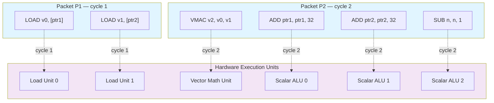

VLIW (Very Long Instruction Word) spent most of the last two decades as a specialist's tool. After the commercial struggles of general-purpose VLIW designs—Intel's Itanium being the canonical example—the architecture retreated into DSPs and embedded media processors, where its constraints were acceptable and its efficiency mattered. For a long stretch, knowing VLIW well was a niche skill.

That has changed. The economics of machine learning have pulled VLIW back into mainstream silicon, and the population of engineers writing compilers and kernels for these machines has grown by roughly an order of magnitude. The reason is straightforward: ML training and inference are dominated by regular, statically analyzable computation, which is precisely the workload VLIW was built to exploit.

The VLIW-versus-out-of-order (OoO) debate is an old one, and for general-purpose code it was settled in favor of OoO. But "settled" rested on assumptions about the workload, and those assumptions do not hold for dense linear algebra. It is worth being precise about why.

## What is VLIW? The Anatomy of an Instruction Bundle

In a scalar processor, instructions are fetched and retired in program order, and the hardware is responsible for discovering what can run concurrently. VLIW inverts that contract: the compiler groups multiple independent operations into a fixed-width bundle (sometimes called a packet), and the hardware issues every slot in the bundle in the same cycle without checking for dependencies between them.

A typical VLIW bundle might look like this conceptually:
```asm
P1: {
  LOAD  v0, [ptr1]      // Load unit 0
  LOAD  v1, [ptr2]      // Load unit 1
}
P2: {
  VMAC  v2, v0, v1      // Vector Math unit: v2 += v0 * v1
  ADD   ptr1, ptr1, 32  // Scalar ALU 0: advance pointer 1
  ADD   ptr2, ptr2, 32  // Scalar ALU 1: advance pointer 2
  SUB   n, n, 1         // Scalar ALU 2: decrement trip count
}
P3: {
  JNZ   n, P1           // Branch back to P1 while n != 0
}
```
Each packet issues in a single cycle. `P1` fires both loads together; `P2` then issues the multiply-accumulate alongside the two pointer increments and the trip-count decrement—four operations in one cycle—because the compiler has proven they are mutually independent and the hardware may launch them simultaneously. `P3` takes the loop back-edge. Spending an entire packet on a lone branch is wasteful, and it is exactly the kind of inefficiency a real ISA removes by folding the compare-and-branch into the packet that produces the value being tested—as the Hexagon example below shows.

The advantage is compute density and power efficiency. The hardware spends no area or energy determining whether the `VMAC` depends on the preceding `LOAD`s—that guarantee is encoded by the compiler in how the bundle was formed. Anything placed in the same bundle issues together. What this saves is precisely the machinery an OoO core spends recovering the same parallelism at runtime.

### VLIW Execution Model



Within each packet, every operation issues to its unit in the same cycle—no stalls, no hardware checking for data dependencies, because the compiler guaranteed the operations were independent when it built the packet.

### What a Real Bundle Looks Like

The conceptual bundle above hides the features that make a production VLIW ISA usable. Here is the same idea on Qualcomm's Hexagon, drawn from the global-scheduling work in the talk referenced above[^1]. This fragment walks a linked list, loading a field from each node and comparing it against a target in `R3`:

```asm
{
  R7 = R2                                      // copy current node pointer
  R4 = load.word (R2+#4)                       // load a field      (load slot 0)
  R2 = load.word (R2)                          // R2 = node->next   (load slot 1)
}
{
  R4 = load.u_half (R4+#2)                     // dereference that field
  if (compare.equal (R4.new, R3)) jump BB#3    // branch on a value produced THIS cycle
}
```

Two things here have no equivalent on a scalar machine. First, the opening packet issues three operations—a register move and two independent loads—in one cycle. All source operands are read at the start of the packet, so both reads of `R2` see its old value even though another slot overwrites `R2` in the same cycle; the compiler relies on those parallel-read semantics to pack the next-pointer load alongside the field load. Second, the `.new` suffix: the `load.u_half` that defines `R4` and the `compare.equal` that consumes it sit in the *same* packet. `R4.new` tells the hardware to forward the freshly produced value within the cycle rather than waiting for the register write-back—latency the compiler has already accounted for.

Predication is the other lever. Instead of branching around a short region, the compiler can guard individual operations with a predicate register and hoist them across what used to be a basic-block boundary:

```asm
{
  R7 = R2
  p0 = compare.equal (R2, #0)                  // is next == NULL?
  if (!p0.new) R4 = load.word (R2+#4)          // speculative load, guarded by p0
  if (p0.new) jump BB#10                        // exit if the list ended
}
```

A compare sets `p0`, and *within the same packet* a guarded load and a guarded branch both consume `p0.new`. The load executes only when the pointer is non-null; the exit branch is taken when it is. That load was pulled up out of a successor block and made conditional so it could ride along in an otherwise half-empty packet—global, cross-block scheduling in action. None of it is free: it is exactly the modeling of pipeline latency, predicate liveness, and per-slot resource constraints that a VLIW compiler has to get right, which is what the talk was about[^1].

## Compiler-Driven Scheduling vs. Out-of-Order (OoO)

The difference between VLIW and a modern OoO core is fundamentally about *where* the parallelism-extraction problem is solved.

An **Out-of-Order (OoO)** core (a modern x86 or ARM CPU) solves it in hardware. It carries reorder buffers, reservation stations, and register-rename tables to look ahead in the instruction stream, find independent instructions, and dispatch them dynamically[^8]. This is the right design for unpredictable, branch-heavy code—browsers, operating systems, general application logic—but it costs significant silicon area and power, and that cost is paid on every cycle regardless of how regular the code happens to be.

**VLIW** removes that dynamic logic. The hardware is comparatively simple but very wide, which moves the responsibility for finding instruction-level parallelism (ILP) entirely into the compiler—and, by extension, onto whoever writes and tunes the kernels.

The compiler must perform rigorous **instruction scheduling** and **software pipelining** to keep those wide execution units full. It must mathematically prove that instructions are independent, calculate exact hardware latencies, and overlap the execution of different loop iterations. In an LLVM Developers' Meeting talk that Sergei Larin and I gave on global instruction scheduling[^1], we walked through how an optimizing compiler for VLIW has to model the entire hardware pipeline and manage register pressure explicitly across bundles to keep the machine from stalling.

## Where VLIW Pays Off, and Where It Doesn't

**Is VLIW necessary?** For general-purpose computing, no—OoO cores are good enough and far easier to target. For power- and area-constrained workloads, the calculus changes. Removing the dynamic-scheduling hardware frees a large fraction of the die and power budget to spend on compute instead, and at the scale of a datacenter full of accelerators—or a mobile SoC with a fixed thermal envelope—that efficiency translates directly into capital cost, operating cost, and battery life[^8][^9].

**Is VLIW sufficient?** No. It only pays off when memory access patterns are predictable at compile time. Pointer-chasing workloads—graph traversal, sparse irregular access—defeat static scheduling, and the wide issue slots sit empty. The architecture buys efficiency by betting on regularity; when that bet is wrong, there is no dynamic fallback to recover the lost parallelism.

**Where does the complexity go?** Onto the compiler. Because the hardware no longer hides pipeline hazards, the compiler must manage them explicitly—through predication, speculation, and the scheduling of operations into **branch delay slots**[^2]. Where an OoO core uses dynamic branch prediction to run speculatively past a branch, a VLIW pipeline typically exposes the latency between issuing a branch and resolving its target, and the compiler is expected to fill that window with useful work. This dissolves the clean abstraction of sequential execution within a basic block and makes global, cross-block scheduling a requirement rather than an optimization[^1].

**Is the compiler investment worth it?** For a stable, high-value workload, yes—and this is the crux of the argument. Software pipelining and global scheduling for a large matmul or attention kernel is genuinely hard, but it is effort spent once per kernel-and-target and then amortized over the entire lifetime of the deployment. That economic shape—heavy one-time compiler effort against enormous runtime reuse—is what makes the VLIW tradeoff sound for ML kernels and unsound for a web browser.

**What does the hardware side gain, and what's the risk?** The appeal to architects is obvious: strip out the reorder buffers, reservation stations, and rename logic, and spend that silicon on execution units. The cautionary tale is equally well known. In the late 1990s, Intel and HP bet enterprise computing on this premise with **Itanium** (EPIC), assuming compilers could extract enough ILP from general-purpose C/C++ to keep a wide machine fed[^3]. They could not. Real control flow, pointer indirection, and unpredictable cache behavior left the issue slots starved, and Itanium—inevitably nicknamed "Itanic"—never matched contemporary x86 OoO parts on the code people actually ran. The lesson is not that VLIW is a bad design. It is that VLIW is only as good as the static predictability of the workload it runs.

## The Industry Trend: The Rise of NPUs and ML Accelerators

This is exactly why VLIW fits modern accelerators. Deep learning is dominated by dense matrix multiplication, convolution, and attention—operations expressed as regular, deeply nested loops over contiguous memory[^10]. Iteration counts and access strides are largely known at compile time, so the scheduler can lay out bundles and software-pipeline the loops with little runtime uncertainty[^11]. The workload assumption that sank Itanium is the workload guarantee that ML provides.

That alignment shows up across nearly every serious AI accelerator, all of which lean on VLIW or VLIW-derived scheduling:

*   **Google TPUs:** TPUs are best known for their systolic arrays, but the control logic that feeds those arrays and handles vector operations is VLIW. The XLA compiler generates the bundles that keep the matrix units busy[^4], using compile-time analysis of loop structure and data dependencies—the core VLIW discipline applied at scale[^12].
*   **Google SparseCore:** Starting with TPUv4 and TPUv5, Google added the "SparseCore" for embeddings and sparse routing. These cores also use VLIW scheduling to dispatch concurrent gather/scatter memory operations alongside vector ALU work[^5].
*   **Qualcomm Hexagon NPUs:** Qualcomm's Hexagon architecture, which powers the AI processing in Snapdragon chips, has a long history as a VLIW DSP (Digital Signal Processor). Modern Hexagon NPUs scale this VLIW design to handle large tensor operations efficiently at the edge, relying heavily on the compiler to extract parallelism[^6].
*   **AMD XDNA (AI Engine):** AMD's NPUs, built on the Xilinx AI Engine architecture (XDNA), are spatial arrays of VLIW processors. Each AI Engine core is a VLIW processor capable of executing multiple scalar and vector instructions per clock, connected by a high-bandwidth network-on-chip[^7].

By moving scheduling out of hardware and into the compiler, these designs reach a level of compute density and energy efficiency that general-purpose OoO cores cannot match on the same workloads. None of this repeals the lesson of Itanium—it confirms it. VLIW wins when the workload is statically predictable, and the current generation of ML accelerators is, more than anything, a bet that the workload will stay that way. Given the shape of modern models, that looks like a safe bet for now.

### A Concrete Example: Inside the TPU's 322-bit Bundle

This is not hand-waving. The TPUv2/v3 TensorCore is a VLIW machine at the instruction level, and its designers published the format. Each bundle is **322 bits** wide and carries eight operation slots: two scalar slots, four vector slots (two of them vector load/store), two matrix slots—a *push* and a *pop*—one miscellaneous slot, and six immediates[^13]. The scalar unit fetches a complete bundle from local instruction memory, executes the scalar slots itself, and forwards the decoded vector and matrix slots downstream, where they run later and decoupled from the scalar pipeline[^13].

Consider what that one bundle expresses. In a single instruction the compiler can issue scalar address arithmetic, a vector load and a vector store, two vector ALU operations across all 128 lanes, and—through the matrix slots—*queue* a tile into the matrix-multiply unit while *draining* a result out of it. Those push and pop slots are the telling detail: they let the compiler keep the systolic array fed and emptied in the same instruction as the vector work that prepares and consumes the data. Matrix, vector, and scalar units advancing together under one static schedule is exactly the software pipelining described earlier, expressed directly in the ISA. The design paper states the rationale plainly—"a VLIW architecture was the simplest way for the hardware to express instruction level parallelism and allowed us to utilize known compiler techniques"[^13]—and the complexity was moved into XLA by design.

The continuity is not only conceptual—it runs through the people. One of the TPU's architects, Cliff Young, co-wrote the standard text on the subject, *Embedded Computing: A VLIW Approach*, with Joseph Fisher, who coined the term "VLIW" at Yale and founded Multiflow Computer to build the first trace-scheduled VLIW machines[^15]. Fisher's later work at HP Labs—alongside Bob Rau of Cydrome—became the EPIC research that Intel and HP productized as Itanium. Norman Jouppi, the TPU's tech lead, spent most of the 2000s at that same HP Labs before joining Google. The throughline from Multiflow to Itanium to the TPU is not just a migration of ideas; some of the same architects carried VLIW from the machines where it failed to the one where it works. What changed was never the principle—only the workload.

If you would rather read a production ML-accelerator VLIW ISA than take this on trust, AMD's AI Engine is the most accessible target: a 7-way, in-order, exposed-pipeline VLIW core with an open-source toolchain. The `llvm-aie` backend and the `mlir-aie` compiler let you build a kernel and inspect the emitted bundles, slot assignments, and scheduling decisions end to end[^14]. It is a rare opportunity to see exactly how a modern accelerator lowers a tensor kernel into packed VLIW instructions.

## If You Were Designing the Next TPU

Here is where it gets interesting. The whole argument above rests on one assumption: that ML workloads stay statically predictable. That assumption is already fraying at the edges. Mixture-of-experts routing makes the active computation data-dependent. Dynamic sequence lengths, speculative decoding, and KV-cache management introduce control flow that the compiler cannot fully resolve ahead of time. Sparsity—real, unstructured sparsity—is exactly the pointer-chasing pattern that VLIW handles worst. The clean, rigid loops that make VLIW pay off are slowly acquiring the irregularity that made Itanium fail.

So if the next TPU, or NPU, or whatever comes after, landed on your desk tomorrow, where would you spend the transistors? Do you stay pure VLIW and push the irregularity back onto the compiler, trusting that a smart enough scheduler and a well-designed IR can keep the static bet alive? Do you add a thin layer of dynamic scheduling—a small OoO window, hardware gather/scatter, runtime predication—and accept some of the power overhead you spent a decade removing? Do you bifurcate the die, pairing a wide VLIW datapath for the dense kernels with a smaller dynamic core for the irregular control, the way TPUs already paired matrix units with SparseCore? Or do you bet on something the compiler community hasn't fully exploited yet?

There is no settled answer, which is what makes this the most interesting it has been in twenty years. The pendulum between hardware-managed and compiler-managed parallelism has swung hard toward the compiler. The question worth sitting with is whether the next workload shift pushes it back—and what you would build if the decision were yours.

---

## References

[^1]: **Global Instruction Scheduling for LLVM** — Sergei Larin and Aditya Kumar, Qualcomm Innovation Center, LLVM Developers' Meeting (2014). [Slides (PDF)](https://llvm.org/devmtg/2014-10/Slides/Larin-GlobalInstructionScheduling.pdf)

[^2]: **Branch Delay Slots** — Explanation of control-flow exposure in pipelines. [Wikipedia: Delay slot](https://en.wikipedia.org/wiki/Delay_slot)

[^3]: **The "Itanium" (Itanic) Failure** — The history of Intel's Itanium and the failure of EPIC/VLIW on general-purpose workloads. [Wikipedia: Itanium](https://en.wikipedia.org/wiki/Itanium)

[^4]: **In-Datacenter Performance Analysis of a Tensor Processing Unit** — Jouppi, N. P., Young, C., Patil, N., et al. *ISCA 2017*. [arXiv:1704.04760](https://arxiv.org/abs/1704.04760)

[^5]: **TPUv4: An Optically Reconfigurable Supercomputer for Machine Learning with Hardware Support for Embeddings** — Jouppi, N. P., et al. *ISCA 2023*. [arXiv:2304.01433](https://arxiv.org/abs/2304.01433)

[^6]: **Qualcomm Hexagon DSP SDK** — Technical documentation on Qualcomm's VLIW AI processors. [Hexagon DSP SDK](https://developer.qualcomm.com/software/hexagon-dsp-sdk)

[^7]: **AMD XDNA Technology** — Overview of AMD's spatial array VLIW architecture. [AMD XDNA](https://www.amd.com/en/technologies/xdna.html)

[^8]: **Out-of-Order Execution in Superscalar Processors** — Comprehensive overview of OoO architecture, including reorder buffers, reservation stations, and power consumption tradeoffs. [Wikipedia: Out-of-order execution](https://en.wikipedia.org/wiki/Out-of-order_execution)

[^9]: **Why AI Datacenters Choose Efficiency Over Performance** — Analysis of total-cost-of-ownership for AI infrastructure, where power consumption drives operational costs. [Meta Research: Reducing AI Training Data Bandwidth](https://research.facebook.com/blog/2024/01/reducing-ai-training-data-bandwidth/)

[^10]: **The Predictability of Deep Learning Workloads** — Research on characterizing ML workloads and their access patterns for hardware acceleration. [arXiv:1806.00863](https://arxiv.org/abs/1806.00863)

[^11]: **Compiler-Driven Software Pipelining for ML Kernels** — Techniques for optimizing compiler scheduling on spatially distributed architectures. [arXiv:2008.04166](https://arxiv.org/abs/2008.04166)

[^12]: **XLA: Optimizing Compiler for Machine Learning** — Technical documentation on XLA's compile-time instruction scheduling and buffer analysis. [TensorFlow XLA Documentation](https://www.tensorflow.org/xla/architecture)

[^13]: **The Design Process for Google's Training Chips: TPUv2 and TPUv3** — Norrie, T., Patil, N., Yoon, D. H., Kurian, G., Li, S., Laudon, J., Young, C., Jouppi, N., Patterson, D. *IEEE Micro*, 2021. Describes the 322-bit VLIW bundle and its slot layout. ([DOI: 10.1109/MM.2021.3058217](https://doi.org/10.1109/MM.2021.3058217))

[^14]: **AMD AI Engine open-source toolchain** — `llvm-aie`, an LLVM backend for the AI Engine VLIW ISA, and `mlir-aie`, an MLIR-based compiler for AMD Ryzen AI and Versal devices. ([llvm-aie](https://github.com/Xilinx/llvm-aie), [mlir-aie](https://github.com/Xilinx/mlir-aie))

[^15]: **Embedded Computing: A VLIW Approach to Architecture, Compilers and Tools** — Fisher, J. A., Faraboschi, P., Young, C. Morgan Kaufmann, 2005. Fisher coined the term "VLIW" and founded Multiflow Computer; the trace-scheduling lineage runs from Multiflow and Cydrome through HP Labs' EPIC research into Itanium, and co-author Cliff Young went on to help design Google's TPU. ([Publisher](https://shop.elsevier.com/books/embedded-computing/fisher/978-1-55860-766-8))

---

*Disclaimer: This article was generated using the Claude Opus 4.8 model.*
