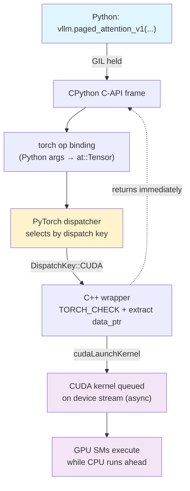
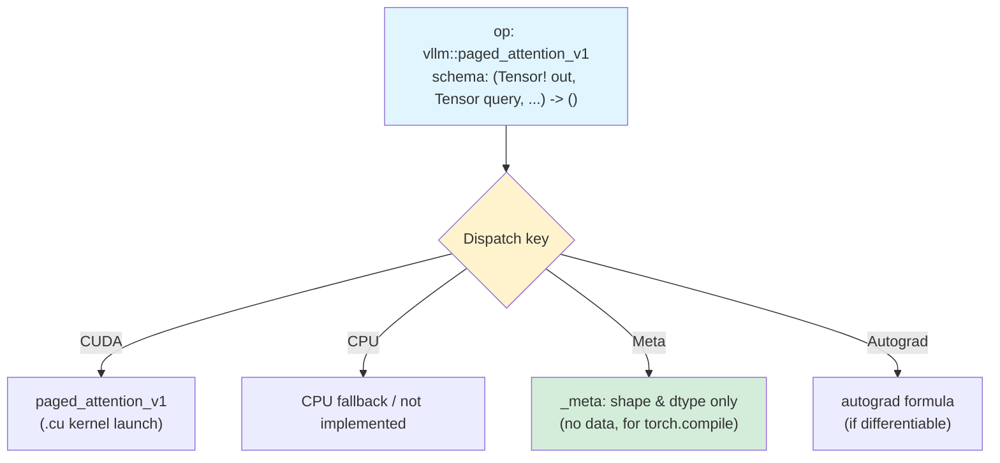
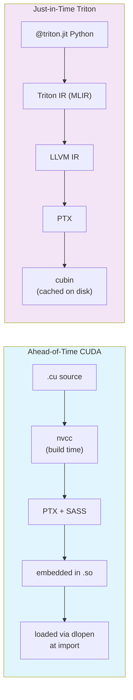
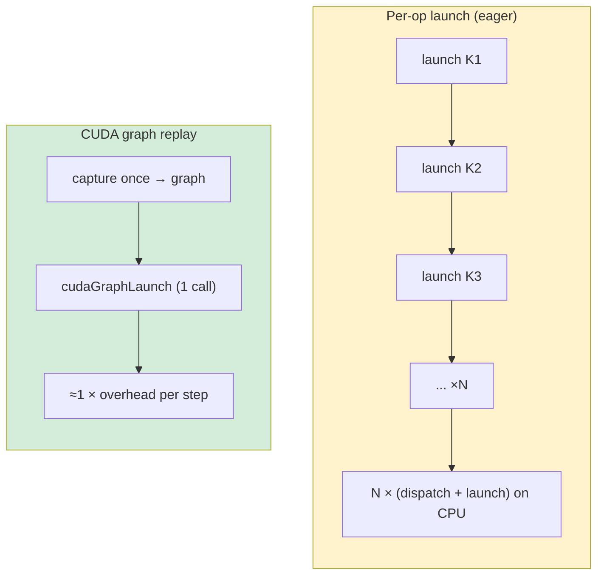

Python is a productive orchestration language for inference serving, but it is the wrong tool for the critical path of token generation. Large-model inference is bound by memory bandwidth and by per-operation latency, and the interpreter cannot meet either constraint. So frameworks like vLLM keep the control flow in Python and push the arithmetic into compiled C++ and CUDA kernels.

That split is not free. Every call has to cross the Python/C++ boundary, and that crossing involves an Application Binary Interface (ABI), a dispatcher, and the overhead of launching work on the GPU. This post walks through how vLLM crosses that boundary: how kernels are registered with PyTorch, the ABI constraints that make the boundary fragile, the hardware-level decisions inside the kernels themselves, and how vLLM amortizes the per-call overhead with CUDA graphs.

Here is the whole path a single custom op travels, from a Python call to execution on the GPU's streaming multiprocessors (SMs):



The important feature of this path is that the bulk data, the multi-gigabyte tensors, never moves. Only metadata and pointers cross the boundary; the launch is asynchronous, so the CPU returns to Python and queues the next op while the GPU is still working on the last one.

## The Cost of Crossing the Python/C++ Boundary

When a Python script invokes a PyTorch operation, very little of the work happens in Python. The call crosses into a pre-compiled C++ backend, and the crossing has a fixed cost regardless of how small the tensors are. That cost comes from several places:

- **The interpreter and the GIL.** CPython evaluates the call frame with the Global Interpreter Lock held. Argument parsing, reference-count bookkeeping, and object unpacking all happen single-threaded.
- **Argument marshaling.** Python objects (`PyObject*`) must be converted into their C++ counterparts. A `torch.Tensor` is unwrapped into an `at::Tensor`, integers and floats are unboxed, and lists become `c10::IntArrayRef` or `std::vector`.
- **The dispatcher.** PyTorch routes every operation through a C++ dispatcher that selects a backend implementation based on the operation's *dispatch key* (device, dtype, autograd state, and so on). This indirection is what makes one Python call work transparently on CPU and CUDA, but it is several function hops per op.
- **The kernel launch.** Handing work to the GPU through `cudaLaunchKernel` costs on the order of single-digit microseconds of CPU time, before the kernel does any arithmetic.

None of these is large in isolation. The problem is the multiplier. Generating one token runs a tight sequence of operations, embedding lookup, a stack of linear projections, RoPE, the KV-cache write, attention, normalization, and sampling, and a decode step can issue hundreds of ops. At a few microseconds of fixed overhead each, the boundary cost alone can rival the time the GPU spends on the math, especially at small batch sizes where each kernel is short. The two structural responses are to do *more work per crossing* (fused kernels) and to *remove the crossings entirely* on the hot path (CUDA graphs, covered later).

vLLM leans on PyTorch's extension machinery to keep the per-crossing cost to the unavoidable minimum: validate metadata, extract raw pointers, launch. The tensor payload stays pinned in GPU memory throughout; nothing is copied or serialized to make the call.

## The Integration Layer: `torch.library` and the Dispatcher

vLLM implements operations that PyTorch does not ship natively, PagedAttention, AWQ/GPTQ dequantization, fused RoPE, fused RMSNorm, and others, and it has to make them first-class citizens of the dispatcher so they participate in autograd, `torch.compile`, and device routing like any built-in op.

The dispatcher is a routing table. Each operation has a schema (a typed signature), and for each *dispatch key* there can be a different registered implementation:



Registration happens in C++ through the `torch.library` API (the `TORCH_LIBRARY` family of macros; vLLM wraps these in its own `TORCH_LIBRARY_EXPAND` helper). The schema is declared as a string, and the implementation is bound for a specific dispatch key:

```cpp
#include <torch/library.h>

// 1. The C++ wrapper that validates inputs and launches the CUDA kernel.
//    It writes its result into `out` in place rather than allocating.
void paged_attention_v1(
    torch::Tensor& out,            // mutated output  (marked Tensor! in the schema)
    torch::Tensor const& query,
    torch::Tensor const& key_cache,
    torch::Tensor const& value_cache,
    torch::Tensor const& block_tables,
    torch::Tensor const& seq_lens,
    int64_t block_size,
    int64_t max_seq_len) {
  // 2. Contract checks: the dispatcher guarantees nothing about device/dtype,
  //    so the kernel must assert its own preconditions before touching memory.
  TORCH_CHECK(query.is_cuda(), "query must be a CUDA tensor");
  TORCH_CHECK(query.scalar_type() == at::kHalf ||
              query.scalar_type() == at::kBFloat16,
              "query must be fp16 or bf16");
  TORCH_CHECK(out.is_contiguous(), "out must be contiguous");

  // 3. Extract raw device pointers; from here on it is plain CUDA.
  //    .data_ptr<T>() hands the kernel a typed pointer into GPU memory.
  // launch_paged_attention_v1(out.data_ptr<...>(), query.data_ptr<...>(), ...);
}

// 4. Declare the schema. The `!` on `Tensor!` records that `out` is mutated,
//    which functionalization in torch.compile relies on to stay correct.
TORCH_LIBRARY(vllm, m) {
  m.def(
    "paged_attention_v1(Tensor! out, Tensor query, Tensor key_cache, "
    "Tensor value_cache, Tensor block_tables, Tensor seq_lens, "
    "int block_size, int max_seq_len) -> ()");
}

// 5. Bind the implementation to the CUDA dispatch key. The same op name can
//    have separate implementations for CPU, Meta, etc.
TORCH_LIBRARY_IMPL(vllm, CUDA, m) {
  m.impl("paged_attention_v1", &paged_attention_v1);
}
```

Two details are worth dwelling on, because they are easy to get wrong.

First, **the mutation annotation**. Writing the result into `out` in place avoids an allocation on the hot path, but it makes the op a side-effecting operation. The schema records that with `Tensor!` (the `!` marks an aliased, mutable argument). `torch.compile` *functionalizes* the graph, rewriting in-place mutations into a pure dataflow form so it can reorder and fuse, and it can only do this safely if the schema tells the truth about what is mutated. A missing `!` here is a silent correctness bug under compilation, not a compile error.

Second, **the Meta kernel**. `torch.compile` traces a model with fake (meta) tensors that carry shape and dtype but no data. For a custom op to be traceable, vLLM also registers a `_meta` implementation that computes the *output* shape and dtype without running the kernel. The meta function must stay in lockstep with the real one; if it reports the wrong shape, the compiled graph is wrong in ways that only surface at runtime.

When `vllm.paged_attention_v1(...)` is called from Python, the binding converts the arguments to `at::Tensor` references, the dispatcher selects the CUDA implementation by dispatch key, and the C++ wrapper validates and launches. The Python-side cost is confined to routing and metadata checks.

## The ABI Boundary Itself

The title of this post promises ABI, and this is where it bites. An ABI is the machine-level contract for how compiled code interoperates: how arguments are passed in registers or on the stack, how structs are laid out and aligned, how names are encoded into symbols, and how exceptions and destructors behave. The Python/C++ boundary in vLLM is really three nested contracts, and all three have to agree.

**Name mangling.** C++ encodes parameter types into the symbol name (on Linux, per the Itanium C++ ABI), so `paged_attention_v1(at::Tensor&, ...)` becomes a long mangled symbol. If Python tried to resolve C++ functions by linking against those symbols, every signature change would break the link, and different compilers might mangle differently. The dispatcher sidesteps this: vLLM registers a *function pointer* into a runtime table keyed by the schema *string*. Python looks the operation up by name at runtime, so the mangled C++ symbol never has to be part of any stable interface.

**The libstdc++ dual ABI.** This is the classic vLLM/PyTorch build failure. Since GCC 5.1, libstdc++ ships two incompatible implementations of `std::string` and `std::list`, selected by the `_GLIBCXX_USE_CXX11_ABI` macro; the new one lives in an inline namespace (`std::__cxx11`) with different symbol names and a different in-memory layout.[^3] PyTorch's pip wheels were long built with `_GLIBCXX_USE_CXX11_ABI=0` for broad manylinux compatibility.[^4] An extension compiled with `=1` will either fail to link (undefined references mentioning `__cxx11`) or, worse, link and then corrupt data when a `std::string`-bearing structure crosses the boundary with two different layouts on each side. This is why `torch.utils.cpp_extension` reads `torch._C._GLIBCXX_USE_CXX11_ABI` and forces the extension to match whatever the installed PyTorch used. vLLM's build does the same; mismatching it is one of the most common "it compiled but crashes" reports.

**libtorch version coupling.** An `at::Tensor` is not a value; it is a reference-counted handle (`c10::intrusive_ptr<TensorImpl>`). Passing one across a shared-library boundary requires both sides to agree on the exact layout of `TensorImpl`, which means the extension must be compiled against the same libtorch headers as the runtime it loads into. That coupling is why a kernel built for one PyTorch version generally cannot be loaded by another, and why vLLM ships wheels pinned to specific PyTorch releases.

The direction of travel is to make this boundary stable. PyTorch 2.10+ exposes an ABI-stable LibTorch API built around `torch::stable::Tensor` and a C-style shim, so an extension can target one frozen interface and survive across PyTorch versions instead of being rebuilt for each.[^5] It trades a little expressiveness for the ability to ship a single wheel, the same bargain that the dispatcher already makes for name mangling, now extended to the type layout.

## Hardware-Level Optimizations in Custom CUDA Kernels

Once the boundary is crossed and the wrapper launches, the constraints change entirely. The kernel's job is to keep the SMs fed and the memory subsystem busy. A few principles drive vLLM's kernel design, illustrated with PagedAttention[^7] and the quantized-dequant kernels.

### Memory coalescing and alignment

When a warp (32 threads) accesses global memory, the hardware coalesces the accesses into the fewest possible transactions when the addresses are contiguous and aligned.[^1] vLLM lays out data so reads coalesce, and uses vectorized loads to move 128 bits per thread per instruction:

```cuda
// Each thread loads 8 fp16 values (128 bits) in one instruction.
// Casting to uint4 makes the compiler emit a single 16-byte vectorized load,
// and the contiguous per-thread layout lets the warp coalesce 32 of them.
const uint4* kv_vec = reinterpret_cast<const uint4*>(key_cache_ptr);
uint4 chunk = kv_vec[thread_offset];   // 1 transaction per aligned warp access
```

The alignment is a hard precondition, not a nicety: a `uint4` load from a non-16-byte-aligned address is undefined behavior on the GPU, and even a merely uncoalesced (but legal) access splits one transaction into several, which is costly on a bandwidth-bound kernel. PagedAttention's block tables are sized and padded precisely so that each KV block starts on an aligned boundary.

### Register pressure and occupancy

Registers are the fastest storage on the GPU and the scarcest. Each SM has a fixed register file shared by all resident threads, so a kernel that uses more registers per thread allows fewer thread blocks to be resident at once, which lowers occupancy and the hardware's ability to hide memory latency by switching warps. vLLM kernels use `#pragma unroll` deliberately rather than reflexively, and keep variable lifetimes short, because unrolling that inflates the live register set can reduce occupancy enough to erase the gain. Block dimensions (for example $16 \times 16$ or $32 \times 8$) are chosen to balance registers against shared-memory use for a target architecture such as Ampere or Hopper.

### Warp-level reductions

Rather than synchronize through shared memory, vLLM uses warp-shuffle primitives to exchange values directly between threads in a warp. The softmax denominator in attention is a reduction, and a shuffle-based tree reduction completes it without a single shared-memory round trip:

```cuda
// Sum a value across the 32 lanes of a warp using register-to-register
// shuffles. After the loop, lane 0 holds the full warp sum.
template <typename T>
__device__ __forceinline__ T warp_reduce_sum(T val) {
#pragma unroll
  for (int offset = 16; offset > 0; offset >>= 1) {
    // __shfl_down_sync reads `val` from the lane `offset` higher, with no
    // shared memory and no __syncthreads(): it is a single register op.
    val += __shfl_down_sync(0xffffffff, val, offset);
  }
  return val;
}
```

### Shared memory as a software-managed cache

For data reused within a block, vLLM stages it in shared memory, the explicitly managed on-chip scratchpad, to avoid redundant global reads. This matters most for weight-only quantization such as AWQ: the packed low-bit weights are loaded once into shared memory and dequantized on the fly into the registers feeding the matrix multiply, so the expensive global-memory traffic happens a single time per tile.

## Compiler Interactions: AOT CUDA vs. JIT Triton

vLLM uses two compilation models, and they make different trade-offs at the ABI boundary:



**AOT CUDA (`.cu`).** These kernels are compiled by `nvcc` during the vLLM build, with loop unrolling, register allocation, and instruction scheduling specialized to a target architecture (for example `-gencode arch=compute_90,code=sm_90`). The resulting PTX and SASS are embedded in a shared library that the runtime loads with `dlopen`, and the ABI is fixed at compile time, which is exactly why the libstdc++ and libtorch constraints above apply to them.

**JIT Triton.** Triton raises the abstraction from threads to tiles. A `@triton.jit` kernel is compiled on first use: the Python-level kernel is lowered to Triton's MLIR-based IR, then to LLVM IR, then to PTX, and finally assembled into a cubin that is cached on disk.[^8] Triton handles much of the shared-memory banking and intra-warp synchronization that a CUDA author manages by hand. The cost is a compile-and-autotune pause the first time a kernel shape is seen; after that the cached binary calls into the same CUDA stream as everything else, and performance is competitive with hand-written CUDA for fused operations.

```python
import triton
import triton.language as tl

@triton.jit
def add_kernel(x_ptr, y_ptr, out_ptr, n, BLOCK: tl.constexpr):
    # 1. Each program instance handles one BLOCK-sized tile, not one thread.
    pid = tl.program_id(axis=0)
    offsets = pid * BLOCK + tl.arange(0, BLOCK)
    # 2. A mask guards the ragged final tile so we never read out of bounds.
    mask = offsets < n
    # 3. Loads/stores are tile-level; Triton lowers them to coalesced accesses.
    x = tl.load(x_ptr + offsets, mask=mask)
    y = tl.load(y_ptr + offsets, mask=mask)
    tl.store(out_ptr + offsets, x + y, mask=mask)
```

## Removing the Crossings: CUDA Graphs

The boundary analysis at the top of this post leads to an uncomfortable conclusion: even with perfectly tuned kernels, a decode step that issues hundreds of small ops pays the dispatcher-and-launch tax hundreds of times per token. For short kernels at low batch size, that fixed cost can dominate the step.

CUDA graphs remove it. Instead of launching each kernel individually, vLLM *captures* the entire sequence of launches for a decode step once, into a graph, and then *replays* the whole graph with a single call on subsequent steps:



```python
# 1. Warm up so allocators, autotuning, and lazy init settle before capture.
for _ in range(3):
    model.decode_step(static_input)

# 2. Capture the decode step. Every kernel launch issued inside the context is
#    recorded into the graph instead of being executed immediately.
g = torch.cuda.CUDAGraph()
with torch.cuda.graph(g):
    static_output = model.decode_step(static_input)

# 3. Steady state: copy new data into the *same* input buffers and replay.
#    One launch reissues the whole recorded sequence; the CPU barely participates.
static_input.copy_(new_token_ids)
g.replay()
```

The constraint that makes this work is also its main limitation: a captured graph replays a fixed sequence of launches against fixed memory addresses. Inputs must be written into the same persistent buffers every step, and anything genuinely data-dependent, dynamic shapes, host-side branching, certain collectives, cannot be captured. vLLM handles this by capturing graphs for a set of common batch sizes and falling back to eager execution outside them, and by splitting a step into graph-safe and graph-unsafe regions so the safe part is still captured while the unsafe part (for example cascade attention) runs eagerly.[^9] This is the same theme as `torch.compile` integration in vLLM:[^10] find the largest static region of the hot path and pay the boundary cost for it once.

## Conclusion

vLLM's performance is not only the algorithmic win of PagedAttention; it is the result of treating the Python/C++ boundary as a first-class engineering problem. The op-registration layer makes custom kernels behave like native PyTorch ops; the ABI discipline (matching the libstdc++ dual ABI, pinning to a libtorch version, and increasingly targeting a stable ABI) keeps the boundary from silently corrupting data; the kernels themselves are written to the grain of the memory system; and CUDA graphs remove the per-op crossing cost from the hot path entirely. The recurring move is the same one VLIW compilers and accelerator designers make: push the cost to where it can be paid once, statically, and keep the steady state lean. Understanding these interactions is what makes it possible to extend or tune the framework rather than treat it as a black box.

---

## References

[^1]: **CUDA C++ Programming Guide:** Maximize Memory Throughput. ([Link](https://docs.nvidia.com/cuda/cuda-c-programming-guide/index.html#maximize-memory-throughput))

[^2]: **Custom C++ and CUDA Operators** — PyTorch tutorial on `torch.library`, schemas, and dispatch-key registration. ([Link](https://docs.pytorch.org/tutorials/advanced/cpp_custom_ops.html))

[^3]: **The libstdc++ Dual ABI** — GCC documentation on `_GLIBCXX_USE_CXX11_ABI` and the `std::__cxx11` namespace. ([Link](https://gcc.gnu.org/onlinedocs/libstdc++/manual/using_dual_abi.html))

[^4]: **PyTorch C++11 ABI** — Discussion of why pip-distributed libtorch is built with `_GLIBCXX_USE_CXX11_ABI=0` and the resulting extension constraints. ([pytorch/pytorch#102142](https://github.com/pytorch/pytorch/issues/102142))

[^5]: **ABI-Stable LibTorch (`torch::stable::Tensor`)** — PyTorch's stable custom-op ABI for building extensions that work across PyTorch versions. ([Custom ops landing page](https://docs.pytorch.org/tutorials/advanced/custom_ops_landing_page.html))

[^6]: **vLLM Op Registration** — `csrc/torch_bindings.cpp`, where vLLM declares schemas and binds CUDA implementations. ([GitHub](https://github.com/vllm-project/vllm/blob/main/csrc/torch_bindings.cpp))

[^7]: **Efficient Memory Management for Large Language Model Serving with PagedAttention** — Kwon, W., Li, Z., Zhuang, S., et al. *SOSP 2023*. ([arXiv:2309.06180](https://arxiv.org/abs/2309.06180))

[^8]: **Triton: An Intermediate Language and Compiler for Tiled Neural Network Computations** — Tillet, P., Kung, H. T., Cox, D. *MAPL 2019*. ([ACM](https://dl.acm.org/doi/10.1145/3315508.3329973))

[^9]: **CUDA Graphs in vLLM** — Design notes on graph capture, batch-size buckets, and graph-safe/unsafe splitting. ([vLLM docs](https://docs.vllm.ai/en/latest/design/cuda_graphs/))

[^10]: **Introduction to `torch.compile` and How It Works with vLLM** — vLLM blog on compiled regions and custom-op fusion. ([vLLM blog](https://blog.vllm.ai/2025/08/20/torch-compile.html))

*Disclaimer: This article was generated using the Gemini 3.1 Pro and Claude Opus 4.8 models.*
