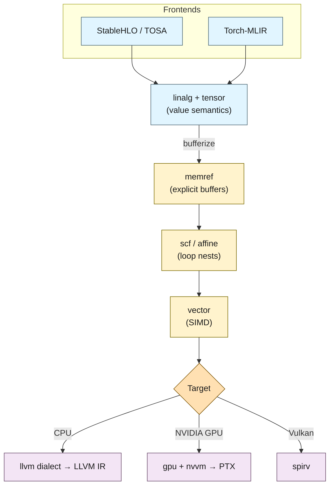
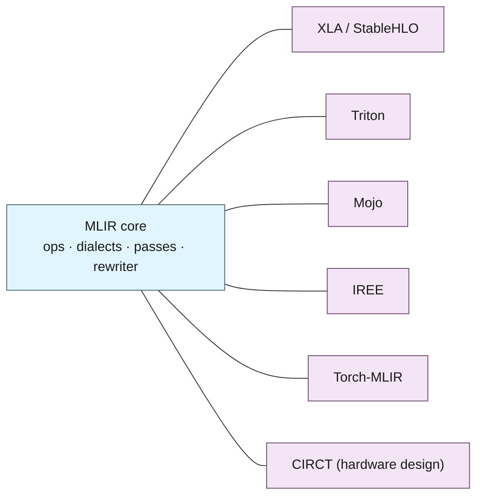

If you train or serve models, you depend on MLIR whether or not you have ever written a line of it. XLA lowers through it, Triton is built on it, Mojo is MLIR-native, and Torch-MLIR, IREE, and ONNX-MLIR exist to funnel their respective frontends into it. The reason a single piece of infrastructure ended up underneath so many otherwise-competing stacks is worth understanding, because it explains a lot about how modern ML compilers are actually built, and where their seams are.

This post is a tour of MLIR: what it is, the dialect idea that makes it different, how a tensor operation is progressively lowered to machine code, and what the infrastructure does and does not give you.

## What MLIR Actually Is

The common misconception is that MLIR is "another IR like LLVM IR." It is better described as an IR *construction kit*. LLVM IR is a single, fixed, low-level representation: roughly a typed assembly with SSA values. That is the right abstraction for the last mile to machine code, and the wrong one for a matrix multiply over tensors. Historically, every domain compiler that needed a higher-level representation invented its own from scratch: XLA had HLO, Halide its own IR, TensorFlow its graph, each shipping with a separate pass manager, serialization format, verifier, and pile of bugs.[^1]

MLIR's premise is that those representations have far more in common than not, and that the common parts can be built once and shared: SSA, a CFG of regions and blocks, a pass infrastructure, a pattern rewriter, location tracking, and verification. What differs between domains is then expressed as a *dialect*.

The unit of everything in MLIR is the **Operation**. An op has operands and results (SSA values), a set of typed **attributes** (compile-time constants like shapes or strides), and zero or more **regions**, which themselves contain blocks of further ops. That last property is what makes the IR genuinely multi-level: a single op can carry a whole nested computation, so a high-level `linalg.generic` and a low-level `llvm.add` are the same kind of object at different altitudes. Every op belongs to a dialect, which is simply a namespace for a related family of ops, types, and attributes.

Stated as a grammar, the relationship is small and recursive. A dialect supplies *vocabulary*, the op names, types, and attributes, while the *shape* of an operation is universal:

```ebnf
; A dialect is a namespace that contributes a family of ops, types, and attributes.
dialect    ::= (operation-def | type-def | attribute-def)*

; The grammar of an operation is identical across every dialect.
operation  ::= [ result ("," result)* "=" ] op-name
               "(" [ operand ("," operand)* ] ")"
               attr-dict? region*
               ":" type-signature

op-name    ::= dialect-name "." mnemonic       ; e.g. linalg.matmul, scf.for, llvm.add
attr-dict  ::= "{" attr-entry ("," attr-entry)* "}"   ; compile-time constants
region     ::= "{" block+ "}"
block      ::= operation+                      ; ops hold regions hold ops -> it recurses

result     ::= ssa-value                       ; %C
operand    ::= ssa-value                       ; %A, %B
type       ::= dialect-name "." mnemonic | builtin-type   ; tensor<...>, memref<...>
attr-entry ::= name "=" (dialect-name "." mnemonic | builtin-attr)
```

Two consequences fall out of this. First, the op name, the types, and the attributes are all namespaced by a dialect (`linalg.matmul`, `tensor<128x256xf32>`), so "adding a dialect" extends the vocabulary without touching the grammar, which is exactly why the surrounding infrastructure can be dialect-agnostic. Second, because an `operation` may contain a `region`, and a `region` contains `block`s of further `operation`s, the structure nests without bound, and that recursion is what lets a single op carry an entire computation rather than one instruction.

## Dialects: One IR, Many Altitudes

The defining feature is that dialects *coexist*. A module mid-compilation routinely holds ops from several dialects at once, and lowering is the gradual replacement of higher-level ops with lower-level ones until only a target dialect remains. The dialects an ML pipeline passes through, from high to low:

- **High level (what you mean):** `stablehlo` and `tosa` (whole-tensor operator sets), `linalg` (structured ops over tensors/buffers), `tensor` (value-semantic tensor manipulation).[^4]
- **Mid level (how it's structured):** `memref` (buffers with layout/strides), `affine` and `scf` (loop nests and structured control flow), `vector` (SIMD), `arith` (scalar math).[^3]
- **Low level (where it runs):** `llvm` (translated to LLVM IR for CPUs), `gpu` plus `nvvm`/`rocdl` (GPU targets), `spirv` (Vulkan/compute).

The skill MLIR encodes is choosing *when* to drop from one altitude to the next. Stay high too long and you cannot express a hardware-specific schedule; drop low too early and you have thrown away the structure an optimizer needs.

The word *coexist* is easy to gloss over, so here is a single function that uses four dialects at once. Nothing has been lowered yet; these ops simply live side by side in one SSA region, and the verifier checks them together:

```mlir
// One region, four dialects; each line is tagged with the dialect it comes from.
func.func @scale_in_place(%buf: memref<1024xf32>, %a: f32) {
  %c0 = arith.constant 0    : index   // 1. arith: loop bounds are scalar index constants
  %c1 = arith.constant 1    : index   // 2. arith
  %n  = arith.constant 1024 : index   // 3. arith
  scf.for %i = %c0 to %n step %c1 {    // 4. scf: a structured loop that carries a region
    %x = memref.load %buf[%i]  : memref<1024xf32>   // 5. memref: read from an explicit buffer
    %y = arith.mulf %x, %a     : f32                // 6. arith: the scalar multiply
    memref.store %y, %buf[%i]  : memref<1024xf32>   // 7. memref: write the result back
  }
  return                              // 8. func: terminator
}
```

Four dialects, `func`, `arith`, `scf`, and `memref`, appear in one region with no impedance mismatch between them. A later pass might rewrite the `scf.for` into `cf` branches, or vectorize the body into the `vector` dialect, but at this altitude they simply compose. That composability is the point: dialects are not separate IRs you translate between, they are vocabularies you mix in a single program.



## Progressive Lowering, Concretely

Take a single matrix multiply. At the top, it is one structured **op** over (value semantic) tensors. Shapes live in the type, and nothing has been said yet about memory or loops:

```mlir
// Shapes are part of the type; this is pure dataflow over tensors.
func.func @matmul(%A: tensor<128x256xf32>,
                  %B: tensor<256x64xf32>) -> tensor<128x64xf32> {
  %zero = arith.constant 0.0 : f32                       // 1. scalar identity for the accumulator
  %init = tensor.empty() : tensor<128x64xf32>            // 2. an uninitialized result value
  %acc  = linalg.fill ins(%zero : f32)
                      outs(%init : tensor<128x64xf32>)
                      -> tensor<128x64xf32>              // 3. zero-initialize the accumulator
  %C = linalg.matmul                                     // 4. the whole multiply, as one op
         ins(%A, %B : tensor<128x256xf32>, tensor<256x64xf32>)
         outs(%acc  : tensor<128x64xf32>) -> tensor<128x64xf32>
  return %C : tensor<128x64xf32>
}
```

Two transformations turn this into something close to machine code. First, **bufferization** converts value-semantic `tensor`s into `memref`s, explicit buffers with addresses, layouts, and lifetimes.[^5] This is the moment the program stops being pure dataflow and acquires aliasing, allocation, and the need to write results into a caller-provided output buffer rather than returning a fresh value. Second, the structured `linalg.matmul` is lowered into an explicit loop nest:

```mlir
// Tensors are now memrefs; the result is written in place into %C.
func.func @matmul(%A: memref<128x256xf32>,
                  %B: memref<256x64xf32>,
                  %C: memref<128x64xf32>) {
  affine.for %i = 0 to 128 {                             // 1. the loop nest the matmul implied
    affine.for %j = 0 to 64 {
      affine.for %k = 0 to 256 {
        %a = affine.load %A[%i, %k] : memref<128x256xf32>  // 2. explicit loads from buffers
        %b = affine.load %B[%k, %j] : memref<256x64xf32>
        %c = affine.load %C[%i, %j] : memref<128x64xf32>
        %p = arith.mulf %a, %b : f32                     // 3. the arithmetic, now scalar
        %s = arith.addf %c, %p : f32
        affine.store %s, %C[%i, %j] : memref<128x64xf32> // 4. accumulate back into the buffer
      }
    }
  }
  return
}
```

From here the `affine`/`scf` loops can be tiled, vectorized into the `vector` dialect, and finally lowered to the `llvm` dialect (for CPU) or the `gpu`/`nvvm` path. Essentially, the *same* high-level starting point can be driven down any of these target paths by choosing different lowering passes. That reuse, one frontend representation, many target lowerings, is the entire economic argument for MLIR.

## The Real Payoff: Reusable Lowering Machinery

What makes this practical is not the dialects themselves but the shared infrastructure beneath them. MLIR provides a **dialect conversion** framework: you declare a conversion target (which dialects/ops are "legal" at the end), supply rewrite patterns that transform illegal ops into legal ones, and the framework applies them to a fixed point, handling type conversions and operand remapping along the way.[^2] Pattern rewriting, the verifier, location/debug-info propagation, and the pass manager are all dialect-agnostic. Most transformations are written as local rewrite patterns rather than hand-coded IR traversals, including the canonicalization patterns each dialect registers to fold and simplify its own ops, and they can be declared declaratively (via PDL/DRR) and applied by a shared driver.[^10] A new abstraction is a set of op definitions plus a set of patterns; everything around it is inherited.

This is why the ecosystem consolidated. Rather than each project maintaining a bespoke compiler middle-end, they share one:



It is also how new hardware gets targeted. A vendor adds a dialect that models its device's operations and memory, plus the passes that lower the standard mid-level dialects (`linalg`, `memref`, `vector`) onto it. The frontend, the optimizer, and the tooling come for free; the vendor writes only the part that is genuinely specific to their silicon.[^6]

## The Costs: Verification, Debugging, and Fragile Pipelines

The machinery that makes MLIR productive has sharp edges worth stating plainly.

**Defining correct verification is real work.** Every dialect ships a verifier that enforces invariants on its ops and types, and the shared framework runs all of them together. That catches malformed IR early, but the burden of writing *correct* verification rules falls on whoever defines a dialect. Get a type invariant wrong, or leave one out, and malformed IR passes the verifier and resurfaces as a crash in a later pass, far from where it was actually introduced.[^7]

**Debugging spans altitudes.** With several dialects in one module and a long sequence of passes, a miscompile or a performance regression has to be traced from a high-level tensor op down to a specific LLVM or PTX instruction. Location tracking propagates source positions through lowering and helps, but a bug frequently manifests many passes after the one that caused it. The practical tools are dumping the IR between passes (`mlir-opt --mlir-print-ir-after-all`) and the automatic crash reproducer; even with them, multi-level debugging is its own skill, and improving it is a recurring topic in the MLIR community.[^8]

**Dialects are stable; pipelines are not.** StableHLO is a versioned, portable interchange, and the built-in dialects are reasonably stable. The *pass pipelines* that string transformations together are not. A lowering pipeline tuned for Torch-MLIR will not generally run unmodified through IREE, and a sequence that works on one release can break on the next. "Built on MLIR" means the dialects compose; it does not mean two MLIR-based stacks interoperate end to end.[^9]

## Key Technical Takeaways

| Concept | What it is | Why it matters |
| :--- | :--- | :--- |
| **Dialects** | Namespaces for ops and types (e.g. `linalg`, `arith`). | Lets high-level and low-level ops mix in one module without an impedance mismatch. |
| **Regions** | Ops can contain nested blocks of further ops. | Enables a multi-level IR where one op holds a whole sub-computation (a loop body inside a structured op). |
| **Bufferization** | Converting `tensor` (value semantics) to `memref` (buffers). | The transition where the program acquires aliasing, allocation, and side effects. |
| **Dialect conversion** | A framework that rewrites illegal ops into legal ones to a fixed point. | The engine that drives lowering, e.g. `linalg` → `vector` → `llvm`. |

## Where the Infrastructure Stops

MLIR is, deliberately, plumbing. It gives you a place to *represent* hardware and a disciplined way to *lower* onto it, and that is a great deal. But it is not a source language, and it does not, by itself, decide where a computation should run or guarantee that a buffer lives in the memory space an operation expects. Those choices are made by whatever sits on top: the frontend language, the pass pipeline, the cost model. They are still, today, mostly expressed outside the type system and checked late, if at all. That gap, between MLIR giving you the machinery to lower onto heterogeneous hardware and the source languages above it largely treating placement and memory space as an afterthought, is a recurring theme I will keep coming back to in future posts.

You can see the same gap from the other side. MLIR keeps its core deliberately small, so any requirement the upstream dialects do not cover, framework-specific tensor semantics, sharding, quantization, target-specific ops, tends to become yet another dialect. The published roster of MLIR users reads, in effect, as a catalog of these in-tree and out-of-tree (and often proprietary) dialects, many of them re-solving overlapping problems in incompatible ways.[^11] Extensibility and fragmentation are the same property viewed from two sides, and the abstractions ML programming most depends on, including where data lives and where work runs, are among the things reinvented per stack rather than expressed once.

For now, the takeaway is narrower: the stack you already use is an MLIR stack. Knowing its altitudes, where tensors become buffers, where structure becomes loops, where loops become a target, is most of what it takes to read what your compiler is actually doing to your model.

---

## References

[^1]: **MLIR: Scaling Compiler Infrastructure for the Domain of ML** — Lattner, C., Amini, M., Bondhugula, U., Cohen, A., Davis, A., Pienaar, J., Riddle, R., Shpeisman, T., Vasilache, N., Zinenko, O. *CGO 2021*. ([arXiv:2002.11054](https://arxiv.org/abs/2002.11054))

[^2]: **MLIR Language Reference** — Operations, regions, SSA, and the dialect conversion framework. ([mlir.llvm.org/docs/LangRef](https://mlir.llvm.org/docs/LangRef/))

[^3]: **MLIR Dialects** — Overview of the built-in dialects (`linalg`, `tensor`, `memref`, `affine`, `scf`, `vector`, `arith`, `gpu`, `llvm`, `spirv`). ([mlir.llvm.org/docs/Dialects](https://mlir.llvm.org/docs/Dialects/))

[^4]: **The `linalg` Dialect** — Structured ops over tensors and buffers, and their lowering. ([mlir.llvm.org/docs/Dialects/Linalg](https://mlir.llvm.org/docs/Dialects/Linalg/))

[^5]: **Bufferization in MLIR** — Converting value-semantic tensors to side-effecting memrefs. ([mlir.llvm.org/docs/Bufferization](https://mlir.llvm.org/docs/Bufferization/))

[^6]: **StableHLO** — The portable, versioned MLIR dialect used as an interchange for XLA-class compilers. ([openxla.org/stablehlo](https://openxla.org/stablehlo))

[^7]: **Defining Dialects: Operations** — How op verifiers and invariants are written, and why downstream passes are allowed to assume verified IR. The community has also debated the limits of static verification, since some invalid cases only show up at runtime. ([Operation definitions](https://mlir.llvm.org/docs/DefiningDialects/Operations/), [RFC: Runtime Op Verification](https://discourse.llvm.org/t/rfc-runtime-op-verification/66776))

[^8]: **Debugging MLIR** — The official debugging guide (IR printing with `--mlir-print-ir-before/after-all`, `--mlir-disable-threading`, and the crash reproducer), alongside ongoing community efforts to improve cross-pass tracing. ([Debugging guide](https://mlir.llvm.org/getting_started/Debugging/), [RFC: MLIR Action, Tracing and Debugging](https://discourse.llvm.org/t/rfc-mlir-action-tracing-and-debugging-mlir-based-compilers/68679))

[^9]: **Pipeline fragility across stacks** — A Torch-MLIR lowering that breaks at a backend boundary, and an IREE case where inserting or reordering a single pass cascades into downstream legalization failures. ([torch-mlir#2096](https://github.com/llvm/torch-mlir/issues/2096), [iree#12283](https://github.com/iree-org/iree/issues/12283))

[^10]: **Pattern-Based IR Rewriting in MLIR** — Springer, M. LLVM Developers' Meeting (2024). Canonicalization and declarative (PDL/DRR) rewrite patterns applied by a shared driver. ([Slides (PDF)](https://llvm.org/devmtg/2024-10/slides/techtalk/Springer-Pattern-Based-IR-Rewriting-in-MLIR.pdf))

[^11]: **MLIR Users** — The published list of projects building on MLIR, a proxy for the breadth of in-tree and out-of-tree dialects. ([mlir.llvm.org/users](https://mlir.llvm.org/users/))

*Disclaimer: This article was generated using the Claude Opus 4.8 model.*
