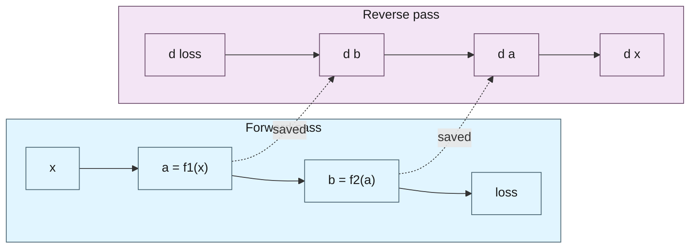

Training is gradient descent, and gradient descent needs gradients, so every ML framework has an automatic differentiation engine at its core. What is less obvious is that the *representation* a framework chooses for autodiff is one of its most consequential design decisions. It decides what control flow you may write, how much the compiler can optimize, where the engine sits in the stack, and ultimately what code you are allowed to differentiate at all. PyTorch, JAX, and compiler-level tools like Enzyme make three different choices, and the differences explain a lot of their downstream behavior.

This post is about those three representations: the runtime **tape**, the functional **trace-and-transform**, and **source (IR) transformation**. First, a brief refresher on what a gradient is and the algorithm that consumes it.

## A Gradient in One Equation

The gradient of a function is its slope: the rate at which the output changes as you nudge the input. For a one-variable function,

$$f(x) = 3x^2,$$

the gradient is the derivative $f'(x) = 6x$. At $x = 2$ that slope is $12$, the steepness of the tangent line touching the curve at that point.


_The gradient is the slope of the tangent line; for $f(x) = 3x^2$ it is $12$ at $x = 2$._

Numerically, that slope is a finite difference, the change in output over a small change in input:

$$f'(x) \approx \frac{f(x + h) - f(x)}{h},$$

exact in the limit $h \to 0$. You could compute a gradient this way, by perturbing each input in turn, but it costs one extra function evaluation per parameter and loses precision as $h$ shrinks. Automatic differentiation exists to get the same derivatives exactly, at a cost that does not grow with the number of parameters.

Training generalizes this to a loss function of millions of parameters. The gradient $\nabla_\theta L$ is a vector of partial derivatives, one per parameter, pointing in the direction that increases the loss fastest. **Gradient descent** steps the opposite way, downhill, to reduce the loss:

$$\theta \leftarrow \theta - \eta \, \nabla_\theta L,$$

where $\eta$ is the learning rate. Every step needs $\nabla_\theta L$, the gradient of the loss with respect to every parameter at once, and producing that, automatically and cheaply, is the whole job of an autodiff engine.[^7] Computing it efficiently starts with a choice of direction.

## Forward and Reverse Mode

Automatic differentiation applies the chain rule mechanically to a program.[^6] There are two directions to walk the chain, and the choice is purely about cost.[^5]

**Forward mode** propagates a derivative alongside each value, from inputs to outputs. Its cost scales with the number of *inputs*: one pass per input direction. **Reverse mode** computes the output first, then propagates sensitivities backward from outputs to inputs. Its cost scales with the number of *outputs*.

Concretely, write the computation as $y = f(\theta)$. Forward mode seeds an input direction $\dot\theta$ and pushes it through, accumulating a Jacobian-vector product:

$$\dot y = \frac{\partial f}{\partial \theta}\, \dot\theta \qquad \text{(forward, JVP)}.$$

Reverse mode runs the other way: it seeds the output with $\bar y = \partial L / \partial y$ and pulls a vector-Jacobian product back to the inputs,

$$\bar\theta = \left(\frac{\partial f}{\partial \theta}\right)^{\!\top} \bar y \qquad \text{(reverse, VJP)}.$$

For a scalar loss $L$, seeding $\bar y = 1$ makes a single reverse pass produce $\bar\theta = \nabla_\theta L$, the gradient with respect to every parameter at once, exactly what the update $\theta \leftarrow \theta - \eta\,\nabla_\theta L$ consumes. Forward mode would need one pass per parameter to assemble the same vector, and that asymmetry is why training uses reverse mode.

### A Worked Example

Take a small program with two inputs:

```python
from math import sin

def f(x1, x2):
    v3 = x1 * x2       # 1. product term
    v4 = sin(x1)       # 2. nonlinear term
    return v3 + v4     # 3. f = x1*x2 + sin(x1)
```

Analytically, its partial derivatives are

$$\frac{\partial f}{\partial x_1} = x_2 + \cos(x_1), \qquad \frac{\partial f}{\partial x_2} = x_1.$$

Autodiff reaches the same result mechanically: it records the elementary steps (a *Wengert list*[^8]) and applies the chain rule to each. Evaluate at $x_1 = 2,\ x_2 = 3$:

| step | value |
| --- | --- |
| $v_1 = x_1$ | $2$ |
| $v_2 = x_2$ | $3$ |
| $v_3 = v_1 v_2$ | $6$ |
| $v_4 = \sin v_1$ | $0.909$ |
| $f = v_3 + v_4$ | $6.909$ |

**Forward mode** carries a tangent $\dot v_i$ next to each value. Seed the input you want, $\dot x_1 = 1,\ \dot x_2 = 0$, and sweep forward:

| step | rule | value |
| --- | --- | --- |
| $\dot v_1$ | seed | $1$ |
| $\dot v_2$ | seed | $0$ |
| $\dot v_3 = \dot v_1 v_2 + v_1 \dot v_2$ | $1\cdot 3 + 2\cdot 0$ | $3$ |
| $\dot v_4 = \cos(v_1)\,\dot v_1$ | $\cos 2$ | $-0.416$ |
| $\dot f = \dot v_3 + \dot v_4$ | | $2.584$ |

One pass gives $\partial f / \partial x_1 = 2.584$. To also get $\partial f / \partial x_2$, forward mode must run again with $\dot x_2 = 1$, one pass per input.

**Reverse mode** runs the forward sweep once for the values, then sweeps backward accumulating an adjoint $\bar v_i = \partial f / \partial v_i$. Seed the output with $\bar f = 1$:

| step (backward) | rule | value |
| --- | --- | --- |
| $\bar f$ | seed | $1$ |
| $\bar v_3 = \bar f \cdot 1$ | $\partial f/\partial v_3 = 1$ | $1$ |
| $\bar v_4 = \bar f \cdot 1$ | $\partial f/\partial v_4 = 1$ | $1$ |
| $\bar x_2 = \bar v_3 \, v_1$ | $1\cdot 2$ | $2$ |
| $\bar x_1 = \bar v_3 \, v_2 + \bar v_4 \cos(v_1)$ | $1\cdot 3 + 1\cdot(-0.416)$ | $2.584$ |

That single backward pass yields *both* partials, $\partial f / \partial x_1 = 2.584$ and $\partial f / \partial x_2 = 2$, matching the analytic answer. With one output and many inputs, that is the entire economic case for reverse mode.

The catch is memory. Walking the chain backward requires the intermediate values from the forward pass, so something has to either store them or recompute them:



That "saved" edge, the intermediates the backward pass consumes, is exactly what the three representations that follow manage differently. Each is essentially machinery for recording this graph and replaying it backward. They diverge mainly in where those intermediates live and when they are produced. (Reducing the set is what gradient checkpointing trades compute for: drop the saved values and recompute them on the backward pass.)

## Representation 1: The Runtime Tape (PyTorch)

PyTorch builds the differentiation graph *as the forward pass runs*. Every operation on a tensor with `requires_grad` records a node, capturing the inputs it needs for its own backward formula. The result is a tape: a dynamic record of exactly the operations that executed, in the order they executed.[^1]

```python
import torch

# 1. requires_grad marks the leaf whose gradient we want.
x = torch.tensor([2.0], requires_grad=True)

# 2. The tape is built op-by-op AS THIS RUNS, recording only the path actually taken.
y = x * x
if y.item() > 1.0:        # 3. a data-dependent branch; the tape captures this side only
    z = y * 3.0
else:
    z = y + 3.0

# 4. backward() replays the recorded tape in reverse, accumulating dz/dx into x.grad.
z.backward()
print(x.grad)             # 5. 12.0 = d(3 x^2)/dx at x = 2
```

Because the tape is whatever ran, arbitrary Python control flow just works. This includes data-dependent branches, loops with runtime trip counts, and recursion. The tape reflects the path taken on this input. The weakness is the flip side: the graph exists only at runtime, one op at a time, so there is no whole-program form for an optimizer to fuse or rearrange ahead of time. `torch.compile` exists precisely to recover a static graph after the fact, by tracing the tape-building code and handing the result to a compiler.

## Representation 2: Trace to a Functional IR (JAX)

JAX takes gradients of *pure functions*. It traces the function once with abstract values to produce a jaxpr, a small functional intermediate representation. Differentiation is then a transformation *on that IR* rather than a runtime recording.[^2] Because the result is a program transformation, it composes with the other transformations JAX offers.

```python
import jax
import jax.numpy as jnp

def f(x):
    return jnp.sum(3.0 * x * x)

# 1. grad is a transformation: given f, it returns a NEW function that computes df/dx.
df = jax.grad(f)

# 2. Transformations compose freely: batch with vmap, then compile the whole thing with jit.
batched_df = jax.jit(jax.vmap(df))

print(df(2.0))                       # 3. 12.0
print(batched_df(jnp.arange(4.0)))  # 4. the gradient at each input, batched and compiled
```

The strength is that the gradient is a program the compiler sees in full: XLA can fuse the forward and backward computations and schedule them as one. The cost is the purity requirement. The function must be a side-effect-free transformation of its inputs, and control flow that depends on traced values has to be expressed through structured primitives (`lax.cond`, `lax.scan`) rather than native Python `if`/`for`. You trade some of PyTorch's dynamism for a representation an optimizer can work on.

## Representation 3: Source (IR) Transformation (Enzyme, Zygote)

The third approach differentiates the program itself, emitting a new program that computes derivatives. Zygote does this on Julia's SSA IR;[^3] Enzyme does it on LLVM IR, and now on MLIR through an Enzyme dialect.[^4] The distinctive move in Enzyme's case is *when* it runs: it differentiates the **optimized** IR, after the compiler has already inlined, simplified, and specialized the code.

```c
// 1. An ordinary function. The compiler optimizes it as usual first.
double sq(double x) { return 3.0 * x * x; }

// 2. Enzyme differentiates the OPTIMIZED LLVM IR of sq, not its source text.
extern double __enzyme_autodiff(void*, double);

double grad_sq(double x) {
    return __enzyme_autodiff((void*)sq, x);  // 3. returns d(sq)/dx = 6x
}
```

This buys two things the framework-level engines cannot easily get. First, differentiating after optimization tends to produce better gradient code. The derivative is taken of the code that will actually run instead of a higher-level form with abstraction overhead. Second, it can differentiate code the framework never wrote, including foreign functions, hand-written kernels, and library calls. It works at the IR every language compiles to, rather than at the level of a framework's tensor objects.

Working at the IR also imposes the strictest requirements of the three. Autodiff differentiates the operations a program actually executes, not the mathematical function you intended, so for source transformation to produce a gradient three conditions have to hold:

- **Every instruction it traverses needs a derivative rule.** The tool walks each IR instruction and emits its adjoint. An op with no rule, a `floor`, a comparison, or an opaque external call, is treated as having zero derivative unless you supply one. That same rule-at-the-IR-level is what lets it differentiate foreign code in the first place.
- **Active values must be separated from inert ones.** An *activity analysis* finds which values depend on the inputs and reach the outputs; constants and integer index arithmetic are skipped. Getting it wrong wastes work or corrupts the gradient.
- **Memory must be analyzed.** IR has loads, stores, and aliasing, not just values. The tool has to track how a stored value is later read in order to route the adjoint correctly. This is the genuinely hard part and the reason source-level AD needed a real compiler to get right.[^4]

Beneath all three is a baseline that governs *every* representation in this post: the function must be built from differentiable elementary operations and evaluated where it is differentiable. At a kink such as `relu(0)` autodiff returns a convention rather than a true derivative (a subgradient, usually `0`). Where control flow makes the function piecewise, it differentiates only the active piece, blind to the jump at the boundary.[^9] The tape and the trace inherit this baseline and add their own constraints: the tape needs every op to carry a backward formula, and the trace needs a pure function with structured control flow. Source transformation's extra burden is the activity and memory analysis the other two largely sidestep by working on values rather than an IR.

## The Real Axis: Where Differentiation Happens

Reduced to one question, the three approaches differ in *where in the stack* the derivative is taken:

| | Where it lives | Control flow | Optimizable as a whole | Can differentiate foreign code |
| --- | --- | --- | --- | --- |
| **Tape** (PyTorch) | runtime, on tensor objects | any native Python | no (needs later capture) | no |
| **Trace** (JAX) | a functional IR (jaxpr) | structured primitives only | yes (XLA) | within the traced function |
| **Source transform** (Enzyme/Zygote) | the compiler IR | whatever the IR expresses | yes, and after optimization | yes |

None is strictly best; they sit at different points on the same trade-off between dynamism and what a compiler can do with the result. PyTorch maximizes expressiveness and recovers optimization afterward; JAX fixes a functional contract to get a fully optimizable graph; source transformation pushes differentiation down to the IR so it can apply to anything that compiles, at the cost of operating below the comfortable abstractions.

There is a consequence worth flagging for later. Once differentiation is a transformation on a *compiler* IR rather than a runtime engine bound to one framework's objects, the gradient stops being a framework feature and becomes a property of the program, including programs that span languages, custom kernels, or, in principle, more than one kind of hardware. Most autodiff in practice is still trapped inside a single framework's runtime and a single device's view of memory; differentiating a computation that crosses the host/accelerator boundary remains awkward. That gap, between autodiff as a portable IR transformation and autodiff as a framework-and-device-bound runtime, is one I will return to when this series gets to differentiating across the memory boundary.

## Conclusion

Tape, trace, and source transform are three answers to the same question: the chain rule applied to a program. They are distinguished mainly by where the derivative is computed and what that location constrains. The runtime tape buys dynamism, the functional trace buys whole-graph optimization, and source transformation buys reach: the ability to differentiate optimized code in any language. Knowing which one a tool uses tells you, in advance, what it will let you write and how well its gradients will run.

---

## References

[^1]: **PyTorch: An Imperative Style, High-Performance Deep Learning Library** — Paszke, A., Gross, S., Massa, F., et al. *NeurIPS 2019*. Describes the reverse-mode, tape-based autograd engine. ([arXiv:1912.01703](https://arxiv.org/abs/1912.01703))

[^2]: **JAX: Autodiff and the `grad`/`vjp`/`jvp` transformations** — The JAX Autodiff Cookbook and design. ([jax.readthedocs.io](https://jax.readthedocs.io/en/latest/notebooks/autodiff_cookbook.html))

[^3]: **Don't Unroll Adjoint: Differentiating SSA-Form Programs** — Innes, M. Source-to-source reverse-mode AD on SSA IR (Zygote). ([arXiv:1810.07951](https://arxiv.org/abs/1810.07951))

[^4]: **Instead of Rewriting Foreign Code for Machine Learning, Automatically Synthesize Fast Gradients** — Moses, W., Churavy, V. *NeurIPS 2020*. Enzyme: differentiating optimized LLVM IR. ([arXiv:2010.01709](https://arxiv.org/abs/2010.01709))

[^5]: **Evaluating Derivatives: Principles and Techniques of Algorithmic Differentiation** — Griewank, A., Walther, A. *SIAM, 2008*. The canonical treatment of forward/reverse mode and checkpointing.

[^6]: **Automatic Differentiation in Machine Learning: a Survey** — Baydin, A. G., Pearlmutter, B. A., Radul, A. A., Siskind, J. M. *JMLR 2018*. ([arXiv:1502.05767](https://arxiv.org/abs/1502.05767))

[^7]: **Gradients and gradient descent** — Goodfellow, I., Bengio, Y., Courville, A. *Deep Learning*, MIT Press 2016, ch. 4 (numerical computation); and Ruder, S. *An overview of gradient descent optimization algorithms* (2017). ([deeplearningbook.org](https://www.deeplearningbook.org/), [arXiv:1609.04747](https://arxiv.org/abs/1609.04747))

[^8]: **A Simple Automatic Derivative Evaluation Program** — Wengert, R. E. *Communications of the ACM*, 7(8):463–464, 1964. The origin of the "Wengert list" and of forward-mode automatic differentiation. ([doi:10.1145/355586.364791](https://doi.org/10.1145/355586.364791))

[^9]: **A Mathematical Model for Automatic Differentiation in Machine Learning** — Bolte, J., Pauwels, E. *NeurIPS 2020*. What AD actually computes on nonsmooth functions (kinks, piecewise control flow), and why it returns valid subgradients almost everywhere. ([arXiv:2006.02080](https://arxiv.org/abs/2006.02080))

*Disclaimer: This article was generated using the Gemini 3.1 Pro and Claude Opus 4.8 models.*
