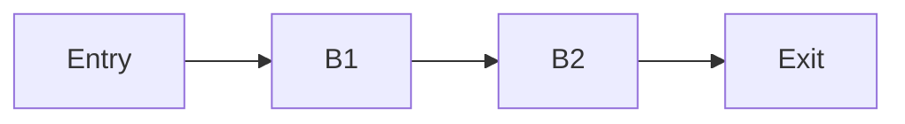



When building a dataflow analysis framework in a compiler, you quickly encounter an array of mathematical terms: semilattices, semirings, Kleene algebras, Galois connections, and Knaster-Tarski fixpoints. It is easy to treat these as distinct, isolated concepts or to conflate them into a single fuzzy Venn diagram. However, to truly engineer robust static analyses, we need a precise mental model of how these structures interact[^1].

The cleanest way to understand this landscape is to view it as three concentric *kinds* of mathematical objects rather than a single flat structure. In this post, we will dissect the anatomy of dataflow equations, map every symbol back to its proper theoretical home, and explore why compilers rely on complete lattices even when they seem to only use half of their power.

## The Three Layers of Dataflow Theory

To see the whole picture, we organize the mathematical structures into three distinct layers: the base, the overlap, and the wrapper.

### 1. The Base Carrier Set
At the core, we have a single carrier set that is progressively enriched in algebraic structure. It is helpful to think of this as a sequence of stronger axioms rather than a literal subset relation:

- Monoid → Semilattice → Lattice → Complete Lattice
A semilattice is (informally) a commutative, idempotent binary operation that gives us a confluence operator (meet or join). When the structure is bounded, it can be viewed as a monoid. A lattice equips the set with both meet and join satisfying the absorption laws. A complete lattice further guarantees that arbitrary subsets have greatest lower bounds and least upper bounds. Completeness ensures the existence of fixpoints (Knaster–Tarski). Termination of an iterative solver, however, requires additional properties (finite height / ACC, widening, or other convergence criteria).

For compiler engineers, this base layer maps to familiar constructions: the powerset lattice $\mathcal{P}(S)$ ordered by inclusion (used for may-analyses such as reaching definitions), bitvector lattices (finite-height, efficient for dataflow frameworks), and numeric lattices used for interval or sign analyses (often requiring widenings). Note that the algebraic names (monoid, semilattice) describe the operations you rely on when writing transfer functions and merge operators, while the lattice and completeness properties are the meta-invariants that let fixpoint theory apply.
### 2. The Semiring Overlap
Beside the base hierarchy sits the **Semiring** and **Kleene Algebra** layer. This is an *alternative* enrichment of a carrier set. It intersects the semilattice precisely when its additive operation ($\oplus$) is idempotent. A semilattice is effectively a semiring where addition means "merge paths" and multiplication means "compose effects".

More concretely, an idempotent semiring $(R,\oplus,\otimes,0,1)$ models path algebra: $\oplus$ aggregates alternative paths (think union or meet depending on ordering), and $\otimes$ composes effects along a path (function composition or relational composition). The Kleene star $x^*$ algebraically summarizes iteration over cycles[^4]. For PL architects, this layer formalizes the difference between "what a single path does" and "what the set of all paths does", providing a language for reasoning about precision and expressiveness of analyses.

### 3. The Meta Layer
Above and around the base set sit the relational layers that govern the analysis:
- **Transfer-Function Monoid:** This acts *on* the lattice, transforming abstract states.
- **Galois Connection:** This relates two different lattices (the concrete semantics and the abstract domain).
- **Knaster-Tarski Fixpoint Theorem:** This is the engine that justifies the entire construction, guaranteeing that iterative solving will eventually terminate at a fixpoint.

Drill-down details for experts:
- Transfer functions are elements of the set of monotone functions $\mathrm{Mon}(L,L)$. The monoid structure is composition with identity. Monotonicity (preserving order) is the key correctness requirement. When these functions additionally distribute over the confluence operator (e.g., $f(x\vee y)=f(x)\vee f(y)$), you get stronger precision properties (MFP = MOP).
- A Galois connection between concrete lattice $(C,\le_C)$ and abstract lattice $(A,\le_A)$ is a pair $(\alpha: C\to A,\;\gamma: A\to C)$ satisfying $\alpha(c) \le_A a \Leftrightarrow c \le_C \gamma(a)$[^2]. In practice, we use the abstraction map $\alpha$ to translate concrete states to abstract values and $\gamma$ to interpret abstract results. Soundness requires $c \le_C \gamma(\alpha(c))$ for all concrete $c$ (abstraction is an over-approximation).
- Knaster–Tarski guarantees existence of least/greatest fixpoints for monotone functions on complete lattices[^3]. Computationally, we rely on iteration, sometimes augmented with widenings (to force convergence on infinite-height lattices) and narrowings (to regain precision afterwards).

## Anatomy of a Single Dataflow Equation

Consider the standard forward dataflow equation for a basic block $b$:

\[
\mathrm{IN}[b] \;=\; \bigwedge_{p \in \mathrm{pred}(b)} \mathrm{OUT}[p]
\qquad\qquad
\mathrm{OUT}[b] \;=\; f_b\big(\mathrm{IN}[b]\big)
\]

These equations use every layer at once. They form the equation system whose solution is the fixpoint.

- The **values** $\mathrm{IN}[b]$ and $\mathrm{OUT}[b]$ are elements of the **lattice $L$**, representing the abstract state. They live in the base carrier set.
- The **meet** $\bigwedge$ is the **semilattice operation**. This is where confluence happens, merging facts from multiple predecessors. It is an idempotent, commutative, and associative monoid operation. In the semiring view, this is precisely the additive operation $\oplus$, representing aggregation over alternative incoming paths.
- The **transfer function** $f_b$ is an element of the **monotone-function monoid** $(F, \circ, \mathrm{id})$. This is the relational layer acting on $L$. In the semiring view, $f_b$ corresponds to multiplication $\otimes$ ("compose along the path through block $b$").

Operationally, a transfer function for a block implements the block's effect on abstract states: kills, gens, state updates, or relational summaries. For must/always analyses, the domain and ordering reverse (information shrinks), so be explicit about the ordering convention when proving soundness. For complex analyses (intervals, polyhedra), transfer functions may be costly and only partially computable. This is why abstract interpretation trades exactness for computability via conservative approximations.

## The Dual Nature of Lattices in Compilers

You might wonder: if a specific dataflow analysis only uses one confluence operator—for example, Reaching Definitions only uses Join ($\sqcup$ / Union) and Available Expressions only uses Meet ($\sqcap$ / Intersection)—why do we require a *complete lattice*? Why not just a semilattice?

The answer is that even though the compiler's merge function explicitly invokes only one operator, the **mathematical dual** always exists across the domain. The framework forms a complete lattice because the underlying mathematical domain contains both meets and joins for every subset. The compiler uses one operator to merge information, while the dual operator implicitly defines how the "Top" ($\top$) and "Bottom" ($\bot$) boundaries behave.

### Decomposing and Reassembling Lattices

Because a lattice inherently possesses both operations, it can always be decomposed into two semilattices:
1. A **Join-Semilattice** that focuses only on the join ($\lor$) operator.
2. A **Meet-Semilattice** that focuses only on the meet ($\land$) operator.

However, you cannot just glue any two random semilattices together to form a lattice. To successfully combine, they must satisfy the **Absorption Laws**:

1. $a \lor (a \land b) = a$
2. $a \land (a \lor b) = a$

These laws act as the mathematical glue. They ensure that the upward ordering structure defined by the join operation aligns with the downward ordering structure defined by the meet operation. For example, consider the divisors of 6: $\{1, 2, 3, 6\}$. The join-semilattice focuses on the Least Common Multiple (LCM), while the meet-semilattice focuses on the Greatest Common Divisor (GCD). Because their upward and downward paths align and satisfy the absorption laws, they form a cohesive, single lattice.

## The Equation System and the Fixpoint Engine

Returning to our dataflow equations, the whole equation system—one pair of equations per block, mutually referencing each other through the control-flow graph—defines a single, large monotone function on the product lattice. Concretely, if there are n program points we work on the product lattice $L^n$ and define

\[
F : L^n \to L^n,\qquad F(\vec{x}) = (g_1(\vec{x}),\dots,g_n(\vec{x})),
\]

where each $g_i$ computes the next-value of the $i$th unknown (an IN or OUT) from the current vector $\vec{x}$. Solving the dataflow system is finding $\vec{x}$ such that $F(\vec{x}) = \vec{x}$ — i.e., a fixpoint of $F$[^6].

This is where the **Knaster-Tarski** layer steps in. Because the product of complete lattices is itself a complete lattice, and because $F$ is monotone, a least fixpoint is guaranteed to exist. If the lattice satisfies the Ascending Chain Condition (ACC) or has finite height, standard worklist iteration will reach this fixpoint in finite steps.

From an engineering viewpoint, constructing $F$ explicitly as a vector of component update functions clarifies worklist design. Each worklist step applies a local $g_i$, pushes dependents, and repeats until no change. Complexity bounds depend on domain height and the cost of transfer functions. The worst-case number of updates is exponential in the product lattice height, but the sparsity of the CFG and distributivity often yield much better practical behavior. Use widenings when the height is infinite (e.g., interval analysis), and design reverse-narrowing passes if you need extra precision after widening.

### Forcing Convergence: The Widening Operator

For domains with infinite height (like Interval Analysis), standard iteration might never reach a fixpoint. This is where the **widening operator** ($\nabla$) becomes essential. Widening acts as a heuristic extrapolation, intentionally overshooting the precise fixpoint to guarantee termination.

For example, in interval analysis, if a loop counter $i$ takes on values $[0,0]$, then $[0,1]$, then $[0,2]$ across successive iterations, a widening operator detects this instability and forces the upper bound to infinity, jumping to $[0, +\infty]$. By sacrificing precision (we lose the exact upper bound), we regain computability (the analysis terminates). Once convergence is forced via widening, engineers often run a subsequent **narrowing** ($\Delta$) pass—a controlled downward iteration that refines $[0, +\infty]$ back down to a more precise bound using the loop exit conditions.

## Two Solution Concepts: MFP and MOP

There are two primary notions of "the answer" in dataflow analysis:

1. **Fixed point computed by iteration (often called MFP in classic texts):** The iterative worklist algorithm computes a fixpoint of $F$; in the common ordering where information grows upward, this is the least fixpoint. Be aware that some authors use differing names depending on ordering conventions, so explicitly stating the lattice order avoids confusion.
2. **Meet Over all Paths (MOP):** The ideal, path-wise precise answer, defined as

\[\mathrm{MOP}[b] = \bigwedge_{\text{paths } \pi \text{ to } b} f_{\pi}(\mathrm{init}).\]

You run each path independently from the entry and meet the results at the end[^5].

Practical note for engineers: distributivity of transfer functions is the standard sufficient condition for equality between the iterative fixpoint and the path-wise MOP. In many set- and bitvector-based domains, this holds. For larger numeric or relational domains (intervals, polyhedra), distributivity breaks down, and analyses rely on widenings/narrowings and other heuristics to trade precision for termination.

Small worked example (reaching definitions):

Consider the tiny CFG with blocks Entry -> B1 -> B2 -> Exit. Let definitions be $d_1,d_2$ and the abstract domain $\mathcal{P}(\{d_1,d_2\})$ with join = union.

Block summaries:

- Entry: $\mathrm{gen}_{e}=\{d_1\}$, $\mathrm{kill}_{e}=\varnothing$.
- B1: $\mathrm{gen}_{1}=\{d_2\}$, $\mathrm{kill}_{1}=\varnothing$.
- B2: $\mathrm{gen}_{2}=\varnothing$, $\mathrm{kill}_{2}=\{d_1\}$ (overwrites $d_1$).

Iteration (join-based, initial IN=$\varnothing$):

| Step | IN(Entry) | OUT(Entry) | IN(B1) | OUT(B1) | IN(B2) | OUT(B2) |
|---:|:---:|:---:|:---:|:---:|:---:|:---:|
| Init | $\varnothing$ | $\{d_1\}$ | $\{d_1\}$ | $\{d_1,d_2\}$ | $\{d_1,d_2\}$ | $\{d_2\}$ |
| After 1 | $\varnothing$ | $\{d_1\}$ | $\{d_1\}$ | $\{d_1,d_2\}$ | $\{d_1,d_2\}$ | $\{d_2\}$ |

The iterated fixpoint equals the MOP here because the transfer functions are set-based and distribute over union: each path's contributions are preserved by union, so no precision is lost by the iterative solver.

The MOP is the semiring / Kleene-algebra "sum over all paths" formulation. For cyclic graphs the Kleene star summarizes repeated traversals, which is why Kleene algebra is the natural playground for MOP reasoning.

The fundamental relation is that the fixpoint computed by iteration is always a sound approximation of the path-wise answer — in lattice terms the iterative solution is below (less precise than) the MOP:

\[\mathrm{Iterated\;fixpoint} \;\sqsubseteq\; \mathrm{MOP}.\]

Here $\sqsubseteq$ denotes the lattice ordering used by the analysis (so "less than" means "more conservative"). Equality holds when transfer functions distribute over the confluence operator (this is the standard distributivity condition used in proofs that MFP = MOP)[^7].

Concrete example (reaching definitions):

Let the domain be $\mathcal{P}(\{d_1,d_2\})$ (sets of definitions) ordered by subset, with join $\cup$. For a block $b$ with
\[ f_b(S) = (S \setminus \mathrm{kill}_b) \cup \mathrm{gen}_b,\]
these transfer functions are distributive over union, so the iterated fixpoint equals the MOP. This small, familiar example helps ground the abstract claim: distributivity implies path-precision for the iterative solver.

## Bringing It Together with Galois Connections

Finally, the **Galois connection** layer provides meaning to the whole framework. It serves as the soundness argument, ensuring that the abstract values computed by these equations are correct over-approximations of the actual, concrete program states. The equations do not live *in* the Galois layer; rather, the Galois layer *certifies* them.

The dataflow equations form the fixpoint system whose unknowns live in the lattice, whose meet is the semilattice $\oplus$ operation, whose transfer functions are the monoid $\otimes$ operation, whose solution is delivered by Tarski, whose path-algebra alter ego is the semiring/Kleene MOP, and whose ultimate soundness is licensed by a Galois connection. They are the thread that stitches every theoretical box together.

### Galois Connections in Practice: Sign Analysis

To make this concrete, consider a simple Sign Analysis. The concrete domain $C$ is the powerset of integers, $\mathcal{P}(\mathbb{Z})$ (e.g., the actual values a variable might hold at runtime). The abstract domain $A$ is the set of signs: $\{\bot, -, 0, +, \top\}$, forming a lattice.

The Galois connection defines how these two worlds relate:
- **Abstraction ($\alpha$):** Maps a set of integers to a sign. For example, $\alpha(\{1, 5, 42\}) = +$. If the set contains mixed signs like $\{-2, 3\}$, $\alpha$ maps it to $\top$ (unknown/any).
- **Concretization ($\gamma$):** Maps an abstract sign back to the set of all possible integers it represents. For example, $\gamma(+) = \{x \in \mathbb{Z} \mid x > 0\}$.

Soundness guarantees that any computation performed in the abstract sign domain will, when concretized via $\gamma$, fully contain the true runtime values. If our abstract transfer function says the result of multiplying two negative variables is $+$, then $\gamma(+)$ must safely over-approximate the concrete multiplication of any two negative integers.

## Conclusion: The Engineer's Mental Model

When you sit down to implement or debug a dataflow framework, keep these distinct mathematical layers in mind. They tell you exactly where to look when things go wrong:
- When writing the `merge()` function, you are building a **semilattice**. Ensure your operation is idempotent, commutative, and associative.
- When proving that your analysis terminates, you rely on **complete lattices** and **Knaster-Tarski**. Ensure your domain has finite height, or implement a widening operator.
- When auditing precision and asking "is my iterative solver losing information compared to path-by-path execution (MFP vs. MOP)?", you are leaning on the **semiring** property. Look for distributivity.
- When mathematically proving that your analysis is correct and safe to use for optimizations, you are defining a **Galois connection** ($\alpha, \gamma$). Ensure your abstract states safely over-approximate the concrete runtime behavior.

Checklist for reviewers / PL auditors:

- **Concrete semantics:** Provide the concrete semantic function $\llbracket P\rrbracket_C$ used as the specification.
- **Abstraction maps:** State $\alpha$ and $\gamma$ and the ordering conventions on both lattices.
- **Soundness lemma:** Show $\alpha\circ \llbracket P\rrbracket_C \le_A \llbracket P\rrbracket_A \circ \alpha$ (or equivalent) and how it implies the abstract fixpoint over-approximates the concrete semantics via $\gamma$.
- **Termination strategy:** If the domain has infinite height, state the widening/narrowing choices and their impact on precision.

---

*Disclaimer: This article was generated using the Gemini 3.1 Pro and Claude Opus 4.8 models.*

## References

[^1]: **A Theory of Program Analysis:** K. L. McMillan's course notes and surveys on model checking and program analysis. ([link](https://www.cs.cmu.edu/~modelcheck/mc.pdf))
[^2]: **Abstract Interpretation:** P. Cousot and R. Cousot, "A Unified Lattice Model for Static Analysis of Programs by Construction or Approximation of Fixpoints", POPL 1977. ([link](https://doi.org/10.1145/512950.512973))
[^3]: **Introduction to Lattices and Order:** B. A. Davey and H. A. Priestley — standard reference for lattice theory and Knaster–Tarski.
[^4]: **A Completeness Theorem for Kleene Algebras and the Algebra of Regular Events:** Dexter Kozen, Theoretical Computer Science, 1994. ([link](https://doi.org/10.1016/0304-3975(94)90096-3))
[^5]: **Precise Interprocedural Dataflow Analysis via Graph Reachability:** T. W. Reps, S. Horwitz, and M. Sagiv, POPL 1995. ([link](https://doi.org/10.1145/199448.199462))
[^6]: **A Unified Approach to Global Program Optimization:** Gary A. Kildall, POPL 1973. The seminal paper that introduced lattice-theoretic frameworks to dataflow analysis. ([link](https://doi.org/10.1145/512927.512945))
[^7]: **Monotone Data Flow Analysis Frameworks:** John B. Kam and Jeffrey D. Ullman, Acta Informatica 1977. Formalized the MFP and MOP solution concepts and the distributivity condition for their equality. ([link](https://doi.org/10.1007/BF00290339))
