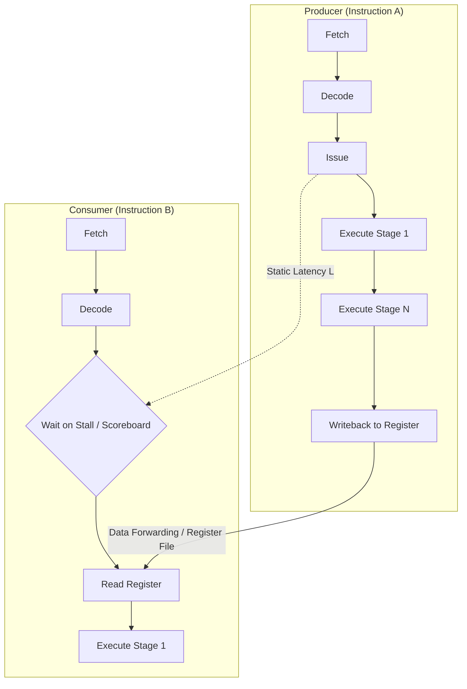
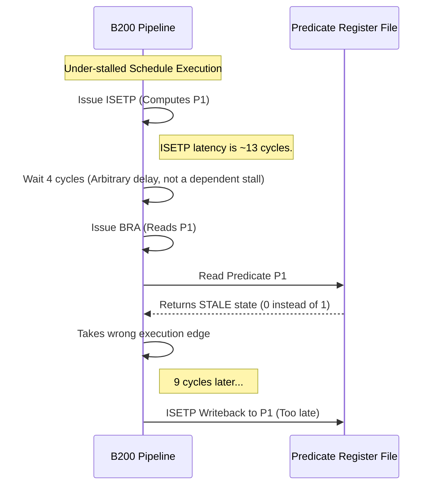
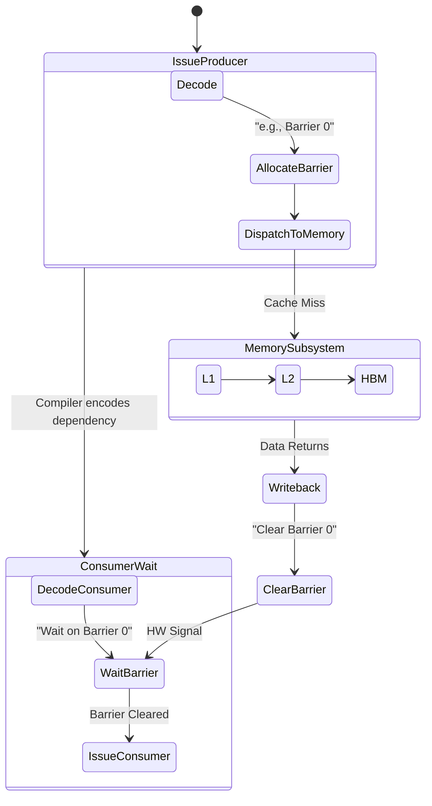



When engineering instruction schedulers and assemblers for modern, deep-pipeline GPUs like the Nvidia B200, static analysis and coverage metrics are necessary but insufficient. It is a humbling experience to build a compiler pass that reports 100% test coverage on Read-After-Write (RAW) dependency tracking, only to see the emitted code fail silently on actual silicon.

Why does this happen? Because the hardware pipeline itself is the final arbiter of correctness. When an assembler or scheduler *under-stalls* a dependency—allowing a consumer instruction to issue into the pipeline before the producer's result is firmly committed to the register file—the hardware does not typically raise an exception. Instead, it dutifully executes the compromised schedule, reading whatever stale state happens to be in the register, and propagates garbage through the rest of the computation.

These are not defects in the silicon. They are schedule violations where the hardware exposes the compiler's incorrect assumptions. In compiler backends, we generally adhere to a strict rule: **over-stalling is a performance bug, but under-stalling is a silent correctness bug.**

To catch these, we must construct a registry of hardware hazards backed by minimal, reproducible on-silicon tests. Let us examine the mechanics of these hazards on the B200 architecture, explore the control flows and architectural tradeoffs that govern them, and learn how we can systematically trigger them to validate scheduler correctness.

## The Anatomy of an Instruction Pipeline Hazard

Before diving into the specific B200 hazards, it is essential to ground ourselves in the mechanics of a GPU pipeline. Modern GPU streaming multiprocessors (SMs) are designed for extreme throughput. To achieve this, the pipeline is deep, and the hardware relies on the compiler (the assembler) to explicitly encode dependency information—either via stall counts or scoreboard barrier identifiers.

Consider a simple dataflow path where Instruction A produces a value that Instruction B consumes.



If Instruction B issues too early (the stall count is $L_{stall} < L_{actual}$), the `Read Register` phase of Instruction B will fetch the register's old contents before `WriteBack` completes. On CPUs, sophisticated out-of-order execution engines and Tomasulo-style register renaming mask these latencies dynamically. On GPUs, the philosophy is to maximize die area for ALUs, pushing the complexity of instruction scheduling onto the compiler. The hardware trusts the compiler's stall counts implicitly.

This architectural tradeoff—shifting scheduling complexity to the compiler to gain computational density—means that compiler engineers must be pedantic about low-level constraints like pipeline depths, execution latencies, and barrier encodings.

## 1. The Predicate-Consumer Under-Stall (H1)

The most difficult bugs are those that slip through rigorous static checks. Recently, an internal scheduler shipped with a critical bug involving predicate evaluation, despite static metrics claiming full RAW coverage across the test suite.

The pattern involves an integer set-predicate instruction (`ISETP`) that computes a condition and writes it to a predicate register, which is subsequently read by a branch instruction. This is classically seen in a back-edge branch defining a loop.

```assembly
// 1. Produce the predicate P1 based on some condition.
// R0 and R1 are compared; the boolean result is written to P1.
ISETP.GE.AND P1, PT, R0, R1, PT;

// 2. Consume P1 as the branch target condition.
// P0 is the execution guard (is the thread active?), P1 is the branch condition.
@!P0 BRA P1, target;
```

### The Mechanism of Failure

The bug originated in the `def_use` dataflow analysis pass of the compiler. The analyzer correctly recorded the guard predicate `P0` as a use for the branch instruction. However, it systematically dropped the branch condition operand `P1`.

Consequently, the compiler's internal dependency graph missed the `ISETP` $\rightarrow$ `BRA` RAW dependency. The scheduler, completely unaware of the dependency, failed to insert the required predicate-latency stall.



The branch issued roughly 4 cycles after the `ISETP`, well before the predicate's actual latency (modeled at 13 cycles) had elapsed. The branch instruction read a stale value for `P1`, took the wrong execution edge, and resulted in a silent miscomputation.

### Ground-Truth Mitigation

To prevent this, the scheduler must be gated by a static test asserting that `def_use(@!P0 BRA P1)` yields uses `{0,1}`. However, the true defense is an on-silicon probe. We force a stall on the `ISETP` and validate that the branch reads the correct predicate on hardware. The baseline predicate latency must be dynamically probed on-device because architectural models are often approximations. On the B200, tier-1 differencing (`lat_pred.cu`) confirmed the divergence between the modeled 13 cycles and the actual pipeline depths encountered during under-stalls.

## 2. Fixed-Latency RAW Under-Stalls (H2)

Fixed-latency arithmetic instructions, such as `FFMA` (Single-precision Fused Multiply-Add) and `DFMA` (Double-precision Fused Multiply-Add), form the backbone of matrix multiplication and tensor core workloads. They require precise, fixed cycle delays before their destination registers can be safely read.

If a scheduler emits a `stall` control code with a cycle count strictly below the hardware's fixed latency, the consumer reads the destination register before the ALU writeback stage completes.

### Latency Measurement and Tradeoffs

Through direct hardware probing on the B200, we measure the exact latency floors where execution transitions from incorrect (stale read) to correct (valid read).

| Operation | Precision | Measured Cycle Floor | Validation Signal |
| :--- | :--- | :---: | :--- |
| **FFMA** | FP32 | **4 cycles** | Stall 3 yields WRONG result. Stall 4 yields CORRECT result. |
| **DFMA** | FP64 | **8 cycles** | Stall 7 yields WRONG result. Stall 8 yields CORRECT result. |

Notice the tradeoff here: higher precision arithmetic naturally requires deeper pipelines. The FP64 unit requires exactly twice the latency of the FP32 unit.

To validate the scheduler against these latencies, we employ probe kernels that intentionally under-stall and over-stall these dependencies.

```c
// Probe Kernel Logic (Conceptual)
float a = 1.0f, b = 2.0f, c = 3.0f;
float result = 0.0f;

// Force the compiler to emit an FFMA followed immediately by a consumer
asm volatile (
    "ffma.rn.f32 %0, %1, %2, %3;\n\t"
    // --> INJECT STALL L HERE <--
    "fadd.rn.f32 %0, %0, %4;\n\t"
    : "=f"(result)
    : "f"(a), "f"(b), "f"(c), "f"(1.0f)
);
```

A correct scheduler must target the cycle floor exactly. We use tools like `cuobjdump -sass` to verify the assembled control codes and run the resulting binaries directly on the GPU, generating the `results/tier2_ffma.txt` evidence files.

## 3. Variable Latency and Uncovered Scoreboards (H3)

Fixed latencies apply only to deterministic ALU operations. However, a vast portion of a GPU's workload involves variable-latency operations. Global memory loads (`LDG`), shared memory operations (`LDS`), atomic memory operations (`ATOM`), and complex transcendental functions (`MUFU`) have execution times that vary based on cache hits, TLB state, memory subsystem contention, and structural hazards.

For these operations, static stall counts are entirely inadequate. Instead, the architecture utilizes a **scoreboard**.

### The Scoreboard Mechanism

When a variable-latency instruction is issued, it allocates a slot in a hardware scoreboard. The compiler must explicitly encode a barrier identifier with the instruction. The consumer instruction must then be encoded to wait on that specific scoreboard barrier before issuing.



If an assembler strips these control barriers (for instance, via a minimal `strip` mode that forces every instruction to `stall 1` and ignore scoreboard tracking), the pipeline coherence breaks down. Consumers read destination registers before the variable-latency memory result has landed.

This invariably leads to incorrect mathematical results. More critically, if the stale data happens to be an address used in a subsequent memory access, it triggers a `CUDA_ERROR_ILLEGAL_ADDRESS`. Validation requires generating `*.strip` binaries for various kernels and asserting that they *must* either compute the wrong result or crash, proving that the scoreboard barriers in the fully assembled `*.ours` binaries are the sole mechanism guaranteeing correctness.

## 4. Crash-Amplified Load-Use Hazards (H4)

While fixed-latency under-stalls (H2) cause silent data corruption by reading a nearby valid—but mathematically wrong—value, load-use hazards can be intentionally amplified to provide a deterministic, loud failure. This is highly desirable for Continuous Integration (CI) systems, where binary pass/fail crash signals are far easier to triage than heuristic output differencing.

A load-use hazard occurs when a value intended to be used as a memory address is read before the load producing it has landed.

To amplify this into a guaranteed, deterministic crash, we can explicitly **poison** the index register. We load a wild constant into the register (e.g., `0x40000000`, translating to a +4 GiB offset in memory) before the actual load occurs. We maintain this poison value's liveness via a runtime-unknown guard so the compiler's dead-code elimination (DCE) pass cannot optimize it away.

```c
// 1. Poison the address register with a wild offset
// This offset points deep into unmapped memory.
uint32_t addr_reg = 0x40000000; 

// 2. Load the actual address (Variable Latency)
// If the scheduler misses the scoreboard wait, the next instruction
// will use the poisoned 'addr_reg' instead of the correctly loaded value.
addr_reg = load_actual_address(); 

// 3. Consume the address register
// A correct schedule WAITS for the load. 
// An under-covered schedule reads the POISON.
execute_memory_operation(addr_reg); 
```

### The Amplification Tradeoff

This testing methodology provides significant value. If the schedule is correct, the load lands, the valid pointer is used, and execution succeeds cleanly (`ok`). If the schedule under-covers the latency, the hardware reads the poisoned register, resulting in a deterministic MMU fault (`CUDA_ERROR_ILLEGAL_ADDRESS`).

It is crucial to note that this is a *recoverable* software fault. The MMU and the CUDA driver safely contain the illegal memory access. It does not cause physical hardware damage; at worst, it results in a dead CUDA context that requires process restart or an `nvidia-smi --gpu-reset`. The primary advantage is an unambiguous, self-contained, minimal form of the scoreboard hazard (H3) that leaves no room for debate in the CI logs.

## The Path Forward: Trusting Silicon

Building reliable compilers and instruction schedulers requires treating the hardware as the ultimate source of truth. Software metrics are theoretical; silicon is absolute.

As we scale into more complex architectures, the abstraction gap between the high-level language and the physical pipeline deepens. Relying solely on static analysis or internal graph coverage metrics is fundamentally insufficient, as the predicate-consumer bug so clearly demonstrated. By systematically building a registry of targeted, minimal hardware hazards and executing them continually on actual silicon, compiler engineers can ensure that their scheduling logic remains sound against the unyielding reality of the pipeline.

## References

[^1]: **B200 Instruction Scheduling:** Findings based on internal B200 hardware probes and `schedule.py` validation.

*Disclaimer: This article was generated using the Gemini 3.1 Pro and Claude Opus 4.8 models.*
