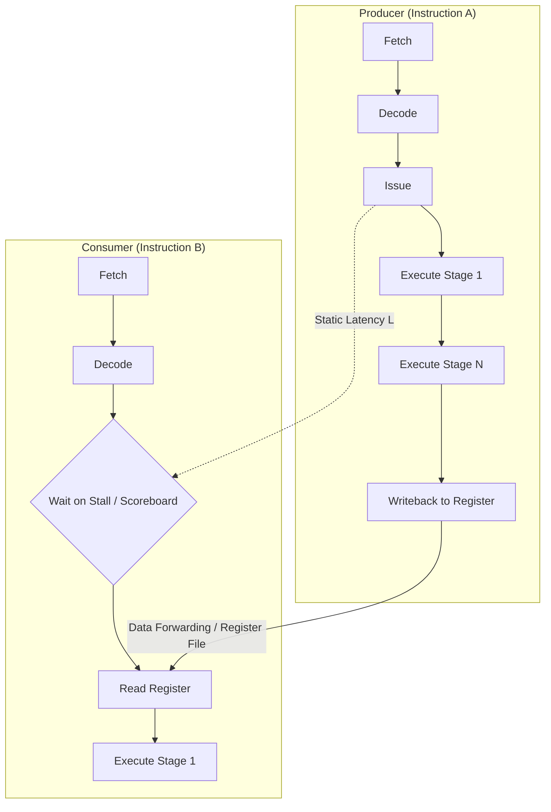
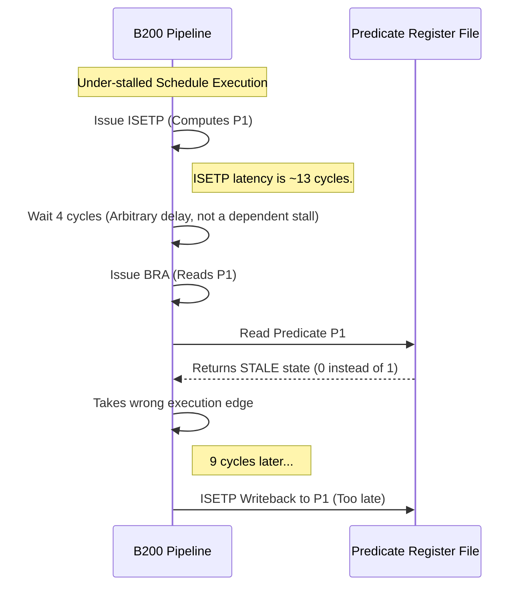
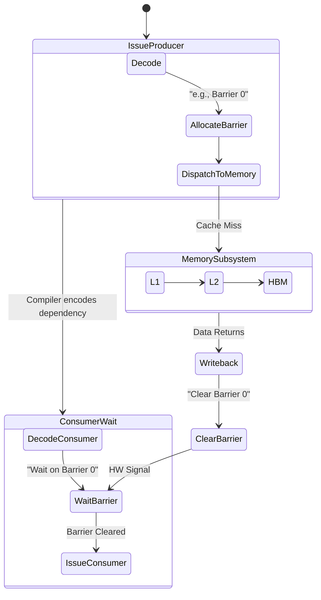



**Executive Summary:** This article explains why compiler schedulers must be validated on real silicon, not just via static analysis, by detailing four critical hardware hazard classes on the B200.

When working with modern, deep-pipeline GPUs like the Nvidia B200, static analysis is necessary but insufficient for validating instruction schedules. It is a humbling experience to see a scheduler report 100% test coverage on dependency tracking, only to watch the emitted code fail silently on actual silicon.

Why does this happen? The hardware pipeline itself is the final arbiter of correctness.

When a scheduler *under-stalls* a dependency, it allows a consumer instruction to issue into the pipeline before the producer's result is firmly committed to the register file. The hardware does not raise an exception. Instead, it executes the schedule, reading stale state, and propagates incorrect values through the rest of the computation.

These are not defects in the silicon. They are schedule violations where the hardware exposes the compiler's incorrect assumptions. In compiler backends, compiler engineers generally adhere to the rule: **over-stalling is a performance bug, but under-stalling is a silent correctness bug.**

To catch these issues, I constructed a registry of hardware hazards[^1] backed by minimal, reproducible on-silicon tests.

## Prerequisites & Terminology

Before diving into specific B200 hazards, it helps to establish some baseline context:

*   **Instruction Scheduling:** A phase in the compiler backend that reorders instructions to maximize hardware utilization. It must explicitly encode delays (stalls) or synchronization (scoreboards) between dependent instructions.
*   **Pipeline Depth:** The number of stages an instruction passes through (fetch, decode, execute, writeback). Deeper pipelines take longer to complete an instruction.
*   **RAW (Read-After-Write) Hazard:** A scenario where an instruction tries to read a register before a previous instruction has finished writing to it.
*   **Variable-Latency Operations:** Operations whose execution time is not fixed. This includes global memory loads (`LDG`), shared memory operations (`LDS`), atomic operations (`ATOM`), and multi-function units (`MUFU`).

## The Anatomy of an Instruction Pipeline Hazard

Modern GPU streaming multiprocessors (SMs) are designed for extreme throughput. To achieve this, the pipeline is deep. The hardware relies on the compiler to explicitly encode dependency information.

Consider a simple dataflow path where Instruction A produces a value that Instruction B consumes.



If Instruction B issues too early, its `Read Register` phase fetches the register's old contents before `WriteBack` completes.

On CPUs, sophisticated out-of-order execution engines mask these latencies dynamically. On GPUs, the philosophy is to maximize die area for ALUs. This pushes the complexity of instruction scheduling onto the compiler.

This architectural tradeoff means that compiler engineers must be pedantic about low-level constraints like pipeline depths and barrier encodings.

## 1. The Predicate-Consumer Under-Stall (H1)

The most difficult bugs slip through rigorous static checks. Recently, while hacking on the B200, I discovered a critical bug involving predicate evaluation in an instruction scheduler. This occurred despite static metrics claiming full RAW coverage across the test suite.

The pattern involves an integer set-predicate instruction (`ISETP`) that computes a condition. It writes it to a predicate register, which is then read by a branch instruction. This is classically seen in a back-edge branch defining a loop.

```assembly
// 1. Produce the predicate P1 based on some condition.
// R0 and R1 are compared; the boolean result is written to P1.
ISETP.GE.AND P1, PT, R0, R1, PT;

// 2. Consume P1 as the branch target condition.
// P0 is the execution guard (is the thread active?), P1 is the branch condition.
@!P0 BRA P1, target;
```

### The Mechanism of Failure

The bug surfaced while I was hacking on the B200's predicate handling. The compiler correctly recorded the guard predicate `P0` as a use for the branch, but it missed the branch condition operand `P1`.

Consequently, the `ISETP` $\rightarrow$ `BRA` RAW dependency was missed entirely. The scheduler failed to insert the required predicate-latency stall.



The branch issued roughly 4 cycles after the `ISETP`. This was well before the predicate's actual modeled latency of 13 cycles had elapsed. The branch instruction read a stale value, took the wrong execution edge, and resulted in a silent miscomputation.

### Ground-Truth Mitigation

To prevent this, a scheduler's operand analysis must correctly identify both `P0` and `P1` as uses of `@!P0 BRA P1`.

However, the true defense is an on-silicon probe. I sweep the stall cycles between the `ISETP` and the branch, verifying the minimum latency required for correct execution.

The baseline predicate latency must be dynamically probed on-device because architectural models are often approximations. On the B200, microbenchmarking probes confirmed the divergence between the modeled 13 cycles and the actual pipeline depths, where the physical predicate latency floor sits at approximately 4 cycles.

## 2. Fixed-Latency RAW Under-Stalls (H2)

Fixed-latency arithmetic instructions form the backbone of matrix multiplication and tensor core workloads. They require precise, fixed cycle delays before their destination registers can be safely read. Examples include:
*   `FFMA` (Single-precision Fused Multiply-Add)
*   `DFMA` (Double-precision Fused Multiply-Add)

If a scheduler emits a stall with a cycle count strictly below the hardware's fixed latency, the consumer reads the destination register early.

### Latency Measurement and Tradeoffs

Through direct hardware probing on the B200, I measured the exact latency floors where execution transitions from incorrect (stale read) to correct (valid read)[^2].

| Operation | Precision | Measured Cycle Floor | Validation Signal |
| :--- | :--- | :---: | :--- |
| **FFMA** | FP32 | **4 cycles** | Stall 3 yields WRONG result. Stall 4 yields CORRECT result. |
| **DFMA** | FP64 | **8 cycles** | Stall 7 yields WRONG result. Stall 8 yields CORRECT result. |

Notice the tradeoff here: higher precision arithmetic naturally requires deeper pipelines. The FP64 unit requires exactly twice the latency of the FP32 unit.

When building latency validation tests, it is critical to construct floating-point recurrence chains rather than integer linear chains. Integer chains can be folded or bypassed via pipeline forwarding networks in hardware, which masks under-stalls[^2]. Floating-point chains, due to strict execution pipeline stages and rounding, make dependency latencies visible.

To validate these latencies, I employed probe kernels that intentionally under-stall and over-stall these dependencies.

```c
// 1. Define the input floating-point operands and the result container.
float a = 1.0f, b = 2.0f, c = 3.0f;
float result = 0.0f;

// 2. Execute inline assembly to guarantee back-to-back instructions with controlled stall insertion.
asm volatile (
    // 3. Perform the Single-precision Fused Multiply-Add (FFMA).
    "ffma.rn.f32 %0, %1, %2, %3;\n\t"
    // 4. Stall the pipeline for L cycles (inserted via custom post-processing of the SASS).
    // --> INJECT STALL L HERE <--
    // 5. Read the destination register %0 immediately as an operand in the floating-point addition (FADD).
    "fadd.rn.f32 %0, %0, %4;\n\t"
    : "=f"(result)
    : "f"(a), "f"(b), "f"(c), "f"(1.0f)
);
```

A correct scheduler must target the cycle floor exactly. I used tools like `cuobjdump -sass` to verify the assembled control codes before running the resulting binaries directly on the GPU.

## 3. Variable Latency and Uncovered Scoreboards (H3)

Fixed latencies apply only to deterministic ALU operations. However, a vast portion of a GPU's workload involves variable-latency operations:
*   `LDG` (Global memory loads)
*   `LDS` (Shared memory operations)
*   `ATOM` (Atomic memory operations)
*   `MUFU` (Multi-function units)

These instructions have execution times that vary based on cache hits, TLB state, and structural hazards (resource conflicts in the hardware pipeline).

For these operations, static stall counts are entirely inadequate. Instead, the architecture utilizes a **scoreboard**.

### The Scoreboard Mechanism

When a variable-latency instruction is issued, it allocates a slot in a hardware scoreboard. The compiler must explicitly encode a barrier identifier (e.g., scoreboard indices 0 through 5) in the control fields of the instruction. The consumer instruction must then be encoded to wait on that specific scoreboard barrier before issuing.



If an assembler strips these control barriers, the pipeline coherence breaks down. Consumers read destination registers before the variable-latency memory result has landed.

This leads to incorrect mathematical results. More critically, if the stale data is used as a memory address in a subsequent access, it triggers a `CUDA_ERROR_ILLEGAL_ADDRESS`.

Validation requires generating stripped binaries for various kernels and asserting that they must either compute the wrong result or crash. This proves that the scoreboard barriers in the fully assembled binaries are the sole mechanism guaranteeing correctness.

## 4. Crash-Amplified Load-Use Hazards (H4)

Fixed-latency under-stalls (H2) cause silent data corruption by reading a nearby valid—but mathematically wrong—value. Load-use hazards, however, can be intentionally amplified to provide a deterministic, loud failure[^3].

This is highly desirable for Continuous Integration (CI) systems, where binary pass/fail crash signals are easier to triage than heuristic output differencing.

A load-use hazard occurs when a value intended to be used as a memory address is read before the load producing it has landed.

To amplify this into a guaranteed crash, I explicitly poisoned the index register. I loaded a wild constant into the register (e.g., `0x40000000`, translating to a +4 GiB offset in memory) before the actual load occurred. I maintained this poison value's liveness via a runtime-unknown guard so the compiler's dead-code elimination (DCE) pass could not optimize it away.

```c
// 1. Initialize the target register with a known poison value pointing to unmapped memory space.
uint32_t addr_reg = 0x40000000;

// 2. Issue a global memory load (variable latency) to overwrite the register with a valid address.
// Under correct execution, this load must complete and update the register before any subsequent read.
addr_reg = load_actual_address();

// 3. Immediately consume the register as a pointer or address operand.
// If the compiler fails to emit a scoreboard wait, this instruction reads the stale register state (0x40000000), triggering an MMU fault.
execute_memory_operation(addr_reg);
```

### The Amplification Tradeoff

This testing methodology provides significant value:
1.  If the schedule is correct, the load lands, the valid pointer is used, and execution succeeds cleanly (`ok`).
2.  If the schedule under-covers the latency, the hardware reads the poisoned register, resulting in a deterministic MMU fault (`CUDA_ERROR_ILLEGAL_ADDRESS`).

It is crucial to note that this is a *recoverable* software fault. The MMU and the CUDA driver safely contain the illegal memory access. It does not cause physical hardware damage; at worst, it results in a dead CUDA context that requires process restart or an `nvidia-smi --gpu-reset`.

The primary advantage is an unambiguous, self-contained, minimal form of the scoreboard hazard (H3) that leaves no room for debate in the CI logs.

## The Path Forward: Trusting Silicon

Building reliable compilers and instruction schedulers requires treating the hardware as the ultimate source of truth. Software models are theoretical; silicon is absolute.

As we scale into more complex architectures, the abstraction gap between the high-level language and the physical pipeline deepens. Relying solely on static analysis or internal graph coverage metrics is fundamentally insufficient.

By systematically building a registry of targeted, minimal hardware hazards and executing them continually on actual silicon, compiler engineers can ensure that their scheduling logic remains sound against the unyielding reality of the pipeline.

## References

[^1]: **NVIDIA RTX Blackwell GPU Architecture:** Detailed technical description of NVIDIA's Blackwell family and Streaming Multiprocessor design. ([Link](https://images.nvidia.com/aem-dam/Solutions/geforce/blackwell/nvidia-rtx-blackwell-gpu-architecture.pdf))
[^2]: **Dissecting the NVIDIA Volta GPU Architecture via Microbenchmarking:** Zhe Jia et al., arXiv:1804.06826, 2018. Analysis of instruction latencies, pipeline depths, and scoreboard barrier rules. ([Link](https://arxiv.org/pdf/1804.06826))
[^3]: **NVIDIA CUDA Driver API:** Reference documentation on virtual memory management and MMU memory protection faults. ([Link](https://docs.nvidia.com/cuda/cuda-driver-api/group__CUDA__MEM.html))

*Disclaimer: This article was generated using the Gemini 3.1 Pro and Claude Opus 4.8 models.*
