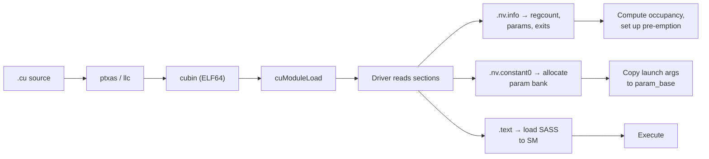

*What is inside a cubin, and why should you care*

When you compile a CUDA kernel, the final artifact is a **cubin** — a CUDA binary. It is a standard ELF64 file with NVIDIA-specific sections that encode everything the CUDA driver needs to load and launch a kernel: the machine code, the parameter layout, register allocation metadata, and a collection of attributes that have no public documentation.

This post walks through the section layout of a cubin, explains the `.nv.info` metadata format that makes a kernel self-describing, and shows how these pieces connect at the byte level. The material is drawn from building a from-scratch cubin emitter and validating it against `ptxas` output on B200 silicon.

> **A note on methodology:** Everything in this article is based on my analysis of cubins produced by `ptxas` and validated on real hardware. Nvidia does not publish a specification for the cubin section layout, the `.nv.info` EIATTR encoding, or the constant bank parameter conventions described here. The structures and semantics are reverse-engineered from compiled binaries. Readers should verify against their own cubins and toolkit versions.

## The ELF Container

A cubin is an ELF64 executable. The header identifies it:

```
e_ident[EI_OSABI]    = 0x41       (CUDA ABI, not the older 0x33)
e_ident[EI_ABIVERSION] = 8
e_type               = ET_EXEC    (loadable, not relocatable)
e_machine            = EM_CUDA    (0xBE)
e_flags              = 0x06006402 (for sm_100, 64-bit addressing)
```

The `e_flags` field encodes the SM architecture in bits 8–15. For `sm_100` (B200), that is `0x64` = 100 decimal. Bit 1 marks 64-bit addressing. Bits 24–26 carry a format version that the driver checks.

Older cubins used `ELFOSABI_CUDA = 0x33` with ABI version 0. The CUDA 13 driver rejects these — `cuModuleGetFunction` returns `CUDA_ERROR_NOT_SUPPORTED`. If you are emitting cubins from scratch, the ABI version matters.

## Section Layout

A single-kernel cubin contains roughly twelve sections. We will use a minimal kernel as the running example — an integer add, written in LLVM IR:

```llvm
define i32 @add(i32 %a, i32 %b) {
  %c = add i32 %a, %b
  ret i32 %c
}
```

Compiling this with `llc -march=sass -filetype=obj` produces a relocatable CUDA ELF. After finalization, the cubin contains these sections:

| # | Section | Type | Purpose |
| :--- | :--- | :--- | :--- |
| 0 | *(null)* | `SHT_NULL` | ELF convention |
| 1 | `.text.add` | `SHT_PROGBITS` | SASS machine code (128-bit instructions) |
| 2 | `.nv.constant0.add` | `SHT_PROGBITS` | Constant bank 0 (parameter region) |
| 3 | `.nv.info` | `SHT_LOPROC` | Module-level metadata (EIATTR stream) |
| 4 | `.nv.info.add` | `SHT_LOPROC` | Per-kernel metadata (EIATTR stream) |
| 5 | `.note.nv.cuver` | `SHT_NOTE` | CUDA version note |
| 6 | `.note.nv.tkinfo` | `SHT_NOTE` | Toolkit release note |
| 7 | `.nv.compat` | `0x70000086` | SM compatibility descriptor |
| 8 | `.nv.callgraph` | `0x70000001` | Intra-module call graph |
| 9 | `.symtab` | `SHT_SYMTAB` | Symbol table |
| 10 | `.strtab` | `SHT_STRTAB` | String table |
| 11 | `.shstrtab` | `SHT_STRTAB` | Section-name string table |

The sections fall into four categories: the executable code, the kernel ABI metadata, driver compatibility notes, and the standard ELF bookkeeping.

This is the minimal set. A real cubin produced by `ptxas` for a production kernel is larger — typically ~22 sections, 8 symbols, and 5 program headers. The additional sections include `.nv.shared.<kernel>` (shared memory allocation), `.nv.global` (global variable metadata), `.nv.constant2.<kernel>` (compiler-generated constant data), `.debug_*` sections (DWARF debug info when compiled with `-G`), and `.rel.*` relocation sections. The table above covers the sections that are structurally required for any kernel to load and execute.

## `.text.<kernel>` — The Machine Code

The `.text.add` section contains the SASS instructions. Each instruction is a 128-bit (16-byte) word. The section flags are `SHF_ALLOC | SHF_EXECINSTR` — `SHF_ALLOC` means the section occupies memory at runtime (the driver must load it onto the GPU), and `SHF_EXECINSTR` marks it as containing executable machine instructions. The section is aligned to 128 bytes.

```
Bits   0..104:  instruction body (opcode, operands, modifiers)
Bits 105..121:  scheduling control (stall, yield, barriers)
Bits 122..125:  operand reuse flags
```

The kernel's entry symbol is a `STT_FUNC` in the symtab with `st_other = 0x10` (`STO_CUDA_ENTRY`), pointing at the start of this section. The driver uses `STO_CUDA_ENTRY` to distinguish kernel entry points from device functions.

## `.nv.constant0.<kernel>` — The Constant Bank

Kernel parameters are passed through constant bank 0. The section `.nv.constant0.add` is a `SHT_PROGBITS` section sized to cover the parameter region:

```
size = param_base + param_size
```

The `param_base` is a CUDA-toolchain-determined offset — not a fixed ISA constant. It varies by SM architecture:

| SM range | `param_base` |
| :--- | :--- |
| sm_70 – sm_89 (Volta through Ampere) | `0x160` (352 bytes) |
| sm_90 (Hopper) | `0x210` (528 bytes) |
| sm_100 – sm_12x (Blackwell) | `0x380` (896 bytes) |

The first `param_base` bytes are reserved for driver-managed metadata (grid dimensions, block dimensions, shared memory size, etc.). User-specified kernel parameters are laid out contiguously starting at `param_base`, each aligned to its ABI alignment.

For a kernel `add(int a, int b)`, the two 4-byte parameters occupy offsets `0x0` and `0x4` relative to `param_base`. The total section size is `0x380 + 8 = 0x388` on sm_100.

The code reads parameters with `LDC` (load constant) instructions:

```
LDC R0, c[0x0][param_base + 0x0]   // load 'a'
LDC R1, c[0x0][param_base + 0x4]   // load 'b'
```

The `.nv.info` metadata, the constant bank section, and the `LDC` instructions must all agree on the base offset. If they disagree, the driver copies launch arguments to one offset and the kernel reads from another — wrong results, no crash, no diagnostic.

## `.nv.info` — The EIATTR Metadata Format

The `.nv.info` sections are the most opaque part of a cubin. They use `SHT_LOPROC` (`0x70000000`), a processor-specific section type. The content is a flat stream of **EIATTR** (ELF Info ATTRibute) entries. There is no public documentation for this format.

Each EIATTR entry has a fixed 4-byte header:

```
byte 0:  format (EIFMT)
byte 1:  attribute code (EIATTR)
byte 2-3: value or size (depends on format)
```

The format byte determines how the value is encoded:

| EIFMT | Value | Encoding |
| :--- | :--- | :--- |
| `EIFMT_NVAL` | 1 | No value. Bytes 2–3 are zero padding. |
| `EIFMT_BVAL` | 2 | One inline byte in byte 2. Byte 3 is padding. |
| `EIFMT_HVAL` | 3 | 16-bit inline value in bytes 2–3 (little-endian). |
| `EIFMT_SVAL` | 4 | Bytes 2–3 are a 16-bit size N. N bytes of payload follow immediately. |

This is a TLV (type-length-value)[^3] scheme, except the "length" is implicit for formats 1–3 (always 4 bytes total) and explicit only for format 4.

### Module-Level `.nv.info`

The module-level `.nv.info` section (no kernel suffix) contains attributes keyed by symbol index. For each kernel, it emits three entries:

**REGCOUNT (0x2f):** The number of general-purpose registers the kernel uses. Format is `EIFMT_SVAL` with an 8-byte payload: `(symbol_index:u32, regcount:u32)`.

For a kernel `add` that touches registers `R0` and `R1`, the regcount is 2:

```
04 2f 08 00   03 00 00 00   02 00 00 00
│  │  │       │             └─ regcount = 2
│  │  │       └─ symbol index = 3 (the kernel entry)
│  │  └─ payload size = 8 bytes
│  └─ EIATTR_REGCOUNT = 0x2f
└─ EIFMT_SVAL = 4
```

**FRAME_SIZE (0x11):** Stack frame size in bytes. Same 8-byte keyed format. Zero for a leaf kernel.

**MIN_STACK_SIZE (0x12):** Minimum stack size. Also zero for a leaf kernel.

The driver uses regcount to compute occupancy — how many thread blocks can run concurrently on one SM. Over-reporting wastes occupancy. Under-reporting causes the hardware to clobber live registers.

### Per-Kernel `.nv.info.<kernel>`

The per-kernel section carries the kernel's ABI contract with the driver. The entries, in order:

**SW_INFO (0x37):** Software info. An `EIFMT_SVAL` with a 4-byte payload containing the section's own byte size. Self-referential — you compute the size, write it, and the size includes the bytes you just wrote. In practice, this means building the section twice.

**Attribute 0x35:** An `EIFMT_NVAL` flag that `ptxas` emits before `PARAM_CBANK`. Its exact semantics are unclear; omitting it does not affect loading, but real cubins always include it.

**PARAM_CBANK (0x0a):** Constant bank descriptor. `EIFMT_SVAL`, 8-byte payload:

```
(cbank_symbol_index:u32, (param_size << 16) | param_base : u32)
```

This tells the driver which symbol table entry identifies the constant bank section, how large the parameter region is, and where it starts within the bank. For `add(int, int)` on sm_100:

```
cbank_sym = 2          (section symbol for .nv.constant0.add)
param_base = 0x380
param_size = 8          (two i32s)
packed = (8 << 16) | 0x380 = 0x00080380
```

**CBANK_PARAM_SIZE (0x19):** An `EIFMT_HVAL` with the parameter region size as a 16-bit value. Redundant with the high half of `PARAM_CBANK`, but both must be present.

**KPARAM_INFO (0x17):** One entry per kernel parameter, emitted in reverse ordinal order (highest ordinal first — this matches `ptxas` output). Each is `EIFMT_SVAL` with a 12-byte payload:

```
(index:u32, ordinal:u16, offset:u16, packed:u32)
```

The `packed` field encodes `(size << 18) | 0x1f000`. The `0x1f000` constant carries the parameter space and log-alignment for by-value parameters. For a 4-byte `int` parameter: `packed = (4 << 18) | 0x1f000 = 0x0011f000`.

**MAXREG_COUNT (0x1b):** An `EIFMT_HVAL` with the maximum register count hint (usually `0xff` = no limit).

**EXIT_INSTR_OFFSETS (0x1c):** An `EIFMT_SVAL` listing the byte offsets of every `EXIT` instruction in the `.text` section. The driver needs these for pre-emption: it must know where the kernel can cleanly stop. Each offset is a `u32`. For a kernel whose `EXIT` is the 5th instruction (offset `4 * 16 = 0x40`):

```
04 1c 04 00   40 00 00 00
│  │  │       └─ EXIT at byte offset 0x40
│  │  └─ payload size = 4
│  └─ EIATTR_EXIT_INSTR_OFFSETS = 0x1c
└─ EIFMT_SVAL = 4
```

## The Note Sections

Two ELF note sections carry driver compatibility information:

**`.note.nv.cuver`** (note type `0x3e8`): A 12-byte descriptor encoding the SM architecture and a format version. The CUDA driver checks this to determine if the cubin is compatible with the current GPU.

**`.note.nv.tkinfo`** (note type `0x7d0`): The toolkit release string. Contains the `ptxas` version, the CUDA release string (e.g., "Cuda compilation tools, release 12.8, V12.8.93"), and the compilation flags (`-arch sm_100 -m 64`). The driver validates this to reject cubins compiled with unsupported toolkit versions.

Both use the standard ELF note format: `(namesz, descsz, type)` header, followed by the vendor name "NVIDIA Corp" (NUL-terminated, 4-byte padded), followed by the descriptor.

## `.nv.callgraph` and `.nv.compat`

**`.nv.callgraph`** (type `0x70000001`): Encodes the intra-module call graph. For a leaf kernel (no device function calls), this contains four entries: the kernel node (id 0) connected to four sentinel edges (`0xffffffff` through `0xfffffffc`) that mark it as a call-graph leaf.

**`.nv.compat`** (type `0x70000086`): An SM compatibility descriptor. For a single-architecture cubin, this is a fixed 16-byte block encoding feature-level requirements.

## The Symbol Table

The cubin's `.symtab` contains four entries for a single-kernel module:

| Index | Type | Other | Section | Name | Purpose |
| :--- | :--- | :--- | :--- | :--- | :--- |
| 0 | `STT_NOTYPE` | 0 | `SHN_UNDEF` | *(null)* | ELF convention |
| 1 | `STT_SECTION` | 0 | `.text.add` | — | Section symbol for .text |
| 2 | `STT_SECTION` | 0 | `.nv.constant0.add` | — | Section symbol for constant bank |
| 3 | `STT_FUNC` | `0x10` | `.text.add` | `add` | Kernel entry point |

The `st_other = 0x10` (`STO_CUDA_ENTRY`) on the kernel symbol is what distinguishes a kernel entry from a device function. The `.nv.info` entries reference symbols by index — REGCOUNT references symbol 3, PARAM_CBANK references symbol 2 — so the indices must be stable.

## Putting It Together

Here is the complete flow from source to loaded kernel:



The driver's loading sequence:

1. Parse the ELF header. Check `e_flags` for SM compatibility.
2. Validate the `.note.nv.cuver` and `.note.nv.tkinfo` notes.
3. Read the `.nv.info` stream: extract regcount, frame size, stack size.
4. Read `.nv.info.<kernel>`: extract parameter layout, constant bank descriptor, EXIT offsets.
5. Allocate constant bank memory. Copy host-side launch arguments to `param_base` within it.
6. Load `.text` into instruction memory on the target SM.
7. Configure the warp scheduler with the register count (for occupancy) and EXIT offsets (for pre-emption).
8. Launch.

If any of these metadata sections are malformed or inconsistent, the behavior ranges from `CUDA_ERROR_INVALID_IMAGE` to silent wrong results — there is no "metadata validation" pass that checks cross-section consistency before launch.

## What This Means in Practice

For most CUDA developers, the cubin is an opaque blob that `nvcc` produces and the driver consumes. But the structure matters when:

- **You want to understand the internals of a SASS binary.** For most CUDA developers, the cubin is a black box. Knowing the section layout — what `.nv.info` encodes, how the constant bank is sized, where the driver finds EXIT offsets — turns it into something you can read and reason about.

- **Debugging and performance analysis.** This is a crucial skill for both. When a kernel silently produces wrong results, the `.nv.info` stream is the authoritative record of what `ptxas` decided: how many registers, where the parameters live, which instructions are exits. When occupancy is lower than expected, the regcount in `.nv.info` tells you why. Reading these sections directly (rather than trusting `cuobjdump`'s summary) gives you the ground truth.

- **Portability of compiled cubins.** The constant bank parameter base has changed silently across GPU generations: `0x160` on Volta through Ampere, `0x210` on Hopper, `0x380` on Blackwell. None of this is documented. A cubin compiled for one architecture cannot be loaded on another, because the code (LDC offsets), the `.nv.info` (PARAM_CBANK), and the `.nv.constant0` section size all encode the base independently. If they disagree, the driver copies launch arguments to one offset and the kernel reads from another.

## References

[^1]: **ELF specification (Tool Interface Standard).** The base ELF64 format that cubins extend with NVIDIA-specific section types and symbol attributes. ([Link](https://refspecs.linuxfoundation.org/elf/elf.pdf))
[^2]: **CUDA Binary Utilities.** NVIDIA's documentation for `cuobjdump` and `nvdisasm`, the tools that read cubins. ([Link](https://docs.nvidia.com/cuda/cuda-binary-utilities/))
[^3]: **Type-length-value (TLV).** A standard binary encoding scheme where each data element is represented as a (type, length, value) triple. Widely used in network protocols (DHCP, IS-IS) and binary formats. ([Link](https://en.wikipedia.org/wiki/Type%E2%80%93length%E2%80%93value))
[^4]: **CuAssembler.** An open-source, community-driven NVIDIA SASS assembler supporting Turing through Hopper architectures. The most widely used third-party tool for cubin-level binary editing and SASS instruction encoding research. ([Link](https://github.com/cloudcores/CuAssembler))
[^5]: **MaxAs.** Scott Gray's reverse-engineered SASS assembler for the Maxwell architecture (2014). The pioneering project that demonstrated hand-written SASS could reach ~98% of peak throughput on SGEMM, motivating subsequent SASS reverse-engineering efforts. ([Link](https://github.com/NervanaSystems/maxas))
[^6]: **Demystifying GPU Microarchitecture through Microbenchmarking.** Henry Wong et al., ISPASS 2010. Foundational work establishing microbenchmarking methodology for probing undocumented GPU pipeline characteristics. ([Link](https://ieeexplore.ieee.org/document/5452013))

*Disclaimer: This article was generated using the Gemini 3.1 Pro and Claude Opus 4.8 models.*
