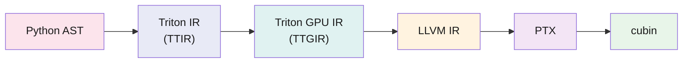
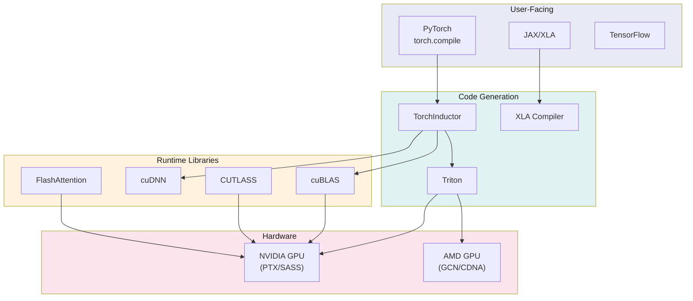

Triton is a compiler with a Python frontend. The `@triton.jit` decorator does not decorate a function. It parses the function's AST, runs it through an MLIR pipeline, and emits a GPU binary. The Python function never runs as Python.

This matters because it sets what Triton can and cannot do. It tiles a GEMM for you, stages data through shared memory, maps blocks to warps, and picks tensor core instructions. You never write a line of PTX or manage a thread index. But you also cannot reach past the abstraction when it gets in the way.

This post walks through how Triton compiles code, what the compiler decides on your behalf, where the abstraction falls short, and where Triton fits in the ML systems stack.

## The Programming Model: Blocks, Not Threads

In CUDA you write code for one thread and the hardware runs it across thousands. Triton flips this. You write code for a *block* of data and the compiler splits it across threads.

```python
import triton
import triton.language as tl

@triton.jit
def softmax_kernel(
    input_ptr, output_ptr,
    n_cols,
    BLOCK_SIZE: tl.constexpr,
):
    # 1. Each "program" handles one row. No thread indexing.
    row_idx = tl.program_id(0)
    col_offsets = tl.arange(0, BLOCK_SIZE)
    mask = col_offsets < n_cols

    # 2. Load an entire row as a block. The compiler picks
    #    coalescing, vector width, and predication.
    row = tl.load(input_ptr + row_idx * n_cols + col_offsets, mask=mask, other=-float('inf'))

    # 3. Block-level reductions. The compiler turns these into
    #    warp shuffles and shared memory reductions.
    row_max = tl.max(row, axis=0)
    numerator = tl.exp(row - row_max)
    denominator = tl.sum(numerator, axis=0)
    result = numerator / denominator

    tl.store(output_ptr + row_idx * n_cols + col_offsets, result, mask=mask)
```

The key operations:

- **`tl.load` / `tl.store`**: Tile-level memory access. The compiler turns these into coalesced global memory instructions with predication from the `mask` argument.
- **`tl.dot`**: Block-level matrix multiply. The compiler emits `mma.sync` (Ampere), `wgmma` (Hopper), or `tcgen05.mma` (Blackwell) depending on the target.
- **`tl.max`, `tl.sum`**: Block-level reductions. The compiler lowers these to warp shuffles (`SHFL.BFLY`) or shared memory reductions depending on block size.
- **`tl.constexpr`**: Compile-time constants. `BLOCK_SIZE` gets baked into the binary. Different values produce different kernels — hence the autotuning step.

You never write `threadIdx.x`. There is no `__syncthreads()`. There is no shared memory declaration. The compiler handles all of it. That is both the selling point and the ceiling.

## The Compilation Pipeline

Triton lowers code through four IRs:[^1]



### Stage 1: Python AST → Triton IR (TTIR)

On first call with concrete arguments, Triton parses the Python AST and traces it into TTIR — a hardware-independent MLIR dialect (`tt` namespace). Operations stay abstract here: `tl.load` becomes `tt.load`, `tl.dot` becomes `tt.dot`. Standard compiler passes run — constant folding, CSE, dead code removal.

TTIR knows nothing about threads, warps, or shared memory. It works on tensors whose shapes come from the `constexpr` parameters.

### Stage 2: Triton IR → Triton GPU IR (TTGIR)

This is where the compiler makes its hard calls. TTGIR adds GPU-specific structure:

- **Thread-to-data mapping.** The compiler decides how to spread a block across threads. A `BLOCK_SIZE=128` vector might become 4 elements per thread across 32 threads (one warp), or 2 per thread across 64 (two warps).
- **Shared memory allocation.** When a `tl.dot` operand gets reused (say, in a GEMM inner loop), TTGIR inserts shared memory allocation and `async_copy` ops to stage data from global memory.
- **Layout propagation.** TTGIR tracks tensor layouts — blocked, shared, slice, dot-operand — and inserts conversions when an op needs a layout its input does not provide. A `tl.dot` needs operands in a specific "dot-operand" layout that matches the hardware MMA instruction.
- **Software pipelining.** For loops with known trip counts, TTGIR overlaps memory loads from iteration N+1 with compute from iteration N.

This stage is where most of Triton's value lives. It is also where most of its performance bugs come from. A bad layout choice or a missed pipeline opportunity shows up as a 2–5x slowdown versus hand-tuned CUDA. Diagnosing it means reading TTGIR dumps.

### Stage 3: TTGIR → LLVM IR

The GPU-specific MLIR gets lowered to plain LLVM IR. By now the tile ops have been broken into per-thread scalar ops. LLVM handles register allocation, instruction selection, and scheduling. The target is `nvptx64`.

### Stage 4: LLVM IR → PTX → cubin

LLVM's NVPTX backend emits PTX. Triton then calls `ptxas` to produce the cubin. The binary gets cached on disk, keyed by a hash of the source, the `constexpr` values, and the target architecture. Later calls with the same inputs skip the whole pipeline and load the cached binary.

## What the Compiler Decides for You

The point of Triton's abstraction is that the compiler handles the decisions that eat most of a CUDA author's time:

| Decision | CUDA Programmer | Triton Compiler |
|:--- |:--- |:--- |
| Thread block dimensions | Manual (`dim3`) | Derived from `BLOCK_SIZE` constexprs |
| Shared memory size and layout | Manual (`__shared__`, bank conflict avoidance) | Automatic (TTGIR layout propagation) |
| Memory coalescing | Manual (stride analysis) | Automatic (vectorized load/store lowering) |
| Warp synchronization | Manual (`__syncwarp`, `__syncthreads`) | Automatic (barrier insertion in TTGIR) |
| Tensor core instruction selection | Manual (`wmma` / `mma.sync` / PTX) | Automatic (`tl.dot` → MMA/WGMMA) |
| Software pipelining | Manual (multi-stage buffering) | Automatic (TTGIR pipelining pass) |
| Boundary predication | Manual (if/else on thread index) | Automatic (`mask` on loads/stores) |

For many workloads — fused elementwise ops, reductions, small-to-medium GEMMs, attention variants — these choices are good enough. "Good enough" here means within 10–20% of hand-tuned CUDA, at a fraction of the development time.

## Where Triton Wins

### Operator fusion

This is Triton's best case. Take a sequence like `GEMM → GeLU → Dropout → LayerNorm`. In CUDA, each step is usually a separate kernel launch. Each launch reads from and writes to HBM. Bandwidth is the bottleneck, not compute.

A Triton kernel fuses the whole chain. Intermediate values stay in registers or shared memory and never touch HBM. For bandwidth-bound workloads — which covers most LLM inference at small batch sizes — fusion delivers 2–4x speedups over cuBLAS plus separate elementwise kernels.

This is why PyTorch's TorchInductor uses Triton as its default codegen backend.[^2] When `torch.compile` traces a model graph, it finds groups of ops it can fuse and emits Triton kernels for them.

### Fast iteration

A Triton kernel runs 30–50 lines of Python. The same kernel in CUDA runs 200–500 lines of C++. When you are trying out a new attention variant or a quantized GEMM for a new model, that gap is the difference between trying an idea and skipping it.

### Multi-backend portability

Because Triton's pipeline is MLIR-based, it supports non-NVIDIA targets. The AMD ROCm backend lowers TTGIR to HIP and targets AMD's MFMA instructions on MI300 hardware.[^3] The abstraction boundary at TTIR means the same kernel source can run on both vendors. The hardware-specific work happens in TTGIR lowering, not in user code.

## Where Triton Loses

### No warp-level control

Triton hides warps. You cannot call `__shfl_sync`, `__ballot_sync`, or `__match_any_sync`. You cannot assign work to specific warps.

This hurts when your algorithm needs direct thread-to-thread communication: warp-level sorting, custom reduction trees, cooperative group patterns. If performance depends on controlling warp topology, Triton cannot express it.

### Irregular memory access

Triton's shared memory and layout passes are built for regular, tiled access. Scatter/gather workloads — graph neural networks, sparse attention, hash table lookups — have access patterns the compiler cannot predict at compile time. The result is either wasted shared memory (conservative allocation) or worse performance than plain CUDA.

### Debugging

When a Triton kernel gives wrong results or runs slow, debugging is hard. The Python source maps poorly to the final PTX because three IR transforms sit between them. Layout mismatches — where TTGIR adds an unexpected conversion that slows an operation — are a common performance bug. Finding them means dumping IR with environment variables (`MLIR_ENABLE_DUMP=1`, `TRITON_KERNEL_DUMP=1`) and reading MLIR output.

In CUDA, `cuda-gdb`, `compute-sanitizer`, and `ncu` (Nsight Compute) map straight to the source. Triton's tooling is getting better, but the debugging gap is a real cost.

### The Hopper and Blackwell problem

Each GPU generation ships features that need *new abstractions*, not just new instruction selection:

- **Hopper** added TMA for async multi-dimensional copies and WGMMA that needs 128 threads to issue cooperatively. Triton could not express either at launch. Support came later through experimental APIs and heuristics that detect GEMM patterns and insert TMA loads and WGMMA instructions. But the abstraction leaks: block size choices that work fine on Ampere can stop the compiler from picking the WGMMA path on Hopper.

- **Blackwell** adds TMEM, tcgen05 single-thread issue, and FP4 microscaling. As I covered in the [tensor core history post](), the ISA changed in ways that matter. Triton's backend needs a deep rework to target these features, because the thread-to-data mapping in TTGIR was built around the warp-level model that Blackwell has left behind.

This is the core tension in Triton's design. Each generation breaks the abstraction the compiler tries to hold together. The team adds heuristics and special cases to patch it, but the abstraction gains weight without getting cleaner.

## Triton's Place in the Stack



Triton fills a specific role: code generation for custom fused kernels. It does not replace cuBLAS for dense GEMMs (cuBLAS still wins for large square matrices). It does not replace CUTLASS for library-grade template code. What it replaces is writing 500-line CUDA kernels every time you need a fused op that cuBLAS does not ship.

In production:

- **TorchInductor** uses Triton for fused subgraphs and falls back to cuBLAS/cuDNN for standard ops.[^2]
- **vLLM** uses Triton for PagedAttention, quantized GEMM kernels (AWQ, GPTQ), and custom activations.[^4]
- **FlashAttention** ships both CUDA and Triton versions. The CUDA one is faster. The Triton one lets you experiment with attention variants (sliding window, block-sparse, grouped-query) quickly.

### Picking the right tool

| Workload | Best tool | Why |
|:--- |:--- |:--- |
| Standard dense GEMM | cuBLAS | Tuned by NVIDIA, autotuned per GPU |
| Custom fused operator | Triton | 10x faster to write, within 10–20% of CUDA |
| Library-grade GEMM template | CUTLASS | Full control over tiling, pipelining, epilogue |
| Custom attention variant | Triton | Iterate in hours, not weeks |
| Sparse / irregular kernel | CUDA | Triton's model does not fit |
| Multi-backend portability | Triton | Same source targets NVIDIA and AMD |

## The Abstraction Tax

You trade control for speed of development. Triton makes that trade clear: give up thread-level control, get block-level programming with automatic shared memory and tensor core use. For workloads that fit, this is a good deal.

But the tax grows each hardware generation. Each new GPU ships features — TMA, WGMMA, TMEM, tcgen05 — built for a lower level of control than Triton offers. The compiler team adds support, but the lag between hardware launch and Triton readiness is typically 6–12 months. In that window, only CUDA and CUTLASS can use the new features.

There is a deeper limit too. Triton generates code for a single GPU. It has no notion of multi-GPU communication (NCCL), host-device data movement, or memory spaces. A `tl.load` reads from device memory. There is no `tl.load_from_host` or `tl.transfer`. Where the data came from, which device runs the kernel, whether the pointer is even valid on this device — that is the caller's problem.

For a single-GPU kernel, this is fine. For the multi-device world that real ML training lives in, Triton only covers the innermost loop. Placement, data movement, memory space management — all of that stays untyped, unchecked, and handled by Python framework code that no compiler can see or verify.[^5]

## References

[^1]: **Triton: An Intermediate Language and Compiler for Tiled Neural Network Computations.** Tillet, P., Kung, H. T., Cox, D. MAPL 2019 / PLDI 2019. The original paper on block-level GPU programming and the Triton compilation pipeline. ([Link](https://dl.acm.org/doi/10.1145/3315508.3329973))

[^2]: **TorchInductor: A PyTorch-Native Compiler.** PyTorch team, 2022. TorchInductor uses Triton as its default GPU codegen backend for fused operator graphs. ([Link](https://dev-discuss.pytorch.org/t/torchinductor-a-pytorch-native-compiler-with-define-by-run-ir-and-target-backends/747))

[^3]: **AMD ROCm Support for Triton.** Triton community, 2024. The AMD backend lowers Triton GPU IR to HIP and targets MFMA instructions on MI300 hardware. ([Link](https://github.com/triton-lang/triton/tree/main/third_party/amd))

[^4]: **vLLM: Easy, Fast, and Cheap LLM Serving.** Kwon, W. et al. SOSP 2023. vLLM uses custom Triton kernels for PagedAttention and quantized serving. ([Link](https://arxiv.org/abs/2309.06180))

[^5]: **MLIR: A Compiler Infrastructure for the End of Moore's Law.** Lattner, C. et al. 2020. The multi-level IR framework that Triton's pipeline is built on. ([Link](https://arxiv.org/abs/2002.11054))

---

*Disclaimer: This article was generated using the Gemini 3.1 Pro and Claude Opus 4.8 models.*
