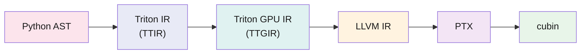
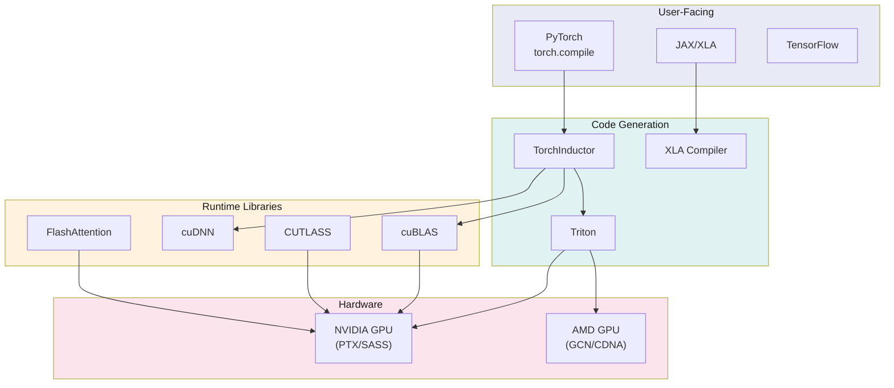

Triton is not a kernel library. It is not a Python framework. It is a compiler with a Python frontend. The `@triton.jit` decorator does not decorate — it intercepts the function's AST, feeds it through an MLIR-based compilation pipeline, and emits a GPU binary. The Python function never executes as Python.

This distinction matters because it determines what Triton can and cannot do for you. It can automatically tile a GEMM, stage data through shared memory, map blocks to warps, and emit tensor core instructions — all without the programmer writing a single line of PTX or managing a thread index. What it cannot do is let you reach below the abstraction when the abstraction is wrong.

This post walks through Triton's compilation pipeline, examines what the compiler decides on your behalf, identifies where the abstraction breaks down, and evaluates where Triton fits in the broader ML systems stack.

## The Programming Model: Blocks, Not Threads

CUDA's programming model is SIMT: you write code for one thread and rely on the hardware to execute it across thousands. Triton inverts this. You write code for one *block* — a tile of data — and the compiler figures out how to distribute it across threads.

```python
import triton
import triton.language as tl

@triton.jit
def softmax_kernel(
    input_ptr, output_ptr,
    n_cols,
    BLOCK_SIZE: tl.constexpr,
):
    # 1. Each "program" handles one row. No thread indexing.
    row_idx = tl.program_id(0)
    col_offsets = tl.arange(0, BLOCK_SIZE)
    mask = col_offsets < n_cols

    # 2. Load an entire row as a block. The compiler decides
    #    coalescing, vectorization width, and predication.
    row = tl.load(input_ptr + row_idx * n_cols + col_offsets, mask=mask, other=-float('inf'))

    # 3. Block-level reductions. The compiler lowers these to
    #    warp shuffles and shared memory reductions.
    row_max = tl.max(row, axis=0)
    numerator = tl.exp(row - row_max)
    denominator = tl.sum(numerator, axis=0)
    result = numerator / denominator

    tl.store(output_ptr + row_idx * n_cols + col_offsets, result, mask=mask)
```

The key operations:

- **`tl.load` / `tl.store`**: Tile-level memory access. The compiler lowers these to vectorized, coalesced global memory instructions with predication derived from the `mask` argument.
- **`tl.dot`**: Block-level matrix multiply. The compiler recognizes this as a tensor core opportunity and emits `mma.sync` (Ampere), `wgmma` (Hopper), or `tcgen05.mma` (Blackwell) depending on the target architecture.
- **`tl.max`, `tl.sum`**: Block-level reductions. Lowered to a tree of warp shuffles (`SHFL.BFLY`) or shared memory reductions depending on the block size.
- **`tl.constexpr`**: Compile-time constants. `BLOCK_SIZE` is baked into the binary. Different values produce different kernels, which is why Triton has an autotuning step.

The programmer never writes `threadIdx.x`. There is no `__syncthreads()`. There is no explicit shared memory allocation. The compiler handles all of it — and that is both the value proposition and the ceiling.

## The Compilation Pipeline

Triton's pipeline is a progressive lowering through four IRs:[^1]



### Stage 1: Python AST → Triton IR (TTIR)

The `@triton.jit` decorator intercepts the function at definition time. On first invocation with concrete arguments, Triton parses the Python AST and traces it into TTIR — a hardware-independent MLIR dialect (`tt` namespace). At this stage, operations are still abstract: `tl.load` becomes a `tt.load` op, `tl.dot` becomes a `tt.dot` op. Standard compiler optimizations apply here: constant folding, common subexpression elimination, dead code elimination.

TTIR knows nothing about threads, warps, or shared memory. It operates on tensors with shapes determined by the `constexpr` parameters.

### Stage 2: Triton IR → Triton GPU IR (TTGIR)

This is where the compiler makes its critical decisions. TTGIR introduces GPU-specific concepts:

- **Thread-to-data mapping.** The compiler decides how to distribute a block of data across threads. A `BLOCK_SIZE=128` vector might be distributed as 4 elements per thread across 32 threads (one warp), or 2 elements per thread across 64 threads (two warps).
- **Shared memory allocation.** If a `tl.dot` operand is reused (e.g., in a GEMM's inner loop), TTGIR inserts shared memory allocation and `async_copy` operations to stage data from global memory.
- **Layout propagation.** TTGIR tracks tensor layouts (blocked, shared, slice, dot-operand) and inserts layout conversion operations when an operation requires a different layout than its input provides. A `tl.dot` requires its operands in a specific "dot-operand" layout compatible with the hardware's MMA instruction.
- **Software pipelining.** For loops with predictable iteration counts, TTGIR can overlap the memory loads of iteration N+1 with the computation of iteration N.

This stage is where most of Triton's "magic" happens. It is also where most of Triton's performance bugs originate — a poor layout choice or a missed pipelining opportunity shows up as a 2–5x regression versus hand-tuned CUDA, and diagnosing it requires inspecting the TTGIR output.

### Stage 3: TTGIR → LLVM IR

The GPU-specific MLIR is lowered to standard LLVM IR. At this point, the abstract tile operations have been decomposed into scalar operations per thread. LLVM's optimization passes handle register allocation, instruction selection, and low-level scheduling. The output is standard LLVM IR targeting the `nvptx64` backend.

### Stage 4: LLVM IR → PTX → cubin

LLVM's NVPTX backend emits PTX assembly. Triton then invokes `ptxas` (NVIDIA's PTX assembler) to produce the final cubin. The cubin is cached on disk, keyed by a hash of the kernel source, the `constexpr` parameters, and the target GPU architecture. Subsequent invocations with the same parameters skip the entire pipeline and load the cached binary.

## What the Compiler Decides for You

The value of Triton's abstraction is that the compiler handles decisions that consume most of a CUDA kernel author's time:

| Decision | CUDA Programmer | Triton Compiler |
|:--- |:--- |:--- |
| Thread block dimensions | Manual (`dim3`) | Derived from `BLOCK_SIZE` constexprs |
| Shared memory size and layout | Manual (`__shared__`, bank conflict avoidance) | Automatic (TTGIR layout propagation) |
| Memory coalescing | Manual (stride analysis) | Automatic (vectorized load/store lowering) |
| Warp synchronization | Manual (`__syncwarp`, `__syncthreads`) | Automatic (barrier insertion in TTGIR) |
| Tensor core instruction selection | Manual (`wmma` / `mma.sync` / PTX) | Automatic (`tl.dot` → MMA/WGMMA) |
| Software pipelining | Manual (multi-stage buffering) | Automatic (TTGIR pipelining pass) |
| Predication for boundary tiles | Manual (if/else on thread index) | Automatic (`mask` parameter on loads/stores) |

For many workloads — fused elementwise ops, reductions, small-to-medium GEMMs, attention variants — these automatic decisions are good enough. "Good enough" here means within 10–20% of hand-tuned CUDA, at a fraction of the development time.

## Where Triton Wins

### Operator fusion

This is Triton's strongest case. Consider a sequence like `GEMM → GeLU → Dropout → LayerNorm`. In CUDA, each of these is typically a separate kernel launch. Each launch reads from and writes to global memory — HBM bandwidth is the bottleneck, not compute.

A Triton kernel can fuse the entire sequence. The intermediate results live in registers or shared memory and never touch HBM. For bandwidth-bound workloads (which describes most LLM inference at small batch sizes), fusion often delivers 2–4x speedups over calling cuBLAS + separate elementwise kernels.

This is also why PyTorch's TorchInductor defaults to Triton as its codegen backend.[^2] When `torch.compile` traces a model graph, it identifies fusible subgraphs and emits Triton kernels for them.

### Rapid iteration

A Triton kernel is 30–50 lines of Python. The equivalent CUDA kernel is 200–500 lines of C++. When you are iterating on a custom attention variant or a quantized GEMM for a new model architecture, the iteration speed difference is the difference between trying an idea and not trying it.

### Multi-backend portability

Triton's MLIR-based pipeline enables non-NVIDIA backends. The AMD ROCm backend lowers TTGIR to HIP and targets AMD's MFMA (Matrix Fused Multiply-Accumulate) instructions on MI300 hardware.[^3] The abstraction boundary at TTIR means the same kernel source can target both vendors — the hardware-specific decisions happen in the TTGIR lowering, not in user code.

## Where Triton Loses

### No warp-level control

Triton does not expose warp primitives. You cannot call `__shfl_sync`, `__ballot_sync`, or `__match_any_sync`. You cannot specify which warp executes which code path. The compiler abstracts warps away entirely.

This matters for algorithms that need explicit inter-thread communication: warp-level sorting, custom reduction trees, cooperative groups patterns. If your kernel's performance depends on controlling the warp topology, Triton cannot express it.

### Irregular memory access

Triton's shared memory allocation and layout propagation are tuned for regular, tiled access patterns. Scatter/gather workloads — graph neural networks, sparse attention, hash table lookups — produce memory access patterns that the compiler cannot predict at compile time. The result is either suboptimal shared memory usage (the compiler allocates conservatively) or outright performance regression versus CUDA.

### Debugging

When a Triton kernel produces wrong results or runs slowly, the debugging experience is painful. The Python source maps poorly to the emitted PTX because three IR transformations sit between them. Layout mismatches — where TTGIR inserts an unexpected layout conversion that serializes an operation — are a common performance bug, and diagnosing them requires dumping intermediate IR with environment variables (`MLIR_ENABLE_DUMP=1`, `TRITON_KERNEL_DUMP=1`) and reading MLIR output that most kernel authors are unfamiliar with.

Compare this with CUDA, where `cuda-gdb`, `compute-sanitizer`, and `ncu` (Nsight Compute) map directly to the source. Triton's tooling is improving, but the debugging story remains a real cost of the abstraction.

### The Hopper and Blackwell problem

Each new GPU generation introduces hardware features that require *new abstractions*, not just new instruction selection:

- **Hopper** introduced TMA (Tensor Memory Accelerator) for async multi-dimensional memcpy, and WGMMA (Warp Group MMA) that requires 128-thread cooperative issue. Triton initially could not express either. Support has been added through experimental APIs and compiler heuristics that detect GEMM patterns and automatically insert TMA loads and WGMMA instructions. But the abstraction is leaky: block size choices that would be perfectly reasonable on Ampere can prevent the compiler from selecting the WGMMA path on Hopper.

- **Blackwell** introduces TMEM (Tensor Memory), tcgen05 single-thread issue semantics, and FP4 microscaling. As discussed in the [tensor core history post](), the ISA interface changed fundamentally. Triton's compiler backend must be substantially rewritten to target these features, because the thread-to-data mapping assumptions in TTGIR were designed around the warp-level model that Blackwell's tensor core has moved past.

This is the fundamental tension in Triton's design: each hardware generation adds features that break the abstraction boundary the compiler is trying to maintain. The compiler team adds heuristics and special cases to recover performance, but the abstraction accretes complexity without getting simpler.

## Triton's Place in the Stack



Triton occupies a specific niche: it is the code generation layer for *custom fused kernels*. It does not replace cuBLAS for dense GEMMs (cuBLAS is still faster for large square matrices). It does not replace CUTLASS for library-quality, hand-tuned template code. What it replaces is the practice of writing 500-line CUDA kernels every time you need a fused operator that cuBLAS does not provide.

The production evidence supports this positioning:

- **TorchInductor** uses Triton for fused subgraphs and falls back to cuBLAS/cuDNN for standard ops.[^2]
- **vLLM** uses Triton for PagedAttention, quantized GEMM kernels (AWQ, GPTQ), and custom activation functions.[^4]
- **FlashAttention** has both CUDA and Triton implementations. The CUDA version is generally faster, but the Triton version enables rapid experimentation with attention variants (sliding window, block-sparse, grouped-query).

### Who should use what

| Workload | Best tool | Why |
|:--- |:--- |:--- |
| Standard dense GEMM | cuBLAS | Hand-tuned by NVIDIA, autotuned per GPU |
| Custom fused operator | Triton | 10x faster to write, within 10–20% of CUDA |
| Library-quality GEMM template | CUTLASS | Full control over tiling, pipelining, epilogue |
| Custom attention variant | Triton | Iterate in hours, not weeks |
| Sparse / irregular kernel | CUDA | Triton's abstraction doesn't fit |
| Multi-backend portability | Triton | Same source targets NVIDIA and AMD |

## The Abstraction Tax

Every abstraction trades control for productivity. Triton's trade is explicit: you give up thread-level control and get block-level programming with automatic shared memory management and tensor core utilization. For the workloads that fit the abstraction, this is an excellent trade.

But the abstraction has a tax that compounds across hardware generations. Each new GPU ships features — TMA, WGMMA, TMEM, tcgen05 — that were designed for a lower level of control than Triton exposes. The compiler team adds backend support, but the latency between hardware availability and Triton support is typically 6–12 months. During that window, only CUDA and CUTLASS can target the new features.

More fundamentally, Triton inherits a constraint from its position in the stack: it generates code for a single GPU. It has no concept of multi-GPU communication (NCCL), host-device data movement, or memory space distinctions. A `tl.load` reads from device memory. There is no `tl.load_from_host` or `tl.transfer`. The kernel's relationship to the rest of the system — where the data came from, which device it is running on, whether the pointer is valid on this device — is the caller's problem entirely.

For a single-GPU fused kernel, this is fine. For the heterogeneous, multi-device, multi-memory-space world that modern ML training actually lives in, it means Triton solves only the innermost loop. The orchestration — placement, data movement, memory space management — remains untyped, unchecked, and managed by Python-level framework code that the compiler cannot see or verify.[^5]

## References

[^1]: **Triton: An Intermediate Language and Compiler for Tiled Neural Network Computations.** Tillet, P., Kung, H. T., Cox, D. MAPL 2019 / PLDI 2019. The original paper introducing block-level GPU programming and the Triton compilation pipeline. ([Link](https://dl.acm.org/doi/10.1145/3315508.3329973))

[^2]: **TorchInductor: A PyTorch-Native Compiler.** PyTorch team, 2022. TorchInductor uses Triton as its default GPU codegen backend for fused operator graphs. ([Link](https://dev-discuss.pytorch.org/t/torchinductor-a-pytorch-native-compiler-with-define-by-run-ir-and-target-backends/747))

[^3]: **AMD ROCm Support for Triton.** Triton community, 2024. The AMD backend lowers Triton GPU IR to HIP and targets MFMA instructions on MI300 hardware. ([Link](https://github.com/triton-lang/triton/tree/main/third_party/amd))

[^4]: **vLLM: Easy, Fast, and Cheap LLM Serving.** Kwon, W. et al. SOSP 2023. vLLM uses custom Triton kernels for PagedAttention and quantized serving. ([Link](https://arxiv.org/abs/2309.06180))

[^5]: **MLIR: A Compiler Infrastructure for the End of Moore's Law.** Lattner, C. et al. 2020. The multi-level IR framework that Triton's compilation pipeline is built on. ([Link](https://arxiv.org/abs/2002.11054))

---

*Disclaimer: This article was generated using the Gemini 3.1 Pro and Claude Opus 4.8 models.*
