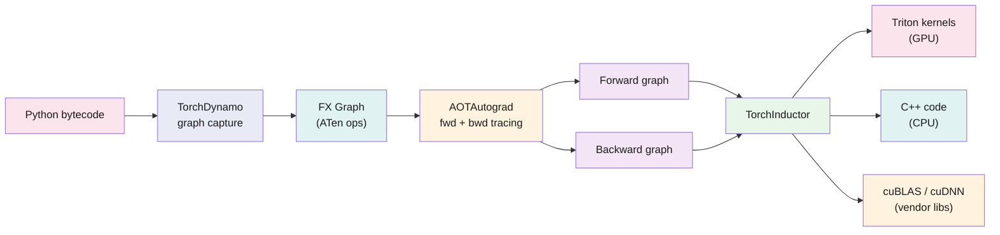

Most PyTorch users think `torch.compile` is a compiler. It is not — at least not in the way `gcc` or `nvcc` is a compiler. It is a system that intercepts Python bytecode at runtime, extracts the parts it can handle, compiles those parts through a multi-stage pipeline, and stitches the compiled regions back together with eager Python fallbacks for everything it cannot handle.

The interesting engineering is not in the compilation itself. It is in the *boundaries* — where the compiler gives up and hands control back to Python. Those boundaries determine whether you get a 2x speedup or no speedup at all.

This post walks through the four stages of the `torch.compile` pipeline: how Dynamo captures a graph from live Python, how AOTAutograd traces the backward pass ahead of time, how Inductor decides what to fuse and what to delegate to cuBLAS, and where the whole thing falls apart.

## The Pipeline



When you call `torch.compile(model)`, nothing compiles yet. The compilation happens lazily on the first forward pass. Each stage feeds the next, and the final output — Triton kernels, C++ code, or cuBLAS calls — gets cached on disk so the second run skips the whole pipeline.

## Stage 1: TorchDynamo — Capturing a Graph from Live Python

Dynamo is the most unusual part of the stack. It does not parse Python source code. It does not require type annotations or a restricted language subset. Instead, it hooks into CPython's frame evaluation API (PEP 523) and intercepts Python bytecode *as it executes*.[^1]

Here is what that means concretely. When Python is about to execute a frame (a function call), Dynamo steps in before CPython's default evaluator runs. It walks the bytecode instructions one by one, symbolically executing them. When it sees a PyTorch operation — a `torch.add`, a `nn.Linear`, a tensor indexing op — it records it into an FX graph. When it sees plain Python (a list append, a `print`, a call into a C extension), it has a choice: trace through it if it can, or give up.

"Giving up" is a **graph break**. Dynamo stops tracing, compiles everything it has accumulated so far into a subgraph, emits code to call that compiled subgraph, and falls back to normal CPython execution for the unsupported instruction. Then it tries to resume tracing after the break.

```python
@torch.compile
def f(x):
    y = x * 2          # ← Dynamo traces this
    z = y + 1           # ← Dynamo traces this
    print(z.shape)      # ← graph break: side effect
    w = z.relu()        # ← Dynamo starts a new subgraph
    return w
```

This function compiles into *two* subgraphs with a Python call to `print` between them. Each subgraph gets compiled and optimized independently. The `print` runs in eager Python. You get the optimization benefits for the two compiled regions, but you lose cross-region fusion and you pay two kernel-launch boundaries instead of one.

### Guards

Because Python is dynamic, Dynamo cannot assume a compiled graph stays valid forever. A tensor's shape might change on the next call. A module might get replaced. A global variable might flip.

So Dynamo generates a **guard function** alongside each compiled graph — a fast boolean check that verifies the assumptions the compilation made. Typical guards check tensor shapes, dtypes, device, and the identity of Python objects referenced during tracing. On each subsequent call, Dynamo runs the guard first. If it passes, the cached compiled code runs. If it fails, Dynamo recompiles.[^2]

Guard failures are a common performance problem. A model that sees different input shapes on every call recompiles on every call, and compilation is slow — often 10–60 seconds for a large model. This is the "cold start" problem, and it is the main reason `torch.compile` sometimes makes things slower in practice.

### Why not TorchScript?

PyTorch previously shipped TorchScript (`torch.jit.script`, `torch.jit.trace`) for ahead-of-time compilation. TorchScript required rewriting code into a restricted subset of Python. It could not handle data-dependent control flow, dynamic types, or most third-party libraries. Adoption was limited because the rewriting cost was high and the error messages were poor.

Dynamo takes the opposite approach: compile what you can, fall back for what you cannot. No rewriting needed. The tradeoff is that you get partial compilation instead of whole-program compilation, and you have to care about graph breaks. But the barrier to entry is a one-line decorator.

## Stage 2: AOTAutograd — Tracing the Backward Pass

In standard PyTorch, the backward pass builds itself dynamically during the forward pass. Each forward op records a backward function onto the autograd tape. The tape is consumed once during `loss.backward()`.

AOTAutograd changes this.[^3] It traces both the forward and backward passes *ahead of time*, producing a joint graph. Then it partitions that graph into a separate forward graph and backward graph that can each be compiled by Inductor.

The process has three parts:

### Decomposition

High-level PyTorch ops get broken down into primitive ATen ops. A `nn.Linear` becomes a `mm` (matrix multiply) plus an `add` (bias). A `nn.LayerNorm` decomposes into `mean`, `sub`, `pow`, `sqrt`, `div`. This reduces the number of ops that Inductor needs to handle from thousands to a few hundred.

### Functionalization

PyTorch code is full of in-place mutations: `x.add_(1)`, `y[:, 0] = 3`, `buffer.copy_(new_data)`. A compiler cannot safely reorder or fuse ops that mutate shared state. Functionalization rewrites all mutations into pure, out-of-place equivalents.[^4]

```python
# Before functionalization:
x.add_(1)       # mutates x in place

# After functionalization:
x_new = x + 1   # pure: creates a new tensor
# all subsequent uses of x are replaced with x_new
```

This is not optional. If the op schema lies about what it mutates (a missing `Tensor!` annotation), functionalization produces a wrong graph and the compiled model silently computes wrong results. I covered this failure mode in detail in the [vLLM custom ops post]().

### Partitioning

The joint forward-backward graph gets split by a min-cut partitioner. It decides which forward activations to save for the backward pass (stored in "saved tensors") and which to discard and recompute during backward. This is activation checkpointing built into the compiler, and it runs automatically. The partitioner's objective is to minimize the memory high-water mark while keeping recomputation cost reasonable.[^5]

## Stage 3: TorchInductor — Fusion and Code Generation

Inductor takes the forward and backward FX graphs and turns them into executable code. This is where the actual optimization happens.

### The fusion algorithm

Inductor's primary job is reducing memory traffic. On a modern GPU, a single HBM read-write round trip takes orders of magnitude longer than an arithmetic operation. Fusing operations so that intermediate values stay in registers or shared memory instead of touching HBM is the single biggest lever Inductor has.

Inductor uses two fusion strategies:

**Vertical fusion** chains dependent ops. If op B reads the output of op A and nothing else reads it, Inductor fuses A and B into a single kernel. The intermediate tensor never gets written to HBM. A chain like `matmul → add → relu → dropout` becomes one kernel.

**Horizontal fusion** groups independent ops that access the same memory. If two ops read from the same input tensor, Inductor can fuse them into one kernel that reads the input once instead of twice.

The fusion pass builds a dependency graph over the ops, groups fusible nodes, and emits one kernel per group. The output is Triton source code for GPU, or C++ source for CPU.

### Triton vs. cuBLAS: who gets what

Not every op goes through Triton. Inductor maintains a routing table:

| Op pattern | Backend | Why |
|:---|:---|:---|
| Pointwise ops (add, mul, relu, ...) | Triton | Fusion is the win; Triton fuses these well |
| Reductions (sum, mean, softmax) | Triton | Block-level reductions map naturally |
| Dense GEMM (matmul, linear) | cuBLAS | NVIDIA hand-tunes cuBLAS per GPU; hard to beat |
| Convolutions | cuDNN | Same story as cuBLAS |
| Fused GEMM + epilogue (matmul + relu) | Triton template | When the epilogue fusion saves enough bandwidth |

The GEMM routing deserves a note. Inductor does not blindly call cuBLAS for every matrix multiply. It has a template system that benchmarks cuBLAS against Triton GEMM templates for each specific shape and picks the winner. For small or irregular shapes (common in LLM inference), Triton sometimes wins because cuBLAS's tile sizes are tuned for large matrices. For large square GEMMs, cuBLAS almost always wins.

For more on how Triton generates the actual GPU binary, see the [Triton deep-dive]().

### Memory planning

After fusion, Inductor analyzes tensor lifetimes and reuses buffers. If tensor A is dead before tensor B is born and they are the same size, B reuses A's memory. This reduces peak memory and fragmentation, which matters for large models where every gigabyte of HBM counts.

## Where It Breaks

### Graph breaks

Graph breaks are the most common reason `torch.compile` fails to help. Each break splits the graph into smaller subgraphs. Smaller subgraphs mean fewer fusion opportunities and more kernel launches. Common causes:

- **`print`, `logging`, or any Python side effect.** Dynamo cannot prove these do not affect tensor computation.
- **Data-dependent control flow.** `if x.sum() > 0:` branches on a runtime tensor value. Dynamo does not know which branch to trace.
- **C extensions.** Calling into a C library that Dynamo cannot see through.
- **Unsupported Python constructs.** Some `torch.autograd` functions, certain `__torch_function__` overrides, or exotic Python features.

Debugging graph breaks requires setting `TORCH_LOGS='graph_breaks'` and reading the output, which tells you which bytecode instruction caused the break. This is not intuitive — the message refers to CPython bytecodes, not your source code. But it is the only diagnostic that works.

### Dynamic shapes

By default, Dynamo specializes on input shapes. A model compiled with batch size 32 recompiles when it sees batch size 64. Setting `torch.compile(dynamic=True)` tells Dynamo to use symbolic shapes instead of concrete values. This avoids recompilation but limits some optimizations (the compiler cannot constant-fold shape-dependent expressions).

Even with `dynamic=True`, highly variable shapes — say, a batch dimension that changes every call — can cause guard failures and thrash the compilation cache. The fix is `torch._dynamo.mark_dynamic()`, which explicitly tells Dynamo which dimensions vary. But this requires the user to know their data shapes ahead of time, which is not always possible.

### Custom ops

Any C++ or CUDA extension that Dynamo cannot trace is a graph break. If your model calls a custom CUDA kernel (common in LLM inference for PagedAttention, quantized GEMMs, or fused normalization), that kernel is a black box. Dynamo stops tracing at the call boundary.

The fix is `torch.library`, which lets you register a custom op with a schema, a meta function (for shape inference during tracing), and optional decomposition rules.[^6] This makes the op visible to Dynamo and Inductor. I covered the registration mechanics in the [vLLM ABI post]() — the key requirement is that the schema must truthfully declare which tensors are mutated.

### Compilation time

Compilation is slow. A large LLM can take 30–120 seconds to compile on first run. This is split roughly evenly between Dynamo's tracing, AOTAutograd's graph manipulation, and Inductor's code generation plus Triton's own JIT compilation.

For production inference, compilation happens once and the result is cached. For training, the backward graph adds compilation time. For development iteration, the cold start is painful. Regional compilation — compiling only the hot inner module (e.g., the transformer block) rather than the entire model — is the practical workaround.

## What torch.compile Sees and What It Does Not

The compilation pipeline sees a lot: op types, tensor shapes, dtypes, strides, device types, and the full dataflow graph including the backward pass. This is enough to fuse operators, eliminate dead code, reorder memory accesses, and pick the best kernel for each op.

What it does not see:

- **Which physical device a tensor lives on.** A `cuda:0` tensor and a `cuda:1` tensor have the same dtype and shape. The compiler treats them identically. Whether a particular data movement between devices is correct, efficient, or even legal is not the compiler's concern.
- **Memory space distinctions.** Host memory, device memory, pinned memory, and unified memory are all just tensors with a device tag. There is no type-level distinction between a pointer to HBM and a pointer to host DRAM. An accidental `.cpu()` in the wrong place is a runtime error or a silent performance cliff, not a compile error.
- **Placement decisions.** The compiler does not decide where an op should run. It compiles the graph as given. If a matmul should run on device 1 instead of device 0 for locality reasons, that is the user's problem — or the framework's (FSDP, pipeline parallelism, tensor parallelism all manage placement in Python).
- **Inter-device communication.** NCCL collectives (`all_reduce`, `all_gather`) interact with `torch.compile` but are essentially opaque barriers. The compiler cannot fuse across a collective or reason about the communication cost.

This is not a criticism of `torch.compile`. The scope is deliberate. Compilation within a single device's compute graph is a well-defined, solvable problem. Placement, routing, and memory-space management across a heterogeneous cluster are a different class of problem entirely — one where the constraints are topological, the costs are hardware-dependent, and the correctness properties cannot be inferred from tensor shapes alone.[^7]

Today, that outer layer lives in uncompiled Python: FSDP's sharding logic, DeepSpeed's pipeline scheduler, Megatron's tensor-parallel annotations. These are written by hand, tested empirically, and verified by hoping the loss converges. No compiler checks them.

## References

[^1]: **PEP 523 — Adding a frame evaluation API to CPython.** Python Enhancement Proposal enabling external tools to intercept frame evaluation. TorchDynamo uses this to capture FX graphs from running Python. ([Link](https://peps.python.org/pep-0523/))

[^2]: **TorchDynamo: An Experiment in Dynamic Python Acceleration.** Ansel, J. et al. PyTorch team, 2022. Describes the guard mechanism and graph break strategy. ([Link](https://pytorch.org/docs/stable/torch.compiler_dynamo_overview.html))

[^3]: **AOTAutograd: Ahead-of-Time Tracing for PyTorch.** Functorch / PyTorch team. Traces forward and backward passes ahead of time for compiler consumption. ([Link](https://pytorch.org/functorch/stable/notebooks/aot_autograd_optimizations.html))

[^4]: **Functionalization in PyTorch.** Yang, E. (ezyang). Explains how in-place mutations are rewritten into pure functional form for compiler safety. ([Link](https://dev-discuss.pytorch.org/t/functionalization-in-pytorch-everything-you-wanted-to-know/965))

[^5]: **Min-Cut Rematerialization Partitioning.** PyTorch Inductor's activation checkpointing strategy that partitions the joint forward-backward graph to minimize memory usage. ([Link](https://pytorch.org/docs/stable/torch.compiler_aot_autograd.html))

[^6]: **torch.library: Custom Operators for torch.compile.** PyTorch documentation on registering custom ops with schemas and meta functions for compiler visibility. ([Link](https://pytorch.org/docs/stable/library.html))

[^7]: **PyTorch Distributed and torch.compile.** PyTorch team. Documents the interaction between FSDP, DDP, and the compilation stack. ([Link](https://pytorch.org/docs/stable/torch.compiler_faq.html))

---

*Disclaimer: This article was generated using the Gemini 3.1 Pro and Claude Opus 4.8 models.*
