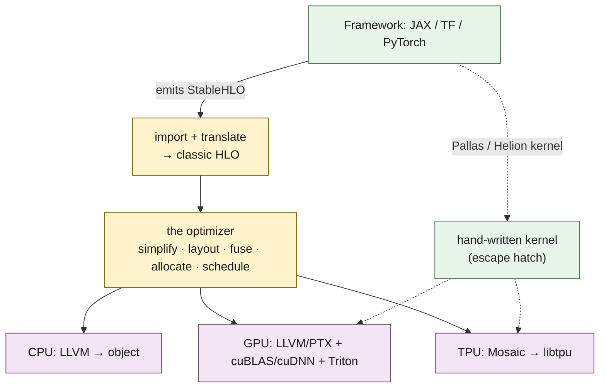
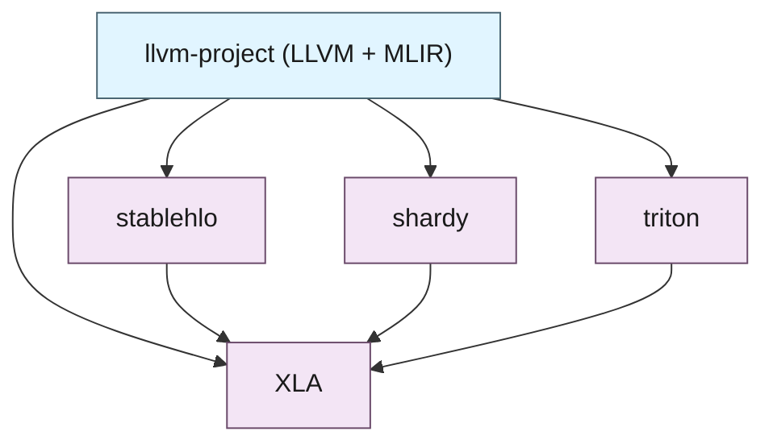

If you train or serve models, XLA is probably compiling them, whether or not you have ever named it. It is the compiler behind JAX, behind TensorFlow, and — through PyTorch/XLA — behind much of PyTorch on TPUs. It takes the tensor program your framework produces and turns it into fast code for CPUs, GPUs, and TPUs. This is a tour of how it is built: the IR it works in, the optimizer at its center, how it generates code for three very different kinds of hardware, how it spreads a program across many chips, and where you can step outside it. The aim is to be able to read what XLA is actually doing to your model — and to see the shape of its design, where it is strong and where its assumptions start to bind. Everything below is derived from the `openxla/xla` source tree, with paths cited.



## The IR: HLO

XLA's intermediate representation is **HLO** — "High Level Operations" — an SSA graph of operations over statically-shaped tensors. It has a rich set of abstractions (`HloModule`, `HloComputation`, `HloInstruction`, in `xla/hlo/ir/`), with its own serialization and text format.[^1] The operation set is deliberately small — on the order of 150 opcodes[^2] — covering the primitives a tensor program reduces to: `dot` (general contraction), `convolution`, `reduce`, `dynamic-slice`, the collectives (`all-reduce`, `all-gather`), and an escape valve, `custom-call`. A fragment of optimized HLO reads like this — note the `f32[4,16]{1,0}` shape-and-layout notation and the `fusion` op:

```text
%fused_computation.1 (param_0: f32[4,16], param_1: f32[16]) -> f32[4,16] {
  %b   = f32[4,16]{1,0} broadcast(%param_1), dimensions={1}
  %add = f32[4,16]{1,0} add(%param_0, %b)
  ROOT %max = f32[4,16]{1,0} maximum(%add, %constant)
}
ENTRY %main {
  %f = f32[4,16]{1,0} fusion(%x, %W), kind=kCustom, calls=%fused_computation
}
```

HLO predates MLIR but these days frameworks (like JAX) do not hand XLA this C++ HLO directly. They emit **StableHLO**, a portable, versioned interchange that XLA imports and translates into HLO (`xla/hlo/translate/`).[^3] StableHLO is the well designed contract between a framework and the compiler — the thing JAX's `lower()` produces — and the same `relu(x @ W + b)` comes out of it looking like this:

```mlir
func.func public @main(%arg0: tensor<4x8xf32>, %arg1: tensor<8x16xf32>,
                       %arg2: tensor<16xf32>) -> tensor<4x16xf32> {
  %0 = stablehlo.dot_general %arg0, %arg1, contracting_dims = [1] x [0] :
         (tensor<4x8xf32>, tensor<8x16xf32>) -> tensor<4x16xf32>
  %1 = stablehlo.broadcast_in_dim %arg2, dims = [1] : (tensor<16xf32>) -> tensor<1x16xf32>
  %3 = stablehlo.add %0, %1 : tensor<4x16xf32>
  %5 = stablehlo.maximum %3, %cst : tensor<4x16xf32>
  return %5 : tensor<4x16xf32>
}
```

StableHLO is an MLIR dialect — which is why it reads with `func.func`, SSA `%` values, and `tensor<...>` types, and why its specification notes the syntax is "heavily inspired by MLIR."[^4] It is also the public face of a small family of related MLIR dialects that live under `xla/mlir_hlo/`, and the three are worth telling apart:

- **CHLO** ("client HLO") is the highest-level and most permissive. It carries the conveniences a frontend wants — implicit broadcasting (`chlo.broadcast_add` and its siblings) and a handful of composite ops — and is meant to be *decomposed* into the level below rather than compiled directly.[^chlo]
- **MHLO** is the MLIR-native rendering of HLO's operation set: the same semantics as classic HLO, expressed as MLIR ops, used while a program is on the MLIR side of the fence.
- **StableHLO** is MHLO plus a stability contract — a versioned, backward- and forward-compatible serialization — which is what makes it safe as the durable interchange a framework commits to.

So the front-end path is: a framework lowers its own graph to StableHLO (with CHLO's conveniences already expanded away), and XLA's translation layer — `xla/hlo/translate/`, with `stablehlo_to_hlo`, `hlo_to_mhlo`, and `mhlo_to_hlo` — carries it across the seam into the classic C++ HLO the optimizer runs on.[^3] The architectural point to hold onto: XLA has a stable, portable front-end IR (StableHLO, with CHLO above it and MHLO alongside), and a separate internal IR (classic HLO) that the optimizer works on, with an explicit translation step between them.

## The optimizer

The optimizer is the center of XLA and the reason it exists. Between importing HLO and generating code, XLA runs a long pipeline of passes — dump it and there are dozens of stages — and the spine of that pipeline is worth knowing, because it is where your model actually gets faster.

**Simplification.** First come the classic optimizing-compiler passes: algebraic simplification, common-subexpression elimination, dead-code elimination.[^5] These are strong enough that XLA will prove a whole expression is the identity. Hand it `(x + 0) * 1` followed by a double transpose and the entire computation collapses to a single copy:

```text
ENTRY %main (x: f32[128,128]) -> f32[128,128] {
  %x = f32[128,128]{1,0} parameter(0)
  ROOT %copy = f32[128,128]{1,0} copy(%x)
}
```

**Layout assignment.** Every array gets a physical layout — the `{1,0}` is the minor-to-major dimension order, and on TPU the layouts are tiled to match the hardware. XLA chooses layouts to make consuming ops efficient, and when a consumer demands a layout the producer did not provide, it inserts a copy.[^6] These copies are invisible in your source and are a frequent, quiet cost in a profile.

**Fusion.** This is the optimization that matters most. On modern accelerators, moving bytes to and from memory costs far more than arithmetic, so XLA fuses chains of operations into a single kernel to keep intermediates in registers instead of streaming them through memory. It distinguishes fusion *kinds* — loop, input, output, custom.[^7] A chain like `tanh(exp(x) * 2 + 1)` becomes one kernel:

```text
%fused (param_0: f32[1024]) -> f32[1024] {
  %e = f32[1024] exponential(%param_0)
  %m = f32[1024] multiply(%e, broadcast(2))
  %a = f32[1024] add(%m, broadcast(1))
  ROOT %t = f32[1024] tanh(%a)
}
ENTRY %main { ROOT %fusion = f32[1024] fusion(%x), kind=kLoop, calls=%fused }
```

Four operations, one kernel, one pass over memory. The decision of what to fuse comes from a cost model inside the fusion passes; you generally do not control it directly, which is a point I will return to at the end.

**Buffer assignment.** Because XLA sees the whole program and every shape is known, it plans memory statically: it computes buffer lifetimes and assigns every value a concrete offset in a preplanned allocation, reusing space between values whose lifetimes do not overlap, before the program ever runs.[^8] The dump is explicit about it — allocations, offsets, and reuse:

```text
allocation 1: size 64, output, maybe-live-out:
   value: eigh{1}                 (offset 0)
   value: broadcast_select_fusion (offset 0)   <- same buffer, reused
allocation 2: size 1092, preallocated-temp:
   value: multiply_copy_fusion    (offset 64)
```

No `malloc` on the execution path, peak memory known at compile time. This pairs with *donation* — aliasing an input buffer to an output so an update happens in place — which is how optimizer state and KV caches avoid doubling in size. For a static-shape program this is close to optimal, and it is one of the cleanest things XLA does.

If you come to XLA from MLIR, this stage is the analogue of *bufferization*: the moment value-semantic tensors become physical buffers with addresses and lifetimes — MLIR's `tensor` → `memref` transition. XLA's buffer assignment is doing the job the `memref` world does — deciding where each value physically lives, which buffers can share storage, and what is updated in place — just inside its own HLO representation rather than as an MLIR pass.

**Scheduling.** Finally the instructions are ordered — to hide latency, and in the distributed case to overlap collective communication with compute.[^9]

If you want to watch any of this, XLA ships a tool, `hlo-opt`, that runs the pipeline (or a single named pass) on a hand-written HLO module and prints the result — the examples above came out of it. Being able to run one pass in isolation is the fastest way to answer "which pass did this to my program?"

## Code generation: three backends

Optimized HLO then becomes machine code, and the way out differs sharply by target.

**CPU and GPU** go through LLVM. The modern path is an *emitters* framework that lowers a fusion's HLO down to LLVM IR and then to a CPU object file or GPU PTX.[^10] But on GPU, codegen is a fan-out, not a single path:

- **cuBLAS and cuDNN.** For dense matmuls and convolutions — where NVIDIA's libraries are already tuned to the metal — XLA does not generate code at all. Rewriter passes turn those ops into `custom-call`s targeting the libraries (`__cublas$gemm`, `__cublas$lt$matmul`, `__cudnn$convForward`, and friends).[^11] A large fraction of a model's GPU FLOPs are these library calls:

  ```text
  %custom-call = (f32[4096,4096]{1,0}, s8[4194304]{0}) custom-call(%a, %b),
                 custom_call_target="__cublas$lt$matmul"
  ```

- **Triton.** For matmul-and-softmax-shaped fusions, XLA generates Triton, which compiles the rest of the way to PTX.[^12] This is the path that lets XLA fuse an epilogue onto a GEMM, or generate a fast softmax, without a hand-written kernel.

**TPU** goes to XLA's TPU backend, which is closed-source; the generation and hardware specifics live in `libtpu`, and the kernel-level dialect that Pallas targets on TPU is **Mosaic**.[^13] Which GPU branch a given op takes — library call, Triton, or emitters — is decided per shape, and with autotuning XLA will benchmark candidates on the actual device and keep the fastest, which is a real part of why first-compile can be slow.

## Across many chips: sharding

A single-device program is only half the story. When a computation spans a mesh of devices, XLA relies on **GSPMD**, and increasingly its successor **Shardy** (`sdy`), integrated under `xla/service/spmd/`.[^14] You annotate *where* arrays live — a named device mesh and a per-dimension mapping — and the partitioner propagates a consistent sharding through the graph and inserts the collectives required to keep the math correct. Shard the contracting dimension of a matmul across two devices, run the partitioner, and it synthesizes the all-reduce for you:

```text
ROOT %all-reduce = f32[256,1024]{1,0} all-reduce(%dot), ...,
     frontend_attributes={is_spmd_generated="true"}
```

The parameters come back with per-device shapes and a `sharding=` attribute recording the layout across the mesh. The important architectural fact is that this is a *separate* concern from the single-device optimizer: placement is expressed as annotations that a dedicated partitioning stage consumes, not as part of the ops the optimizer fuses and schedules.

## Stepping outside: Pallas and Helion

Sometimes the optimizer's automatic choices are not enough — the canonical case is an attention kernel that cannot be expressed as a good fusion at HLO granularity. For that, JAX provides **Pallas**, a kernel language whose kernels bypass HLO fusion and layout assignment entirely: a Pallas kernel is compiled straight to a device kernel (Triton on GPU, Mosaic on TPU) and dropped into the surrounding program as an opaque `custom-call`.[^15] From the optimizer's point of view it is a black box with a launch grid attached.

This escape hatch has become a small convergence point. PyTorch, with Google, built a TPU backend for **Helion** — its high-level kernel DSL — that "compiles Helion kernels to Pallas," so a PyTorch author can write one kernel and target TPU through the same path (`Helion → Pallas → Mosaic → TPU`), with the stated goal of keeping "the same set of kernels across TPU and GPU."[^16] The kernel backends, in other words, are reachable from more than one framework.

## Running it: PJRT and the compilation cache

Compilation produces an *executable*, but something has to hold that executable, feed it inputs that already live on devices, run it, and return the outputs. That layer is **PJRT**, XLA's hardware-agnostic device-runtime API (`xla/pjrt/`).[^pjrt] A PJRT *client* represents a backend — CPU, a set of GPUs, a TPU slice — and exposes the handful of things a runtime must do: enumerate devices (`PjRtDevice`), move data on and off them (`PjRtBuffer`), and run compiled programs (`PjRtLoadedExecutable`). The point of PJRT is that the same compile-and-run flow works across backends behind one interface, which is why JAX — and, increasingly, PyTorch/XLA and others — can target CPU, GPU, and TPU without a bespoke runtime for each. The in-tree `IFRT`/`VIFRT` dialects are the multi-host generalization of the same idea: PJRT is the single-client view, IFRT the sharded-array view across a whole cluster.

The runtime is also where XLA earns back its compile cost, which is not small — the optimizer pipeline plus, on accelerators, autotuning that benchmarks kernels on the real device. XLA avoids paying it twice in two ways. In-process, a compiled executable is cached and keyed on the program together with the *shapes and dtypes* of its inputs, so calling the same `jit`-ted function again with the same shapes reuses the executable and goes straight to execution — and feeding it a new shape compiles a fresh one, which is exactly the per-shape recompilation cost noted earlier. Across processes, XLA has a **persistent compilation cache** that writes compiled executables to disk, so a restarted server or a resumed training job can skip compilation entirely.[^cache] The intended pattern falls out of both: compile once per shape, cache it, amortize over many executions.

## What XLA is built on

Read as a dependency graph, XLA sits on a stack of shared infrastructure. Its Bazel `third_party/` pulls in the `llvm-project` monorepo — LLVM for code generation, and MLIR, which is the framework StableHLO, Shardy, and Triton are all built on — plus those satellite repositories themselves.[^17]



It is worth noting how much of the periphery — the StableHLO front door, the Shardy partitioner, the Triton and Mosaic codegen — is built on MLIR, while the classic-HLO optimizer at the center is its own older representation. XLA predates MLIR by years, and that ordering shows in the architecture: MLIR sits at the interfaces that were built or rebuilt more recently, and the mature core has stayed as it was.

## The design, and where it binds

Step back and the shape of XLA is coherent, and its strengths all come from the same few commitments. It compiles the whole program ahead of time, on known static shapes, which is what lets it fuse globally, assign layouts, and — the defining move — allocate every buffer statically with no allocator on the hot path. It optimizes a single-device graph as a clean, bounded problem, and treats distribution as a separate layer of annotations on top. These are good decisions, and together they are why XLA produces code that saturates real hardware.

They are also exactly where it binds. Static shapes are load-bearing, so genuinely dynamic ones are awkward: XLA pads bounded-dynamic tensors up to a static bound and slices back at the end (`PadToStatic` / `SliceToDynamic`), and it rejects computations whose output shape depends on the data.[^18] Because it specializes on shape, a new shape means a recompile, and compile time — dominated by autotuning on accelerators — is a real operational cost. And placement lives outside the type system: a tensor's sharding, or the memory space of a kernel buffer, is an *annotation* a pass checks, not a property the compiler can prove at the point you wrote the program. A bad sharding is a runtime error, not a compile-time type error; an accidental host round-trip is a silent performance cliff, not a diagnostic.

None of that is a flaw in XLA so much as the edge of its design — the frontier where a static-shape, single-device-plus-annotations compiler stops being the natural fit. It is a very good compiler for the problem it chose. Where its assumptions run out — dynamic structure, and hardware placement as a first-class, checkable property rather than an annotation resolved late — is the interesting country, and it is a subject I will keep coming back to.

For the practical takeaway: the next time you read an HLO dump or wonder why your model recompiled, you now have the map. StableHLO in, a classic-HLO optimizer doing the fusing and allocating in the middle, three quite different backends out, a separate sharding layer for the mesh, and a side door when you need to write the kernel yourself.

---

## References

[^1]: **HLO — XLA's IR.** `HloModule`/`HloComputation`/`HloInstruction` and the optimizer that runs on them. ([xla/hlo/ir](https://github.com/openxla/xla/tree/main/xla/hlo/ir), [XLA architecture](https://openxla.org/xla/architecture))

[^2]: **The HLO opcode set.** `hlo_opcode.h` enumerates the operations (`kDot`, `kConvolution`, `kReduce`, `kDynamicSlice`, `kAllReduce`, `kCustomCall`, …), on the order of 150. ([hlo_opcode.h](https://github.com/openxla/xla/blob/main/xla/hlo/ir/hlo_opcode.h), [operation semantics](https://openxla.org/xla/operation_semantics))

[^3]: **StableHLO and the translation layer.** `xla/hlo/translate/` imports StableHLO into classic HLO (`stablehlo_to_hlo`, `hlo_to_mhlo`, `mhlo_to_hlo`). ([xla/hlo/translate](https://github.com/openxla/xla/tree/main/xla/hlo/translate), [StableHLO](https://openxla.org/stablehlo))

[^4]: **StableHLO syntax.** The spec: "StableHLO syntax is heavily inspired by MLIR … the best fit for StableHLO's goal of creating more interoperability between ML frameworks and ML compilers." ([StableHLO spec, Operations](https://github.com/openxla/stablehlo/blob/main/docs/spec.md#operations))

[^chlo]: **The MLIR-HLO dialect family.** CHLO (client-level, implicit broadcasting) legalizes into MHLO/StableHLO; see `xla/mlir_hlo/` (`map_chlo_to_hlo_op.h`, `chlo_legalize_to_hlo`). ([xla/mlir_hlo](https://github.com/openxla/xla/tree/main/xla/mlir_hlo))

[^5]: **Simplification passes.** `algebraic_simplifier`, `hlo_cse`, `hlo_dce`. ([algsimp](https://github.com/openxla/xla/blob/main/xla/hlo/transforms/simplifiers/algebraic_simplifier.cc), [dce](https://github.com/openxla/xla/blob/main/xla/hlo/transforms/simplifiers/hlo_dce.cc))

[^6]: **Layout assignment.** Assigns minor-to-major layouts and inserts copies to satisfy operand layout constraints. ([layout_assignment.cc](https://github.com/openxla/xla/blob/main/xla/service/layout_assignment.cc), [shapes & layout](https://openxla.org/xla/shapes))

[^7]: **Fusion.** `FusionKind` is `{kLoop, kInput, kOutput, kCustom}`; `instruction_fusion` fuses producers into consumers, and the GPU `priority_fusion` uses a cost model (`priority = time_unfused - time_fused`). ([hlo_instruction.h](https://github.com/openxla/xla/blob/main/xla/hlo/ir/hlo_instruction.h), [priority_fusion](https://github.com/openxla/xla/blob/main/xla/backends/gpu/transforms/priority_fusion.h))

[^8]: **Buffer assignment.** Whole-program static allocation with buffer reuse across disjoint lifetimes; donation via `HloInputOutputAliasConfig`. ([buffer_assignment.h](https://github.com/openxla/xla/blob/main/xla/service/buffer_assignment.h))

[^9]: **Scheduling.** `latency_hiding_scheduler` orders instructions and overlaps collectives with compute. ([latency_hiding_scheduler.h](https://github.com/openxla/xla/blob/main/xla/service/latency_hiding_scheduler.h))

[^10]: **The emitters framework.** MLIR-based CPU/GPU codegen (`elemental_hlo_to_mlir` → `arith`/`scf`/`vector` → the `llvm` dialect), replacing the hand-written `IrEmitter`. ([xla/codegen/emitters](https://github.com/openxla/xla/tree/main/xla/codegen/emitters))

[^11]: **cuBLAS/cuDNN as `custom-call`s.** Target names in `cublas_cudnn.h`; `gemm_rewriter`/`conv_rewriter` lower matmul/convolution to them. ([cublas_cudnn.h](https://github.com/openxla/xla/blob/main/xla/service/gpu/cublas_cudnn.h), [GPU architecture](https://openxla.org/xla/gpu_architecture))

[^12]: **XLA:GPU and Triton.** The GPU backend emits Triton for matmul/softmax fusions. ([xla/backends/gpu/codegen/triton](https://github.com/openxla/xla/tree/main/xla/backends/gpu/codegen/triton))

[^13]: **TPU backend.** XLA:TPU is closed-source (built into `libtpu`); Pallas targets the Mosaic dialect on TPU. ([openxla/xla#11599](https://github.com/openxla/xla/issues/11599), [Mosaic dialect](https://github.com/jax-ml/jax/tree/main/jaxlib/mosaic/dialect/tpu))

[^14]: **GSPMD and Shardy.** Sharding propagation + collective insertion; the SPMD partitioner and the newer MLIR-based Shardy under `xla/service/spmd/`. ([GSPMD paper](https://arxiv.org/abs/2105.04663), [Shardy](https://github.com/openxla/shardy), [in XLA](https://github.com/openxla/xla/tree/main/xla/service/spmd/shardy))

[^15]: **Pallas.** JAX's kernel language; kernels compile via Triton (GPU) or Mosaic (TPU) and embed as a `custom-call`, bypassing HLO fusion/layout. ([Pallas design](https://docs.jax.dev/en/latest/pallas/design/design.html))

[^16]: **Helion on TPU.** PyTorch's high-level kernel DSL; its TPU backend "compiles Helion kernels to Pallas," aiming to keep the same kernels across TPU and GPU. ([PyTorch blog](https://pytorch.org/blog/helion-on-tpu-towards-hardware-heterogeneous-kernel-authoring/))

[^pjrt]: **PJRT.** XLA's device-runtime API — `PjRtClient`/`PjRtDevice`/`PjRtBuffer`/`PjRtLoadedExecutable` in `xla/pjrt/`, with a C API for out-of-tree backends. ([xla/pjrt](https://github.com/openxla/xla/tree/main/xla/pjrt))

[^cache]: **Compilation caching.** Compiled executables are cached in-process keyed on input shape/dtype; XLA/JAX also provide an optional on-disk persistent compilation cache across runs. ([JAX persistent cache](https://docs.jax.dev/en/latest/persistent_compilation_cache.html))

[^17]: **Dependencies.** XLA's `third_party/` pulls `llvm-project` (LLVM + MLIR) and the `stablehlo`, `shardy`, and `triton` repos. ([xla/third_party](https://github.com/openxla/xla/tree/main/third_party))

[^18]: **Dynamic shapes.** Bounded dynamism via `PadToStatic`/`SliceToDynamic`; data-dependent output shapes are rejected under `jit`. ([StableHLO dynamism](https://openxla.org/stablehlo/dynamism), [jax#26265](https://github.com/jax-ml/jax/issues/26265))

*Disclaimer: This article was generated using the Claude Opus 4.8 model.*
