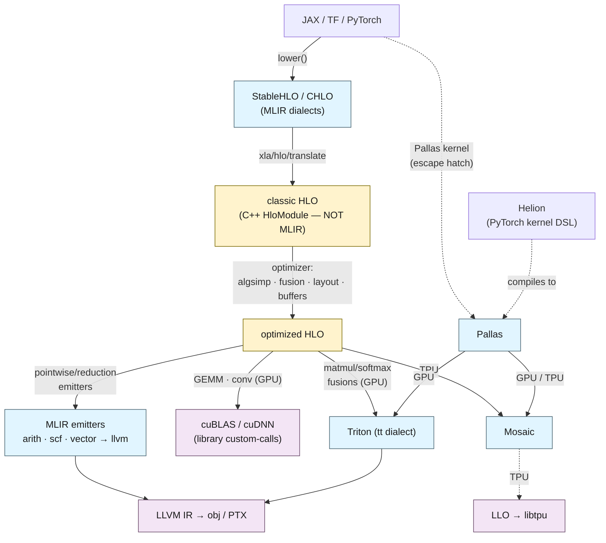
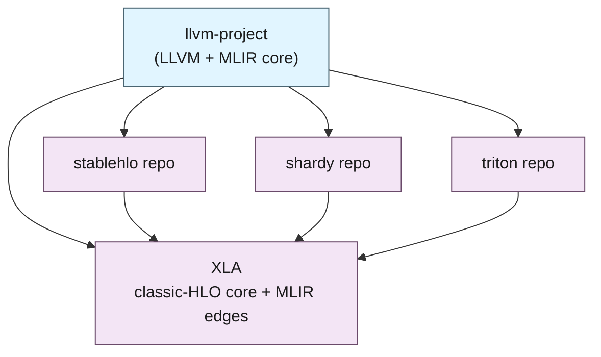

XLA is the compiler under JAX, TensorFlow, and PyTorch/XLA, turning tensor programs into fast code for CPUs, GPUs, and TPUs. This is a tour of its architecture through one particular lens — where it uses MLIR, and where it doesn't — because XLA's structure is mixed, and the mix is the part worth understanding.

XLA predates MLIR by several years, and its optimizer core is still its own representation: classic HLO, a hand-built C++ IR with its own passes, serialization, and text format. That core is not MLIR. MLIR appears, instead, at particular layers around it — the front door the frameworks target, the sharding system, and a growing share of code generation. So the useful question about XLA is not whether it "is an MLIR compiler" but which parts are and which parts aren't — and that turns out to be specific enough to map.

That map is the rest of this post, walked from the way in to the way out and grounded in the `openxla/xla` source tree with paths cited. It is a companion to [the tour of MLIR](), which covered MLIR as a general IR construction kit; here we look at one large, mature consumer of it and note how much shows up, and where.

## The two IRs

The single most important architectural fact about XLA is that it has **two** intermediate representations, and only one of them is MLIR.

The core is **classic HLO** — "High Level Operations." It is a set of hand-written C++ classes (`HloModule`, `HloComputation`, `HloInstruction`, in `xla/hlo/ir/`), with its own protobuf serialization, its own pass manager, and a text format that is *not* MLIR's.[^1] This is what the optimizer works on, and it reads like this — note the `f32[4,16]{1,0}` shape-and-layout notation, the `fusion(...)` ops, no `func.func`, no `tensor<>` types:

```text
%fused_computation.1 (param_0.2: f32[4,16], param_1.4: f32[16]) -> f32[4,16] {
  %add.1 = f32[4,16]{1,0} broadcast(%param_1.4), dimensions={1}
  %add.0 = f32[4,16]{1,0} add(%param_0.2, %add.1)
  ROOT %max.0 = f32[4,16]{1,0} maximum(%add.0, %constant.0)
}
ENTRY %main {
  %ynn_fusion = f32[4,16]{1,0} fusion(%x, %W), kind=kCustom, calls=%fused_computation
}
```

The other IR is a family of **MLIR dialects**. XLA defines some in-tree — `MHLO` (the MLIR-native rendering of HLO) and the `IFRT`/`VIFRT` dialects for its multi-device runtime interchange[^2] — and depends on others, chiefly **StableHLO** and its higher-level sibling **CHLO**. A `jit`-ed `relu(x @ W + b)`, straight from JAX's `lower()`, comes out as StableHLO, and it is unmistakably MLIR — `func.func`, SSA `%` values, `tensor<...>` types, dialect-prefixed ops:

```mlir
func.func public @main(%arg0: tensor<4x8xf32>, %arg1: tensor<8x16xf32>,
                       %arg2: tensor<16xf32>) -> tensor<4x16xf32> {
  %0 = stablehlo.dot_general %arg0, %arg1, contracting_dims = [1] x [0] :
         (tensor<4x8xf32>, tensor<8x16xf32>) -> tensor<4x16xf32>
  %1 = stablehlo.broadcast_in_dim %arg2, dims = [1] : (tensor<16xf32>) -> tensor<1x16xf32>
  %3 = stablehlo.add %0, %1 : tensor<4x16xf32>
  %5 = stablehlo.maximum %3, %cst : tensor<4x16xf32>
  return %5 : tensor<4x16xf32>
}
```

Same computation, two worlds. And critically, there is a translation layer, `xla/hlo/translate/`, whose whole job is to move programs across the seam: `stablehlo_to_hlo`, `hlo_to_mhlo`, `mhlo_to_hlo`.[^3] So the life of a program is: a framework hands XLA **StableHLO** (MLIR), XLA translates it *down into classic HLO*, optimizes it *as classic HLO*, and then translates *back into MLIR* to generate code. MLIR bookends the classic-HLO core — and, as we will see, there is a second entry path that skips the core entirely.



The blue is MLIR; the yellow, in the middle, is not; the purple is the vendor libraries and the final targets. The rest of this post walks the blue, roughly left to right.

## The front door: CHLO, MHLO, StableHLO

The way into XLA is MLIR, and it is a small stack of related dialects under `xla/mlir_hlo/`.[^4] From high to low: **CHLO** ("client HLO") is the most permissive — implicit broadcasting, a few composite ops, the conveniences a frontend wants — and lowers to MHLO (`map_chlo_to_hlo_op.h`). **MHLO** is the MLIR-native form of HLO's operation set. **StableHLO** is MHLO with a stability contract — versioning, backward/forward compatibility — so it can be the portable interchange *between* frameworks and compilers. This is what `jit(...).lower()` emits and what a framework commits to.[^5]

Here is a detail worth noting about the interchange itself: **StableHLO's syntax is MLIR's.** The StableHLO specification says so in as many words — *"StableHLO syntax is heavily inspired by MLIR, which is not necessarily the most ergonomic alternative, but is arguably the best fit for StableHLO's goal of creating more interoperability between ML frameworks and ML compilers."*[^6] The op grammar is MLIR's op grammar (`OpName ::= '"' 'stablehlo' '.' OpMnemonic '"'`), and the function-signature form is, per the spec, "deliberately part of StableHLO syntax for compatibility with MLIR." You can see it in an op that carries a region — a reduction-style op whose body is a nested block, written exactly as MLIR writes regions and blocks:

```mlir
%result = "stablehlo.select_and_scatter"(%operand, %source, %init_value) ({
  ^bb0(%arg0: tensor<i32>, %arg1: tensor<i32>):
    %0 = "stablehlo.compare"(%arg0, %arg1) {
      comparison_direction = #stablehlo<comparison_direction GE>
    } : (tensor<i32>, tensor<i32>) -> tensor<i1>
    "stablehlo.return"(%0) : (tensor<i1>) -> ()
}) : ...
```

The `^bb0` block, the region in `({ ... })`, the `#stablehlo<...>` attribute, the trailing type signature — none of that is XLA-specific; it is MLIR's generic op syntax. So StableHLO uses not just MLIR as a library but MLIR's textual and structural conventions as its on-disk interchange format. This is the front door the frameworks emit, and the one XLA translates through to reach its classic-HLO core.

## The sharding layer: Shardy

Off to the side of the optimizer sits an entire MLIR-based subsystem for distribution: **Shardy**, dialect `sdy`, integrated under `xla/service/spmd/shardy/`.[^7] It is the newer, MLIR-native partitioner superseding GSPMD, propagating shardings and inserting collectives. What is worth showing here is that it is a *real dialect*, with its own attribute syntax for meshes and shardings:

```mlir
// a named device mesh, and a value sharded across its axes
sdy.mesh @mesh_xyz = <["x"=2, "y"=2, "z"=2]>
%arg0 : tensor<8xf32> {sdy.sharding = #sdy.sharding<@mesh_xyz, [{"x"}]>}
```

That `#sdy.sharding<@mesh, [{"x"}, {"y"}]>` attribute is exactly the kind of thing MLIR's extensibility is *for*: a domain that needs a first-class, verifiable representation of something the built-in dialects do not model — here, how a tensor's dimensions map onto a device mesh. Architecturally, the giveaway of how Shardy is wired in is that its directory is full of *round-trip* pipelines — `stablehlo_round_trip`, `sdy_round_trip` — because sharding information has to be carried back and forth between the `sdy` MLIR world and the StableHLO/HLO the rest of XLA speaks.[^7] XLA reached for MLIR here precisely because sharding annotations are gnarly enough to deserve a dedicated dialect with real verification, and it pays a round-tripping tax to bridge back to the classic core.

## The way out: emitters, cuBLAS/cuDNN, Triton, and Mosaic

Code generation is where MLIR does the most work in modern XLA, and where the "vote for MLIR" is most visible. But the GPU way out is not one path — it is a fan-out, and only some of the branches are MLIR.

**The emitters framework (MLIR).** The old code generator was a hand-written `IrEmitter` that walked HLO and called the LLVM `IRBuilder` directly. It is being replaced by an **emitters framework** built on MLIR, now used by *both* the CPU and GPU backends (`xla/codegen/emitters/`, `xla/backends/cpu/codegen/emitters/cpu_fusion_emitter.cc`, `xla/backends/gpu/codegen/emitters/`).[^8] The path is textbook progressive lowering: a fusion's HLO is converted to MLIR by `elemental_hlo_to_mlir`, producing a mix of standard dialects — the emitters pull in `arith`, `math`, `scf`, `affine`, `vector`, `tensor`, `gpu`, and `mhlo` — and that is lowered, through the emitters' own transform passes (`vectorize_loads_stores`, then `lower_to_llvm_gpu` / `lower_to_llvm_common`), down to the **`llvm` dialect** and out to LLVM IR.[^8] This is exactly the `linalg`/`scf`/`vector` → `llvm` story from the MLIR tour, happening inside XLA.

**cuBLAS and cuDNN (not MLIR — vendor libraries).** For the operations that vendors have already tuned to the metal, XLA does not generate code at all; it calls the library. Dedicated rewriter passes turn matmuls and convolutions into `custom-call`s targeting the NVIDIA libraries — the targets are spelled out in `xla/service/gpu/cublas_cudnn.h`: `"__cublas$gemm"`, `"__cublas$lt$matmul"` (and F8/MX variants), `"__cudnn$convForward"`, `"__cudnn$convBiasActivationForward"`, and more.[^9] Disable the Triton GEMM path and a matmul falls back to exactly one of these:

```text
%custom-call = (f32[4096,4096]{1,0}, s8[4194304]{0}) custom-call(%a, %b),
               custom_call_target="__cublas$lt$matmul"
```

This is a real and important branch of the "way out": a large fraction of a model's FLOPs, on GPU, never touch MLIR or LLVM at all — they are a `custom-call` into a closed vendor library. MLIR owns the *fusions around* the GEMMs, not usually the GEMMs themselves.

**Triton (MLIR).** For matmul-and-softmax-shaped fusions on GPU, XLA emits the `tt` (Triton) dialect (`xla/backends/gpu/codegen/triton/`), which the Triton compiler — itself MLIR — takes to LLVM and PTX.[^10] The kernel XLA emits is ordinary Triton IR:

```mlir
tt.func @triton_fn(%arg0: !tt.ptr<f32>, %arg1: !tt.ptr<f32>) {
  %r  = tt.make_range {end = 1024 : i32, start = 0 : i32} : tensor<1024xi32>
  %p  = tt.addptr %base, %off : tensor<1024x!tt.ptr<f32>>, tensor<1024xi32>
  %x  = tt.load %p : tensor<1024x!tt.ptr<f32>>
  ...
  tt.store %q, %y : tensor<1024x!tt.ptr<f32>>
  tt.return
}
```

**Mosaic (MLIR).** On TPU, the codegen dialect is **Mosaic**, another MLIR dialect (with its own TPU memory spaces, vector layout, and systolic-array ops). So there is not one MLIR codegen path but three — the general emitters, Triton, and Mosaic — chosen by target and fusion shape, plus the non-MLIR cuBLAS/cuDNN library path alongside them.

## The other door: Pallas

Everything so far is the main road: framework → StableHLO → classic-HLO optimizer → codegen. There is a second entrance that skips the optimizer almost entirely. **Pallas** is JAX's kernel language, and a Pallas kernel does not go through HLO fusion and layout assignment — it is compiled straight to a device kernel and dropped into the surrounding program as a `custom-call`.[^11] The architectural point here is that Pallas is a *second producer of the MLIR codegen dialects*, reaching them without the classic-HLO core:

- On GPU, `JAX → Pallas → Triton (tt) → LLVM → PTX`. (In recent JAX, Pallas-Triton even has its own compilation pipeline rather than delegating PTX generation to XLA.[^11])
- On TPU, `JAX → Pallas → Mosaic → LLO → libtpu`.

From XLA's perspective the whole kernel is one opaque `custom-call` — `@__gpu$xla.gpu.triton` for the Triton path — with its launch grid attached; XLA schedules around it but does not look inside. So the dotted arrow in the diagram is not a detail: Pallas is a deliberate hole punched through the classic-HLO core so that a hand-written kernel can reach the same MLIR codegen backends (Triton, Mosaic) that XLA's own emitters use. The same MLIR dialects, two producers.

And the door has become a doorway others walk through. PyTorch, working with Google, shipped a TPU backend for **Helion** — its high-level kernel-authoring DSL — that "compiles Helion kernels to Pallas."[^13] So a PyTorch author writing a single Helion kernel reaches XLA's Mosaic TPU backend *through* JAX's Pallas — `Helion → Pallas → Mosaic → TPU` — with the explicit aim of keeping "the same set of kernels across TPU and GPU." The escape hatch is now a convergence point: two frameworks and two kernel DSLs reaching one shared set of MLIR codegen backends. Triton and Mosaic are, in other words, not only XLA's internal codegen path but a common target reached from several directions.

To collect the blue regions in one place:

| Where | MLIR piece | Role |
| :--- | :--- | :--- |
| **Front door** | CHLO / MHLO / **StableHLO** | portable interchange; syntax *is* MLIR's[^5][^6] |
| **Sharding** | **Shardy** (`sdy`) | dialect for mesh/sharding; round-trips to HLO[^7] |
| **CPU/GPU codegen** | **emitters** (`arith`/`scf`/`vector`/`llvm`) | HLO → MLIR → LLVM IR[^8] |
| **GPU GEMM/conv** | *none — cuBLAS/cuDNN* | library `custom-call`s[^9] |
| **GPU fusions** | **Triton** (`tt`) | matmul/softmax → PTX[^10] |
| **TPU / Pallas** | **Mosaic** | kernels → TPU[^11] |
| **Runtime interchange** | **IFRT / VIFRT** | multi-device array IR[^2] |
| **The optimizer core** | *none — classic C++ HLO* | algsimp, fusion, layout, buffers[^1] |

## What XLA depends on

Read as a dependency graph, XLA is downstream of a lot of shared infrastructure. Its Bazel `third_party/` pulls in the whole `llvm-project` monorepo (where MLIR itself lives), plus the `openxla` satellites and Triton, each of which is *itself* MLIR-based.[^12]



MLIR is not a dependency XLA could take or leave — it arrives through `llvm-project` and again through every satellite (StableHLO, Shardy, and Triton are all MLIR-based). The one part of XLA that owes nothing to that ecosystem is the classic-HLO core, which is exactly why it is the part that has not been rewritten: it works, it is mature, and MLIR arrived after it was already load-bearing.

## Why the hybrid, and what it costs

The honest description of XLA today is a mature pre-MLIR optimizer with MLIR bolted to its inputs, outputs, and sharding, plus a Pallas side-door to the MLIR backends, migrating inward at the rate a heavily-used production compiler can tolerate. That is what incremental adoption looks like when a rewrite is off the table. It has costs worth stating plainly.

**Two IRs means translation, and translation means round-trips.** The `xla/hlo/translate/` layer and Shardy's `*_round_trip` pipelines exist solely to shuttle programs across the classic-HLO/MLIR seam. Every round-trip is code to maintain and a place for information to be lost or subtly changed.

**The optimizer cannot use MLIR's machinery.** The pattern rewriter, the dialect-conversion driver, PDL/DRR declarative rewrites — the reusable transformation infrastructure the MLIR tour praised — none of it is available to the classic-HLO passes, because they operate on C++ HLO objects, not MLIR ops. XLA maintains its own pass manager and rewriting for HLO in parallel with the MLIR one it uses in the emitters. Two of everything.

**"Built on MLIR" means different things for different parts.** The interchange and the codegen are MLIR; the optimizer is not. That distinction predicts what you can and cannot do: you can retarget the front door with StableHLO and write kernels that reach the same MLIR backends through Pallas, but you cannot express an HLO optimization as an MLIR pattern.

## Where it stops

What MLIR provides XLA is concrete and easy to list: a portable, versioned front door whose syntax the ecosystem shares, a dialect for the hard problem of sharding, a reusable progressive-lowering path to LLVM, and a set of codegen backends (Triton, Mosaic) that a hand-written Pallas kernel can reach too. It is what lets XLA retarget, and share codegen rather than hand-write it. But it is worth ending where the MLIR tour did. MLIR is plumbing: it gives XLA the machinery to *represent* StableHLO, `sdy` shardings, and TPU memory spaces, and to lower them. It does not decide that a tensor should live on a particular device, or in VMEM rather than HBM, and it does not put any of that in the *type* of the value. Those remain, in XLA as everywhere, annotations and dialect attributes checked by passes — the `sdy` sharding on an op, the memory space on a Mosaic `Ref` — rather than properties the type system enforces where you wrote the program. That gap is the one I keep coming back to.

The map, in one line: StableHLO in, Shardy to the side, emitters and Triton and Mosaic (and cuBLAS/cuDNN) out, Pallas and Helion as side-doors to the same backends — and a mature C++ HLO optimizer still in the middle, where most of the compiling happens. That is the shape of XLA today: a pre-MLIR optimizer at the center, MLIR at the interfaces around it — inbound interchange, sharding, and code generation — with the classic HLO core the one place MLIR has not reached. How much MLIR is in XLA, in the end, depends on which layer you are standing in.

---

## References

[^1]: **Classic HLO — the C++ core.** `HloModule`/`HloComputation`/`HloInstruction` and the optimizer that runs on them; not MLIR. ([xla/hlo/ir](https://github.com/openxla/xla/tree/main/xla/hlo/ir), [XLA architecture](https://openxla.org/xla/architecture))

[^2]: **In-tree MLIR dialects: MHLO, IFRT, VIFRT.** MHLO is the MLIR rendering of HLO; IFRT/VIFRT are the multi-device runtime interchange dialects. ([xla/mlir_hlo](https://github.com/openxla/xla/tree/main/xla/mlir_hlo), [xla/python/ifrt](https://github.com/openxla/xla/tree/main/xla/python/ifrt))

[^3]: **The translation layer.** `xla/hlo/translate/` bridges StableHLO ↔ MHLO ↔ classic HLO (`stablehlo_to_hlo`, `hlo_to_mhlo`, `mhlo_to_hlo`). ([xla/hlo/translate](https://github.com/openxla/xla/tree/main/xla/hlo/translate))

[^4]: **CHLO / MHLO under `xla/mlir_hlo`.** The MLIR-HLO dialect family and its passes (`map_chlo_to_hlo_op.h`, `mhlo` transforms). ([xla/mlir_hlo](https://github.com/openxla/xla/tree/main/xla/mlir_hlo))

[^5]: **StableHLO.** The portable, versioned MLIR interchange dialect; what JAX `lower()` emits and XLA imports. ([openxla.org/stablehlo](https://openxla.org/stablehlo))

[^6]: **StableHLO syntax is inspired by MLIR.** "StableHLO syntax is heavily inspired by MLIR … arguably the best fit for StableHLO's goal of creating more interoperability between ML frameworks and ML compilers"; the op grammar and function-signature form are MLIR's. ([StableHLO spec, Operations](https://github.com/openxla/stablehlo/blob/main/docs/spec.md#operations))

[^7]: **Shardy (`sdy`).** MLIR-based partitioner integrated under `xla/service/spmd/shardy/`, with StableHLO/HLO round-trip pipelines; `#sdy.sharding<@mesh, [...]>` attributes and `sdy.mesh`. ([Repo](https://github.com/openxla/shardy), [sdy dialect](https://github.com/openxla/shardy/blob/main/docs/sdy_dialect.md), [in XLA](https://github.com/openxla/xla/tree/main/xla/service/spmd/shardy))

[^8]: **The emitters framework.** MLIR-based CPU/GPU codegen replacing the hand-written `IrEmitter`: `elemental_hlo_to_mlir` → `arith`/`scf`/`vector`/`affine`/`gpu`/`mhlo`, lowered via `lower_to_llvm_*` to the `llvm` dialect. ([xla/codegen/emitters](https://github.com/openxla/xla/tree/main/xla/codegen/emitters))

[^9]: **cuBLAS/cuDNN as `custom-call`s.** Target names in `cublas_cudnn.h` (`__cublas$gemm`, `__cublas$lt$matmul`, `__cudnn$convForward`, …); `gemm_rewriter`/`conv_rewriter` lower matmul/convolution to them. ([cublas_cudnn.h](https://github.com/openxla/xla/blob/main/xla/service/gpu/cublas_cudnn.h), [GPU architecture](https://openxla.org/xla/gpu_architecture))

[^10]: **XLA:GPU and Triton.** The GPU backend emits the Triton (`tt`) dialect for matmul/softmax fusions. ([xla/backends/gpu/codegen/triton](https://github.com/openxla/xla/tree/main/xla/backends/gpu/codegen/triton), [gpu architecture](https://openxla.org/xla/gpu_architecture))

[^11]: **Pallas — the escape hatch.** JAX kernels compiled via Triton (GPU) or Mosaic (TPU) and embedded as a `custom-call`, bypassing HLO fusion/layout. ([Pallas design](https://docs.jax.dev/en/latest/pallas/design/design.html), [Mosaic/Triton lowering](https://docs.jax.dev/en/latest/pallas/index.html))

[^12]: **External dependencies.** XLA's `third_party/` pulls `llvm-project` (LLVM + MLIR), and the `stablehlo`, `shardy`, and `triton` repos — each itself MLIR-based. ([xla/third_party](https://github.com/openxla/xla/tree/main/third_party))

[^13]: **Helion on TPU.** PyTorch's high-level kernel DSL; its TPU backend "compiles Helion kernels to Pallas," aiming to keep the same kernels across TPU and GPU. ([PyTorch blog](https://pytorch.org/blog/helion-on-tpu-towards-hardware-heterogeneous-kernel-authoring/))

*Disclaimer: This article was generated using the Claude Opus 4.8 model.*
