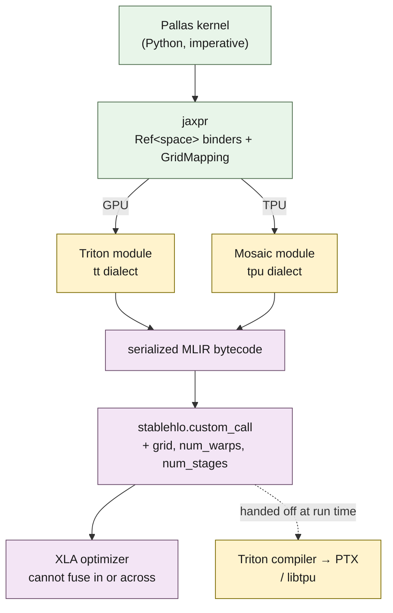
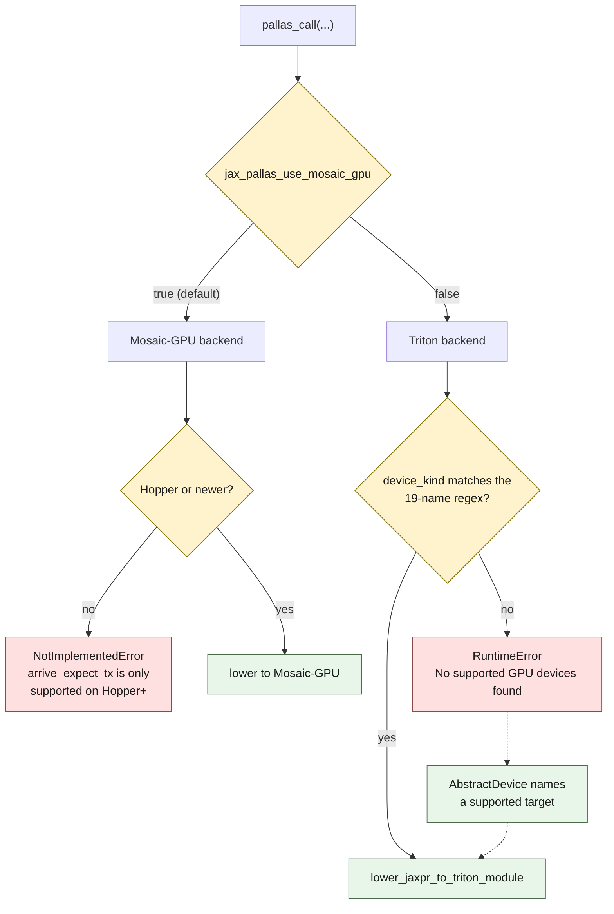

This is the last post on the JAX/XLA stack. We went from Python to a jaxpr, from a jaxpr to optimized single-device HLO, and from single-device HLO to a [mesh of devices](). One door left, and it is the one you take when the compiler's automatic decisions are not good enough: writing the kernel yourself. In JAX that door is **Pallas**, and it lowers through two very different backends — Triton on GPU and Mosaic on TPU.[^1]

The motivation is concrete and I raised it in the [XLA review](): XLA fuses at the granularity of HLO ops using a cost model you do not control, and some kernels — flash attention is the canonical one — cannot be expressed as a good fusion at that granularity. When you hit that wall you stop describing *what* to compute and start describing *how*.

Everything below is captured from JAX 0.11.0 on an NVIDIA A10G. That hardware choice turned out to matter more than I expected, and the reason is a section of its own.[^2]

## You write to references, not values

A Pallas kernel does not look like normal JAX. Normal JAX is functional: values in, values out. A Pallas kernel is imperative and operates on **references** — you are handed input and output `Ref`s and you load from and store to them explicitly.

```python
def kernel(x_ref, o_ref):
    o_ref[...] = jnp.maximum(x_ref[...] * 2.0 + 1.0, 0.0)

n, blk = 1024, 256
def f(x):
    return pl.pallas_call(kernel,
        out_shape=jax.ShapeDtypeStruct((n,), jnp.float32),
        grid=(n // blk,),
        in_specs=[pl.BlockSpec((blk,), lambda i: (i,))],
        out_specs=pl.BlockSpec((blk,), lambda i: (i,)))(x)
```

Trace it and the shape of the thing is the whole point:

```text
{ lambda ; a:f32[1024]. let
    b:f32[1024] = pallas_call[
      grid_mapping=GridMapping(grid=(4,), block_mappings=(
        BlockMapping(block_shape=(Blocked(block_size=256),)),
        BlockMapping(block_shape=(Blocked(block_size=256),))))
      jaxpr={ lambda ; c:Ref<default>{f32[256]} d:Ref<default>{f32[256]}. let
          e:f32[256] <- c[...]
          f:f32[256] = mul e 2.0:f32[]
          g:f32[256] = add f 1.0:f32[]
          h:f32[256] = max g 0.0:f32[]
          i:f32[256], d[...] <- d[...], h
        in () }
      interpret=False
      out_avals=(ShapedArray(float32[1024]),)
    ] a
  in (b,) }
```

Look at the inner binders: `c:Ref<default>{f32[256]}`. Not `f32[256]` — a `Ref` to `f32[256]`, tagged with a **memory space**, which is `default` here on GPU. The outer array is `f32[1024]`; inside the kernel you see one 256-element block, because `grid=(4,)` launches four program instances and `BlockSpec` hands instance `i` the `i`-th block. Same grid-of-programs model as CUDA and Triton, because on GPU that is exactly what it becomes.

Then there is the last line:

```text
i:f32[256], d[...] <- d[...], h
```

`o_ref[...] = h` did not lower to a store. It lowered to a **swap** — it binds the old contents of `d` as `i` and writes `h`. Pallas's store primitive returns the previous value whether or not you asked for it, and `i` is then dead. That has a visible consequence downstream, which we will see in the Triton IR in a moment.

## It compiles to a custom call, and that is the trade

When you `jit` a Pallas kernel, XLA does not see inside it:

```text
%0 = stablehlo.custom_call @__gpu$xla.gpu.triton(%arg0)
       {backend_config = "", mhlo.backend_config = {debug = false,
        grid_x = 4 : i32, grid_y = 1 : i32, grid_z = 1 : i32,
        ir = "ML\EFR\0DMLIR24.0.0git\00\015\07\01\05\09\1F...",
        name = "kernel", num_stages = 3 : i32, num_warps = 4 : i32}}
```

The target is `__gpu$xla.gpu.triton`, with the launch grid, warp count, and pipeline depth as attributes. And that `ir = "ML\EFR\0D..."` field is the interesting part: the entire Triton module is carried inside the custom call as **serialized MLIR bytecode**. For this four-line kernel it is 2,141 escaped characters; for the flash-attention kernel later in this post it is 10,000.

That blob is the mechanism behind the optimization barrier I flagged in the review. XLA cannot fuse across the call or optimize inside it, not because of a policy decision but because what it holds is an opaque byte string destined for a different compiler.



The two backends converge on the same shape: whatever dialect your kernel became, it leaves as bytes. You get total control of the kernel body, and in exchange XLA treats it as a black box. Reach for Pallas when a kernel is worth more hand-optimized than auto-fused with its neighbours, and not before.

## The GPU backend: Triton

On GPU, Pallas lowers to Triton. Dump the lowered module and the `relu(2x+1)` kernel comes out as, trimmed:

```text
%4  = tt.make_range {end = 256 : i32, start = 0 : i32} : tensor<256xi32>
%6  = arith.addi %4, %5 : tensor<256xi32>
%10 = tt.splat %arg0 : !tt.ptr<f32> -> tensor<256x!tt.ptr<f32>>
%11 = tt.addptr %10, %9 : tensor<256x!tt.ptr<f32>>, tensor<256xi32>
%12 = tt.load %11 : tensor<256x!tt.ptr<f32>>
%14 = arith.mulf %12, %13 : tensor<256xf32>
%16 = arith.addf %14, %15 : tensor<256xf32>
%18 = arith.maxnumf %16, %17 : tensor<256xf32>
%27 = tt.addptr %26, %25 : tensor<256x!tt.ptr<f32>>, tensor<256xi32>
%28 = tt.load %27 : tensor<256x!tt.ptr<f32>>
      tt.store %27, %18 : tensor<256x!tt.ptr<f32>>
      tt.return
```

That is the `tt` dialect — `tt.make_range`, `tt.splat`, `tt.addptr`, `tt.load`, `tt.store` — with the arithmetic in `arith`. Pointers are typed (`!tt.ptr<f32>`) and vectorized into `tensor<256x!tt.ptr<f32>>`, which is Triton's whole idea: you write block-at-a-time code and the compiler assigns threads. From here it goes through the Triton compiler to PTX, which I covered end to end in the [Triton deep-dive]().

Now find `%28`. It loads from `%27` — the *output* pointer — immediately before storing to it. Nothing in the kernel reads the output. That load is the swap from the jaxpr, faithfully lowered: Pallas asked for the old value, nobody used it, and it survived into the Triton IR as a dead read of the destination. Triton's own DCE may or may not remove it depending on aliasing assumptions. It is a small thing, and it is the kind of small thing that shows up as unexplained memory traffic in a profile.

## Getting this to run at all

Here is where the hardware choice stopped being incidental. On an A10G — the GPU in every AWS `g5` instance — that kernel does not run. Both backends refuse it, for two unrelated reasons, and the shape of the dispatch is worth having in front of you:



An A10G takes the left branch to `F1`, then the right branch to `F2`. Both failures, two different subsystems, neither of them about what the silicon can do.

The default GPU backend in current JAX is not Triton, it is Mosaic-GPU, and Mosaic-GPU targets Hopper:[^3]

```text
NotImplementedError: arrive_expect_tx is only supported on Hopper+ hardware
```

Fine — that is a documented limitation, and the fix is to ask for Triton with `jax.config.update("jax_pallas_use_mosaic_gpu", False)`. Which produces:

```text
RuntimeError: No supported GPU devices found, please specify an abstract GPU
device using AbstractDevice. See jax.sharding.use_abstract_mesh method for
example.
```

On a machine with a working, CUDA-enabled `jax` that reports `[CudaDevice(id=0)]`. The Triton backend resolves hardware by matching the device's name string against a hardcoded regex of nineteen GPU names, and if that fails it raises.[^4] So:

```python
"NVIDIA A10G"            -> NO MATCH
"NVIDIA A10"             -> NVIDIA A10
"NVIDIA A100-SXM4-40GB"  -> NVIDIA A100
"NVIDIA H100 80GB HBM3"  -> NVIDIA H100
```

The allowlist contains `NVIDIA A10`. The device reports `NVIDIA A10G`. The pattern is anchored with `\b`, and the `G` is a word character, so the boundary fails and the A10G matches nothing. The A100 and H100 match fine because what follows their names is a `-` or a space.

Nothing about this is a judgement on the hardware, and the reason is visible in the order of operations. The `get_gpu_info()` call that raises sits *above* `lower_jaxpr_to_triton_module` in the same function — the name lookup fails and the exception propagates before Triton is handed the kernel at all.[^4] No Triton compilation was attempted, so nothing was concluded about what the chip can do. It is one letter falling on the wrong side of a word boundary in a device-name table, on one of the most widely deployed cloud GPUs there is.

The error message names the way out, and it is a genuinely good one: `AbstractDevice` lets you lower for a GPU you do not have.

```python
dev = AbstractDevice(device_kind="NVIDIA H100 80GB HBM3",
                     num_cores=None, platform="cuda")
with use_abstract_mesh(AbstractMesh((1,), ("d",), abstract_device=dev)):
    print(jax.jit(f).lower(x).as_text())
```

Every Triton excerpt in this post came out of that, lowered for an H100 on Ampere silicon. Which is a fair thing to do for reading IR and an unfair thing to do for claiming performance, so I have not claimed any.

## Developing without the hardware

Lowering for a GPU you do not have gets you IR to read. It does not get you a kernel you can test, and the obvious question is how anyone writes Pallas without first acquiring the right accelerator. The answer is `interpret=True`, and it is better than it sounds:

```python
pl.pallas_call(kernel, out_shape=..., interpret=True)(x)
```

That runs the kernel body in JAX itself — no Triton, no Mosaic, no GPU. The grid becomes a loop, the `Ref`s become arrays, and the whole thing executes on CPU and produces the right numbers. I checked this on a machine reporting `[CpuDevice(id=0)]` and nothing else: the same four-instance `relu(2x+1)` kernel returns `[1. 3. 5. 7.]` for the first four elements, all 1024 match, and the jaxpr is unchanged — still `Ref<default>{f32[256]}` binders under a `GridMapping(grid=(4,))`.

So the front-end semantics — indexing, block mapping, the grid, whether your `index_map` computes the tile you think it does — are all debuggable with no hardware in the loop. What interpret mode cannot tell you is anything you actually bought the accelerator for: whether your tiles fit in fast memory, whether the DMAs overlap the compute, whether the memory space you picked was the right one. It checks that your kernel is *correct*, never that it is *fast*.

That split is a fair description of what this layer costs. Pallas moves the correctness question onto your laptop and leaves the performance question on hardware you have to go and get — and, as the previous section shows, hardware that JAX has to recognise by name.

## The TPU backend: Mosaic

On TPU, Pallas lowers to Mosaic, and this is where the `Ref<space>` tag stops being decorative. On GPU the space was `default`. The TPU has a genuinely partitioned memory hierarchy for the tag to range over — `VMEM`, `SMEM`, `HBM`, `SemaphoreMem` and more, eight in total in the Mosaic dialect's enum,[^5] which I went through in [the TPU post]().

The idiom of a TPU kernel follows from that. DMA a tile from `HBM` into `VMEM`, wait on its semaphore, compute in the vector unit, DMA the result back, and double-buffer so the next tile's transfer overlaps this tile's compute. Mosaic exposes all of it as ops, and the difference between `VMEM` and `HBM` on a `Ref` is the difference between a fast local access and an off-chip transfer — which is to say, between a fast kernel and a broken one.

I have not run any of this. There is no TPU in the loop for this post, and unlike the Hopper case there is no `AbstractDevice` trick that would produce trustworthy Mosaic output for hardware I do not have. Everything I say about the TPU side comes from reading the dialect definitions, and the contrast with the GPU side — where I can show you real captured IR — is itself informative about which of these two backends is easy to get your hands on.

## Flash attention, the reason the door exists

Put it together on the kernel that motivated all of this. JAX ships a reference multi-head attention Pallas kernel, and its signature is a real tiled flash-attention implementation:[^6]

```python
mha(q, k, v, segment_ids, sm_scale=1.0, causal=False,
    block_sizes=BlockSizes(block_q=128, block_k=128,
                           block_q_dkv=32, block_kv_dkv=32,
                           block_q_dq=32, block_kv_dq=32),
    backward_pass_impl='triton', num_warps=None, num_stages=2,
    grid=None, interpret=False, debug=False, return_residuals=False)
```

`block_q=128`, `block_k=128` are the query/key tiles that keep the working set in fast memory; the six block sizes exist because the forward pass and the two backward passes (`dkv`, `dq`) tile differently. Compile it on `q,k,v` of shape `(2, 512, 4, 64)` in FP16 and the *entire* attention — the QKᵀ, the online softmax, the PV — comes out as one call:

```text
%0 = stablehlo.custom_call @__gpu$xla.gpu.triton(%arg0, %arg1, %arg2)
       {mhlo.backend_config = {grid_x = 4 : i32, grid_y = 2 : i32,
        grid_z = 4 : i32, name = "mha_forward",
        num_stages = 2 : i32, num_warps = 4 : i32}}
```

Three operands in, one out. The grid decodes exactly: `grid_x = 4` is the sequence dimension, 512 divided by `block_q` of 128; `grid_y = 2` is the batch; `grid_z = 4` is the heads. One program instance per (query tile, batch element, head), each streaming the whole key/value sequence through fast memory and never materializing the 512×512 attention matrix.

That is the payoff of the layer. The pattern XLA could not fuse at HLO granularity becomes a single kernel once you write it yourself, tiled the way the algorithm needs.

## What four levels of this stack actually did

I started this series expecting to end on a clean complaint, and I want to state plainly that it did not survive contact with the code.

The plan was to show that the stack models more of the machine at every level — shape, then layout, then placement, then memory space — and never puts *any* of it in the type, so every hardware mismatch surfaces as a pass failure or a runtime error instead of a type error at the line you wrote. Four levels, same shape of gap, and the gap is the opening.

Two of those four turned out to be wrong, and I found out by checking rather than by remembering:

- **Tracing.** I expected shape and dtype only. `ShapedArray` in current JAX declares `sharding` and `memory_space` alongside them, and an aval prints as `float32<host>[8@x,16@y]`.
- **Sharding.** I expected a `PartitionSpec` hanging off a value, checked by a propagator. What is actually there is `ShardingTypeError`, raised from 53 sites in `core.py` during tracing, plus a second placement type inside `shard_map` that tracks which mesh axes a value varies over and which reductions it still owes.

So the honest version of the series conclusion is not "nobody puts hardware in the type." It is that the line moved twice in about a year, while I was not looking, and the direction is consistent:

| Level | What it models | Where it lives now |
|---|---|---|
| Tracing | shape, dtype, **sharding, memory space** | in the aval |
| XLA | physical layout (`{1,0}`, tiling) | in the HLO shape |
| Sharding | placement over a named mesh | **in the type**, trace-time checked |
| Pallas | memory space | a `Ref<space>` attribute, verifier-checked |

Pallas is the level where it has *not* moved. The memory space on a `Ref` is an attribute the Mosaic verifier consumes at lowering. Put a buffer in the wrong space and you learn about it from a verifier, not from the language declining to compile the line you wrote. And divisibility — whether a dimension actually splits across the mesh axis you assigned it — is still a plain `ValueError` from `device_put` at every level.

Which is a much more interesting position than the one I set out to argue. Not "the type system ignores the hardware," but: the boundary between what a type carries and what rides alongside it moved twice, under commercial pressure, without anyone calling it a language-design project — and the remaining holdouts are memory space and shape arithmetic. Nobody drew that boundary on principle. It sits where the last expensive bug pushed it.

Whether the last step is worth taking on purpose — making memory space and hardware topology first-class types, with placement as a static obligation rather than an inferred annotation — is a real and hard language-design question, and now a much better-posed one than when I started. That is a subject for its own writing.

## References

[^1]: **JAX Pallas.** The kernel language: `pallas_call`, `BlockSpec` and grid, `Ref`-based memory, and the Triton (GPU) and Mosaic (TPU) backends. ([Link](https://docs.jax.dev/en/latest/pallas/index.html))

[^2]: **Reproduction environment.** JAX 0.11.0 with CUDA jaxlib on an NVIDIA A10G (compute capability 8.6), driver 595.71.05, CUDA 13.2, Ubuntu 24.04. Jaxprs are from `jax.make_jaxpr`; StableHLO from `jax.jit(...).lower(...).as_text()`; Triton modules from the same lowering with `debug=True`. All Triton output was lowered for an abstract `NVIDIA H100 80GB HBM3` target via `jax.sharding.AbstractDevice`, for the reason described in the text — it was assembled, not executed, so no performance claim is made from it. Nothing in this post ran on a TPU. ([Link](https://pypi.org/project/jax/0.11.0/))

[^3]: **Pallas GPU backends.** The Triton backend and the newer Mosaic-GPU backend, and backend selection via `jax_pallas_use_mosaic_gpu`. ([Link](https://docs.jax.dev/en/latest/pallas/gpu/index.html))

[^4]: **The Pallas Triton device allowlist.** `jax/_src/pallas/triton/gpu_info.py` in JAX 0.11.0 resolves hardware by matching `device_kind` against a regex of nineteen names — `NVIDIA A10|A30|A100|H100|H200|GH200|B200|GB200|B300|GB300|GB10|L4|L40|Tesla T4|GeForce RTX 4090|RTX PRO 4500|RTX PRO 5000|RTX PRO 6000|Thor` — anchored with `\b` at both ends, with an empty fallback `registry` dict. A non-matching name raises from `pallas_call_registration.py:107`. In that same function the `try: gpu_info = gpu_info_lib.get_gpu_info()` block precedes the `lower_jaxpr_to_triton_module(...)` call, so the lookup failure short-circuits before any Triton lowering is attempted. ([Link](https://github.com/jax-ml/jax/tree/main/jax/_src/pallas/triton))

[^5]: **Mosaic TPU dialect.** The MLIR dialect Pallas TPU kernels lower to, defining the TPU memory spaces and the vector-unit ops. This is the source of every TPU claim in this post; none of it was executed. ([Link](https://github.com/jax-ml/jax/tree/main/jaxlib/mosaic/dialect/tpu))

[^6]: **Pallas flash attention.** The reference multi-head attention kernel in `jax.experimental.pallas.ops.gpu.attention`, including the `BlockSizes` defaults quoted above. ([Link](https://github.com/jax-ml/jax/blob/main/jax/experimental/pallas/ops/gpu/attention.py))

---

*Disclaimer: Researched and drafted with AI assistance (Gemini 3.1 Pro, Claude Opus 4.8 and Opus 5). Direction, technical judgment, and final edits are mine; every claim is traceable to the sources cited above.*
