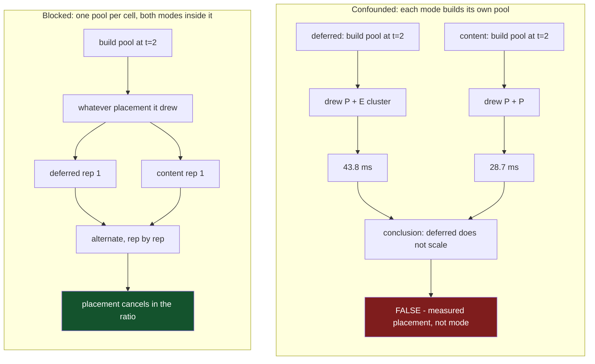

In September I am presenting a session at CppCon that challenges conventional frontend design: "Escaping the AST: A Data-Oriented, Lock-Free Parallel Compiler Architecture."[^0]

The core thesis requires a structural shift. By abandoning traditional pointer-chasing ASTs in favour of representing the program as flat, contiguous arrays of bit-packed global identifiers, and by deferring name resolution to a later pass, we eliminate the lock contention that throttles semantic phases. The result is an architecture that scales across available cores.

Making throughput claims about concurrent compiler pipelines to a room full of systems experts demands empirical proof. With the conference approaching, I set out to gather the multi-core scaling benchmarks for the lock-free design I have been building in Vx. The objective was to quantify speedups a strictly data-oriented infrastructure should obviously deliver.

I spent two days explaining a result that did not exist.

The frontend interns types two ways. Deferred interning gives every worker a private arena and reconciles at a barrier. Content-addressed interning hashes the structure, so identity is final the moment a type is minted and no reconciliation is needed. Both emit byte-identical MLIR. The only open question was throughput, and the benchmark answered it:

| threads | deferred | content | ms deferred / content |
|---|---|---|---|
| 1 | 1.00 | 1.00 | 44.0 / 45.6 |
| 2 | **1.01** | 1.59 | **43.8** / 28.7 |
| 3 | 1.80 | 1.93 | 24.5 / 23.6 |
| 4 | 2.19 | 2.34 | 20.1 / 19.5 |

Deferred gained nothing from a second core. Content gained 1.59x. At one thread deferred was *faster*, so this was not a constant-factor loss hiding in arena allocation — it was a specific failure to convert the second core into throughput, which is exactly the vulnerability a barrier-based design is supposed to have. The story wrote itself.

I even had a mechanism. Deferred hands each worker private slow-path arenas, allocating per-function `Vec`s that content never creates, and malloc contention is thread-count sensitive. Plausible. Testable. Wrong.

Every number in that table is real. I can reproduce all of them. The finding is false.

## This failure has a name, and a literature

The interesting part is not that I got it wrong. It is that I got it wrong while doing everything the standard methodology asks for.

Fifteen repetitions per cell. Medians rather than means. Three separate whole-run repeats. The interquartile range inside every cell was under 2% — one cell ran 30.00 to 30.33 ms, another 49.54 to 50.92 ms. By every convention I had absorbed in ten years of benchmarking on x86 Linux, that is a clean measurement.

It is a clean measurement of the wrong thing, and the phenomenon has been named since 2009. Mytkowicz, Diwan, Hauswirth and Sweeney called it **measurement bias**: an innocuous-looking aspect of the experimental setup that biases the result enough to overstate an effect or invert a conclusion.[^1] Their examples were almost comically mundane — the size of your UNIX environment, the link order of your object files — and their headline result is the one worth sitting with. In a survey of 133 papers from ASPLOS, PACT, PLDI and CGO, they found *one* that adequately considered measurement bias.

Hoefler and Belli reached the same place from the HPC side six years later, surveying 120 papers across three conferences and concluding it was frequently impossible to tell whether a reported improvement was deterministic or observed by chance.[^2]

So the field has known for fifteen years that the standard toolkit does not defend against this class of error. What it has not absorbed is that asymmetric cores turn this class of error from an accident of your link order into the default condition of your machine.

## Why every defense I had failed

Look at what the standard defenses actually assume.

Repetitions, medians, trimmed means, confidence intervals — every one of these assumes samples are **exchangeable**: independent draws from a single population, where ordering carries no information. Under that assumption more samples buy precision, and dispersion tells you how much to trust the centre.

Thread placement violates the assumption at the root. Which cores my pool landed on was decided once, when the pool was constructed, before the first repetition ran, and every subsequent sample inherited it. I did not have fifteen draws from one population. I had one draw from a placement lottery, followed by fifteen confirmations of it.

The evidence is unambiguous once you stop comparing the two modes to each other and measure each alone, one mode per process. Same binary, same corpus, same configuration.

`--modes content`, three processes:

| process | t=1 | t=2 | t=4 |
|---|---|---|---|
| A | 44.12 | **30.13** | 20.06 |
| B | 45.40 | **50.03** | 21.24 |
| C | 46.03 | **50.66** | 20.23 |

And `--modes deferred`, four processes at t=2: 57.46, 32.89, 31.16, 51.74.

Two clusters, in both modes. The bimodality follows the *process*, not the mode.

Now trace what each defense does to that data. Repetitions sample the same cluster fifteen times. The median reports that cluster's centre with excellent precision. Outlier rejection is actively harmful — there are no outliers, there are two populations, and trimming makes each look more trustworthy than it is. The confidence interval is worst of all, because it will be tight, and tightness reads as rigour.

A confidence interval describes dispersion around your estimate. It is silent on whether your estimate is of the quantity you think it is.

## The machine underneath

The host is an Apple M4, and `sysctl` will tell you it is not symmetric:

```console
$ sysctl -n hw.nperflevels hw.ncpu
2
10

$ sysctl -n hw.perflevel0.name hw.perflevel0.physicalcpu \
         hw.perflevel1.name hw.perflevel1.physicalcpu
Performance
4
Efficiency
6
```

Four performance cores, six efficiency cores. Ten "CPUs" that are not interchangeable in any sense a speedup table cares about.

The caches diverge further than most people expect:

```console
$ sysctl -n hw.perflevel0.l1icachesize hw.perflevel0.l1dcachesize hw.perflevel0.l2cachesize
196608      # 192 KB L1i
131072      # 128 KB L1d
16777216    #  16 MB L2, shared across the P cluster

$ sysctl -n hw.perflevel1.l1icachesize hw.perflevel1.l1dcachesize hw.perflevel1.l2cachesize
131072      # 128 KB L1i
65536       #  64 KB L1d
4194304     #   4 MB L2, shared across the E cluster
```

A thread landing on an E-core gets a quarter of the L2 and half the L1d. A working set tuned against the P-cluster's 16 MB does not run slightly slower there; it runs a different algorithm's worth of cache misses.

Running the compiler's thread ladder from 1 to 10 gives the shape of the machine directly:

| threads | speedup | gain from the added thread |
|---|---|---|
| 1 | 1.00 | — |
| 2 | 1.47 | +0.47 |
| 3 | 1.88 | +0.41 |
| 4 | 2.24 | +0.36 |
| 5 | 2.39 | +0.15 |
| 6 | 2.54 | +0.15 |
| 8 | 2.84 | +0.075 |
| 10 | 2.92 | +0.04 |

The knee lands exactly on 4, which is `hw.perflevel0.physicalcpu`. Each of the first four threads is worth about 0.4 of a speedup unit; each of the next two is worth 0.15. An E-core contributes roughly **0.37 of a P-core** on this workload, falling under 0.15 by threads nine and ten.

That is the number that makes the bug arithmetic rather than mysterious. A two-thread pool drawing one P-core and one E-core has throughput near 1.37 units instead of 2, stretching wall clock by about 1.7x — very close to the gap I had attributed to a reconciliation barrier.

## The fix in the literature does not work here

The known remedy for measurement bias is randomization, and its sharpest implementation is STABILIZER.[^3] Curtsinger and Berger observed that code and data *layout* biases every run — caches and branch predictors make performance depend on the exact placement of code, stack frames and heap objects — and that this bias is fixed for the life of a process, which is precisely what defeats classical statistics. Their fix is to re-randomize layout repeatedly during execution. Layout effects then become Gaussian noise instead of a constant offset, and ANOVA becomes legitimate again.

The payoff is a result worth remembering: with layout randomized, the impact of LLVM's `-O3` over `-O2` on SPEC CPU2006 is **indistinguishable from noise**. A great many published optimization wins were measuring layout.

That logic applies exactly to my problem. Placement is a per-process constant that biases every sample. Randomize it and the bias becomes noise; repetitions and medians start working again.

You cannot randomize it. That part is specific to this machine, and it is not a gap in my tooling.

The Mach thread affinity API still exists, still compiles, still links, and refuses:

```c
// The affinity API that works on an Intel Mac.
thread_affinity_policy_data_t pol = { .affinity_tag = 1 };
kern_return_t kr = thread_policy_set(mach_thread_self(),
                                     THREAD_AFFINITY_POLICY,
                                     (thread_policy_t)&pol,
                                     THREAD_AFFINITY_POLICY_COUNT);
```

```console
thread_policy_set(THREAD_AFFINITY_POLICY) = 46 ((os/kern) service not supported)
```

46 is `KERN_NOT_SUPPORTED`. XNU is candid about why — `thread_policy_set` gates the affinity case on a predicate[^4], and the predicate is a one-liner[^5]:

```c
boolean_t
thread_affinity_is_supported(void)
{
	return ml_get_max_affinity_sets() != 0;
}
```

Affinity sets were an Intel-era mechanism for grouping threads onto a shared L2. Apple Silicon returns zero. There is no supported way to say "run this thread on core 3", by design, because the scheduler owns placement so it can manage power.

What you get instead is Quality of Service: a declaration of intent from which the OS infers placement.[^6] I measured what that buys on an idle M4, verifying with `qos_class_self()` that each request took effect:

```console
USER_INTERACTIVE  rc=0 requested=33 effective=33     310.9 ms
DEFAULT           rc=0 requested=21 effective=21     294.8 ms
UTILITY           rc=0 requested=17 effective=17     298.6 ms
BACKGROUND        rc=0 requested=9  effective=9      300.8 ms
```

Every request succeeded. None changed anything. On an idle machine the scheduler has four P-cores available and hands you one regardless of how modestly you asked — so QoS cannot force a thread onto an E-core for testing, and a successful `pthread_set_qos_class_self_np` tells you nothing about where you landed.

Then run the same binary under a background task policy:

```console
$ taskpolicy -b ./probe2
USER_INTERACTIVE  rc=0 requested=33 effective=33    1054.9 ms
DEFAULT           rc=0 requested=21 effective=21    1094.4 ms
UTILITY           rc=0 requested=17 effective=17    1119.1 ms
BACKGROUND        rc=0 requested=9  effective=9     1115.9 ms
```

Between 3.4x and 3.7x slower. `taskpolicy -b` applies `PRIO_DARWIN_BG`, which maps to the Background QoS class and confines the process to efficiency cores.[^7] Read the first row again: a thread that explicitly requested `QOS_CLASS_USER_INTERACTIVE`, successfully, still ran at E-core speed. **Thread QoS is clamped by the inherited task policy, and the thread cannot observe the clamp** — `qos_class_self()` reports 33 either way.

That is the operational hazard, and it has nothing to do with compilers. A CI agent, an IDE build task, a `launchd` job with a low-priority key, a shell inherited from something already demoted — any of these silently applies a 3.6x offset your program cannot detect and your results table does not record. When a macOS benchmark number moves and your code did not, check the launching context before you check anything else.

## Block what you cannot randomize

If randomization is unavailable, the remaining tool is older than computing: **blocking**, from Fisher's design of experiments. You cannot eliminate the nuisance variable, so you arrange for it to affect both treatments identically, and it cancels in the comparison.



The old harness ran each mode's entire thread ladder end to end: two ladders, two pools, two independent draws from the placement lottery. Whichever mode drew the efficiency cores at `t=2` looked like it could not use a second core.

The new one builds **one pool per cell** and runs both modes inside it, alternating repetition by repetition. Whatever placement that pool drew, both modes drew it. The nuisance variable is still there and still large — it just stopped varying between the things being compared.

| threads | deferred | content | speedup |
|---|---|---|---|
| seq | 99.5 | 99.1 | 1.00 |
| 1 | 99.7 | 99.3 | 1.00 |
| 2 | 69.0 | 68.9 | 1.44 |
| 4 | 43.1 | 43.2 | 2.30 |
| 8 | 33.9 | 33.4 | 2.95 |

Within 1% at every thread count. There is no anti-scaling and there never was.

Two guards now sit in the harness so this cannot recur quietly. A row slower than a row with *fewer* threads is flagged `SUSPECT`, because more workers cannot lengthen the same work and a table saying otherwise is measuring the machine. And `--modes` accepts a single mode, so one process measures one treatment and reversing the order is a second run — which makes "does this effect follow the mode or its position in the run" decidable instead of assumed.

Any A/B harness that runs A's full sweep and then B's full sweep has confounded the comparison with time: thermal state, background daemons, page-cache warmth, and here, cluster placement. Interleave, or you are comparing two experiments rather than two treatments.

## The harness lied a second time, about something else

Placement is the Apple-specific failure. The other one is not, and it is the more broadly useful of the two.

An earlier revision of the benchmark's README carried a published scaling table. Those numbers are withdrawn, because they were taken against a frontend that built a `TransferCostGraph` per *function* and ran an all-pairs shortest-path precompute twice for each one. A profile eventually put that at the top of the entire compiler by self time. Deleting it cut wall clock by 2.35x at one thread.

So far, an ordinary optimization story. Here is the part that matters:

**Removing that work made the measured parallel scaling worse** — across 8 threads the curve fell from 2.9x to 2.67x.

Nothing regressed. The compiler got 2.35x faster. But the deleted work sat *inside* the parallel region and scaled beautifully, since all-pairs shortest path over a per-function graph is embarrassingly parallel and touches no shared state. It was inflating the numerator of every speedup ratio while contributing nothing any user wanted.

Amdahl's law is a statement about the serial *fraction*, and you can always improve a fraction by padding its denominator with garbage. Every unnecessary parallel-friendly computation in your pipeline buys scaling numbers you have not earned, which means profiler-guided cleanup makes your speedup graph look worse as your compiler gets better. If you optimise and your scaling curve improves, check whether you deleted serial work or merely added parallel work.

Two smaller traps from the same harness, both of which produced wrong numbers before they were caught. The parse phase opened its per-module closure with a `println!` inside a rayon parallel-for; `println!` takes the global stdout lock, so every worker serialised on it once per module — 512 lock acquisitions per repetition at the largest cell, inside the region whose scaling was being measured. Profile that and you get contention correctly reported on stdout rather than on the thing you are studying. Separately, the generated corpus is cached in a directory named by a digest of its parameters, so changing the generator without bumping its version constant leaves every cached corpus looking current, and the next run compiles the *old* programs while faithfully reporting the *new* flags.

## This is about to be everyone's problem

It would be comfortable to file this under Apple eccentricity. That is not where it is going.

Intel shipped hybrid x86 with Alder Lake and built Thread Director to manage it — hardware telemetry that reports each core's performance and energy efficiency to the OS as values on a 0–255 scale, so the scheduler can place threads accordingly.[^8] Windows 11 consumed it first; Linux support landed in 5.18. ARM has shipped big.LITTLE and DynamIQ for over a decade. The asymmetric machine is now the mainstream machine, across all three major ISAs.

The scheduling model came with it, and it is the same everywhere: **the OS owns placement, the application gets a hint at best, and nobody gets a guarantee.** That is a defensible decision. Placement is entangled with power, thermals and foreground responsiveness, and an application demanding core 3 does not know what else the machine is doing. But it means the property your measurement depends on is decided by a component you cannot query, cannot pin, and cannot reproduce across runs.

Set the benchmarking canon against that. Repetitions, medians, confidence intervals — the whole apparatus assumes exchangeable samples from one population, and every one of those techniques was developed on machines whose cores were interchangeable. That assumption is now false on a laptop, false on a phone, and false on a growing share of servers. Almost none of the tooling has been updated to say so.

Which leaves the rule I now apply to anything measured on this machine:

**Ratios between two treatments on one machine survive core heterogeneity. Absolute scaling curves do not.**

A blocked A/B inside a single pool cancels placement, so "deferred versus content" is answerable here. "This compiler achieves 2.92x on ten threads" is not, and no amount of care in the harness will make it so — the last six of those threads are cores worth roughly a third of the first four, and 4→8 threads gaining 31% describes what happens when you add four weak cores, not how parallel the code is. That number needs homogeneous hardware before anyone quotes it, mine included.

A corollary worth internalising: `std::thread::available_parallelism()` returns 10 here, matching `hw.ncpu`, and `rayon` sizes its global pool from exactly that.[^9] The default pool on this machine is ten threads — four good ones and six worth about 0.37 each. That default is not merely suboptimal. Its composition changes the answer your benchmark gives, chosen by a function with no way to know the difference.

## The part I keep coming back to

The retracted claim was not small. I had argued that content-addressed identity earned its complexity partly because it parallelised better. That performance argument was mine, and it was wrong. The design argument survives without it and never needed it: with content addressing, identity is final at mint time, so there is no barrier, no patch pass, and determinism holds across any scheduling, partitioning, worker count or process boundary. Reproducible builds are the point. "And it is faster" was a bonus I invented from a scheduling artifact.

It was also two weeks from being a slide. The table at the top of this post is exactly the artifact that ends up projected at a conference — a clean grid, a plausible mechanism, a design lesson falling out of it — and once a conclusion reaches a few hundred people, the retraction never catches up.

The judgement failure is worth separating from the harness bug, because only one of them is fixed by code. The entire regression sat in `codegen`, a phase that runs after the type stream is extracted, never touches the interner, and got *slower with more threads*. Meanwhile `dedup_barrier` — the phase where deferred interning does its reconciliation, the whole theoretical objection to the design — measured 0.3 ms against a 35 ms gap. I wrote a note to myself that this was "odd, worth measuring before believing", and went on believing it. When your proposed mechanism cannot reach the phase where the cost lands, you do not have a mechanism. You have a coincidence with a story attached.

There is a larger version of this that I did not expect to find at the bottom of a benchmarking bug. An M4 is the *friendliest* heterogeneous machine that exists: one ISA, one cache-coherent address space, one operating system scheduler, cores differing only in width and clock. Placement is still invisible, still unpinnable, and still capable of inverting a conclusion while every statistic looks healthy.

Now attach a GPU, where the cores differ in ISA, the memory is not coherent, and placement is decided partly by a driver and partly by you. We have treated "where does this run" as a runtime concern for forty years, on the assumption that the answer either does not matter much or can be recovered by measurement. On a machine whose cores are not interchangeable, it matters, and measurement is the first thing it corrupts.

---

## References

[^0]: **"Escaping the AST: A Data-Oriented, Lock-Free Parallel Compiler Architecture."** CppCon 2026, Monday 14 September 2026, 3:15pm MDT. ([Session page](https://cppcon2026.sched.com/event/2RT4Y/escaping-the-ast-a-data-oriented-lock-free-parallel-compiler-architecture))

[^1]: **Mytkowicz, Diwan, Hauswirth and Sweeney, "Producing Wrong Data Without Doing Anything Obviously Wrong!"** ASPLOS 2009. Demonstrates that mundane setup details — UNIX environment size, object file link order — introduce measurement bias large enough to invert conclusions, across multiple architectures and compilers. Their survey of 133 papers from ASPLOS, PACT, PLDI and CGO found one that adequately considered it. Proposes causal analysis for detection and setup randomization for avoidance. ([ACM DL](https://dl.acm.org/doi/10.1145/1508284.1508275), [PDF](https://sape.inf.usi.ch/publications/asplos09))

[^2]: **Hoefler and Belli, "Scientific Benchmarking of Parallel Computing Systems: Twelve Ways to Tell the Masses When Reporting Performance Results."** SC 2015. A stratified sample of 120 papers across three conferences found it frequently impossible to determine whether a reported improvement was deterministic or observed by chance; proposes reporting and experimental-design guidelines. ([ACM DL](https://dl.acm.org/doi/10.1145/2807591.2807644), [PDF](https://htor.inf.ethz.ch/publications/img/hoefler-scientific-benchmarking_aachen.pdf))

[^3]: **Curtsinger and Berger, "STABILIZER: Statistically Sound Performance Evaluation."** ASPLOS 2013. Re-randomizes code, stack and heap layout during execution so layout effects become Gaussian and ANOVA applies. Under randomized layout, the impact of LLVM's `-O3` over `-O2` on SPEC CPU2006 is indistinguishable from noise. ([ACM DL](https://dl.acm.org/doi/10.1145/2451116.2451141), [PDF](https://people.cs.umass.edu/~emery/pubs/stabilizer-asplos13.pdf))

[^4]: **XNU `thread_policy_set`, `THREAD_AFFINITY_POLICY` case.** Returns `KERN_NOT_SUPPORTED` when `thread_affinity_is_supported()` is false. ([`osfmk/kern/thread_policy.c`](https://github.com/apple-oss-distributions/xnu/blob/main/osfmk/kern/thread_policy.c))

[^5]: **XNU `thread_affinity_is_supported()`.** Defined as `ml_get_max_affinity_sets() != 0`; the file notes affinity sets are not used on platforms with a single processor set. ([`osfmk/kern/affinity.c`](https://github.com/apple-oss-distributions/xnu/blob/main/osfmk/kern/affinity.c))

[^6]: **Prioritize Work with Quality of Service Classes**, and Apple's note on asymmetric multiprocessing describing QoS as the mechanism by which the OS places threads on P or E cores. Apple does not document a fixed QoS-to-core mapping. ([QoS guide](https://developer.apple.com/library/archive/documentation/Performance/Conceptual/EnergyGuide-iOS/PrioritizeWorkWithQoS.html), [P/E core note](https://developer.apple.com/news/?id=vk3m204o))

[^7]: **`PRIO_DARWIN_BG` and efficiency-core confinement.** Discussed in the LLVM patch adding `ThreadPriority::Low` and QoS class Utility on macOS, which distinguishes Utility from Background precisely because Background confines the thread to efficiency cores. ([D124715](https://reviews.llvm.org/D124715), and the parallel Ruby discussion at [Feature #17566](https://bugs.ruby-lang.org/issues/17566))

[^8]: **Intel Thread Director.** Hardware telemetry introduced with Alder Lake that reports per-core performance and energy-efficiency values to the OS scheduler on a 0–255 scale so it can place threads across P and E cores. Windows 11 consumed it first; Linux support landed in 5.18. An independent evaluation appeared at APSys '22. ([APSys '22 evaluation](https://pmctrack-linux.github.io/assets/papers/apsys22-saez.pdf), [ACM DL](https://dl.acm.org/doi/abs/10.1145/3546591.3547532))

[^9]: **`std::thread::available_parallelism` and `rayon`.** Rust reports available parallelism without distinguishing core types (10 on this M4), and rayon derives its global pool size from it. ([Rust docs](https://doc.rust-lang.org/std/thread/fn.available_parallelism.html), [rayon `ThreadPoolBuilder`](https://docs.rs/rayon/latest/rayon/struct.ThreadPoolBuilder.html))

---

*Disclaimer: Researched and drafted with AI assistance (Claude Opus 5). Direction, technical judgment, and final edits are mine; every claim is traceable to the sources cited above. The `sysctl`, QoS, `taskpolicy` and affinity measurements were run on the M4 described; the compiler thread ladder and the blocked results come from my own benchmark harness.*
