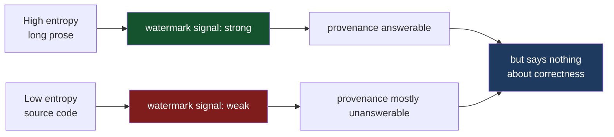

As of this month, Claude watermarks its text output. Anthropic's documentation is direct about the mechanism: for text, "it weaves an imperceptible watermark directly into the text itself. You won't see it, and it doesn't change the meaning, quality, or readability." For files, it attaches signed provenance metadata following the C2PA standard. Models launched on or after 2 August 2026 support marking at launch, and the rollout is worldwide rather than scoped to the EU regime that prompted it.[^1]

I want to take that seriously as a systems fact rather than a policy talking point, because a watermark is not a label attached to a document. It is an intervention in the sampling loop. Something is changing which token gets emitted, and that is a different kind of object from a metadata field.

The interesting question is what happens when the artifact being marked is a program.

## What a token watermark actually does

Anthropic has not published its scheme — the documentation says details on detection mechanisms are coming in "forthcoming technical documentation."[^1] So the honest thing is to reason about the class of schemes rather than assert a specific implementation. The published literature is small and consistent enough to make that worthwhile.

The canonical construction is Kirchenbauer et al.'s green-list watermark.[^2] At each generation step, you hash the preceding token under a secret key, use that hash to pseudorandomly partition the vocabulary into a "green list" (some fraction γ of tokens) and a "red list," and then add a constant δ to the logits of every green token before the softmax:

```python
# 1. Seed a PRNG from the previous token under the watermark key. Deterministic,
#    so a detector holding the key can replay the same partition later.
rng.manual_seed(hash_key * prev_token_id)

# 2. Pseudorandomly split the vocabulary. Green gets gamma of the tokens.
green_ids = torch.randperm(vocab_size, generator=rng)[: int(gamma * vocab_size)]

# 3. Nudge green tokens up before sampling. This is the entire intervention --
#    delta is a bias on the logits, not a filter on the output.
logits[green_ids] += delta
next_token = sample(softmax(logits))
```

Detection needs no model. Re-derive the partition at each position, count how many emitted tokens landed in green, and run a z-test against the γ you would expect by chance. A long enough passage from a watermarked model shows a green fraction far above γ; unwatermarked text does not.

Google's SynthID-Text, the only production system with a peer-reviewed description, replaces the additive bias with tournament sampling: draw several candidate tokens, run them through keyed pairwise tournaments, and emit the winner. Tokens that consistently win see their sampling probability increased, and in one configuration the scheme is *non-distortionary* — the output token distribution matches the unwatermarked model's.[^3]

That word deserves care, because it is where most reasoning about watermarking and code goes wrong.

## "Non-distortionary" is a weaker promise than it sounds

Non-distortionary means the *distribution* is preserved. It does not mean you get the same output.

Sample twice from an unchanged distribution and you get two different programs. Both are legitimate draws. Neither is more likely to be correct than the other, and — this is the part that matters — the model's distribution over programs already contains buggy programs. A watermark that samples faithfully from that distribution has not made your code worse. It has given you a different draw from a bag that always contained bad draws.

So the naive claim — "watermarking injects vulnerabilities into generated code" — is wrong, and I want to dispose of it before building anything on top. A distribution-preserving watermark does not bias generation toward insecure constructs. There is no adversary in the sampler.

The real problem is more structural, and you find it by asking where a watermark can hide.

## Entropy is the whole game

A watermark is a signal smuggled into your choice among tokens. That only works when there *is* a choice.

Kirchenbauer et al. make this explicit in the design of their own scheme. The obvious construction — a "hard" watermark that simply forbids red-list tokens — fails badly: for low-entropy sequences where the next token is nearly deterministic, hard watermarking may prevent the model from producing it at all, degrading output quality.[^2] The soft watermark, with its finite δ, exists precisely so that a sufficiently confident model can still overrule the bias and emit the red token it was going to emit anyway.

Read that as a design constraint and it says something sharp: **a watermark is only free when the model was uncertain.** Where the model is confident, you either corrupt the output or you skip it. Every credible scheme skips it.

The consequence is measured, not merely theoretical. An independent analysis of SynthID-Text notes that "in regions where entropy is low, watermarking is typically less effective, which is also advantageous for the attacker," and reports that all existing methods perform poorly on short text — SynthID-Text reaches only about 0.3 true-positive rate at a 1% false-positive rate on 50-token passages.[^4]

Now hold that next to the shape of source code.

## Source code is a low-entropy artifact with high-stakes tokens

Prose is forgiving because it is redundant. Swap "however" for "but" and the paragraph survives. That redundancy is the entropy the watermark lives in.

Code is not like that. Its distinguishing property is that enormous stretches are nearly deterministic given context, and a large share of the positions where the model *is* confident are exactly the positions that carry the semantics:

```c
// 1. After "for (size_t i = 0; i" the model is close to certain about the
//    next token. It is also the token that decides whether this loop
//    reads one element past the end of the buffer.
for (size_t i = 0; i <= n; i++)      /* '<' vs '<=' -- one token, one overflow */
        dst[i] = src[i];

// 2. Same shape, different failure. Bitwise-and evaluates both sides and
//    drops short-circuiting, so the null check stops protecting the deref.
if (p != NULL & p->len > 0)          /* '&' vs '&&' -- one token, one segfault */
        use(p);

// 3. Overlap-safety is a single identifier. Both compile; one is UB.
memcpy(buf, buf + 4, len);           /* 'memcpy' vs 'memmove' */

// 4. Signedness is one token and changes the comparison's meaning entirely.
int len = get_length();              /* 'int' vs 'size_t' */
if (len < MAX) copy(buf, src, len);  /* negative len passes the check */
```

Each of these is a single-token difference. Each compiles. Each is a well-known CWE. And in each case the surrounding context makes the model quite confident about which token it wants — which is to say, these are precisely the low-entropy positions where a watermark has nowhere to hide.

That gives two horns, and they are not symmetric:

**If a scheme does perturb high-confidence positions,** it can flip a semantically load-bearing token, and in code there is no such thing as a harmless synonym. Well-designed schemes avoid this, which is why the soft watermark exists at all.

**If a scheme does not perturb high-confidence positions** — the correct engineering choice, and what every credible construction does — then it carries almost no signal in code. Not a little less than in prose: qualitatively less, because the low-entropy fraction of a program is so much larger, and because the useful unit of generated code is often a 30-line function rather than a 500-word essay.

The second horn is the true one, and it is worse for the industry than the first.

## The failure mode is institutional, not cryptographic

Put the pieces together. Watermarking is strongest on long, high-entropy, redundant text. It is weakest on short, low-entropy, structured text. Code is short, low-entropy, and structured. So the provenance signal is weakest exactly on the artifact class where the provenance question has real consequences — and it is arriving at the moment when regulation, procurement, and CI pipelines are starting to build policy on top of it.



The vulnerability watermarking introduces into software is a **false negative that reads as a clean bill of health.** "We scanned the PR and found no AI watermark" is not evidence that a human wrote it. For a 40-line function it is barely evidence of anything. Any gate — a compliance checkbox, a provenance audit, a policy that routes flagged code to extra review — inherits a detector whose miss rate on its most important input class is enormous, and inherits it silently.

Four other properties compound it, and they are ordinary security reasoning rather than speculation:

**Scrubbing is trivial for code and hard for prose.** Stripping a watermark from an essay means paraphrasing it, which costs effort and risks meaning. Stripping it from a program means running the formatter. `gofmt`, `black`, `rustfmt`, and `prettier` rewrite whitespace and token layout wholesale; a rename pass changes identifiers; an inliner changes structure. All of these preserve semantics exactly and demolish a token-sequence statistic. Anthropic says the mark "may persist through some editing" and that heavy modification can obscure it.[^1] Normal code hygiene is heavy modification.

**Detection is an oracle, and oracles cut both ways.** Once third-party detection tooling exists — Anthropic says it is coming — anyone who can run it against a repository can label which regions are model-generated. That is a targeting signal. An attacker who knows which subsystems were machine-written knows where to look first, because model-generated code has characteristic weaknesses. Provenance transparency is not free; it tells your adversary something too.

**The key holder can enumerate; nobody else can.** Detection requires the watermark key, and the originator holds it. That asymmetry exists today, before any third-party tooling ships, and it has a consequence worth stating plainly.

A provider already knows what it generated — request logs give you that. What a watermark adds is recognition of your own output *after it has left your infrastructure*: committed to a repository, published in a package, vendored into someone else's tree, pasted into a Stack Overflow answer. That is a categorical extension of reach, not a quantitative one. Logs cover your account boundary; a watermark covers anywhere you can see.

Now suppose a systematic defect is later found in some model's output — a window during which it reliably emitted a weak cipher default, a broken sanitizer, an off-by-one in a common idiom. That is not hypothetical; models have characteristic failure modes and they change between versions. At that moment, the party best positioned to enumerate the blast radius is the party that caused it, and the parties who need to remediate are the ones who cannot. A key that identifies "code generated by model M during window W" is, once W has a known defect, a vulnerability inventory. Whoever holds it holds that inventory — which makes the key a concentrated target for breach, insider abuse, subpoena, or state compulsion, and makes its custody a security property of every downstream codebase.

I am describing a structural property of keyed watermarking, not alleging that anyone scans repositories this way. The entropy argument above also bounds it: if code watermarks weakly, enumeration over code is correspondingly weak, and the same physics that makes the signal a poor assurance tool makes it a poor census. But the direction of the asymmetry is fixed, and it runs against the people holding the liability.

**Spoofing inverts attribution.** A watermark proves a statistical property of a token sequence, not authorship. An adversary who recovers enough of the keyed partition can craft text that carries a passing mark. The interesting abuse is not disguising machine text as human — it is the reverse: laundering deliberately introduced human-written flaws as "just AI output," in a world where that increasingly implies diminished responsibility.

One more possibility I will flag as speculation rather than assert: because the green/red partition is derived deterministically from preceding tokens, an adversary with knowledge of the scheme and key might in principle craft a prefix such that at a chosen decision point the vulnerable token is favoured and the safe one disfavoured. I have not seen a demonstration of this against a deployed system, the δ in a soft watermark is small relative to the model's confidence at exactly the low-entropy positions that would matter, and Anthropic's key is not public. Treat it as a research question, not a finding.

## None of this is the actual problem

Everything above is about whether the watermark works. Suppose it works perfectly. Suppose detection is flawless, scrubbing impossible, spoofing infeasible, and every line of machine-written code in your repository is reliably attributable.

You still know nothing about whether the code is correct.

Provenance and correctness are orthogonal axes, and the industry is in the middle of a large, well-funded, regulation-driven push along the axis that does not carry the risk. A perfect watermark on a buffer overflow tells you a machine wrote the buffer overflow. The overflow is unaffected.

This is not an argument against watermarking. Attribution has real uses — training-data hygiene, disclosure obligations, disputes about authorship. It is an argument against the substitution that is quietly happening: treating a provenance signal as a safety signal because it is the one that has shipped.

## Thompson settled the general case in 1984

The strongest version of this argument is forty-two years old, and it is stronger than anything I have written above.

Ken Thompson's Turing Award lecture, "Reflections on Trusting Trust," opens with the question directly: "To what extent should one trust a statement that a program is free of Trojan horses? Perhaps it is more important to trust the people who wrote the software."[^8] He then builds the attack in three stages, and the payload is a login backdoor:

> The actual bug I planted in the compiler would match code in the UNIX "login" command. The replacement code would miscompile the login command so that it would accept either the intended encrypted password or a particular known password. Thus if this code were installed in binary and the binary were used to compile the login command, I could log into that system as any user.[^8]

A compiler that backdoors `login` would be caught by anyone reading the compiler's source, so the third stage adds a second Trojan aimed at the compiler itself — a self-reproducing program that reinserts both Trojans whenever the compiler is compiled:

> First we compile the modified source with the normal C compiler to produce a bugged binary. We install this binary as the official C. We can now remove the bugs from the source of the compiler and the new binary will reinsert the bugs whenever it is compiled. Of course, the login command will remain bugged with no trace in source anywhere.[^8]

No trace in source anywhere. The source of the compiler is clean. The source of `login` is clean. Every line a reviewer can read is clean, and the system is owned. Thompson's moral is the sentence that should be pinned above every discussion of AI content provenance:

> The moral is obvious. You can't trust code that you did not totally create yourself. (Especially code from companies that employ people like me.) No amount of source-level verification or scrutiny will protect you from using untrusted code.[^8]

Sit with the relationship between that and a watermark. A watermark is a statistical property of a token sequence in the source. It is strictly *weaker* than source-level scrutiny — reading the source at least tells you what the source says. Thompson demolished the entire category of source-level assurance in 1984, and a watermark is a new instrument aimed at the layer he had already shown to be the wrong one.

He also anticipated the generalization, in a line usually left out of the retelling:

> In demonstrating the possibility of this kind of attack, I picked on the C compiler. I could have picked on any program-handling program such as an assembler, a loader, or even hardware microcode. As the level of program gets lower, these bugs will be harder and harder to detect.[^8]

*Any program-handling program.* A code-generating model is now the first program-handling program in the chain — earlier than the compiler, and operating on intent rather than source. That is a new link in exactly the supply chain Thompson was describing, and the industry's response so far is to mark its output and call the problem addressed.

The countermeasure, when one finally arrived, was not better provenance either. David A. Wheeler's diverse double-compiling recompiles the source twice — once with a second, independently produced compiler, then again using the result — so that a subverted binary can be detected by comparison rather than by trust.[^9] The ACSAC 2005 paper gave an informal justification; his 2009 dissertation supplied a formal proof that the technique actually works. The answer to "can I trust this artifact" turned out to require a proof, which is where this was always going.

## Check the artifact, not the author

If Thompson posed the problem, Necula proposed the shape of the answer thirteen years later. Proof-carrying code, from POPL 1997, addressed running a program from an untrusted source: the producer ships the code together with a machine-checkable proof that it satisfies the consumer's safety policy, and the consumer verifies the proof before running it.[^5] The producer's trustworthiness never enters the argument — which is the only way out of Thompson's box, since every alternative reduces to trusting somebody. Checking is cheap, automatic, and independent of who, or what, did the generating.

That is exactly the shape of the problem an LLM creates, and it is why the answer is not better provenance.

There is also a pleasant asymmetry in how LLMs and verifiers fail. A language model is very good at producing a plausible candidate and structurally incapable of guaranteeing anything about it. A verifier is hopeless at producing candidates and extremely good at rejecting wrong ones. Generate-and-check pairs the two along their strengths, and it gets *better* as generation gets cheaper — you can afford to throw away rejected candidates. The bottleneck moves to the specification, which is where you wanted it.

The practical ladder, cheapest first, is more approachable than "formal methods" usually sounds:

**Types.** The formal method you are already running. Making an illegal state unrepresentable is a proof, discharged by the compiler, on every build, at zero marginal cost. A newtype around a length, a non-null pointer type, an enum instead of a bare `int` — each removes a class of the single-token errors above from the space the model can even express. This is the highest-leverage rung and it is routinely skipped because it does not look like verification.

**Contracts and property tests.** Preconditions, postconditions, invariants, and randomized inputs. Not proofs, but they check behaviour rather than provenance, and they cost hours rather than months.

**Bounded model checking.** Tools like Kani for Rust exhaustively check properties up to a bounded depth. Most real bugs — including all four examples above — are shallow.

**Full functional verification.** Dafny, F\*, SPARK Ada, Frama-C/ACSL, Verus and Creusot for Rust. Expensive, and warranted where the cost of being wrong is high.

## The honest cost, and the honest evidence

The strongest empirical case for verification also contains its own caveat, and both come from the same paper.

Yang, Chen, Eide and Regehr spent three years pointing Csmith, a random C program generator, at production compilers, and reported more than 325 previously unknown bugs. "Every compiler we tested was found to crash and also to silently generate wrong code when presented with valid input."[^6] That is the baseline: mature, heavily tested, economically critical software, wrong in ways its authors did not know about.

CompCert, the formally verified C compiler, is the outlier in that study — and the authors are careful about exactly *how* it is an outlier:

> Second, formal verification seldom provides end-to-end guarantees: "details" such as parsers, libraries, and file I/O usually remain in the trusted computing base. This second point is illustrated by CompCert, a verified C compiler. Using Csmith, we found previously unknown bugs in unproved parts of CompCert—bugs that cause this compiler to silently produce incorrect code.[^6]

The bugs were in the parts nobody had proved. And their conclusion is the sentence I would put above the whole discussion:

> As our CompCert results make plain, verification does not obviate testing, but rather complements it. Testing can provide end-to-end evidence that numerous paths through a system work properly. Verification, on the other hand, typically focuses on a narrow slice of a stack of tools, and the parts outside the slice remain in the trusted computing base.[^6]

That is the correct expectation to carry into an LLM-generated codebase. A proof covers what it covers. The trusted computing base is where your remaining bugs live, and machine-generated code expands the surface faster than anyone is expanding proofs.

The cost is real too. seL4 — the first machine-checked functional-correctness proof of a general-purpose OS kernel — covers roughly 8,700 lines of C and 600 lines of assembler.[^7] That is a small kernel and a very large effort, and nobody is verifying a web service that way. Specifications are also code: they can be wrong, they can be vacuous, and a proof against a wrong spec buys you precisely nothing. Anyone selling formal methods as a silver bullet is selling something.

## What I would actually change

Two things, and neither requires a verification team.

**Stop treating provenance as assurance.** If a watermark detector enters your pipeline, it answers "did a model write this," and for short low-entropy code it answers even that badly. It must never gate on "no watermark found." A negative is close to meaningless on a 40-line diff, and a policy that reads it as reassurance has built a machine for producing false confidence.

**Ask for self-service detection, and ask early.** The key-holder asymmetry above is the one thing on this list you cannot engineer around from inside your own repository — it is a property of who holds the key. The mitigation is contractual and it is worth raising while detection tooling is still being designed: if a provider can recognise its output in your codebase, you should be able to recognise it too, on your own infrastructure, without shipping your source anywhere. Any detection scheme that only works as a service run by the party holding the key leaves you unable to audit your own exposure at exactly the moment a systematic defect is disclosed.

**Move one rung up the ladder for machine-written code specifically.** Not full verification — types and contracts. Every one of the four single-token defects above is expressible away: a length type that cannot be negative, a non-null reference type, a slice API with no overlap hazard, a comparison that will not compile against a signed operand. Those are afternoons of work, they are checked on every build forever, and they narrow the space of programs a model is able to write incorrectly rather than trying to detect afterward that a model wrote them.

The watermark tells you where a program came from. It was never going to tell you what the program does, and on code it turns out to be poor at even the first job. The only durable answer is the one Necula gave in 1997: do not trust the producer, check the artifact.

---

## References

[^1]: **"How Claude marks AI-generated content."** Anthropic's documentation on text watermarking and C2PA file provenance: text gets "an imperceptible watermark directly into the text itself"; files get "signed provenance metadata" following C2PA. Models launched on or after 2 August 2026 support marking at launch; the mark "may persist through some editing" but heavy modification can obscure it, and a detected mark "does not, on its own, confirm the full provenance of the content." Detection mechanisms are described as forthcoming. ([Anthropic Help Center](https://support.claude.com/en/articles/16266773-how-claude-marks-ai-generated-content))

[^2]: **Kirchenbauer, Geiping, Wen, Katz, Miers and Goldstein, "A Watermark for Large Language Models."** The green-list/red-list construction: hash the preceding token under a secret key to partition the vocabulary, add a bias δ to green-token logits, detect with a z-test needing no model access. Introduces the soft watermark specifically because hard watermarking degrades low-entropy sequences where the next token is nearly deterministic. ([arXiv:2301.10226](https://arxiv.org/pdf/2301.10226))

[^3]: **"Scalable watermarking for identifying large language model outputs."** Dai et al., *Nature* 634 (October 2024) — the SynthID-Text system. Introduces tournament sampling, supports a non-distortionary configuration that preserves the output token distribution, modifies only the sampling procedure rather than training, and detects without invoking the model. ([Nature](https://www.nature.com/articles/s41586-024-08025-4))

[^4]: **"On Google's SynthID-Text LLM Watermarking System: Theoretical Analysis and Empirical Validation."** Independent analysis reporting that "in regions where entropy is low, watermarking is typically less effective, which is also advantageous for the attacker," and that all existing LLM watermarking methods perform poorly on short texts — SynthID-Text achieving roughly 0.3 TPR at 1% FPR on 50-token passages. ([arXiv:2603.03410](https://arxiv.org/html/2603.03410v2))

[^8]: **Thompson, "Reflections on Trusting Trust."** Turing Award Lecture, *Communications of the ACM* 27, no. 8 (August 1984), pp. 761–763. Source of the subtitle question, the `login` backdoor construction, the self-reproducing compiler Trojan that leaves "no trace in source anywhere," the moral that "no amount of source-level verification or scrutiny will protect you from using untrusted code," and the generalization to "any program-handling program such as an assembler, a loader, or even hardware microcode." ([ACM DL](https://dl.acm.org/doi/10.1145/358198.358210), [PDF](https://www.cs.cmu.edu/~rdriley/487/papers/Thompson_1984_ReflectionsonTrustingTrust.pdf))

[^9]: **Wheeler, "Countering Trusting Trust through Diverse Double-Compiling."** ACSAC 2005. Recompiles source with a second, independently produced compiler and then with the result, so a subverted binary is detectable by comparison. Wheeler's 2009 PhD dissertation extends the work with a formal proof of the technique's effectiveness, where the conference paper gave only an informal justification. ([ACM DL](https://dl.acm.org/doi/10.1109/CSAC.2005.17), [project page](https://dwheeler.com/trusting-trust/))

[^5]: **Necula, "Proof-Carrying Code."** POPL 1997; recipient of the Most Influential POPL 1997 Paper award. A host determines with certainty that it is safe to execute a program from an untrusted source by checking a proof shipped alongside the code, reducing the consumer's task "from the level of proving to the level of checking." ([ACM DL](https://dl.acm.org/doi/10.1145/263699.263712))

[^6]: **Yang, Chen, Eide and Regehr, "Finding and Understanding Bugs in C Compilers."** PLDI 2011. More than 325 previously unknown bugs across three years of randomized differential testing; every compiler tested both crashed and silently generated wrong code on valid input. Source of both quoted passages on the relationship between testing and verification, and on bugs found in the unproved parts of CompCert. ([ACM DL](https://dl.acm.org/doi/10.1145/1993498.1993532), [preprint](https://users.cs.utah.edu/~regehr/papers/pldi11-preprint.pdf))

[^7]: **Klein et al., "seL4: Formal Verification of an OS Kernel."** SOSP 2009. The first formal, machine-checked proof of functional correctness of a complete general-purpose OS kernel, covering roughly 8,700 lines of C and 600 lines of assembler. ([ACM DL](https://dl.acm.org/doi/10.1145/1629575.1629596))

---

*Disclaimer: Researched and drafted with AI assistance (Claude Opus 5). Direction, technical judgment, and final edits are mine; every claim is traceable to the sources cited above. Anthropic has not published the details of Claude's watermarking scheme, so the mechanics here describe the published literature on token-level watermarking rather than Anthropic's specific implementation. The code examples illustrate single-token defect classes and were not generated as watermarking demonstrations. This post was itself drafted by the model whose output marking it discusses, and may carry the mark it describes.*
