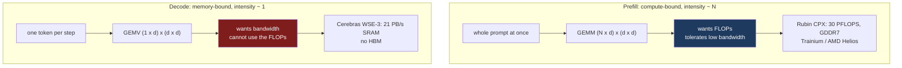



Three announcements inside a year, all making the same architectural bet.

AWS is pairing Trainium with Cerebras: Trainium runs prefill, a Cerebras CS-3 runs decode, and the result ships as a premium tier on Bedrock.[^1] AMD is pairing Helios rack-scale systems with the Cerebras Wafer-Scale Engine on the same split, claiming 5x higher tokens per second per watt, with Helios going into Cerebras datacenters before the end of 2026.[^2] And NVIDIA is doing the same arbitrage in-house with Rubin CPX, a part built specifically for the prefill phase, carrying 128 GB of GDDR7 instead of HBM.[^3]

None of this is fashion. It falls out of a property of the transformer decode loop that has been true since the first autoregressive model and gets worse with every hardware generation. This post is about why the split is inevitable. The four that follow are about why programming the result is so much harder than the press releases suggest.

## The two phases are not the same computation

Serving one request has two phases with almost nothing in common.

**Prefill** processes the whole prompt at once. For a prompt of $N$ tokens and hidden dimension $d$, each projection in each layer is a matrix multiply of shape $(N \times d) \times (d \times d)$. That is $2Nd^2$ floating-point operations against $d^2$ weights read from memory. At two bytes per parameter, arithmetic intensity is

$$I_{\text{prefill}} = \frac{2Nd^2}{2d^2} = N \ \text{FLOP/byte}$$

For a prompt of a few thousand tokens, that is a few thousand FLOP per byte. Every accelerator built in the last decade is compute-bound in that regime.

**Decode** emits one token per sequence per step. The same projection becomes $(1 \times d) \times (d \times d)$ — a matrix-vector product. You read the entire weight matrix to produce a single token:

$$I_{\text{decode}} = \frac{2d^2}{2d^2} = 1 \ \text{FLOP/byte}$$

That is the whole problem in one line. Prefill and decode differ in arithmetic intensity by three orders of magnitude, on identical weights, in the same model, for the same request.

Batching is the standard answer and it is a partial one. Running $B$ sequences together turns the GEMV back into a GEMM of shape $(B \times d) \times (d \times d)$, so intensity rises to roughly $B$. To approach the compute-bound regime on a modern GPU you need $B$ in the hundreds. Two things push back. Larger batches raise per-token latency for every sequence in the batch, which is the metric users feel most directly. And the KV cache scales with $B$ times context length, so the batch you want for arithmetic intensity is often the batch you cannot fit.

Attention makes it worse. At decode step $t$, attention reads the entire KV cache accumulated so far and does $O(t)$ work on $O(t)$ bytes. There is no reuse to find. That component is memory-bound at every batch size, and it grows linearly with context, which is precisely the direction the industry is moving.

So decode is bandwidth-starved by construction, and long context starves it further.

## The ceiling, in one division

The abstraction becomes concrete fast. At batch 1, generating a token requires reading every weight in the model exactly once. So the upper bound on single-stream decode throughput is a division:

$$\text{tokens/sec} \le \frac{\text{memory bandwidth}}{\text{bytes of weights}}$$

Nothing about the kernel, the framework, or the compiler enters that expression. An 8B model at fp16 is 16 GB. On an accelerator with 3 TB/s of bandwidth, batch-1 decode cannot exceed roughly 190 tokens per second no matter what you do to the software. A 70B model at fp16 is 140 GB, which puts the same ceiling near 21 tokens per second and does not fit in one H100's memory in the first place.

That division is why decode latency is a hardware property rather than an optimization target. You can improve the constant factor with quantization, which shrinks the numerator's denominator, or with speculative decoding, which amortizes one weight sweep across several accepted tokens. Both are real and both are bounded. What you cannot do is make a batch-1 GEMV compute-bound.

It is also why 21 PB/s is the number Cerebras leads with. Put the weights in SRAM and the division comes out somewhere else entirely.

The design has a cost that belongs in the same paragraph. Those 44 GB are distributed across 900,000 cores as small local memories rather than pooled the way HBM is, and a model whose weights exceed 44 GB needs more than one wafer. For frontier-scale models the decode side is a multi-wafer system with its own partitioning problem, which is a real constraint rather than a footnote.

## One chip cannot be right for both

Put the two phases on the same accelerator and you buy hardware that is wrong for one of them.

An H100 pairs roughly 3 TB/s of HBM3 bandwidth with a very large amount of compute. Run prefill on it and the FLOPs are the binding constraint while most of the bandwidth sits unused. Run decode on it and the bandwidth is the binding constraint while most of the FLOPs sit unused. You paid for both. Each phase uses about half of what you bought.

The interesting part is that the gap is widening. Splitwise measured it directly across one generation: from A100 to H100, compute grew 3.43x while memory bandwidth grew only 1.64x.[^5] Prefill got more than twice as much of what it needs as decode did. Extrapolate two more generations and a single balanced SKU is not a compromise, it is a chip that is mostly idle no matter which phase you run on it.

That is the reasoning behind the recent silicon, and the specifications make the intent obvious.

**Rubin CPX**, built for prefill, delivers 30 PFLOPS at NVFP4 from a monolithic die with 128 GB of GDDR7 rather than HBM.[^3] Reporting puts the resulting bandwidth near 1.8 TB/s on a 512-bit interface, which is an estimate from the memory configuration rather than a published figure. Less bandwidth than an H100, far more compute. NVIDIA's framing is that prefill "heavily utilizes compute and only lightly uses memory bandwidth," so the right part is skinny on bandwidth and fat on compute.

**Cerebras WSE-3**, which the AWS and AMD deals put on decode, is the exact inverse. 900,000 cores and 44 GB of SRAM distributed across a 46,225 mm² wafer, 4 trillion transistors, 125 PFLOPS of peak AI compute, and 21 PB/s of memory bandwidth.[^4] There is no HBM anywhere in the design. That bandwidth figure is roughly seven thousand times an H100's, which is a number that only makes sense once you accept that decode is a bandwidth problem wearing a compute problem's clothing.

Two chips, built by different companies, whose specifications are close to mirror images. That is not a coincidence. It is two teams solving opposite halves of the same roofline.

## The measurements came first

The hardware is following a research result that is now three years old and has been reproduced repeatedly.

DistServe made the case at OSDI 2024 by separating the phases onto distinct GPU pools. Their headline is that disaggregation serves 7.4x more requests, or meets a 12.6x tighter SLO, than colocated serving while keeping over 90% of requests inside their latency constraints.[^6] The mechanism is interference: when prefill and decode share an engine, a long prompt arriving mid-batch stalls every sequence currently decoding. Time-to-first-token and inter-token latency are different SLOs pulling on the same scheduler, and colocation forces the scheduler to sacrifice one.

Splitwise reported the same direction from Microsoft's production traces, at 1.4x throughput for 20% lower cost.[^5] Mooncake pushed further and made the KV cache the organizing principle rather than the compute, tiering it across HBM, DRAM, and SSD.[^7] The reported time-to-first-token improvements across these systems cluster in the 1.4x to 2.3x range.

Note what all of that shares: every one of those results was obtained with the same accelerator on both sides of the split, running the same inference engine. Disaggregation was a scheduling and placement idea, evaluated on homogeneous fleets.

## Why it became urgent this year

The roofline argument has been true since GPT-2. What changed is the token mix.

A classical chat turn is prefill-heavy: a few thousand tokens of context and prompt, a few hundred tokens of reply. Under that ratio decode is a minority of the work, and the case for buying separate silicon for it is weak.

Reasoning models inverted this. Test-time compute means the model generates long internal chains before answering, and every one of those tokens is a decode step paying the full weight-sweep cost. Agentic systems compound it further: a loop that plans, calls a tool, reads the result, and re-plans produces many generated tokens per unit of user input, and it does so serially, where per-token latency is felt directly. The same shift shows up in the SLO. Interactive agents care about inter-token latency across a long generation, not just time-to-first-token on a short one.

When decode is 10% of your token volume, a decode-shaped accelerator is a rounding error on your capital plan. When decode is the majority of it and the latency users complain about, the division in the previous section becomes the number your product is built on. That is the demand-side reason three vendors moved in the same direction inside a year, and it is why the trend is unlikely to reverse: the workloads that make decode dominant are the ones growing fastest.

## Why the economics push it past one vendor

The research motive was latency isolation. The deployment motive is cost, and cost is what takes this from a serving optimization to an industry structure.

If you sell tokens, your margin is the gap between what you charge per token and what the silicon costs you to produce it. Neoclouds compete on exactly that number and operate on thin margins, which makes idle capacity intolerable in a way it is not for a hyperscaler amortizing across many businesses. A decode fleet that cannot use its FLOPs is paying for transistors that produce nothing. A prefill fleet holding HBM it cannot saturate is paying a premium for bandwidth it never draws.

Disaggregation lets you buy each phase's bottleneck separately and scale the two pools independently, because the ratio of prefill to decode work is a property of your traffic and not of your hardware. A summarization workload with long inputs and short outputs is prefill-heavy. An agent loop generating thousands of tokens from a short instruction is decode-heavy. Under colocation you provision for the worse case on both axes. Under disaggregation you provision each pool for its own demand.

Once that is the shape of the problem, the vendor boundary stops being a natural place to stop. If Cerebras decode is genuinely the cheapest way to produce tokens at a given latency, the fact that your prefill runs on Trainium or Helios is an integration detail rather than a reason to buy a worse decode. That is precisely what the AWS and AMD deals assert.

## What nobody announced

Here is the gap this series is about.

Every mechanism that makes disaggregation work today assumes both halves are the same. vLLM's KV connector interface is an internal contract between two vLLM instances. NIXL moves bytes between memory regions that both sides can describe in the same terms. Dynamo's KV-aware router tracks cache state reported by workers that agree on what a cache block is. These are good systems, and all of them were designed for a fleet of identical accelerators running identical engines.

Cross the vendor boundary and each of those assumptions needs an answer that does not currently exist:

The KV cache produced by one vendor's attention kernel has to be consumed by another vendor's attention kernel, which requires agreement on layout, block size, dtype, quantization scales, attention variant, and whether positional encoding is already baked into the stored keys. There is no interchange format and no standard proposing one.

The bytes have to move. Transport libraries assume a flat, registerable, addressable target buffer. The decode side in these deals is a wafer with 44 GB of SRAM spread across 900,000 cores and no HBM at all.

Two schedulers with opposite batching economics have to cooperate on one latency budget, with no shared notion of admission control, preemption authority, or which side owns an SLO violation.

And the numerics will not match. The decoder consumes a KV cache produced by an implementation it does not contain, with different accumulation order and different scaling. It receives a cache its own prefill would never have produced.

The physics of the split is settled. Its programming model does not exist. The next four posts take those four gaps in order: what is actually inside a KV cache and why it has no ABI; what it takes to move one across a vendor boundary; how two schedulers share one SLO; and what a programming model would have to express to make any of this tractable.

---

## References

[^1]: **AWS and Cerebras collaboration.** Disaggregated prefill-decode inference deployed in AWS datacenters, with Trainium optimized for prefill and Cerebras CS-3 for decode, delivered as a premium tier through Amazon Bedrock. ([Amazon](https://www.aboutamazon.com/news/aws/aws-cerebras-ai-inference), [Cerebras](https://www.cerebras.ai/press-release/awscollaboration))

[^2]: **AMD and Cerebras disaggregated inference.** AMD Helios rack-scale architecture for the compute-intensive prefill phase paired with the Cerebras Wafer-Scale Engine for low-latency decode, with a claimed 5x improvement in tokens per second per watt and Helios deployments inside Cerebras datacenters before the end of 2026. ([SiliconANGLE](https://siliconangle.com/2026/07/29/disaggregated-ai-inference-cerebras-amd-amdadvancingai/))

[^3]: **NVIDIA Rubin CPX.** A prefill-phase accelerator delivering 30 PFLOPS at NVFP4 from a monolithic die with 128 GB of GDDR7 rather than HBM, available end of 2026. The ~1.8 TB/s bandwidth figure quoted above is a press estimate derived from a 512-bit interface at 30 Gbps, not a published specification. ([NVIDIA Newsroom](https://nvidianews.nvidia.com/news/nvidia-unveils-rubin-cpx-a-new-class-of-gpu-designed-for-massive-context-inference), [TechPowerUp](https://www.techpowerup.com/340818/nvidia-unveils-rubin-cpx-gpu-single-die-30-petaflops-and-128-gb-of-gddr7-memory))

[^4]: **Cerebras WSE-3.** 4 trillion transistors, 900,000 AI-optimized cores, 125 PFLOPS peak AI performance, 44 GB on-chip SRAM, 21 PB/s memory bandwidth, 214 Pb/s fabric bandwidth, 46,225 mm² on TSMC 5nm. No HBM or stacked off-die memory in the package; all memory is SRAM distributed alongside the cores. ([Cerebras](https://www.cerebras.ai/press-release/cerebras-announces-third-generation-wafer-scale-engine))

[^5]: **Splitwise: Efficient Generative LLM Inference Using Phase Splitting.** ISCA 2024. Reports 1.4x throughput at 20% lower cost from splitting the phases across machine pools, and measures that from A100 to H100 compute grew 3.43x while memory bandwidth grew 1.64x — the divergence that makes a single balanced SKU progressively worse for both phases.

[^6]: **DistServe: Disaggregating Prefill and Decoding for Goodput-optimized Large Language Model Serving.** OSDI 2024. Serves 7.4x more requests or meets a 12.6x tighter SLO than colocated state-of-the-art systems while keeping over 90% of requests within latency constraints. ([ACM DL](https://dl.acm.org/doi/10.5555/3691938.3691949))

[^7]: **Mooncake.** KV-cache-centric disaggregated serving with hierarchical offloading across GPU HBM, CPU DRAM, and SSD, treating the cache rather than the compute as the object the architecture is organized around.

---

*Disclaimer: Researched and drafted with AI assistance (Claude Opus 5). Direction, technical judgment, and final edits are mine; every claim is traceable to the sources cited above. The arithmetic-intensity derivations are standard roofline reasoning applied to transformer inference; the hardware specifications are vendor-published except where marked as press estimates. I have not run a disaggregated deployment across the vendor pairings described here, and no claim in this post rests on measurements of my own.*
