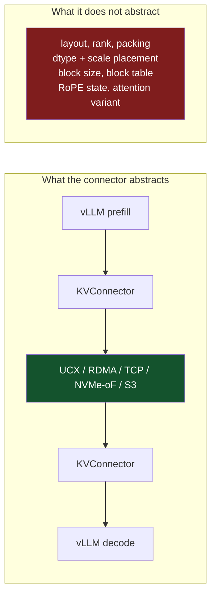

The last post argued that prefill and decode want different computers, and that the industry has started buying them separately. This one is about the handoff, which sounds like the easy part but it is easier said than done.

Stated at the level of a slide, disaggregation is simple. Prefill runs the prompt through the model and produces a KV cache. Ship that cache to the decode machine. Decode generates tokens from it. One artifact crosses one wire, once, per request.

The problem is the word "it." There is no single representation of a KV cache, no standard describing one, and inside the most widely deployed inference engine there are twenty-eight different answers to what shape the thing is.

## What is actually in the cache

Let's look at the ordinary case, multi-head or grouped-query attention on a GPU. vLLM's FlashAttention backend reports its cache shape as a four-dimensional tensor:

```python
# vllm/v1/attention/backends/flash_attn.py
@staticmethod
def get_kv_cache_shape(
    num_blocks: int,
    block_size: int,
    num_kv_heads: int,
    head_size: int,
    cache_dtype_str: str = "auto",
) -> tuple[int, ...]:
    return (num_blocks, num_kv_heads, block_size, 2 * head_size)
```

Four things to notice here out which none of them are universal.

The cache is **paged**. It is not a contiguous per-sequence buffer but a pool of fixed-size blocks, with a per-request block table mapping logical positions to physical blocks. Any consumer needs the block table as well as the blocks, and needs to agree on `block_size`. vLLM requires that to be a multiple of 16.

**K and V are packed together** into the trailing dimension, which is why it is `2 * head_size` rather than a separate tensor for each. A consumer that expects separate K and V tensors reads interleaved garbage.

**Head count is a parameter.** Grouped-query attention means `num_kv_heads` is smaller than the query head count, by a model-specific ratio.

And the **dimension order is a choice**, where vLLM supports two:

```python
# NHD: (num_blocks, block_size, num_kv_heads, 2 * head_size)
# HND: (num_blocks, num_kv_heads, block_size, 2 * head_size)
```

These hold identical numbers in different memory order. The engine knows they are not interchangeable, which is why the connector interface has a method for asking:

```python
def get_required_kvcache_layout() -> str | None:
    """Returns "HND", "NHD", or None if no specific layout is required."""
```

A negotiation method for a layout question, inside one engine, on one vendor's hardware.[^1] That is the shape of the problem in miniature, before any vendor boundary is involved.

## Why have one shape when you can have twenty-eight.

Search vLLM for `"def get_kv_cache_shape"` and you get 31 files. Two are tests, and one is the abstract base that raises `NotImplementedError`. That leaves **28 concrete implementations**[^5], each returning a different tensor shape for a cache the disaggregation slide treats as a single object.

They divide along several axes at once. Backend: FlashAttention, FlashInfer, Triton, ROCm, CPU, XPU. Attention variant: standard MHA/GQA, MLA, sparse MLA, sliding-window, differential KV. Model family: DeepSeek V4, Kimi K3, MiniMax M3, each with bespoke variants. And vendor — the same model carries separate implementations under `models/inkling/amd/` and `models/inkling/nvidia/`.

Not all 28 are live in any one deployment. vLLM has been migrating into the `vllm/v1` tree, so several of these sit in older `model_executor` paths or in model-specific directories that only load for a single architecture. That helps less than it sounds: 19 of the 28 are under `vllm/v1/attention/` alone, and a consumer does not get to choose which one the producer was configured with.

Multi-head Latent Attention is the sharpest divergence, because it changes the rank of the tensor. DeepSeek's MLA does not store keys and values at all. It stores a compressed latent plus a separate positional component, so the head dimension disappears:

```python
# vllm/v1/attention/backends/mla/flashmla_sparse.py
@staticmethod
def get_kv_cache_shape(
    num_blocks: int,
    block_size: int,
    num_kv_heads: int,  # assumed to be 1 for MLA
    head_size: int,
    cache_dtype_str: str = "auto",
) -> tuple[int, ...]:
    if cache_dtype_str == "fp8_ds_mla":
        # V3.2 main MLA: 656-byte custom storage format. See module docstring.
        return (num_blocks, block_size, 656)
    else:
        return (num_blocks, block_size, head_size)
```

Read the parameter list against the body. `num_kv_heads` is accepted and then ignored, with a comment explaining it is assumed to be 1. The signature describes a world this implementation does not live in.[^2]

And then there is 656.

## A shape whose last dimension is a byte count

That constant is not a number of elements. It is a number of bytes, and the surrounding kernel spells out the contract:

```cpp
// csrc/libtorch_stable/cache_kernels.cu
if (kv_cache_dtype == "fp8_ds_mla") {
    STD_TORCH_CHECK(kv_lora_rank == 512, "kv_lora_rank must be 512 for fp8_ds_mla");
    STD_TORCH_CHECK(pe_dim == 64, "pe_dim must be 64 for fp8_ds_mla");
    STD_TORCH_CHECK(kv_cache.size(2) == 656 / kv_cache.element_size(),
                    "kv_cache.size(2) must be 656 bytes for fp8_ds_mla");
    STD_TORCH_CHECK(kv_c.element_size() == 2, ...);
    STD_TORCH_CHECK(k_pe.element_size() == 2, ...);
}
```

Together with the kernel comment about how the tiles are written, the 656 bytes decompose:

| Region | Contents | Bytes |
|---|---|---|
| NoPE latent | 512 elements, fp8 | 512 |
| Scales | 4 tiles × fp32 scale | 16 |
| RoPE component | 64 elements, bf16 | 128 |
| **Total** | logical width 576 | **656** |

A 576-element logical vector stored in 656 bytes, in three regions of two different dtypes, with quantization scales interleaved between them at tile granularity determined by how a warp writes its lanes.

This is not a tensor layout. It is a struct, defined by a CUDA kernel, whose field offsets are load-bearing.

You can watch the engine admit it, because there is a dedicated kernel whose entire job is turning the packed form back into something else:

```cpp
void cp_gather_and_upconvert_fp8_kv_cache(
    torch::stable::Tensor const& src_cache,    // [NUM_BLOCKS, BLOCK_SIZE, 656]
    torch::stable::Tensor const& dst,          // [TOT_TOKENS, 576]
    torch::stable::Tensor const& block_table,  // [BATCH, BLOCK_INDICES]
    ...
```

656 in, 576 out.[^3] If you receive the source buffer without that kernel, you have 656 bytes per token of something you cannot interpret.

Note also what lives in that struct: the RoPE component is *stored in the cache as a distinct region*. Whether positional encoding is already applied to what you receive, and where it sits, is a per-variant answer. There is no general rule to rely on.

## The scales are inside the tensor

Quantization compounds it, because the scale factors are not metadata alongside the cache. They are packed into the cache.

vLLM's Triton backend returns `(num_blocks, num_kv_heads, block_size, 2 * head_size)` for ordinary quantization, but under per-token-head modes it pads the trailing dimension to make room for inline scales, with the padding computed from the ratio of dtype sizes. Same logical cache, same model, same engine, physically different layout depending on a quantization flag.

So "the cache is fp8" is not a sufficient description. You need to know the scale granularity, whether scales are inline or separate, where they sit, and what dtype they are.

## The connector is not a wire format

At this point the obvious objection is that vLLM already has an abstraction for shipping caches between instances. It does. Read its actual signatures rather than its name.

```python
# vllm/distributed/kv_transfer/kv_connector/v1/base.py

@abstractmethod
def start_load_kv(self, forward_context: "ForwardContext", **kwargs) -> None:
    """Start loading the KV cache from the connector to vLLM's paged KV buffer."""

@abstractmethod
def wait_for_layer_load(self, layer_name: str) -> None:
    """Block until the KV for a specific layer is loaded into vLLM's paged buffer."""

@abstractmethod
def save_kv_layer(self, layer_name: str, kv_layer: torch.Tensor,
                  attn_metadata: "AttentionMetadata", **kwargs) -> None:
    """Start saving a layer of KV cache from vLLM's paged buffer to the connector."""

@abstractmethod
def get_num_new_matched_tokens(self, request: "Request",
                               num_computed_tokens: int) -> tuple[int | None, bool]:
    ...

@abstractmethod
def update_state_after_alloc(self, request: "Request", blocks: "KVCacheBlocks",
                             num_external_tokens: int):
    ...

@abstractmethod
def build_connector_meta(self, scheduler_output: SchedulerOutput) -> KVConnectorMetadata:
    ...
```

Every one of those signatures is written in vLLM's own object model. `ForwardContext`, `AttentionMetadata`, `Request`, `KVCacheBlocks`, `SchedulerOutput` are Python classes defined inside vLLM. The payload type is `torch.Tensor`. The docstrings do not say "the KV buffer," they say **"vLLM's paged KV buffer."**

This is a good interface for what it is: a plugin point letting you swap the transport underneath two vLLM instances. UCX, RDMA, TCP, NVMe-oF, object storage. What it is not is a description of bytes on a wire that a foreign runtime could implement against. To satisfy this interface, a Cerebras or Trainium runtime would have to reproduce vLLM's scheduler objects, its block-table representation, its per-layer save/load lifecycle, and its notion of a forward context. The connector abstracts the *transport*. It does not abstract the *format*, because the format was never separated from the engine in the first place.[^4]



## What a cross-vendor handoff would actually have to agree on

Line up everything above and the agreement surface for shipping one cache from vendor A's prefill to vendor B's decode looks like this:

Tensor rank and dimension order, including which of HND or NHD. Whether K and V are packed or separate. Block size, and the block table representation that makes the pool interpretable. Element dtype, plus quantization scale granularity, placement, and dtype. The attention variant, since MLA is not a layout variation of MHA but a different object. For MLA specifically, the exact byte offsets of the latent, the scales, and the positional region. Whether RoPE has been applied, and to which region. Head count and grouping ratio. And the numerical convention of the kernel that produced the values, which the next post in this series takes up.

No standard covers any of that. There is no ONNX for KV caches, no equivalent of the ELF specification that let a linker from one vendor consume objects from another. This blog has spent a fair amount of time on what a real ABI looks like — calling conventions, alignment rules, symbol visibility, all written down precisely enough that independent implementations interoperate. The KV cache has none of that scaffolding.

## Why a specification would not be easy

The tempting conclusion is that someone should write the spec. Nobody has, and the reason is not laziness.

These layouts are not arbitrary. Each one is co-designed with a kernel. The 656-byte struct exists because a specific warp-level access pattern makes those field offsets fast on that hardware. The HND/NHD choice exists because different attention implementations want different strides. Per-token-head scale interleaving exists so the dequantize step reads scale and value from the same cache line. The layout *is* the kernel's ABI, and the kernel is where the performance lives.

So a portable KV format is not a formatting exercise. Either it standardizes on one layout, in which case somebody's kernels get slower, or it defines a neutral interchange form, in which case every handoff pays a conversion. And that conversion is not free at these sizes: Splitwise measured a single 512-token OPT-66B request producing 1.13 GB of cache, needing 90 Gbps at 10 requests per second.[^6] Transposing a paged cache at that rate, on the latency path, before decode can start, is a real cost to weigh against the latency win that motivated disaggregation.

That is the actual engineering tradeoff, and nobody has published a serious answer to it.

## Where this leaves the announcements

The AWS and AMD deals both describe prefill on one vendor's silicon and decode on Cerebras. Somewhere in each of those systems, a KV cache produced by one company's attention kernel is being consumed by another company's attention kernel. That is either a bilateral, privately negotiated format between two partners, or a conversion step on the critical path. Neither has been described publicly, and neither generalizes: a bilateral agreement between AWS and Cerebras does nothing for AMD and Cerebras, and nothing at all for the fourth entrant.

That is the shape of an industry moving to a heterogeneous architecture without an interchange standard. It worked for a while in the GPU era because there was only one vendor to agree with.

The next post takes up moving the bytes rather than describing them, which is where the assumptions get stranger. Transport libraries want a flat, registerable, addressable target buffer. The decode side in these deals is a wafer with 44 GB of SRAM distributed across 900,000 cores and no HBM at all. And in NVIDIA's arrangement the boundary does not even fall between the phases: it falls inside a decoding step, with activations crossing every layer rather than a cache crossing once.

---

## References

[^1]: **vLLM FlashAttention backend.** `get_kv_cache_shape` returning `(num_blocks, num_kv_heads, block_size, 2 * head_size)`, the `block_size % 16` constraint, the NHD/HND stride orders, and the supported cache dtypes (`auto`, `float16`, `bfloat16`, `fp8`, `fp8_e4m3`). ([`v1/attention/backends/flash_attn.py`](https://github.com/vllm-project/vllm/blob/main/vllm/v1/attention/backends/flash_attn.py))

[^2]: **vLLM sparse MLA backend.** The `fp8_ds_mla` branch returning `(num_blocks, block_size, 656)` and the ignored `num_kv_heads` parameter. ([`v1/attention/backends/mla/flashmla_sparse.py`](https://github.com/vllm-project/vllm/blob/main/vllm/v1/attention/backends/mla/flashmla_sparse.py))

[^3]: **vLLM cache kernels.** The `fp8_ds_mla` assertions fixing `kv_lora_rank == 512`, `pe_dim == 64` and a 656-byte entry, the warp-level tiling comment describing where scales are written, and `cp_gather_and_upconvert_fp8_kv_cache` converting `[NUM_BLOCKS, BLOCK_SIZE, 656]` to `[TOT_TOKENS, 576]`. ([`csrc/libtorch_stable/cache_kernels.cu`](https://github.com/vllm-project/vllm/blob/main/csrc/libtorch_stable/cache_kernels.cu))

[^4]: **vLLM KV connector base class.** `KVConnectorBase_V1` and its abstract methods, typed in terms of `ForwardContext`, `AttentionMetadata`, `Request`, `KVCacheBlocks` and `SchedulerOutput`, with docstrings referring to "vLLM's paged KV buffer", plus `get_required_kvcache_layout()` returning `"HND"`, `"NHD"` or `None`. ([`distributed/kv_transfer/kv_connector/v1/base.py`](https://github.com/vllm-project/vllm/blob/main/vllm/distributed/kv_transfer/kv_connector/v1/base.py))

[^5]: **The count of twenty-eight.** A GitHub code search for the exact string `"def get_kv_cache_shape"` in `vllm-project/vllm` returns 31 files. Subtracting two tests (`tests/v1/kv_connector/unit/test_transfer_topology_sharded.py`, `tests/v1/worker/test_attn_utils.py`) and the abstract base in `vllm/v1/attention/backend.py`, which raises `NotImplementedError`, leaves 28 concrete implementations: 19 under `vllm/v1/attention/`, the rest in `vllm/models/` and `vllm/model_executor/`. Searching the bare symbol instead returns 50 files, but that count includes call sites and imports rather than definitions. Counted 2026-08-18; the number moves with the repository. ([search](https://github.com/search?q=repo%3Avllm-project%2Fvllm+%22def+get_kv_cache_shape%22&type=code))

[^6]: **Splitwise KV cache sizing.** A 512-token OPT-66B request producing 1.13 GB of KV cache, requiring roughly 90 Gbps of transfer bandwidth at 10 requests per second — the figure that makes any per-handoff conversion step a first-order cost.

---

*Disclaimer: Researched and drafted with AI assistance (Claude Opus 5). Direction, technical judgment, and final edits are mine; every claim is traceable to the sources cited above. All vLLM code in this post was read from the project's `main` branch on 2026-08-18 and is quoted rather than paraphrased; the 656-byte decomposition is derived from the assertions and the warp-tiling comment in `cache_kernels.cu` rather than stated as such in the source. I have not run a cross-vendor disaggregated deployment, and no claim here rests on measurements of my own.*
