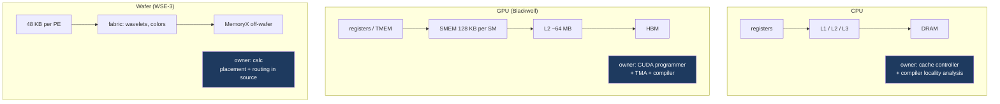
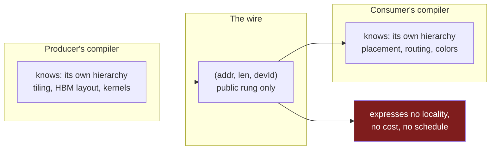
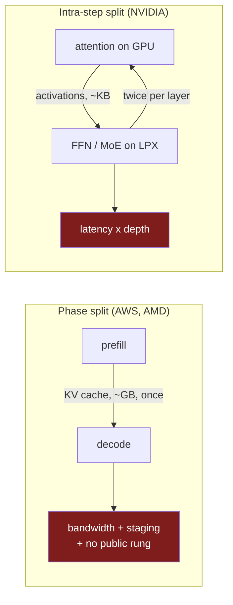

The last post argued that a KV cache has no interchange format. Grant one anyway. Suppose the two vendors agree on layout, dtype, block size, scale placement and every other axis in that list. The bytes still have to move.

This is the part that looks like plumbing and is not, because a transfer library is not neutral about what kind of machine sits at the other end. And the reason it can afford not to be neutral, historically, is that one program has always owned the whole memory hierarchy it was moving data through. Disaggregation is the first time we have split that ownership across two vendors.

## Every machine is a memory hierarchy

Nothing about this problem is new to accelerators. It is the oldest structure in systems programming.

A CPU has registers, then L1, then L2, then L3, then DRAM, then storage. Each level is smaller, faster and closer than the one below it, and a program that ignores the hierarchy runs an order of magnitude slower than one that respects it. The reason most programmers do not think about this daily is that two mechanisms hide it. The hardware has a cache controller that fetches, evicts and prefetches without being asked. And the compiler reasons about locality on your behalf, tiling loops and reordering accesses so the working set fits a level that is actually fast. That analysis is well-developed enough to have its own literature, built on [lattices, fixpoints and semirings]().

A GPU has the same structure with the automation removed. On Blackwell, an SM has registers, then tensor memory, then a configurable unified L1 and shared memory of 128 KB per SM, then a monolithic L2 of 64 to 65 MB, then HBM. Shared memory access runs on the order of 20 to 30 cycles. Distributed shared memory lets an SM reach a neighbour's shared memory within a cluster, at a latency penalty. Tensor memory is newer and, unlike registers, requires explicit user allocation and management.[^2]

The GPU does not hide any of that. There is no cache controller deciding what belongs in shared memory. You write `__shared__`, you stage tiles into it yourself, or you use the tensor memory accelerator to move a block from global memory into shared memory asynchronously while compute proceeds. The hierarchy is exposed, and the programming model exists precisely to let you exploit it.

A Cerebras wafer is the same idea taken to its limit. There are roughly 900,000 processing elements in a 2D mesh, each with 48 KB of local SRAM, and each PE accesses only its own memory, at sub-nanosecond latency. Everything else is a message. PEs communicate over a circuit-switched network-on-chip, sending packets called wavelets along configured routes, where each PE's router supports a limited number of concurrent circuits — 24, plus 8 reserved — called colors, which are virtual channels bound to physical routing resources. Two streams that might collide must be assigned different colors.[^3]

That machine is programmable, and the how matters here, because the easy version of this argument is that a wafer is exotic and therefore hard. It is not exotic. It has a language. CSL is a Zig-inspired dataflow language in which computation is triggered by the arrival of data, and a CSL program is not just kernel code: it includes a layout file that prescribes which code runs on which PEs and how data is routed between them. The `cslc` compiler maps that onto the physical fabric. Placement and routing are first-class parts of the source program.



Three machines, three hierarchies, three different answers to who manages locality: hardware, programmer, compiler. All three answers work. Every one of them assumes a single owner.

## What a transfer library can actually touch

Now put a network in the middle and ask which rung of those ladders a remote peer can write into.

The answer is one rung, and it is always the same rung: the level that is globally addressable, physically stable, and reachable by a device that is not the compute engine. On a CPU that is DRAM. On a GPU that is HBM. It is never L1, never shared memory, never tensor memory, never a PE's scratchpad.

NIXL, NVIDIA's inference transfer library and the thing underneath vLLM's NixlConnector and Dynamo's disaggregated path, states this in its type system. Its memory spaces are enumerated exhaustively:

```cpp
// nixl/src/api/cpp/nixl_types.h
enum nixl_mem_t {DRAM_SEG, VRAM_SEG, BLK_SEG, OBJ_SEG, FILE_SEG};
```

Host DRAM, GPU VRAM, block device, object store, file.[^1] There is no `SMEM_SEG`, no `TMEM_SEG`, no `PE_SEG`, and their absence is not an oversight. Those levels are not addressable from off-chip by anything.

The unit NIXL moves is correspondingly simple:

```cpp
// nixl/src/api/cpp/nixl_descriptors.h
/**
 * @class nixlBasicDesc
 * @brief A basic descriptor class, single contiguous memory/storage
 *        element, alongside supporting methods
 */
class nixlBasicDesc {
public:
    /** @var Start of Buffer */
    uintptr_t addr;
    /** @var Buffer Length */
    size_t len;
    /** @var deviceID/blockID/fileID */
    uint64_t devId;
```

A pointer, a length, and a device number. Single contiguous.

This is why RDMA needs **registration**: pages pinned so the OS cannot move them, the virtual-to-physical mapping handed to the NIC, a key returned that the remote peer presents on every access. Registration is exactly the operation that makes a region of the public rung stable enough for a foreign device to write into. It has no meaning at any other level of the hierarchy.

## The seam is already there on a GPU

Here is the part that is easy to miss, because it has never caused anybody pain.

You cannot RDMA into shared memory. If a remote machine sends you a KV cache, it lands in HBM. Getting it from HBM into the 128 KB of shared memory where the attention kernel actually wants it is a second movement, performed by the receiving side, using its own machinery — a TMA descriptor, an async copy, a tiling strategy chosen by whoever wrote that kernel.

So even in the ordinary all-NVIDIA case, the handoff has two halves. The network gets the bytes to the public rung. The consumer's own compiler and kernel take them the rest of the way down the hierarchy.

Nobody experiences this as a boundary, because both halves are written by the same people against the same layout. The producer knows the consumer will want 128-element tiles in a particular order, so it writes the cache to HBM in the order that makes the consumer's TMA descriptor cheap. That agreement is real, load-bearing, and entirely undocumented, because it never had to leave the building.

That is the seam. It has always existed. Disaggregation is what happens when the two halves stop being written by the same organisation.

## The wafer removes the rung

Now the case where it becomes visible.

A WSE-3 has 44 GB of SRAM, and that number invites you to picture a pool the way you picture 80 GB of HBM. It is not a pool. It is 900,000 × 48 KB, private to each PE, with no shared address space between them.

Try to fill in the descriptor. A single KV block for one layer of a mid-sized model is on the order of a hundred kilobytes: not one PE's scratchpad, two or three of them, and not adjacent in any address sense because there is no address sense. A sequence's whole cache spans thousands of PEs. There is no `uintptr_t addr` that names it, no `size_t len` over which the bytes are contiguous, and no `devId` resolving to something a NIC can write into. `VRAM_SEG` is the nearest enum value and it is wrong: this is not memory behind a controller, it is the compute substrate.

There is also nothing to pin. Registration assumes memory you can hold still while a device writes into it. On a wafer, where a value lives is part of the schedule, and the schedule is what `cslc` emitted from the layout file.

The public rung is missing. Which means the bytes have to stage: land in host DRAM or MemoryX, the off-wafer store that already streams weights in, and then get pulled onto the fabric by the wafer's own dataflow, as scheduled work.

So the handoff is at least two hops, and the second is not a DMA the sender controls. Weigh that against the reason for disaggregating at all. Part one's argument was latency — separate the phases so prefill stops interrupting decode and time-to-first-token improves. Now the first token waits on a network crossing, a staging buffer, and a fabric distribution, all sitting on the TTFT path in front of the metric the split existed to protect. Splitwise measured a single 512-token OPT-66B request producing 1.13 GB of KV cache;[^5] long-context requests are far larger.

## The friction is ownership, not weirdness

It would be easy to read all of this as an argument that wafer-scale hardware is impractical. That is not the claim, and the CSL description above is why.

Cerebras has a compiler that does placement and routing. NVIDIA has a compiler, a TMA engine and a mature set of idioms for staging global memory into shared memory. Intel and AMD and Arm have decades of cache-aware code generation, and the CPU has a hardware controller doing it automatically. Every one of these is a competent answer to the locality problem *for its own machine*.

The friction is that a disaggregated pipeline needs an answer that spans two of them, and nothing in either toolchain can represent the other half.

`cslc` can schedule where a tensor lands on the fabric, but it cannot see the producer's HBM layout, its block table, or the tiling convention its attention kernel assumed. The producer's compiler can emit a KV cache in whatever layout its own kernels like best, but it has no representation for "and then this must be distributed across ten thousand PEs whose routing colors are already allocated." Both sides optimise locality correctly, on their own side of a boundary neither can see across.



The descriptor is the entire vocabulary they share, and it can express a byte range and nothing else. Not what it costs to reach that range. Not what layout the bytes should be in when they arrive. Not whether the receiver is free to place them, or has already committed a routing schedule that constrains where they can go.

Every mature architecture solved locality by giving one component enough visibility to reason about the whole path. Disaggregation removes that visibility and replaces it with a pointer.

## Even the public rung is not uniform

The flat model is already wrong before any of this, on ordinary hardware.

Bandwidth between two GPUs varies by **72x** depending on where they physically sit: roughly 900 GB/s over NVLink within a domain, 50 GB/s over InfiniBand across nodes, 12.5 GB/s over TCP across datacenters. Recent work notes that DistServe, Splitwise and Mooncake all assume uniform RDMA and ignore this entirely.[^4]

Same defect, milder form. The descriptor says `(addr, len, devId)` and says nothing about what reaching `devId` costs. A scheduler choosing which decode instance receives a cache makes a placement decision with a 72x cost spread, through an interface that reports no cost at all.

## The other topology, where nothing is cached

Everything above assumes the split is prefill-then-decode, with a cache crossing once per request. NVIDIA's own arrangement is not that.

Groq LPX takes the latency-sensitive part of the decode loop — feed-forward and MoE expert execution — while Rubin GPUs keep prefill *and decode attention*. Attention stays on the GPU because that is where the KV cache lives.[^6] So the cache never crosses anything. What crosses is activations, and the boundary falls inside a single decoding step.

Work out the shape. For a hidden dimension of `d` in bf16, each layer sends roughly `2d` bytes per token across and gets about the same back. At `d = 8192` that is around 16 KB each way, 32 KB round trip per layer per token, a few megabytes per token across a hundred layers.

The bandwidth is unremarkable. The latency is not, because those crossings are **serial** — layer `n+1` cannot begin until layer `n` returns. A hundred layers is two hundred boundary crossings per token, and they do not overlap.

At one microsecond per one-way crossing, that is 200 µs per token of pure interconnect latency before any arithmetic. Against a 10 ms inter-token budget it is 2%. Against the 1 ms budget that justifies buying a decode accelerator at all, it is 20%, and it scales linearly with depth.

That arithmetic is derived from published architecture descriptions and typical model dimensions, not measured. NVIDIA has not published GPU-to-LPX interconnect latency, and a real implementation may pipeline across tokens or batch layers in ways that change it. The structural point holds regardless: when the boundary falls inside a decode step, model depth multiplies your interconnect latency, and no transfer descriptor expresses that either.

## Two topologies, one missing vocabulary



Two architectures, both shipping, with opposite cost structures. One moves a large payload once and is bounded by bandwidth and staging. The other moves small payloads constantly and is bounded by latency and jitter. Both are called disaggregated inference, and the same descriptor is the only vocabulary available for either.

## Is this actually programmable?

Stack this post on the previous one and the picture is worse than either alone.

[The KV cache has no interchange format]() because layouts are co-designed with kernels: the 656-byte MLA struct has the field offsets it has because a particular warp access pattern is fast on that hardware. This post says locality is co-designed with the hierarchy: `cslc` allocates routing colors against a fabric, a TMA descriptor assumes a tiling, a cache controller assumes a stride.

Those are the same phenomenon seen twice. On both sides, the performance comes from co-design, and co-design is only available to a compiler that can see the whole path. Neither problem is a missing document. They are two faces of having split a single optimisation domain in half.

So the composition question is sharper than "somebody should write a spec." It is whether two independently co-designed systems can be joined at all without destroying the co-design that made each of them fast. There are three shapes of answer and none is comfortable.

**Bilateral agreement.** AWS and Cerebras privately negotiate a format, a staging protocol, and a distribution schedule, tuned to each other. This obviously works, and it is almost certainly what is happening. It also does not generalise: the agreement is worth nothing to AMD and Cerebras, and *n* vendors need *n²* of them. This is the pre-standard era of any interconnect, and historically it ends either in a standard or in one party's format winning by market share.

**A neutral interchange form.** Define a canonical KV representation, have both sides convert. Now every handoff pays a layout conversion on one end and a hierarchy redistribution on the other, both on the time-to-first-token path, against a payload Splitwise measured at 1.13 GB for a single modest request. You have bought portability with the latency that justified disaggregating in the first place.

**Make one side authoritative.** The producer emits directly in the form the consumer's hierarchy wants — the right answer on paper, since it removes the conversion entirely. But it requires the producer's compiler to model the consumer's memory hierarchy, routing constraints and kernel tilings. That is not an interface between two compilers. It is a merge, which is precisely the single-owner property that disaggregation gave up.

I do not think this is unsolvable, and the industry has resolved worse impedance mismatches by eventually agreeing on something. But it is not a plumbing problem with a plumbing answer, and the current tooling is not an early version of the solution. `(addr, len, devId)` is not a first draft of a richer descriptor. It is a correct description of the one rung that a network can reach, in a stack whose performance lives on all the other rungs.

And layout and locality are only two of the three. The values crossing that boundary were produced by an attention kernel the consumer does not contain, with a different accumulation order and different scaling, which means the decoder is reading a cache its own prefill would never have produced. That is the subject of part five.

Part four takes the more immediate problem to the scheduler, which has to make exactly these placement decisions across two engines with opposite batching economics, one latency budget, and no agreement about who owns an SLO violation.

---

## References

[^1]: **NIXL memory types and descriptors.** `enum nixl_mem_t {DRAM_SEG, VRAM_SEG, BLK_SEG, OBJ_SEG, FILE_SEG};` and `nixlBasicDesc`, documented as "a basic descriptor class, single contiguous memory/storage element," carrying `uintptr_t addr`, `size_t len` and `uint64_t devId`. ([`nixl_types.h`](https://github.com/ai-dynamo/nixl/blob/main/src/api/cpp/nixl_types.h), [`nixl_descriptors.h`](https://github.com/ai-dynamo/nixl/blob/main/src/api/cpp/nixl_descriptors.h))

[^2]: **Blackwell memory hierarchy.** A configurable unified L1/shared memory of 128 KB per SM (reduced from 256 KB on Hopper), a monolithic L2 of roughly 64–65 MB, tensor memory as a new on-chip space requiring explicit user allocation, distributed shared memory for reaching a neighbouring SM at a latency penalty, and the TMA engine for asynchronous bulk copies from global memory into shared memory. Shared memory access is on the order of 20–30 cycles. ([Blackwell SM100 analysis](https://jianyuh.github.io/cuda/2026/04/12/blackwell-sm100.html), [microbenchmarking study](https://arxiv.org/html/2512.02189v1))

[^3]: **Cerebras WSE memory and programming model.** Roughly 900,000 processing elements in a 2D mesh, each with 48 KB of local SRAM accessible only to itself at sub-nanosecond latency, communicating by wavelets over a circuit-switched fabric with 24 colors per PE plus 8 reserved. CSL is a Zig-inspired dataflow language in which a program includes a layout file prescribing PE placement and data routing, compiled by `cslc` onto the physical fabric. ([Cerebras SDK overview](https://www.cerebras.ai/blog/supercharge-your-hpc-research-with-the-cerebras-sdk), [CSL compiler docs](https://sdk.cerebras.net/csl/csl-compiler), [ALCF CSL guide](https://docs.alcf.anl.gov/ai-testbed/cerebras/csl/))

[^4]: **Topology-aware data movement.** GPU-to-GPU bandwidth varies by 72x with physical relationship — approximately 900 GB/s over NVLink 4.0 within a domain, 50 GB/s over InfiniBand across nodes, 12.5 GB/s over TCP across datacenters — and DistServe, Splitwise and Mooncake all assume uniform RDMA. ([arXiv:2607.28633](https://arxiv.org/abs/2607.28633))

[^5]: **Splitwise KV cache sizing.** A 512-token OPT-66B request producing 1.13 GB of KV cache, the payload that must cross and land before the first token can be produced.

[^6]: **NVIDIA Groq 3 LPX role split.** Rubin GPUs handle prefill and decode attention; LPX accelerates the latency-sensitive decode path including FFN and MoE expert execution. ([NVIDIA developer blog](https://developer.nvidia.com/blog/inside-nvidia-groq-3-lpx-the-low-latency-inference-accelerator-for-the-nvidia-vera-rubin-platform), [ServeTheHome](https://www.servethehome.com/decoding-the-future-of-inference-at-nvidia-groq-lpus-join-vera-rubin-platform-for-low-latency-inference/))

---

*Disclaimer: Researched and drafted with AI assistance (Claude Opus 5). Direction, technical judgment, and final edits are mine; every claim is traceable to the sources cited above. NIXL headers were read from the project's `main` branch on 2026-08-18 and are quoted rather than paraphrased. The per-layer activation arithmetic is derived from published architecture descriptions and typical model dimensions rather than measured, and I have not run any of the systems described here.*
