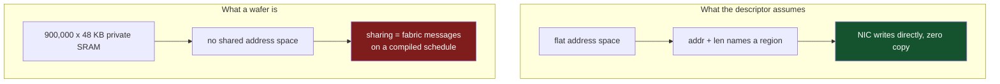
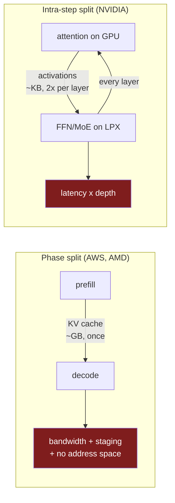

The last post argued that a KV cache has no interchange format. Grant one anyway. Suppose the two vendors agree on layout, dtype, block size, scale placement, and every other axis in that list. The bytes still have to move, and this is where the assumptions get stranger, because a transfer library is not neutral about what kind of machine sits at the other end.

## What the industry's transfer library actually is

NIXL is NVIDIA's inference transfer library, the thing underneath vLLM's NixlConnector and Dynamo's disaggregated path. It abstracts over UCX, RDMA, InfiniBand, RoCE, TCP, NVMe-oF and object storage, which is a genuinely useful piece of engineering.

Its fundamental unit is this:

```cpp
// nixl/src/api/cpp/nixl_descriptors.h
/**
 * @class nixlBasicDesc
 * @brief A basic descriptor class, single contiguous memory/storage
 *        element, alongside supporting methods
 */
class nixlBasicDesc {
public:
    /** @var Start of Buffer */
    uintptr_t addr;
    /** @var Buffer Length */
    size_t len;
    /** @var deviceID/blockID/fileID */
    uint64_t devId;
```

A pointer, a length, and a device number.[^1] Everything NIXL can move is describable as a **single contiguous** range of bytes at an address on a numbered device.

And the memory spaces it knows about are enumerated exhaustively:

```cpp
// nixl/src/api/cpp/nixl_types.h
enum nixl_mem_t {DRAM_SEG, VRAM_SEG, BLK_SEG, OBJ_SEG, FILE_SEG};
```

Host DRAM, GPU VRAM, block device, object store, file.[^2] Five kinds of place a byte can live. Every one of them is a flat, addressable, byte-indexed region.

That is not a criticism of NIXL. It is an accurate model of the machines it was written for. It is also a load-bearing assumption that nobody wrote down as one, and it is about to be handed a counterexample.

## Registration, and why it matters

RDMA is not a function call that copies memory. Before a remote peer can write into your memory, that memory must be **registered**: the pages pinned so the OS cannot move or swap them, and the region's virtual-to-physical mapping handed to the NIC, which returns a key the peer presents on every access. This is what makes zero-copy possible — the NIC writes into your buffer with no CPU involvement, because it already knows where the buffer physically is and has permission to touch it.

Three things have to be true for that to work. Memory must have a stable physical location. It must be addressable by a device that is not the compute engine. And there must be a region large enough that describing it as `(addr, len)` is meaningful.

Hold those three next to the decode side of the AWS and AMD deals.

## The wafer has no pool

A Cerebras WSE-3 has 44 GB of SRAM. That number invites you to picture 44 GB the way you picture 80 GB of HBM: a pool, addressable, sitting next to the compute.

It is not that. The 44 GB is **900,000 cores × 48 KB**, private to each core. Roughly half of each core's ~38,000 µm² is its own SRAM and the other half is logic, with a 256-byte local cache in front of it. Cores do not share an address space. Sharing happens by moving data across the fabric, as messages, under a schedule the compiler produced.[^3]

Now try to fill in the descriptor.

A single KV block for one layer of a mid-sized model is on the order of a hundred kilobytes. That is not one core's scratchpad, it is two or three, and they are not adjacent in any address sense because there is no address sense. A whole sequence's cache spans thousands of cores. There is no `uintptr_t addr` that names it, no `size_t len` for which the bytes are contiguous, and no `devId` that resolves to a thing a NIC can write into. `VRAM_SEG` is the closest enum value and it is wrong: this is not video memory behind a memory controller, it is the compute substrate itself.

There is also nothing obvious to pin. Registration assumes memory you can hold still while a device writes to it. On a wafer, where the data lands is part of the program's schedule, and the schedule is what the compiler emitted.



So the sentence "RDMA the KV cache into the decoder" has no referent on that hardware. Something else must be happening.

## What has to happen instead

The realistic answer is staging. The cache lands somewhere the transfer library can describe — host DRAM on the Cerebras side, or MemoryX, the off-wafer store that already feeds weights onto the wafer. From there the wafer pulls it in through its own dataflow, as part of the schedule, the same way weights arrive.

Which means the handoff is not one hop. It is at least two: network into a staging buffer, then staging buffer onto the wafer through the fabric. And the second hop is not a DMA the sender controls. It is work the receiver has to schedule.

Weigh that against what disaggregation was for. The entire argument in part one was latency: separate the phases so prefill stops interrupting decode and time-to-first-token improves. Now the first token cannot be produced until the cache has crossed a network, landed in a staging buffer, and been distributed across the wafer. Every one of those steps sits on the TTFT path, in front of the very metric the split was supposed to protect.

Splitwise measured a single 512-token OPT-66B request producing 1.13 GB of KV cache.[^5] Long-context requests are far larger. That is the payload, on the critical path, twice.

None of this says the deals do not work. It says the interesting engineering is in a place nobody has published, and that the published tooling does not describe it.

## Even between GPUs the uniformity is fiction

Before treating this as a wafer-specific problem, note that the flat model is already wrong on ordinary hardware.

Bandwidth between two GPUs varies by **72x** depending on where they physically sit: roughly 900 GB/s over NVLink within a domain, 50 GB/s over InfiniBand across nodes, 12.5 GB/s over TCP across datacenters. Recent work points out that DistServe, Splitwise and Mooncake all assume uniform RDMA and ignore this entirely.[^4]

That is the same defect in milder form. The descriptor says `(addr, len, devId)` and says nothing about what it costs to reach `devId`. A scheduler choosing which decode instance receives a cache is making a placement decision with a 72x cost spread, using an interface that reports no cost at all. Part four takes up what that does to scheduling.

## The other topology, where nothing is cached at all

Everything above assumes the split is prefill-then-decode, with a cache crossing once per request. NVIDIA's arrangement is not that.

As noted at the end of part one, Groq LPX takes the latency-sensitive part of the decode loop — feed-forward and MoE expert execution — while Rubin GPUs keep prefill *and decode attention*. Attention stays with the GPU because that is where the KV cache lives.[^6] So the KV cache never crosses anything. What crosses is activations, and the boundary falls inside a single decoding step.

Work out the shape of that. For a hidden dimension of `d` in bf16, each layer sends about `2d` bytes per token to the co-processor and gets about the same back. At `d = 8192` that is roughly 16 KB each way, 32 KB round trip per layer per token. Across a hundred layers, a few megabytes per token.

The bandwidth is unremarkable. The latency is the problem, because those crossings are **serial**. Layer `n+1` cannot start until layer `n` comes back. A hundred layers means two hundred boundary crossings per token, and they do not overlap with each other.

Put a number on it. If a one-way crossing costs 1 µs, that is 200 µs per token of pure interconnect latency before any arithmetic happens. Against a 10 ms inter-token budget that is 2%. Against the 1 ms budget that motivates buying a decode accelerator in the first place, it is 20%, and it grows linearly with depth.

That is why this topology needs an NVLink-class fabric inside a rack and could never run over a network, and it is a different engineering problem from the Cerebras case in every respect. One moves a large payload once and cares about bandwidth and staging. The other moves small payloads constantly and cares only about latency and jitter. They are both called disaggregated inference.

I should be clear that the arithmetic above is derived from published architecture descriptions and standard model dimensions, not from measurement. NVIDIA has not published the interconnect latency between a Rubin GPU and an LPX rack, and the real system may pipeline across tokens or batch layers in ways that change the picture. The structural point survives either way: when the boundary falls inside a decode step, depth multiplies your interconnect latency, and that is a property no transfer descriptor expresses.

## Two topologies, no abstraction



Two architectures, both shipping, with opposite cost structures and no shared vocabulary between them. The transfer library models neither: it describes a contiguous byte range on a numbered device, which is the wrong shape for a wafer and the wrong granularity for a per-layer round trip, and it reports no cost for reaching anything.

A programming model for this would need to express where a tensor physically resides, in terms richer than a pointer; what it costs to move it between two named places; and whether a stage's placement is a fixed property or something a scheduler may choose. None of those are expressible in `(addr, len, devId)`.

Part four takes up the scheduler, which has to make exactly those placement decisions across two engines with opposite batching economics, one latency budget, and no agreement about who owns an SLO violation.

---

## References

[^1]: **NIXL descriptors.** `nixlBasicDesc`, documented as "a basic descriptor class, single contiguous memory/storage element," carrying `uintptr_t addr`, `size_t len` and `uint64_t devId`. ([`src/api/cpp/nixl_descriptors.h`](https://github.com/ai-dynamo/nixl/blob/main/src/api/cpp/nixl_descriptors.h))

[^2]: **NIXL memory types.** `enum nixl_mem_t {DRAM_SEG, VRAM_SEG, BLK_SEG, OBJ_SEG, FILE_SEG};` — the exhaustive set of memory spaces NIXL can describe, all of them flat and byte-addressable. ([`src/api/cpp/nixl_types.h`](https://github.com/ai-dynamo/nixl/blob/main/src/api/cpp/nixl_types.h), [project](https://github.com/ai-dynamo/nixl))

[^3]: **Cerebras WSE-3 memory organization.** 900,000 cores each with 48 KB of private SRAM (roughly half of each core's ~38,000 µm², with a 256-byte local cache), totalling 44 GB on-wafer. Cores do not share an address space; data movement between them goes over the on-wafer fabric. MemoryX holds weights off-wafer and streams them in, with SwarmX as the interconnect fabric across systems. ([Cerebras architecture](https://www.cerebras.ai/blog/announcing-the-cerebras-architecture-for-extreme-scale-ai), [Hot Chips coverage](https://www.servethehome.com/cerebras-wafer-scale-engine-wse-2-and-cs-2-at-hot-chips-34/))

[^4]: **Topology-aware data movement for disaggregated inference.** Reports that GPU-to-GPU bandwidth varies by 72x with physical relationship — approximately 900 GB/s over NVLink 4.0 within a domain, 50 GB/s over InfiniBand across nodes, 12.5 GB/s over TCP across datacenters — and that DistServe, Splitwise and Mooncake all assume uniform RDMA. ([arXiv:2607.28633](https://arxiv.org/abs/2607.28633))

[^5]: **Splitwise KV cache sizing.** A 512-token OPT-66B request producing 1.13 GB of KV cache, the payload that has to cross the boundary and land before the first token can be produced.

[^6]: **NVIDIA Groq 3 LPX role split.** Rubin GPUs handle prefill and decode attention; LPX accelerates the latency-sensitive decode path including FFN and MoE expert execution. ([NVIDIA developer blog](https://developer.nvidia.com/blog/inside-nvidia-groq-3-lpx-the-low-latency-inference-accelerator-for-the-nvidia-vera-rubin-platform), [ServeTheHome](https://www.servethehome.com/decoding-the-future-of-inference-at-nvidia-groq-lpus-join-vera-rubin-platform-for-low-latency-inference/))

---

*Disclaimer: Researched and drafted with AI assistance (Claude Opus 5). Direction, technical judgment, and final edits are mine; every claim is traceable to the sources cited above. NIXL headers were read from the project's `main` branch on 2026-08-18 and are quoted rather than paraphrased. The per-layer activation arithmetic is derived from published architecture descriptions and typical model dimensions, not measured; NVIDIA has not published GPU-to-LPX interconnect latency, and I have not run any of the systems described here.*
