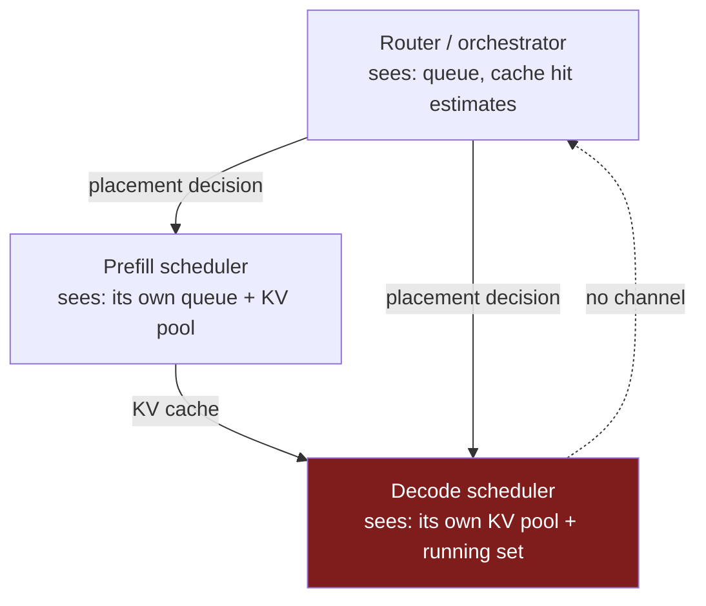
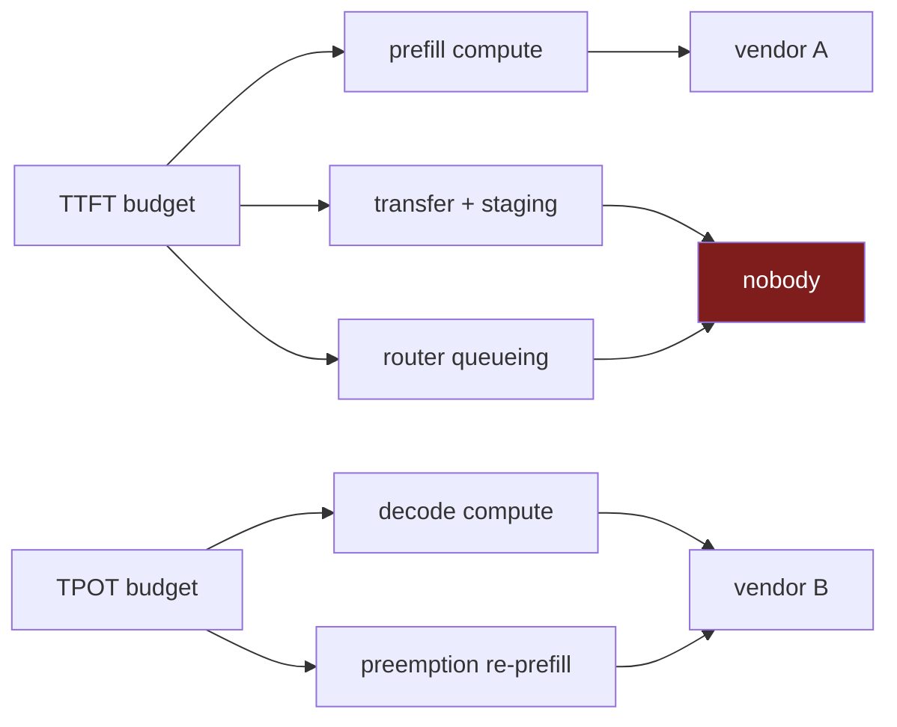

The previous post ended on a pattern: a memory hierarchy works because one component can see the whole path, and disaggregation splits that visibility across two vendors. Scheduling has the same shape, and it fails louder, because the scheduler is not merely optimising. It is the thing holding the system inside its latency budget.

## Continuous batching is a global algorithm

Modern inference throughput comes from continuous batching. Rather than forming a batch, running it to completion, and forming the next one, the engine reconsiders the batch at every decoding step: finished sequences leave, waiting requests join, and the GPU never idles behind the slowest member of a fixed batch. vLLM, SGLang and TGI all work this way.

Making that work requires the scheduler to see and control several things at once.

It sees the **waiting queue** and decides what to admit. It sees **KV memory**, because PagedAttention allocates blocks on demand as sequences grow, so admitting a request is a bet on future memory. When the pool is fully committed the engine is KV-saturated and admits nothing further. And when the running set outgrows what the budget sustains, it **preempts**: evicting a request's blocks, returning it to the waiting queue, and reallocating that memory to sequences that can finish.

Preemption is the interesting one, because the recovery is not free. vLLM offers two modes. Swapping serialises the evicted blocks to host DRAM and copies them back on re-admission. Recomputation throws them away and re-runs prefill when the request is rescheduled. **In vLLM V1, recompute is the default**, on the reasoning that it is cheaper than moving blocks across PCIe.[^1]

Every one of those decisions requires visibility into memory, the queue, and the running set simultaneously. That is fine when one process owns all three.

## Split it, and each half sees half

Disaggregation gives you two engines with two schedulers, plus an external router deciding which instance gets what. Draw the state each can see and the problem is immediate.



The router picks instances but does not run the batch. The prefill scheduler knows its own memory but not the decoder's. The decode scheduler knows its own pressure but did not choose its admissions and cannot decline them. No component owns the end-to-end latency of a request, and the metric everyone is judged on is end-to-end.

That metric is explicitly composite. DistServe's goodput — the framing the whole field adopted — is the sustainable request rate meeting **both** the time-to-first-token and time-per-output-token SLOs, per GPU provisioned. TTFT is produced by prefill, plus queueing, plus the transfer from part three.[^4] TPOT is produced by decode. In a disaggregated deployment those two terms are computed by different machines, and in the AWS and AMD arrangements they are computed by machines from different companies.

## The preemption trap, with field evidence

Now combine those two facts: the decoder preempts by recomputing, and the decoder did not choose its own admissions.

A vLLM RFC filed by the llm-d team spells out what happens. Quoting it directly:

> Request Preemption in vLLM today evacuates the request's KV-cache blocks and they will be reallocated to other RUNNING requests. The preempted request will later be rescheduled (before other WAITING requests), but its local cache had already been discarded.
> This means the *full Prefill* work is done internally inside the Decode instance: including both the prefill work originally done on the Prefiller and all new (possibly many) Output tokens calculated on the Decoder before preemption occurred.[^2]

Read that twice. When a decode instance hits memory pressure, it does not ask the prefiller to redo the prefill. It runs the prefill itself — the original prompt, *plus* every token it has generated since, because those are now part of the context and their KV blocks are gone too.

The decode machine is the one you bought specifically because it is bad at prefill. On the AWS and AMD pairings it is a wafer chosen for bandwidth, not for the compute-bound phase. Memory pressure has just handed it the compute-bound phase.

This is not a theoretical concern. From the same RFC:

> Tests in the field performed by the llm-d team showed this scenario leads to Decode instances starting to execute prefills and eventually locking up due to resource exhaustion.

A cascade: preemption forces prefill, prefill consumes decode resources, resource consumption triggers more preemption.

And the RFC identifies exactly why nobody upstream can fix it from the outside:

> Ideally, all this prefill work would have been done on the Prefiller, but the problem is that the external Router orchestrating P/D has no control over vLLM behavior once the Decode instance received the request.

That sentence is the whole post. Authority over the request ends at the handoff. The router made a placement decision using a cost model, and from that moment the engine schedules autonomously, with no channel back and no shared notion of who is responsible for the outcome.

## The asymmetry, and why it targets your best workloads

The failure is one-directional. Prefill instances do not decode, so their memory does not grow under them, so they do not preempt. The RFC notes that re-executing a prefill on a prefiller would be acceptable anyway. All the risk sits on the decode side.

Worse, it concentrates on precisely the traffic that justified disaggregating in the first place. The RFC again:

> problematic scenarios are more common with workloads that produce longer outputs, which increase the likelihood of request preemption on the Decode instance: as more tokens are generated, more KV-cache blocks are required.

Long outputs are the reasoning models and agent loops from part one — the demand-side shift that made decode-specialised silicon worth buying. The workload that makes the architecture economically necessary is the workload most likely to trigger its worst failure mode.

## And on heterogeneous hardware it is worse than slow

Everything above was measured on GPUs, where a decode instance doing prefill is merely expensive. Change the decoder and it stops being a performance problem.

Recomputation assumes the decode engine can run a prefill at all — that it has the compute for a large batched GEMM over the whole prompt, and that it can materialise KV blocks for the result. A Cerebras wafer was selected for the opposite property. Its advantage is 21 PB/s of SRAM bandwidth against a phase that reads every weight per token; the compute-bound phase is exactly the one it was not bought for.

Then there is the mechanics. Preemption in vLLM means evicting blocks from a paged pool and handing that memory to another sequence. Part three established that a wafer has no pool: KV state lives distributed across hundreds or thousands of processing elements according to a routing schedule the compiler emitted. "Evict these blocks and reallocate them" is a sentence about a paged allocator. It is not obvious what the equivalent operation is on a fabric where placement was decided at compile time, and it is less obvious that it can be done per-request, mid-flight, in response to memory pressure.

Which means the vLLM failure mode does not port cleanly to the heterogeneous case — not because it is solved there, but because the recovery path the GPU engine relies on may not exist. Whatever the AWS and AMD systems do under decode-side memory pressure, it is not the thing vLLM does, and nobody has published what it is.

## What the proposed fix concedes

The RFC's remedy is admission control by rejection. Let a caller attach a minimum cache-hit threshold to a request; if the decoder finds it has less cached than that, it refuses the request and hands it back to the router, which can re-run disaggregation and send the prefill work where it belongs.

There is a phase-two optimisation, and its mechanics are the revealing part. When the decoder rejects a preempted request, it returns the tokens it already generated. The router then constructs a *new* request whose prompt is the original prompt with those output tokens appended, and whose `max_tokens` has been reduced by the number returned. That request goes to the prefiller as if it were fresh.

The system's answer to losing scheduling authority is to reconstruct the request from the outside and replay it. That works, and it tells you plainly that there is no mechanism for the two schedulers to negotiate. The only available move is to cancel and re-enter through the front door.

The RFC is closed and marked stale. It names four orchestrators facing the same problem — llm-d, Dynamo, Production Stack, AIBrix — which is a reasonable proxy for how settled the design is.

## The router is making these calls without a cost model

Given the decoder cannot be steered after handoff, everything rests on the router placing requests well. So look at what a router actually optimises.

Dynamo's KV router scores candidate workers and picks the cheapest. Its configuration, from the Rust source, carries these knobs:[^3]

```rust
pub struct KvRouterConfig {
    /// Device-local prefix-overlap credit multiplier applied to the prefill
    /// load before sampling.
    pub overlap_score_credit: f64,

    /// Decay rate for device-local overlap credit as active prefill load rises
    /// above the least-loaded eligible worker.
    pub overlap_score_credit_decay: f64,

    /// Scale applied after overlap/cache-hit credits reduce the prompt-side
    /// prefill load.
    pub prefill_load_scale: f64,

    /// Block-equivalent cost added for each active request on a candidate
    /// worker.
    pub decode_active_request_weight: f64,

    pub host_cache_hit_weight: f64,
    pub disk_cache_hit_weight: f64,
    pub router_temperature: f64,
    ...
}
```

The load-bearing phrase is **"block-equivalent cost."** Every consideration — prefill work, decode occupancy, a hit in host memory, a hit on disk — is converted into a number of KV blocks so the terms can be added. A block is a unit of memory. The router is expressing "how expensive is this placement" in units of memory, using roughly nine hand-tuned scalars as conversion factors, and then sampling with a temperature.

Look at what has no term at all. There is a weight for a host cache hit and a weight for a disk cache hit. There is nothing for the network. No bandwidth, no topology, no distance.

Part three established that reaching one worker versus another varies by **72x** — around 900 GB/s over NVLink inside a domain, 50 GB/s over InfiniBand between nodes, 12.5 GB/s over TCP between datacenters.[^5] The router chooses among workers spanning that range and its cost function cannot represent the difference. It can tell you that a candidate has more cached blocks. It cannot tell you that the candidate is on the wrong side of a datacenter boundary and the cache you are about to ship will take seventy times longer to arrive.

The knobs are also visibly in flux: `kv_overlap_score_weight` is deprecated in favour of `prefill_load_scale`, with a compatibility shim mapping the old value onto two new fields. That is what an unsettled cost model looks like from the outside.

## Nobody owns the number

Put the pieces together and the governance problem is as hard as the technical one.

A request misses its SLO. Goodput requires both TTFT and TPOT to hold. TTFT was produced by the prefiller, the transfer, and the router's queueing. TPOT was produced by the decoder, possibly after a preemption that forced it to redo work the prefiller had already done. Which vendor's system-level agreement did that violate?

In a single-vendor deployment the question is uninteresting because one operator owns the whole path and one scheduler makes the tradeoff. Disaggregation across vendors turns an engineering question into a contractual one, and none of the interfaces carry the information you would need to answer it. The router does not learn that the decoder preempted. The decoder does not learn what TTFT budget was already consumed before the request arrived. There is no shared request-level accounting across the boundary, and no trace that spans both runtimes without someone building it by hand.



## Where this leaves the series

Three posts in, the pattern is consistent. The KV cache has no interchange format because layouts are co-designed with kernels. Locality has no shared vocabulary because hierarchies are co-designed with compilers. And scheduling has no shared authority because continuous batching was designed as a global algorithm over state that one process owned.

Each of these worked for a decade because one organisation held both ends. None of them is a missing document. They are the same structural fact at three layers, and disaggregation across a vendor boundary is being deployed considerably faster than the interfaces for it are being designed.

There is one axis left, and it is the one with the least tooling of all. Even granting a format, a transport and a scheduler, the values crossing that boundary were produced by an attention kernel the consumer does not contain — different accumulation order, different softmax, different scaling. The decoder is reading a cache its own prefill would never have produced. Part five takes up numerics, determinism, and what any of this does to your ability to evaluate a model.

---

## References

[^1]: **vLLM scheduling and preemption.** Continuous batching reconsiders the batch each decoding step; PagedAttention allocates KV blocks on demand through a per-request block table; when the pool is fully committed the engine admits nothing further and preempts running requests to reclaim blocks. vLLM V1 defaults to recomputation rather than swapping. ([vLLM optimization docs](https://docs.vllm.ai/en/stable/configuration/optimization/), [Inside vLLM](https://vllm.ai/blog/2025-09-05-anatomy-of-vllm))

[^2]: **vLLM RFC #24256, "Add a cache hit threshold to handle Preemptions in PD-Disaggregation."** Filed by the llm-d team. Source of all quoted passages: that a preempted decode request performs the full prefill locally including previously generated output tokens; that field tests showed decode instances executing prefills and locking up on resource exhaustion; that the external router has no control over vLLM behaviour once the decode instance has the request; that longer-output workloads raise preemption likelihood; and the proposed rejection threshold plus the phase-two request-reconstruction optimisation. Closed and labelled stale. Names llm-d, Dynamo, Production Stack and AIBrix as affected orchestrators. ([vllm-project/vllm#24256](https://github.com/vllm-project/vllm/issues/24256))

[^3]: **Dynamo KV router configuration.** `KvRouterConfig` in the Rust source, carrying `overlap_score_credit`, `overlap_score_credit_decay`, `prefill_load_scale`, `decode_active_request_weight` (documented as a "block-equivalent cost added for each active request on a candidate worker"), `host_cache_hit_weight`, `disk_cache_hit_weight` and `router_temperature`, with a deprecation shim mapping the former `kv_overlap_score_weight` onto the newer fields. No term represents network distance or bandwidth. ([`lib/kv-router/src/scheduling/config.rs`](https://github.com/ai-dynamo/dynamo/blob/main/lib/kv-router/src/scheduling/config.rs))

[^4]: **DistServe goodput.** Defined as the sustainable request rate meeting both the TTFT and TPOT SLOs per GPU provisioned; disaggregation is motivated by eliminating the phase interference in which prefill batches inflate TPOT and queued decoding inflates TTFT. ([arXiv:2401.09670](https://arxiv.org/pdf/2401.09670), [OSDI '24](https://www.usenix.org/system/files/osdi24-zhong-yinmin.pdf))

[^5]: **Topology-aware bandwidth variance.** GPU-to-GPU bandwidth varying by 72x with physical relationship — roughly 900 GB/s over NVLink 4.0 within a domain, 50 GB/s over InfiniBand across nodes, 12.5 GB/s over TCP across datacenters. ([arXiv:2607.28633](https://arxiv.org/abs/2607.28633))

---

*Disclaimer: Researched and drafted with AI assistance (Claude Opus 5). Direction, technical judgment, and final edits are mine; every claim is traceable to the sources cited above. The vLLM RFC passages and the Dynamo router configuration are quoted from the sources linked, read on 2026-08-20. I have not operated a disaggregated deployment across the vendor pairings described, and the field-failure evidence cited is the llm-d team's, not mine.*
