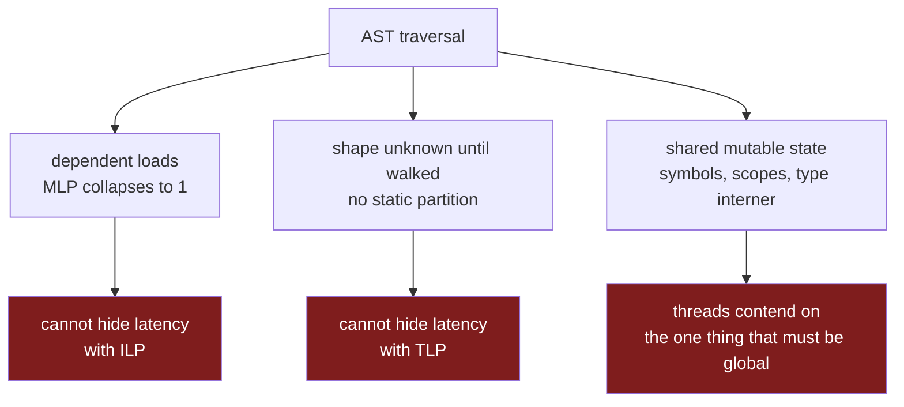
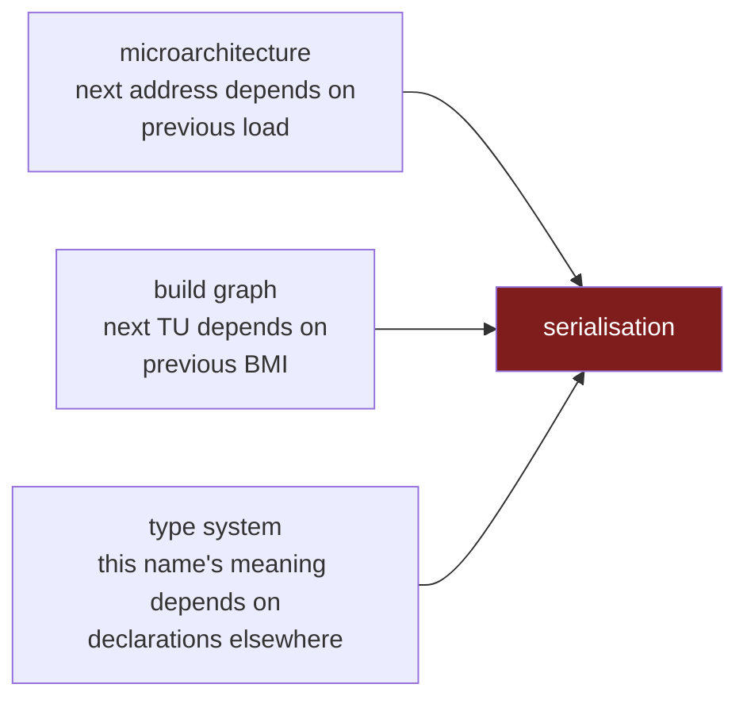

Compilers are the software most likely to be described as embarrassingly parallel and least likely to actually be parallel. Every translation unit is independent, the machine has sixteen cores, and yet the thing that turns your source into an IR is, in almost every production toolchain, a single thread walking a tree.

The usual explanation is that nobody has done the engineering. That is not it. The abstract syntax tree is a data structure whose defining access pattern defeats the mechanisms a modern core uses to hide memory latency, and the module and type systems layered on top of it reintroduce, at two higher levels, exactly the dependence the tree introduces at the lowest one.

## The title, stated precisely

The claim is not that ASTs miss cache sometimes. Every large data structure does. It is that an AST traversal is a **dependent load chain**, and a dependent load chain is the one access pattern against which a modern out-of-order core has no defence.

A core can sustain many outstanding cache misses at once. Load A, load B, load C, and if the addresses are independent they overlap in the memory system, so three misses cost roughly one miss of latency. That is memory-level parallelism, and it is most of why modern hardware feels fast on array code.

Now walk a tree. To visit a child, you dereference a pointer stored in the parent. The address of the next load is the *result* of the previous load. Nothing about the next access is knowable until the current one returns, so in a strict pointer chain, memory-level parallelism collapses toward one.[^1] Every miss is paid in full, serially, at a couple of hundred cycles each.

The hardware prefetcher does not save you either. Prefetchers work by recognising strides and streams. A chain of heap pointers has neither, and the prefetcher gives up.

Then the layout makes it worse. AST nodes are typically allocated individually as they are parsed, so traversal order and address order have no relationship. Two nodes adjacent in the tree may be arbitrarily far apart in memory. A node is often a few dozen bytes, but touching one costs a whole cache line — 64 bytes on most hardware, and [128 on Apple Silicon](), where you drag in twice as much to use the same handful of fields.

Concretely, a node in a conventional frontend looks something like this:

```cpp
// One heap allocation per node. The children are addresses, and the only
// way to reach them is to load this node first.
struct BinaryExpr : Expr {
    Expr        *lhs;        // 8 bytes -- a pointer, and a future cache miss
    Expr        *rhs;        // 8 bytes -- another one
    SourceRange  range;      // 8-16 bytes, usually untouched during type checking
    QualType     type;       // resolved later, mutated in place
    Opcode       op;         // 1 byte. this is the field the visitor wanted.
};
```

A type checker walking this reads `op`, follows `lhs`, reads `op`, follows `rhs`. It touches one to four bytes of a sixty-four byte line, then jumps somewhere unrelated. The fields it does not want — source ranges, parent links, resolved-type slots not yet filled — ride along in the line anyway and evict something that might have been useful.

Now consider the same information as parallel arrays: one array of opcodes, one of left indices, one of right indices. The opcode scan is contiguous and vectorisable, indices are computed rather than dereferenced, and the fields nobody is reading this pass are not in the working set at all. Nothing about the *information* changed. The access pattern did.

So the structure has three properties at once: the accesses are serially dependent, the addresses are unpredictable, and the useful fraction of each fetched line is small. That is not a data structure with a cache problem. That is a data structure that generates cache misses as its primary output.

## Latency is the smaller half

Suppose you accept the misses. The deeper problem is that the same property blocks the escape route.

The standard answer to a memory-bound workload is more threads: if one thread stalls on a miss, another runs. That requires knowing what work to hand each thread. On a tree, you learn the shape of the work by traversing it, and traversing it is the work. You cannot partition a subtree across threads until you know how big it is, and you find out how big it is by walking it.

Work-stealing helps but does not fix it, because load balance depends on tree shape and tree shape is a property of the input program. A deeply nested expression and a flat list of a thousand declarations are the same node count with completely different parallel profiles.

And then there is the state. Parsing is not a pure fold over a tree. It writes to symbol tables, resolves names against scopes, and interns types so that two occurrences of the same type are the same object. All of those are shared mutable structures, and the last one is the interesting one, because interning exists precisely to make identity global.



## The build system was doing the parallelism all along

Zoom out one level and C and C++ look like a success story. Translation units are independent by construction, so `make -j16` saturates the machine, and for thirty years that was enough to make the single-threaded frontend a non-issue.

Notice where the parallelism lives. It is not in the compiler. The compiler is a single-threaded program that the *build system* runs many copies of. The unit of concurrency is a process, and the thing that discovered the concurrency is a dependency graph maintained outside the compiler entirely.

That arrangement was bought with an enormous amount of redundant work. Every translation unit that includes a header parses that header again, from scratch, in its own process, into its own tree. A large project parses the same standard library headers hundreds of times per build. The independence that makes `-j` work is the same independence that guarantees the duplication: nothing is shared, so nothing can be reused.

Precompiled headers were the first attempt to claw that back, and they are exactly the shape of thing that makes parallelism harder — a shared artifact that must exist before the compilations that consume it.

## Modules removed the redundancy and took the parallelism with it

C++20 modules fix the duplication. A module interface is compiled once into a binary module interface, and consumers import the result rather than re-parsing the source. That is a real and large win on total work.

It also converts an antichain into a DAG.

Before modules, the set of translation units had no edges. Any TU could compile at any time, in any order, on any core. After modules, if `B` imports `A`, then `A`'s BMI must exist before `B` compiles. The build has genuine ordering constraints, and the critical path through the module graph is now a lower bound on build time no matter how many cores you own.

The consequences show up immediately in tooling. A build system cannot schedule the work until it knows the graph, and the graph is not visible from file names — it lives inside the source. So the ecosystem grew a separate scanning pass: `clang-scan-deps` emitting the P1689 format that the major compilers agreed on, run before compilation to extract the module dependencies. You now parse the source in order to find out in what order you may parse the source.[^2]

There is even a two-tier choice in how you pay for it. Under one-phase compilation, if `B` depends on `A`, the two compile serially. Under two-phase, you produce `A`'s BMI first with `--precompile`, and `B` can start as soon as `A.pcm` exists rather than waiting for `A` to finish entirely. The whole design of that distinction is an admission that the dependence is now the scheduling problem.

Modules are still worth it. But the trade is explicit: less total work, more constrained ordering. Redundancy was what made the old model parallel.

## Rust has the same problem without the translation units

Rust never had the C model. The compilation unit is a crate, and within a crate, name resolution, trait selection and type inference are crate-global. There is no equivalent of "these thousand files are independent," so there was never a build system quietly supplying the parallelism.

Which makes rustc the best available evidence for how hard this is, because the Rust project has been building a parallel frontend in the open for years. It is on nightly behind `-Z threads=8`.

The reported goal is an average improvement of **20% to 25% on eight cores with eight threads.**[^3]

Read that as a measurement of the problem rather than of the team. A well-resourced compiler group, working with the query-based, demand-driven architecture that was supposed to make this tractable, targets roughly a 1.25x speedup from an 8x increase in threads.

Their own documentation is specific about why, and every reason is a variant of the same thing:

The compiler's central data structure is a problem. `GlobalCtxt` is described as not being friendly to a parallel frontend, and `TyCtxt` together with its **interners and allocators** must be made thread-safe, along with every type any query can return.

Query dependencies produce frequent data contention that limits speedup, because the demand-driven graph has hot nodes that many threads want at once.

Deadlock is a live concern rather than a hypothetical, requiring its own detection algorithm.

And there is a determinism cost that deserves more attention than it gets: the way query cycles are broken depends on the exact state of the query execution graph at the moment the cycle is detected. Which is to say that under threads, *which* error you get from a cyclic definition can depend on scheduling.

The interners appear on that list for the same reason they appear in every design of this kind. Interning is how a compiler makes structural equality into pointer equality, and it is inherently a global agreement. Two threads that independently encounter `Vec<HashMap<String, u32>>` must end up with the same identity for it, which means they must synchronise on exactly the structure that every other part of the frontend consults.

## The type system decides how much of this you can escape

The last level is the language, and it sets a ceiling the implementation cannot exceed.

C++ is famously hostile here even before modules. Argument-dependent lookup means that the meaning of a call depends on the namespaces of its argument types, so introducing a declaration in one place can change the resolution of a call in another. Overload resolution consults a set that is open until the point of use. Template instantiation is demand-driven and crosses every boundary you might have hoped to parallelise on.

Rust's trait system has the same character in a different dialect. Coherence and the orphan rule exist precisely because trait resolution is global: an `impl` anywhere in the crate graph can change which method a call site selects. Type inference propagates constraints across function boundaries within a body and, through trait bounds, well beyond them.

Languages with whole-program inference sit further along the same axis. If your inference unit is larger than your module, then a change anywhere invalidates conclusions everywhere, and the incremental story degrades into the parallel story: neither works, for the same reason.

This is the same constraint that governs incremental rebuilds. The two problems are usually discussed separately, and they are one problem.

Parallelism asks: can two workers proceed without consulting each other? Incrementality asks: can I skip work whose inputs did not change? Both questions reduce to how far the effect of a declaration can travel. If adding an `impl` or an overload can alter resolution in an arbitrary other module, then a worker cannot proceed without consulting a global structure *and* a rebuild cannot prove that any particular downstream conclusion survived. Every language feature that widens the reach of a name widens both failures at once.

This is why "changing one module invalidates everything" and "the frontend will not scale past one core" tend to be true of the same languages. They are the same property, observed from two directions.

This is the part that no amount of engineering removes. A frontend can be made faster, and better data structures help enormously. But if the language specifies that the meaning of a name depends on a global set that any part of the program may extend, then some agreement across all of the program is not an implementation detail. It is the semantics.

## The same shape three times



Three levels, one structure. At the microarchitectural level you cannot issue the next load until the previous one lands. At the build level you cannot compile the next unit until the previous interface exists. At the language level you cannot decide what a name means until you have consulted a set that anything may have contributed to.

In all three cases the dependence is *discovered by doing the work*, which is what makes it resistant to scheduling. You cannot plan around a dependency graph you have to build the thing to learn.

That is why "just use threads" has not worked, and why the interesting attempts start by changing the representation rather than the threading. If the tree is the thing generating both the cache misses and the dependences, then the tree is what has to go — flatten the representation so traversal becomes a scan, and defer the global agreements so that workers are not fighting over an interner at every node.

That is the subject of the talk I am giving at CppCon next month[^4], and I will write up the architecture properly afterwards. This post is only about why the problem is hard, which I think is worth establishing on its own, because most discussions of compiler performance skip straight to implementation and never explain why an obviously parallel workload has stayed stubbornly serial for forty years.

---

## References

[^1]: **Memory-level parallelism and pointer chasing.** In a strict pointer chain where each address depends on the previous load, MLP collapses toward one; prefetchers rely on stride and stream detection and disengage on irregular, non-contiguous access patterns, making every access memory-bound.

[^2]: **C++20 modules dependency scanning.** `clang-scan-deps -format=p1689` emits module dependency information in the P1689R5 format agreed by the major compilers; a build tool must invoke the compiler in dependency order to produce BMIs before their consumers. Under one-phase compilation two module units where `B` depends on `A` must compile serially, whereas two-phase compilation lets `B` start once `A.pcm` is available. ([Clang standard modules documentation](https://clang.llvm.org/docs/StandardCPlusPlusModules.html), [import CMake](https://www.kitware.com/import-cmake-c20-modules/))

[^3]: **Parallel rustc frontend.** Available on nightly via `-Z threads=8`, with a stated goal of an average 20–25% improvement on eight cores and eight threads. Documented obstacles include `GlobalCtxt` being unfriendly to parallelism, the requirement that `TyCtxt` with its interners and allocators plus every query-returned type be thread-safe, data contention arising from query dependencies, the need for a deadlock detection algorithm, and query-cycle breaking that depends on the state of the query execution graph when the cycle is detected. ([Rust project goals](https://rust-lang.github.io/rust-project-goals/2025h1/parallel-front-end.html), [rustc-dev-guide](https://github.com/rust-lang/rustc-dev-guide/blob/main/src/parallel-rustc.md), [tracking issue #113349](https://github.com/rust-lang/rust/issues/113349), [announcement](https://blog.rust-lang.org/2023/11/09/parallel-rustc/))

[^4]: **"Escaping the AST: A Data-Oriented, Lock-Free Parallel Compiler Architecture."** CppCon 2026, Monday 14 September 2026. ([Session page](https://cppcon2026.sched.com/event/2RT4Y/escaping-the-ast-a-data-oriented-lock-free-parallel-compiler-architecture))

---

*Disclaimer: Researched and drafted with AI assistance (Claude Opus 5). Direction, technical judgment, and final edits are mine; every claim is traceable to the sources cited above. The rustc figures and obstacle list are the Rust project's own published targets and documentation rather than measurements of mine, and the C++ modules scheduling behaviour is quoted from Clang's documentation rather than benchmarked here.*
