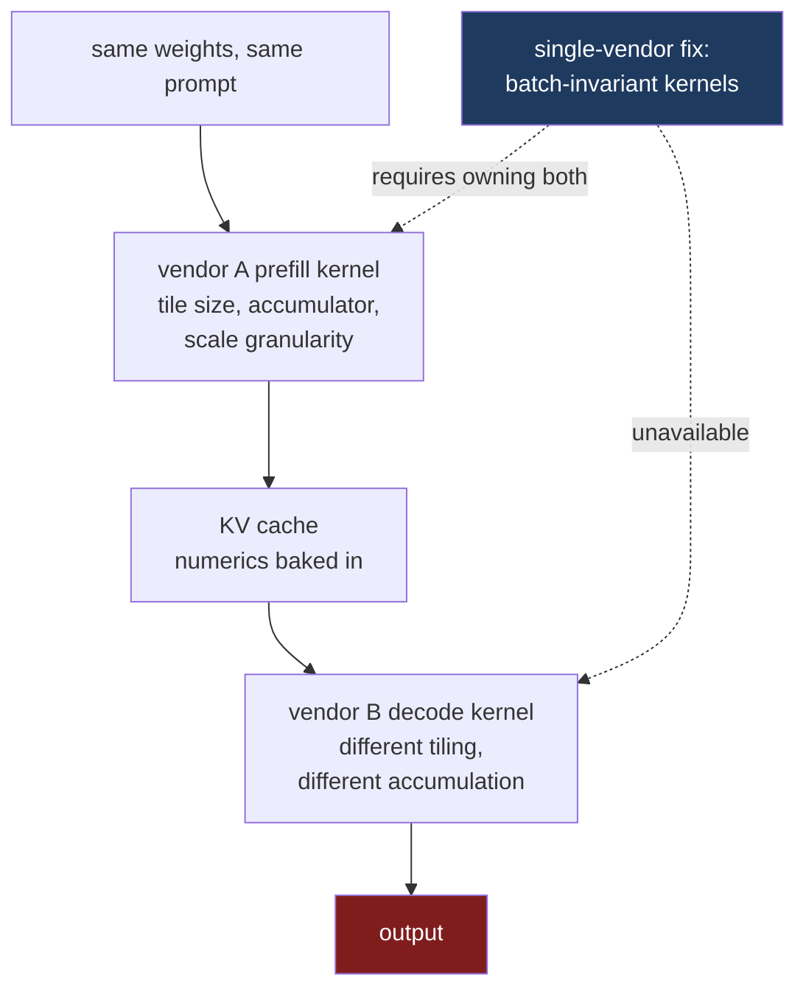

The three previous posts each assumed the next one would be fine. Part two worked out that a KV cache has no interchange format, on the assumption that if two vendors agreed on a layout the bytes would move. Part three worked out that the bytes cannot be placed, on the assumption that if they landed the scheduler would cope. Part four worked out that the scheduler has no authority across the boundary, on the assumption that whatever does arrive is at least *correct*.

That last assumption is the one I want to take apart, because it is the most load-bearing and the least examined.

A KV cache is not data. It is the output of a computation. Ship it to a machine whose attention kernel differs from the one that produced it, and the decoder is reading a cache its own prefill would never have produced.

## Two correct implementations disagree

Floating-point addition is not associative. `(a + b) + c` and `a + (b + c)` are different numbers, and which one you get depends on the order a kernel chooses to accumulate.

That is not a bug anyone is going to fix. It is a property of the representation, and every fast kernel makes ordering choices for performance reasons. A tiled attention kernel disagrees with a naive reference implementation in the low-order bits, and two tiled kernels with different tile sizes disagree with each other.

Attention is unusually exposed to this. FlashAttention does not materialise the full score matrix; it walks key and value tiles, keeping a running maximum and a running normaliser, and rescales the accumulated output each time the maximum moves. Because the global information the softmax needs is unavailable inside a single block, the algorithm reintroduces it through per-tile rescaling factors. Change the tile size and you change where those rescalings happen, which changes where rounding happens, which changes the result.[^2]

Stack the other degrees of freedom on top. Whether the accumulator is fp32 or fp16. Which tensor-core instruction the kernel selects. Whether the reduction is split across thread blocks and recombined. And for a quantised cache, the granularity of the scale factors, which determines what gets clipped and what survives — recall from part two that the 656-byte MLA entry carries four fp32 scales for 512 fp8 elements, a specific choice about how finely to track dynamic range.[^3]

None of these is a correctness question. Every combination is a legitimate implementation of attention. They simply do not produce the same numbers.

## The single-vendor version is already broken, and somebody measured it

Before reaching across a vendor boundary, look at how bad this already is inside one.

Thinking Machines published a result last year that deserves to be better known. They sent the same request a thousand times to an LLM endpoint, with everything nominally fixed — same weights, same prompt, temperature zero.

They got **eighty unique completions**, with the first divergence at **token 103**.[^1]

The cause is not GPU nondeterminism in the usual folk sense. Their finding is that "the primary reason nearly all LLM inference endpoints are nondeterministic is that the load (and thus batch-size) nondeterministically varies." Kernels are not batch-invariant: the numerical result for a given element changes with the batch size it happened to be computed in. Compose a kernel that is sensitive to batch size with a serving system whose batch size depends on other users' traffic, and a request's output depends on who else was talking to the model at the same moment.

The mechanisms are the ones listed above. RMSNorm switches to split reductions when batches shrink. Matrix multiply uses Split-K and picks different tensor-core instructions based on the batch dimension. Attention decomposes the sequence differently depending on shape and scheduling.

The fix they demonstrate is exactly what the diagnosis implies: make the kernels batch-invariant, so that "the reduction order for each element must be fixed regardless of the batch-size of the kernel." With batch-invariant kernels, all thousand completions were identical.

Notice what that fix required. They rewrote the kernels. Normalisation, matmul and attention, all three, to use one universal reduction strategy regardless of shape.

## That fix does not survive disaggregation

The repair is available when you own the kernels. Across a vendor boundary you own one of them.

In the AWS and AMD pairings, prefill runs one company's attention implementation and decode runs another's. There is no version of "make the reduction order consistent" that you can apply, because consistency is a property of a pair, and nobody has the ability to modify both halves. You cannot even establish what the other side does: its tiling, accumulator width and scale granularity are internal details of a proprietary kernel, and no interface in the stack asks for them.

So the batch-invariance problem is not merely still present. It has been joined by a larger one that admits no equivalent solution.

## The cache is persistent state, which makes it worse than a perturbation

There is a structural reason this matters more in a disaggregated system than the batch-size story suggests, and it is easy to miss.

In the single-machine case, a numerical difference perturbs one forward pass. The next token is computed from a context recomputed the same way, so errors do not obviously compound in a directed manner.

A KV cache is different. It is the prefiller's numerics, *stored*, and then read as context for every subsequent token the decoder produces. The prompt is not re-derived on the decode machine; the cache is the only record of it. So a prefiller whose scale granularity clips slightly differently has not introduced a transient error, it has established the premise from which the entire generation follows.

That also means the divergence has a specific shape. It does not accumulate gradually from token one. It is fixed at handoff, and then every token is generated from that fixed, slightly-different context.

## Three things this breaks

**Reproducibility, as an operational property.** Two identical requests can be served by different decode instances, with different batch composition, from a cache produced by a prefiller under different load. The set of things that must match for a byte-identical rerun now spans two organisations' scheduling decisions.

**Evaluation validity.** You evaluate on some configuration and serve on another. That gap has always existed, but disaggregation widens what counts as "configuration" to include which vendor's prefill produced the cache. An eval run against a colocated deployment does not describe the disaggregated one, and there is no version string that captures the difference.

**Bisection.** This is the one that hurts in practice. A generation comes out wrong. In a single-engine system you re-run with logging, pin the seed, bisect the pipeline. Here, neither half reproduces the failure alone: the prefiller produced a cache that looked fine and the decoder consumed it correctly. To reproduce you need both machines, in the same load conditions, with the same batch composition on each side. The failure is a property of the pair.

## Nowhere in the stack is there a place to say any of this

Walk the interfaces this series has examined and look for a field describing numerics.

vLLM's KV connector, from part two, moves a `torch.Tensor` with vLLM's own `AttentionMetadata` alongside it. Shape, dtype, layout. Nothing about accumulation order, tile size or scale granularity.

NIXL's descriptor, from part three, is `(addr, len, devId)`. A byte range on a device.

Dynamo's router, from part four, prices candidate workers in block-equivalent cost. It models cache hits in host memory and on disk. It has no notion that two workers might compute differently.

This is the pattern the whole series keeps arriving at, in its purest form here. The problem is not that the industry has considered numeric compatibility and chosen a permissive policy. It is that there is no field, in any interface, in which such a policy could be written down. A vendor pair that wanted to guarantee bit-exact compatibility has no way to state the guarantee, and a deployment that wanted to check it has nothing to check against.

## What all five posts add up to

Five parts, five layers, and the same structure at each.

| Layer | What is co-designed | What crossing the boundary loses |
|---|---|---|
| Silicon (1) | phase to hardware | one SKU cannot serve both phases |
| Format (2) | layout with kernels | no interchange representation |
| Locality (3) | hierarchy with compiler | no shared vocabulary for placement or cost |
| Scheduling (4) | batching with global state | no authority, no shared SLO |
| Numerics (5) | values with implementation | no contract, no reproducibility |

Reading down that table, a programming model that made heterogeneous inference tractable would have to be able to express at least five things that are currently inexpressible.

**Where a stage runs**, as something the system knows rather than something a YAML file asserts. **What the bytes mean**, precisely enough that a foreign kernel can consume them. **Where a tensor physically resides and what moving it costs**, in terms richer than a pointer and a device number — including, per a good correction I got on part three, the possibility that placement is chosen by the receiver on arrival rather than encoded in the handle, which is what Intel's DDIO does at the cache level.[^4] **Who may preempt whom, and who owns which term of the latency budget.** And **what the values are permitted to be** — the numeric contract that would let two implementations agree, or at least let a deployment discover that they do not.

Every one of those is something a compiler already knows about its own machine. None of them is something it can currently tell anyone else's.

I will not pretend to know the right shape for that. What I am fairly confident of is the diagnosis: none of these five gaps is a missing document, and none is a plumbing problem. They are all the same consequence of splitting an optimisation domain that every one of these systems assumed it owned, and they arrived together because the split arrived all at once.

The hardware argument from part one is settled. Prefill and decode want different computers, the economics are compelling, and the deals are signed. The interfaces are roughly twenty years behind that, and the gap is not closing on its own.

---

## References

[^1]: **Defeating Nondeterminism in LLM Inference.** Thinking Machines Lab. Reports 1,000 identical requests producing 80 unique completions with first divergence at token 103; identifies that "the primary reason nearly all LLM inference endpoints are nondeterministic is that the load (and thus batch-size) nondeterministically varies"; names RMSNorm split reductions, matmul Split-K with batch-dependent tensor-core instruction selection, and attention sequence decomposition as the three operations requiring batch-invariant rewrites; states that "the reduction order for each element must be fixed regardless of the batch-size of the kernel"; and reports that with batch-invariant kernels all 1,000 completions are identical. ([Thinking Machines](https://thinkingmachines.ai/blog/defeating-nondeterminism-in-llm-inference/), [summary](https://simonwillison.net/2025/Sep/11/defeating-nondeterminism/))

[^2]: **FlashAttention numerics.** The online-softmax formulation keeps running row-wise maxima and normalisers and applies per-tile rescaling factors, because the global information softmax requires is unavailable within a single block. Floating-point addition and multiplication are not associative, so a tiled kernel can disagree with a reference implementation in the low-order bits, and two backends can use different accumulation precision. Low-precision settings compound this through biased rounding in the accumulation routines.

[^3]: **MLA cache scale granularity.** The `fp8_ds_mla` entry examined in part two stores 512 fp8 elements of compressed latent with four fp32 tile scales and a 64-element bf16 positional region, in 656 bytes — a specific choice about how finely dynamic range is tracked, made by the kernel that writes it. ([`cache_kernels.cu`](https://github.com/vllm-project/vllm/blob/main/csrc/libtorch_stable/cache_kernels.cu))

[^4]: **Intel Data Direct I/O.** DDIO makes the processor cache rather than main memory the destination for inbound DMA, with the allocating region statically limited to a portion of the LLC to avoid thrashing from I/O bursts or unconsumed data streams — an existing instance of the receiving platform, rather than the sending descriptor, choosing which level of the hierarchy a transfer lands in. ([Intel](https://www.intel.com/content/www/us/en/io/data-direct-i-o-technology.html))

---

*Disclaimer: Researched and drafted with AI assistance (Claude Opus 5). Direction, technical judgment, and final edits are mine; every claim is traceable to the sources cited above. The nondeterminism figures are Thinking Machines' published measurements rather than mine; I have not run a cross-vendor disaggregated deployment, and the claim that two vendors' attention kernels differ numerically is an argument from how the kernels are constructed rather than a measurement of the AWS or AMD systems, whose kernel internals are not public.*
