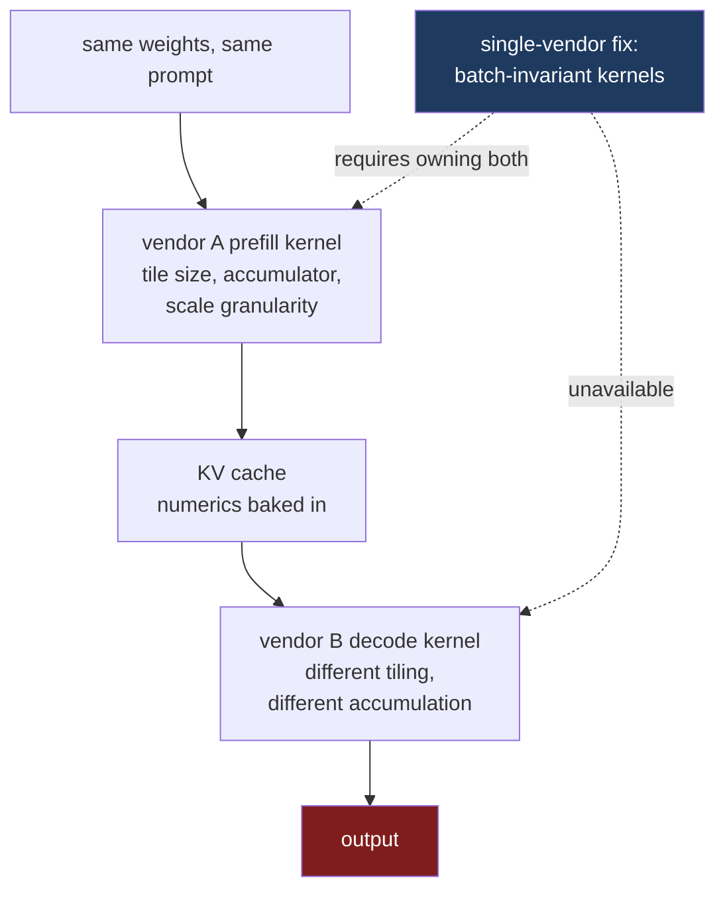

Each of the previous three posts assumed the next layer of the stack would save it. [Part two]() showed that KV caches lack an interchange format, assuming the bytes would flow if two vendors merely agreed on layout. [Part three]() proved you cannot target a physical placement, assuming the scheduler could handle it anyway. [Part four]() demonstrated the scheduler has zero authority across the boundary, banking on the blind faith that whatever bits finally arrive are at least correct.

That final assumption is the fatal one. It carries the weight of the entire architecture, but falls apart the second you actually look at the math.

A KV cache is not passive data. It is the baked output of a specific computation. Hand it to a decoder running a different attention kernel than the one that generated it, and you force that decoder to consume a cache its own prefill would never have emitted.

## Two correct implementations disagree

Floating-point math lacks associativity. Compute `(a + b) + c` versus `a + (b + c)` and you get different answers. The result hinges entirely on the exact accumulation order a kernel author chose.

No one considers this a bug. It is a fundamental reality of the representation. High-performance kernels deliberately make ordering tradeoffs to go fast. Any tiled attention kernel will deviate from a naive reference implementation in the low-order bits. Two tiled kernels using different tile sizes will deviate from each other.

Attention is inherently exposed to this. FlashAttention skips materialising the full score matrix. It walks key and value tiles instead, updating a running maximum and normaliser, and rescaling the accumulated output whenever the maximum shifts. The global state the softmax operation demands does not exist within a single block, so the algorithm reintroduces it via per-tile rescaling. Alter the tile size, and you alter the rescaling trigger. That shifts the rounding. That changes the math.[^2]

Layer the remaining hardware-specific degrees of freedom over that. Maybe the accumulator uses fp32, maybe fp16. The specific tensor-core instructions selected. Whether the reduction splits across thread blocks before recombining. For quantised caches, the scale factor granularity dictates what is clipped versus preserved. The 656-byte MLA entry from part two embeds four fp32 scales for 512 fp8 elements — a highly specific, opinionated choice about tracking dynamic range.[^3]

None of this represents a correctness failure. Each variation is a mathematically valid implementation of attention. They just yield divergent numbers.

## Single-vendor deployments are already nondeterministic

Before examining a multi-vendor split, look at how fragile this gets on a single machine.

Thinking Machines published a result last year that deserves to be better known. They hammered an LLM endpoint with the same request a thousand times. Fixed weights, fixed prompt, temperature zero.

They retrieved **eighty unique completions**. The first divergence hit at **token 103**.[^1]

Do not blame random GPU nondeterminism. Their core finding is that "the primary reason nearly all LLM inference endpoints are nondeterministic is that the load (and thus batch-size) nondeterministically varies." Most kernels are not batch-invariant. A computed element's numerical value shifts depending on the surrounding batch size. Slap a batch-sensitive kernel into a serving system where batch sizes fluctuate based on concurrent traffic, and your request's output is tied to whatever else other users happened to be generating at that moment.

The underlying mechanics match what I described above. RMSNorm pivots to split reductions on smaller batches. Matmul invokes Split-K and swaps tensor-core instructions based purely on the batch dimension. Attention decomposes the sequence differently based on the exact shape the scheduler hands it.

The remedy they demonstrated is as brutal as the diagnosis suggests: force the kernels to be batch-invariant, ensuring "the reduction order for each element must be fixed regardless of the batch-size of the kernel." After that rewrite, all thousand completions matched.

Look at the cost of that fix. They had to rewrite the kernels. Normalisation, matmul, and attention. All three had to adopt a single, inflexible reduction strategy oblivious to tensor shape.

## That fix dies at the disaggregation boundary

You can execute that repair when you control the kernels. Across a vendor boundary, you own exactly half the equation.

Take either announced pairing — AWS with Cerebras, or AMD with Cerebras. Prefill executes one company's attention kernel; decode runs another's. You cannot enforce a consistent reduction order. Consistency is a property of the paired systems, and no single entity holds the keys to both. You cannot even reverse-engineer what the remote side is doing. Their tiling geometry, accumulator width, and scale granularities are unpublished implementation details of a proprietary kernel, and none of the interfaces in this series asks for them.

The batch-invariance problem survives, and it brings a larger one with it — larger because the fix that worked inside one vendor has no equivalent here. Part three's three remedies still apply, and still do not generalise: a bilateral agreement between two partners, a neutral form that costs conversion, or one side emitting in the other's terms.

## The cache is persistent state. That makes it worse.

This matters heavily in a disaggregated system for a structural reason that is easy to overlook.

When a numerical deviation occurs in a normal neural network layer, it typically perturbs a single forward pass. It is a transient error. The KV cache is different. It represents the prefiller's exact numerical choices, *solidified into state*, and treated as ground truth for every subsequent token the decoder spits out.

The decoder does not re-derive the prompt. The cache is its only historical record. So when a foreign prefiller's scale granularity clips just a bit differently, it does not introduce a momentary glitch. It locks in a faulty premise that drives the entire generation sequence.

The resulting divergence is not a slow drift. It is a harsh discontinuity fixed at the exact moment of handoff. Every subsequent decode step propagates that slightly foreign context.

## What this actually breaks

**Operational Reproducibility.** Identical requests might hit different decode instances, featuring different batch dimensions, reading from a cache generated by a prefiller experiencing totally different load. Generating a byte-identical rerun requires synchronizing the transient scheduling state of two separate corporations.

**Evaluation Validity.** Serving on a different configuration than you evaluated on is an old sin, but disaggregation expands "configuration" to include the specific vendor prefill that built the cache. A benchmark executed against a colocated deployment does not describe the disaggregated reality, and no config flag captures the delta.

**Pipeline Bisection.** This is where the pain actually lives. A generation comes back subtly wrong. On a single engine, you pin the seed, crank up logging, and bisect. In a split system, neither side fails in isolation. The prefiller dumped a cache it considers perfect. The decoder processed it flawlessly. Replicating the bug requires spinning up both machines, under identical loads, with identical batch compositions. The failure belongs exclusively to the pairing.

## The stack is entirely blind to this

Scan every interface I have walked through in this series. Look for a struct field describing numerics. You will not find one.

vLLM's KV connector, discussed in part two, shifts a `torch.Tensor` alongside `AttentionMetadata`. Shape, dtype, layout. It has zero awareness of accumulation order, tile geometry, or quantisation scales.

NIXL's descriptor from part three resolves to `(addr, len, devId)`. A raw byte slice on a card.

Dynamo's router from part four ranks workers using block-equivalent costs, modeling cache strikes in host RAM and disk. It fundamentally lacks the concept that two workers might yield different math.

This is the exact dead end this series keeps hitting. The industry did not deliberately review numeric compatibility and settle on a relaxed standard. The fields simply do not exist. There is no API surface to encode a strict numerical policy. If two vendors wanted to enforce bit-exact execution, they have no protocol to express it. If you wanted to validate it, you have nothing to assert against.

## What all five parts actually mean

Five parts, five layers, identical structural failure at every single one.

| Layer | What is co-designed | What crossing the boundary loses |
|---|---|---|
| Silicon (1) | phase to hardware | one SKU cannot serve both phases |
| Format (2) | layout with kernels | no interchange representation |
| Locality (3) | hierarchy with compiler | no shared vocabulary for placement or cost |
| Scheduling (4) | batching with global state | no authority, no shared SLO |
| Numerics (5) | values with implementation | no contract, no reproducibility |

Read down that table. Any programming model capable of wrangling heterogeneous inference requires expressing at least five things that remain entirely inexpressible today.

**Where a stage runs.** The system must know it, not just read a YAML assertion. **What the bytes actually mean.** Specified down to a level where a foreign kernel can safely consume them. **Where a tensor physically resides and what moving it costs.** You need richer semantics than a flat pointer and a device ID. As someone pointed out regarding part three, receivers might choose placement dynamically on arrival—Intel's DDIO does exactly this at the cache level, totally ignoring the sending descriptor.[^4] **Who preempts whom, and who owns the latency budget.** And finally, **what the values are permitted to be.** A strict numeric contract allowing two implementations to either align, or cleanly fail when they do not.

A compiler inherently knows all five of these things about its own local machine. It cannot communicate a single one to a remote peer.

I do not have a pristine architecture diagram that fixes this. But the diagnosis is solid. These five failures are not missing docs or neglected Jira tickets. They are the direct consequence of ripping apart an optimisation domain that every internal system assumes it entirely owns. The split happened everywhere, all at once.

The hardware argument from [part one]() is over. Prefill and decode require totally different silicon. The economics are undeniable, the contracts are signed. Our interfaces are two decades behind the hardware reality, and they will not heal themselves.

---

## References

[^1]: **Defeating Nondeterminism in LLM Inference.** Thinking Machines Lab. Reports 1,000 identical requests producing 80 unique completions with first divergence at token 103; identifies that "the primary reason nearly all LLM inference endpoints are nondeterministic is that the load (and thus batch-size) nondeterministically varies"; names RMSNorm split reductions, matmul Split-K with batch-dependent tensor-core instruction selection, and attention sequence decomposition as the three operations requiring batch-invariant rewrites; states that "the reduction order for each element must be fixed regardless of the batch-size of the kernel"; and reports that with batch-invariant kernels all 1,000 completions are identical. ([Thinking Machines](https://thinkingmachines.ai/blog/defeating-nondeterminism-in-llm-inference/), [summary](https://simonwillison.net/2025/Sep/11/defeating-nondeterminism/))

[^2]: **FlashAttention numerics.** The online-softmax formulation keeps running row-wise maxima and normalisers and applies per-tile rescaling factors, because the global information softmax requires is unavailable within a single block. Floating-point addition and multiplication are not associative, so a tiled kernel can disagree with a reference implementation in the low-order bits, and two backends can use different accumulation precision. Low-precision settings compound this through biased rounding in the accumulation routines.

[^3]: **MLA cache scale granularity.** The `fp8_ds_mla` entry examined in part two stores 512 fp8 elements of compressed latent with four fp32 tile scales and a 64-element bf16 positional region, in 656 bytes — a specific choice about how finely dynamic range is tracked, made by the kernel that writes it. ([`cache_kernels.cu`](https://github.com/vllm-project/vllm/blob/main/csrc/libtorch_stable/cache_kernels.cu))

[^4]: **Intel Data Direct I/O.** DDIO makes the processor cache rather than main memory the destination for inbound DMA, with the allocating region statically limited to a portion of the LLC to avoid thrashing from I/O bursts or unconsumed data streams — an existing instance of the receiving platform, rather than the sending descriptor, choosing which level of the hierarchy a transfer lands in. ([Intel](https://www.intel.com/content/www/us/en/io/data-direct-i-o-technology.html))

---

*Disclaimer: Researched and drafted with AI assistance (Claude Opus 5 and Gemini 3.1 Pro). Direction, technical judgment, and final edits are mine; every claim is traceable to the sources cited above. The nondeterminism figures are Thinking Machines' published measurements rather than mine; I have not run a cross-vendor disaggregated deployment, and the claim that two vendors' attention kernels differ numerically is an argument from how the kernels are constructed rather than a measurement of the AWS or AMD systems, whose kernel internals are not public.*
