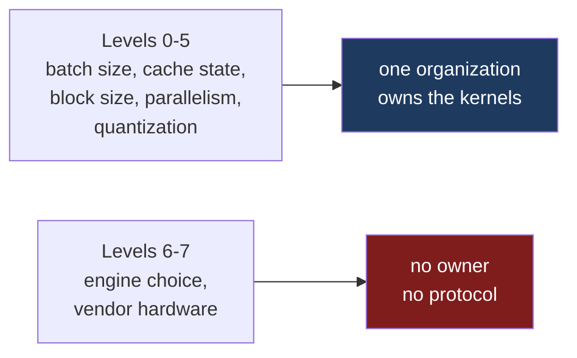

Prefix caching can cause the same prompt to produce different logits on a cache hit versus a cache miss. In many operational contexts, this is quickly categorized as a defect. However, a bug strictly implies the violation of a specification. In this domain, no such specification exists.

[Part five]() argued that a key-value (KV) cache carries the numeric signature of the specific kernel configuration that generated it. This becomes a systemic issue when prefill and decode phases execute under differing configurations or across disparate vendor implementations. The engineering effort required to control that variance is a good measure of how deep the property runs.

## The engineering cost of determinism

Both major serving engines have attempted to enforce determinism, and the shape of those attempts is the evidence. SGLang #10278, "[Feature] Support deterministic inference with Batch Invariant Ops," enumerates 28 requirements spanning attention backends, quantization schemes, expert parallelism, and speculative decoding drafters. Seventeen are checked. Eleven are not, among them all four quantization entries and "Not deterministic on Blackwell for TP4." The issue is now closed and labelled inactive.[^1]

vLLM #34046, still open, proposes an opt-in `--deterministic-prefix-caching` flag: a cache-miss prefill is split at the last block boundary so the suffix GEMM runs with the same `M` regardless of what was already cached.[^2]

The mechanism driving the variance is straightforward:

| Request | Cache State | Tokens Computed | GEMM M Dimension |
|---|---|---|---|
| Run 1 | Miss | All N tokens in one pass | M = N |
| Run 2+ | Hit | Only uncached suffix | M = N % block_size |

GEMM backends, such as cuBLAS or Tensile, select optimal tile configurations dynamically based on the `M` dimension. Different tiling choices dictate different K-dimension reduction partitions. The reproducibility failure follows from what those partitions do to floating-point arithmetic.

## The low-level math of tile shapes

When a library like cuBLAS executes a matrix multiplication, it does not calculate the dot product of a row and a column sequentially in a single thread. It partitions the K-dimension across the Streaming Multiprocessors (SMs) using heavily optimized block tile shapes.

For a large `M` dimension (a cache-miss prefill), the library might select a large tile size (e.g., `128x128x32`), distributing partial sums across multiple thread blocks and combining them using atomic adds in global memory or specific warp-level reduction trees using `__shfl_down_sync()`. For a small `M` dimension (a cache hit calculating only the suffix), the library will likely select a completely different tile shape (e.g., `64x64x32` or even `16x16x16`) to maximize occupancy for a small workload.

Different tile shapes dictate different reduction trees. A different reduction tree changes the temporal order in which partial sums are accumulated. Because floating-point addition is non-associative—meaning `(A + B) + C ≠ A + (B + C)` due to rounding at the 23rd bit of the FP32 mantissa—altering the accumulation order guarantees divergent results. Even when accumulation is performed in FP32 before downcasting to BF16 for storage, these differing accumulation trees routinely produce results that diverge by 1 Unit in the Last Place (ULP).

This is not a race condition. Hold the matrix dimension fixed, and with no global atomics in the reduction the accumulation order is fixed with it: run `M=31` a billion times and the answer does not move. Split-K kernels that combine partial sums through atomic adds in global memory are the exception, and they do vary between runs, which is why Level 0 below is qualified rather than solved. The variance this post is about is a different thing entirely. It comes from the library remapping the problem onto the memory hierarchy the moment the shape changes.

## The physics of the cascade

A single ULP difference at the start of a network is rarely terminal on its own, but deep transformer architectures are not linear systems; they act as amplifiers for numeric perturbations.

The vLLM pull request measures this layer by layer on Qwen3-0.6B running on ROCm:

| | Elements Differing | Max Difference |
|---|---|---|
| Layer 0 | 1 of 92,160 | 0.008 (1 ULP) |
| Layer 14 | ~13,500 | 0.5 |
| Layer 27 | ~14,100 | 8.0 |
| Logits | 129,895 of 151,936 | Argmax flips |

An imperceptible 1 ULP shift becomes an absolute difference of `8.0` because the residual stream is threaded through non-linearities at every layer.

When a 1 ULP discrepancy passes through RMSNorm, it shifts the root-mean-square taken over the entire hidden state. That single statistic divides every element of the vector, so a perturbation in one element is immediately broadcast to all of them. When this perturbed vector enters the attention mechanism, the Softmax operation applies an exponential function (`exp(x)`). Exponential functions aggressively stretch minor differences in input scores. When multiplied against the value matrix, the perturbation spreads across the feature dimensions.

By Layer 14, the error has bounced through 14 layers of exponential stretch, global normalization, and SwiGLU gating. The error margin grows from `0.008` to `0.5`. By Layer 27, it hits `8.0`. At the final projection to the vocabulary space, the accumulated variance fundamentally alters the output distribution, shifting the logits enough to flip the top-1 token choice.

While non-zero sampling temperatures dilute the immediate impact of an argmax flip, they do not resolve the underlying reproducibility failure. Divergent logits guarantee that a run cannot be reliably replayed, regardless of the downstream sampling strategy or fixed random seeds.

## Feature versus defect

The engineer who identified this discrepancy originally filed it as a bug: **`[Bug][ROCm]: Prefix caching produces different output on first request (cache miss) vs subsequent requests (cache hit)`**.[^3]

The same engineer then implemented the fix and reclassified it as a **`[Feature]`**, noting in the PR:

> All methods are identical in accuracy --- the GEMM is working correctly. The 12 differing elements between M=31 and M=15 paths are a consequence of different tile-level K-reduction ordering, **not a precision bug.**

This distinction is critical. Designating a behavior as a bug asserts a deviation from a required contract. In this case, neither vLLM nor the underlying GEMM libraries have ever guaranteed bitwise equivalence across varying matrix dimensions. Optimizing tile selection by shape is the precise mechanism by which these libraries achieve high utilization.

`--deterministic-prefix-caching` does not restore broken behavior. It establishes a new and stricter operational guarantee that trades scheduling flexibility for numeric consistency.

## The determinism hierarchy

"Determinism" in ML systems is an overloaded term. It represents a hierarchy of invariants, each requiring distinct engineering tradeoffs:

| Level | Output is invariant to | Status |
|---|---|---|
| 0 | Repeating the identical call | Largely solved (fixed kernel, fixed shape, no atomics). |
| 1 | Batch size | Attempted; 11 of 28 items unresolved when SGLang #10278 went inactive. |
| 2 | Cache hit vs miss | Addressed via scheduling constraints (vLLM #34046, open). |
| 3 | KV block size | Inherently follows from Level 2. |
| 4 | Parallelism degree (TP/DP/EP) | Partially solved (deterministic all-reduce available, but edge cases remain). |
| 5 | Quantization scheme | Unsolved; dynamic range constraints make scale granularity inherently variable. |
| 6 | Engine choice (e.g., vLLM vs SGLang) | Unattempted. |
| 7 | Vendor hardware (e.g., TPU vs GPU) | Currently inexpressible. |

When hardware vendors claim deterministic execution, they generally refer to Level 0. When inference engineers discuss nondeterminism, they are typically debugging failures at Level 1 or 2.[^4]

## The arithmetic cost of batch-invariant kernels

Enforcing these invariants is generally assumed to incur steep performance penalties, but the reality depends heavily on which level of the hierarchy you target.

**Levels 2 and 3** are inexpensive. The vLLM implementation reports a throughput change of −0.4% at a 0% cache hit rate and −0.02% at 95%: under half a percent in the worst case. The only cost is a scheduling constraint forcing cache-miss prefills to align to block boundaries. At that price, the behavior would be defensible as a default rather than an opt-in flag.

**Level 1**, however, requires invasive kernel modifications. To guarantee that a batch size of 1 produces the exact same logits as a batch size of 256, the inference engine must utilize "batch-invariant" operations.

Under the hood, a batch-invariant kernel must enforce a static reduction tree regardless of the input shape. It cannot dynamically switch to a smaller, faster tile configuration for a small batch. Instead, it must map every operation to the same rigid topological reduction order, padding small batches to large tile boundaries. This approach intentionally bypasses shape-specialized heuristics. It results in underutilized warps, wasted register reads, and a deliberate degradation of peak throughput in service of strict numerical reproducibility.

**Level 4** compromises collective communication efficiency. A strictly deterministic `all_reduce` cannot utilize dynamic or topology-optimized reduction trees (e.g., ring-reduce vs. tree-reduce depending on instantaneous link bandwidth), forcing the cluster to adopt a rigid, often sub-optimal communication pattern.

## The anatomy of the missing numeric contract

Levels 0 through 5 share a defining characteristic: they can be resolved internally by a single engineering organization controlling the engine architecture.

Levels 6 and 7 represent a shift from technical implementation to industry coordination. Requiring two distinct engines to produce identical logits (Level 6) necessitates strict, maintained agreements on reduction order, accumulator precision, and scale granularity.

Level 7 (disaggregated inference across different hardware or vendors) exposes a void in current systems architecture. To achieve bitwise reproducibility across a network boundary where one vendor generates a KV cache and another consumes it, a rigorous numeric specification — the ABI that [part two]() found missing — must be established.

At a minimum, this contract must define in the tensor metadata:
- **Accumulator Precision:** Explicit separation from storage precision. Accumulating in FP32 and storing in BF16 yields a different bit-pattern than pure BF16 accumulation.
- **Reduction Tree Topology:** A strict definition of the associative grouping used during the K-dimension reduction.
- **Microscaling Block Formats:** Low-precision formats embed scaling factors directly in the memory blocks, and they disagree on how. The OCP microscaling formats (MXFP8, MXFP4) carry one shared E8M0 exponent per 32 elements; NVIDIA's NVFP4 on Blackwell uses blocks of 16 with an FP8 scale. If producer and consumer do not agree on block size, scale placement, and scale type, the cache is physically incompatible at the memory level.
- **Collective Algorithms:** Deterministic reduction orders for tensor-parallel environments.

These parameters are not theoretical; the generating compiler holds all of these facts internally. The deficiency is the lack of a standardized protocol or tensor header to communicate them downstream.

Until such a specification is defined and adopted, cross-vendor bitwise reproducibility stays out of reach. When engineers trace a deep divergence back to a 1 ULP shift and decline to call it a bug, they are describing this situation exactly: there is no bug because there is no specification to violate.

---

Thanks to [Micah Villmow](https://www.linkedin.com/in/micah-villmow-1542534/), whose comment on the previous post argued that this was a defect in vLLM and SGLang rather than a structural property, and pointed to SGLang #10278 and vLLM #34046. The data in those two issues isolates the mechanics of numeric divergence more precisely than anything else I have found on it.

---

## References

[^1]: **SGLang #10278, "[Feature] Support deterministic inference with Batch Invariant Ops."** Tracking issue covering attention backends, deterministic all-reduce for tensor parallelism, radix cache support, model coverage, quantization, parallelism and speculative decoding. Seventeen items checked, eleven unchecked, including all four quantization entries, DP attention, expert parallelism, speculative decoding drafters, the prefill-with-versus-without-radix-cache equivalence, and "Not deterministic on Blackwell for TP4." Closed, labelled inactive; read on 2026-08-25. ([sgl-project/sglang#10278](https://github.com/sgl-project/sglang/issues/10278))

[^2]: **vLLM #34046, "[Feature][Scheduler] Add split prefix caching feature to eliminate bf16 GEMM tiling divergence across cache-hit/miss paths."** Identifies the M-dimension tiling divergence and provides empirical layer-by-layer amplification measurements. ([vllm-project/vllm#34046](https://github.com/vllm-project/vllm/pull/34046))

[^3]: **vLLM #33123, "[Bug][ROCm]: Prefix caching produces different output on first request (cache miss) vs subsequent requests (cache hit)."** The originating report for the prefix caching numeric divergence. ([vllm-project/vllm#33123](https://github.com/vllm-project/vllm/issues/33123))

[^4]: **Defeating Nondeterminism in LLM Inference.** Thinking Machines Lab. Details batch-invariance failures and the required kernel rewrites for normalization, matmul, and attention. ([Thinking Machines](https://thinkingmachines.ai/blog/defeating-nondeterminism-in-llm-inference/))

---

*Disclaimer: Researched and drafted with AI assistance (Claude Opus 5 and Gemini 3.1 Pro). Direction, technical judgment, and final edits are mine; every claim is traceable to the sources cited above. The measurements quoted here are from the linked vLLM pull request and its author's own testing on Qwen3-0.6B under ROCm, not mine; the SGLang item counts were read from that tracking issue on 2026-08-25 and will move if it is reopened. This post exists because of a correction offered on the previous one by Micah Villmow, and the substance of that correction is his rather than mine.*
