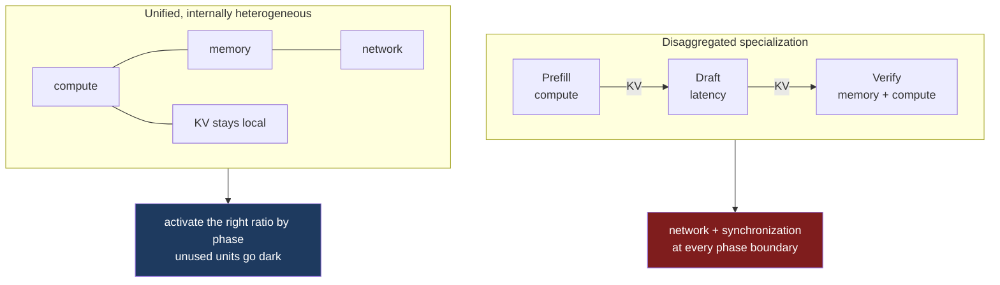

At Hot Chips 2026 on Tuesday, OpenAI presented Jalapeño, an inference ASIC built with Broadcom.[^1] One slide from the talk has been circulating since: a request no longer spans two phases but three — prefill, a draft model, and speculative verification.[^2]

The third phase is not the news. The news is what OpenAI decided to do about it.

## Three regimes, one request

The first slide sets up the problem in the same terms this series has been using. A single request passes through three phases, and each one saturates a different part of the machine.

| Phase | Job | Bottleneck | Profile |
|---|---|---|---|
| Prefill | Encode context | FLOPs + attention | Compute high, memory bandwidth low, comms smooth |
| Draft model | Speculate | Network latency | Small model, ultra-low batch, latency bound |
| Spec-verify | Decode | Attention + HBM bandwidth | Attention compute-bound, MoE bandwidth-hungry, comms bursty |

The prefill column reads as expected: "attention-heavy and primarily compute-bound. Low memory-BW demand; communication is easier to schedule smoothly." The verify column is the mirror image, with the added detail that mixture-of-experts routing makes its communication arrive in bursts rather than a steady stream.

The middle column is the one that did not exist when [part one]() of this series argued that prefill and decode want different computers. A draft model is small, runs at a batch size close to one, and moves very little data. Its stated constraint is "low network bandwidth, but extreme latency sensitivity." It is not bandwidth-hungry or compute-hungry. It is impatient.

The slide closes on a line worth keeping: "What matters is requests/second/watt at the required SLA latency. Each phase hits a different bottleneck; efficiency only counts if the complete request remains within its end-to-end latency target."

That is the same objective [part four]() argued no disaggregated system can actually optimize, because no component owns the end-to-end budget.

## The system choice

Three phases with three bottleneck profiles is a textbook argument for specialization. Build a prefill chip, a draft chip, a verify chip, and route the request through all three.

OpenAI put that option on a slide and rejected it. The title is "System choice: KV moves or the active silicon mix varies."

The right-hand column won. In OpenAI's words: "Heterogeneity moves inside the chip—not across a KV-moving network." The summary line is "Locality is king: keep KV local and activate the right resources."

A separate slide gives the reasoning in one sentence: "dark silicon is cheaper than idle accelerators." Separate accelerators still pay for package, HBM, I/O, network and cooling power whether or not they are doing anything. Blocks on a single die can be gated off while the KV cache stays where it is.

## Why the boundary was refused

Three arguments carry that decision, and each maps onto something this series worked through from the software side.

**The ratio is not fixed.** The slide shows three workload mixes with visibly different prefill/draft/verify proportions, and lists what moves them: model architecture, token efficiency, context length, attention algorithms, speculative acceptance rate, and the latency-versus-throughput target. A fleet built as a fixed split of specialized pools is correct for exactly one of those mixes. For the rest, an entire chip idles because it belongs to the wrong pool.

**Locality.** Prefill produces a KV cache that the next phase needs immediately. Disaggregating means that cache crosses a network at every phase boundary. [Part two]() covered what that cache costs to move and [part three]() covered why you cannot say where it should land.

**Speculation is a tight loop.** This one is specific to the new middle phase. Draft and verify are not a pipeline; they are a loop. The draft model proposes k tokens, verify accepts some prefix and rejects the rest, and the draft resumes from whatever survived. That round trip happens every few tokens. Put a network between them and each speculation round pays a network latency, against a phase the slide itself labels latency-bound. The mechanism that speculative decoding uses to buy latency is the first thing a boundary would spend.

## The diagnosis, arrived at from the other side

The five posts before this one argued that a programming model for heterogeneous inference would have to express five things that are inexpressible today: where a stage runs, what the bytes mean, where a tensor resides and what moving it costs, who preempts whom, and what the values are permitted to be.[^4]

OpenAI's design makes all five expressible by the only method currently available. It deletes the boundary. One vendor, one chip, one memory hierarchy, one scheduler, one set of kernels. Every question this series asked about crossing a vendor line stops being a question when there is no line.

That is not a refutation of the argument. It is the strongest confirmation of it so far. Presented with three phases that genuinely want different hardware, an organization with its own silicon team looked at the cost of the boundary and declined to pay it.

The benchmark numbers on the closing slide are being quoted widely and I am setting them aside. SemiAnalysis, which saw the runs in person, reports that the figures came from OpenAI, cover a single 8k/1k workload, and are not iso-configuration — the comparisons involve different speculative decoding settings on either side.[^3] The architectural argument does not depend on them.

## What deleting the boundary does not delete

Consolidation answers the question of who owns the machine. It does not answer what to do with it.

"Activate the right ratio by phase; unused units go dark" is a runtime decision. Prefill wants the compute blocks and can leave memory bandwidth mostly idle. Verify wants the opposite, plus a burst-tolerant interconnect for expert routing. Draft wants very little of anything except a short path to the verify units. Something has to set that mix, per phase, and reset it a few hundred times a second.

The inputs to that decision are the same list from the changing-ratios slide, and every item on it is dynamic. Context length varies per request. Speculative acceptance rate varies per request and drifts with the model. The latency-versus-throughput target varies by customer tier. None of these are known when the kernel is compiled.

So the question does not disappear at the die boundary. It changes jurisdiction. Across a network it was a protocol problem, and the answer was that no protocol exists. On a single chip it is a compiler and runtime problem, which is a better place for it to be — a compiler has visibility into the phase structure of the computation, and there is finally a single owner who could act on the answer.

What is missing is a way to say it. A kernel today declares the shapes it consumes and the memory it touches. It does not declare that this phase is compute-heavy and bandwidth-light while the next inverts that, that the interconnect should expect bursts rather than a steady stream, or that the resource mix should be re-derived when the acceptance rate moves. Those are properties of a phase, and a phase is not something the interface currently names.

## Different configurations of the same computer

Part one of this series claimed that prefill and decode want different computers. Jalapeño is a reasonable argument that they want different *configurations* of the same computer, and that the configuration should change while the request is in flight.

That is a more demanding claim than the one I made, not a softer one. Different computers is a procurement problem, and the industry knows how to solve procurement problems. A machine that reallocates its own compute, memory and interconnect between three phases of a single request, driven by properties that are only known at runtime, is a language problem. It is the one I have been circling for five posts, and the hardware just arrived first.

---

## References

[^1]: **OpenAI Jalapeño custom AI ASIC, Hot Chips 2026.** Presented on day two of the conference, 25 August 2026, by Richard Ho, Ravi Narayanaswami and Chris Leary; the chip is built in collaboration with Broadcom. ([ServeTheHome](https://www.servethehome.com/openai-jalapeno-asic-at-hot-chips-2026/))

[^2]: **Slide photographs from the talk.** Four slides — "A request spans three distinct hardware regimes," "Key Takeaways," "Changing ratios → inefficiency in heterogeneous fleets," and "System choice: KV moves or the active silicon mix varies." All slide text quoted in this post is transcribed from those photographs. ([@beffjezos](https://x.com/beffjezos/status/2092416851737518190), 26 August 2026)

[^3]: **SemiAnalysis on Jalapeño.** Reports that the performance figures were supplied by OpenAI, that the published runs cover an 8k input / 1k output workload rather than agentic traces, and that the speculative decoding configuration differs between Jalapeño and the systems it is compared against. Also states that OpenAI chose not to disaggregate prefill and decode across separate chip pools, and that the draft model shares chips and fabric with the main model. ([SemiAnalysis](https://newsletter.semianalysis.com/p/openai-jalapeno-better-than-nvidia))

[^4]: **The five-part series.** [Prefill and decode want different computers](), [the KV cache has no ABI](), [there is no address](), [two schedulers, one SLO](), and [a cache its own prefill would never have produced]().

---

*Disclaimer: Researched and drafted with AI assistance (Claude Opus 5). Direction, technical judgment, and final edits are mine. The slide text quoted here is transcribed from photographs of the talk rather than from OpenAI-published material, and I did not attend; the talk metadata and the benchmark reporting come from the two secondary sources cited above. The argument about speculative decoding across a network boundary is mine, reasoned from the phase structure the slide describes, not a measurement.*
