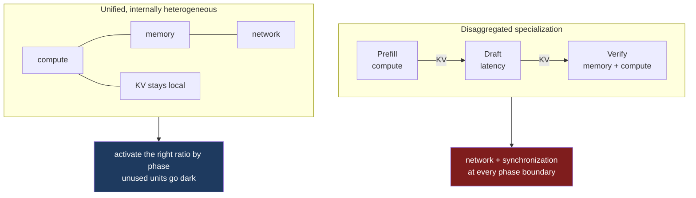

At Hot Chips this week, OpenAI presented Jalapeño, an inference ASIC co-designed with Broadcom.[^1] The architecture slide circulating since the presentation frames a request pipeline split three ways: prefill, a draft model, and speculative verification.[^2] The traditional split is prefill and decode. Replacing decode with a tight draft-and-verify speculation loop forces a re-evaluation of where the hardware bottlenecks actually sit.

What makes the design worth studying is that it rejects physical disaggregation entirely, opting instead for a unified die that reallocates its own internal bottlenecks as the phase changes.

## Three phases, three bottlenecks

A single request traverses three operational regimes, and each one saturates a different dimension of the hardware.

**Prefill** encodes the context. The slide describes it as "attention-heavy and primarily compute-bound. Low memory-BW demand; communication is easier to schedule smoothly." It wants arithmetic density and little else.

**The draft model** runs speculative generations. It is deliberately small, operates at a batch size close to one, and moves very little data. Its stated constraint is "low network bandwidth, but extreme latency sensitivity." Every microsecond spent moving a tensor or waiting on an interconnect degrades the generation rate directly. This phase is not bandwidth-hungry or compute-hungry. It is impatient.

**Speculative verification** replaces decode. Here the slide is more specific than a summary suggests: attention becomes *less* memory-bound once GQA and speculative tokens are in play, so the attention work is compute-bound, while the mixture-of-experts routing is what consumes HBM bandwidth and makes communication arrive in bursts rather than a steady stream.

The slide closes on the objective: "What matters is requests/second/watt at the required SLA latency. Each phase hits a different bottleneck; efficiency only counts if the complete request remains within its end-to-end latency target." That is precisely the objective [part four]() argued no disaggregated system can optimize, because no component owns the end-to-end budget.

The textbook response to three bottleneck profiles is physical specialization: a compute-heavy prefill part, a latency-optimized draft part, a bandwidth-optimized verify part, with the request routed across a fabric through all three. OpenAI put that topology on a slide under the title "System choice: KV moves or the active silicon mix varies," and rejected it.

Their conclusion, in their words: "Heterogeneity moves inside the chip—not across a KV-moving network," summarised as "Locality is king: keep KV local and activate the right resources."

## The cost of the boundary

The decision to refuse physical disaggregation rests on three realities of production serving, and each maps onto something this series worked through from the software side.

First, the ratio of work across the three phases is never fixed. It shifts with model architecture, token efficiency, context length, attention algorithm, speculative acceptance rate, and the latency-versus-throughput target. A fleet built as a fixed split of specialized pools is correct for exactly one workload mix. When the mix drifts — users start submitting 100K-token prompts instead of 4K — entire racks of specialized silicon sit idle behind an overwhelmed tier.

Second, the KV cache is large and it is needed immediately. Prefill generates a cache that the next phase consumes at once, so disaggregating the phases pushes that cache across a network on every request. [Part two]() covered what moving it costs, and [part three]() covered why you cannot say where it should land.

Third, speculative decoding is a loop rather than a pipeline. The draft model proposes k tokens, verify accepts a prefix and rejects the rest, and the draft resumes from whatever survived. That round trip happens every few tokens. Inserting a network hop between draft and verify means paying fabric latency on every speculation cycle, against a phase the slide itself labels latency-bound. The mechanism speculative decoding uses to buy latency is the first thing a boundary spends.

Consolidating onto one die avoids all three. One chip, one memory hierarchy, one scheduler, one set of kernels. The five things the earlier posts in this series argued were inexpressible across a vendor boundary — where a stage runs, what the bytes mean, where a tensor resides and what moving it costs, who preempts whom, and what the values are permitted to be — stop being questions when there is no boundary to cross.[^4]

This is the strongest confirmation the argument has had. Presented with three phases that genuinely want different hardware, an organization with its own silicon team priced the boundary and declined to pay it.

The benchmark figures on the closing slide are circulating widely and I am setting them aside. SemiAnalysis, which watched the runs in person, reports that the numbers came from OpenAI, cover a single 8k input / 1k output workload, and are not iso-configuration, because the speculative decoding settings differ on either side of the comparison.[^3] The architectural argument does not depend on them.

## Dynamic activation and dark silicon

OpenAI justified the unified design with a blunt economic claim: "dark silicon is cheaper than idle accelerators."

A dedicated accelerator pays for packaging, HBM, I/O transceivers, network fabric and cooling whatever its utilization. A unified chip can power-gate unused arithmetic or memory blocks while the KV cache stays resident.

Consolidation settles where the computation lives. It leaves the scheduling problem entirely open.

"Activate the right ratio by phase; unused units go dark" is a runtime decision. During prefill the chip wants its dense matrix-multiply blocks and can leave memory controllers mostly quiet. During verification it wants the reverse, plus burst-tolerant links for expert routing. The draft phase wants almost nothing except a short path to the verification units. The hardware has to reset that mix hundreds of times a second, and the inputs driving it — context length, instantaneous acceptance rate, per-tenant QoS targets — are dynamic. None of them are known when the kernel is compiled.

At a network boundary this is a protocol negotiation problem, and the answer was that no protocol exists. On a unified die it becomes a compiler and runtime scheduling problem, which is a better place for it to live: a compiler has visibility into the phase structure of the computation, and a unified runtime finally has sole ownership of the hardware.

## The missing compiler primitives

We do not currently have a programming model that can express these demands. A modern compiler IR — MLIR's `linalg` dialect, Triton IR, PTX — is built to express tensor shapes, memory layouts and data flow. None of them can express temporal traffic patterns or phase-level hardware transitions.

An IR has no way to declare that a sequence of operations will produce all-to-all traffic in short bursts rather than a steady stream, or that a computation is compute-heavy while its immediate consumer is bandwidth-bound. Those are properties of a phase, and a phase is not something the interface names.

The consequence is concrete. To power-gate a block, the runtime has to wake it *before* the computation arrives. Waking dormant arithmetic units or bringing links out of a low-power state takes time. A strictly reactive runtime pays that wake-up latency on the critical path, which is the same latency the design avoided by refusing the network boundary. If the compiler cannot name a phase, the runtime cannot preallocate for it, and we end up managing a dynamic, multi-modal machine with static, single-mode tools.

## Consolidation moved the boundary; it did not remove it

The phrase "heterogeneity moves inside the chip" is easy to read as "heterogeneity goes away," and the distinction decides how much of this problem a unified die actually retires. OpenAI's own slide does not claim that. It labels the winning column **"Unified, internally heterogeneous."** The heterogeneity is in the name of the thing.

Physical layout and data traffic are properties of the workload, not of the packaging. Prefill still produces a KV cache that verification consumes. Draft still needs a short path to verify. Expert routing still generates all-to-all traffic in bursts. Consolidation changes what those transfers cost — a transfer across on-die interconnect is far cheaper than one across a NIC — but it does not change that they are transfers, that they have a direction, or that something has to decide where each tensor sits.

A package is not a uniform resource either. Jalapeño pairs a compute die with six HBM4 stacks. On a die of that size, the distance from a given compute tile to a given memory stack is not constant, and neither is the contention on the path between them. That is a topology. It is a smaller, faster, more forgiving topology than a rack network, and it is still something a compiler has to reason about if it wants the bandwidth the datasheet advertises.

Scale settles the point. A 216 GiB package does not hold a frontier model and its caches alone; Jalapeño is deployed 128 chips to a rack and 2,048 to a pod.[^5] The model is therefore sharded across packages, and every phase transition that does not happen inside one package happens across a fabric — exactly the boundary the design set out to avoid. The bursty expert routing that verification depends on is precisely the traffic that crosses those packages. Consolidation raised the granularity at which distribution begins. It did not make the system undistributed.

So both architectures land the compiler in the same place, asking the same questions: where does this tensor live, what does moving it cost, which resources does this phase need, and who owns the latency budget. Unified and disaggregated designs give different answers about the cost constants. They do not differ about which facts a compiler needs in order to compute them, and neither one lets us stop reasoning about the machine as a heterogeneous system. That is why I keep returning to this: the programming model gap survives the hardware decision.

## The capacity wall

The assumption underneath "keep KV local" is that there is capacity to hold it, and capacity is a function of context length.

That same package carries 216 GiB at 15.4 TB/s in a 700 W envelope, and a 128-chip rack holds 27.5 TB.[^5] Whether that is generous or tight depends on the KV layout, and the spread across attention designs is wide enough to change the answer.

| KV layout | Per token | One 1M-token session | Such sessions per 216 GiB |
|---|---|---|---|
| MLA, the 656-byte entry from part two | 656 B | 0.6 GiB | ~350 |
| GQA: 80 layers, 8 KV heads, 128-wide, fp8 | 160 KiB | ~153 GiB | 1.4 |
| the same at bf16 | 320 KiB | ~305 GiB | does not fit |

OpenAI does not publish its serving configurations, so the two GQA rows are a bracket rather than a measurement of anything it runs. The ratio between the rows is the point. A compressed-latent design keeps a million tokens local without difficulty. A conventional grouped-query layout at the same length puts a single session on seventy percent of a package.

Batch size binds before capacity does. Decode throughput comes from batching sequences together to amortise the cost of loading model weights, and long context is what destroys batch size. At 8k a chip holds hundreds of sessions to batch across. At 1M with the layout above it holds one, decode collapses into the memory-bound GEMV described in [part one](), and there is nothing left to amortise against. Across a full rack, 27.5 TB works out to roughly 168 concurrent million-token sessions.

Agentic workloads add a pressure unrelated to peak load. Agents idle — on a tool call, a retrieval, a person. Through those gaps the session's KV stays resident in HBM, the most expensive place in the system to hold cold state. The usual remedy is to page it down a tier to host memory or a pooled store, which reintroduces disaggregated memory into a design whose argument was that disaggregation costs too much.

The dark-silicon argument narrows here as well. Power-gating an unused block recovers operating cost without recovering die area, and an agentic mix of long input and short output skews toward prefill for long stretches, leaving memory and network blocks dark on silicon that was already bought.

None of this is disqualifying, and the defence is strong. "Local" can mean rack-local across a coherent fabric rather than resident on one die, and 27.5 TB is real headroom. Agentic sessions also share unusually large prefixes — system prompts, tool schemas, repository context — so if prefix cache hit rates stay high, prefill work collapses and the mix swings back toward decode, which is the regime a balanced chip is built for. What we do not have is evidence: the published runs are 8k/1k, and SemiAnalysis notes there are no agentic traces yet, with the routers and prefix-caching machinery being the components under the most pressure in that regime.[^3]

## NVIDIA's counter-bet

The unified design is a serious engineering argument, and the rest of the industry has not converged on it.

NVIDIA removed Rubin CPX — a part aimed at compute-bound prefill using GDDR7 rather than HBM — from its roadmap at GTC 2026. The slot went to a 256-chip SRAM-based Groq 3 LPX rack, acquired through a licensing arrangement reported at roughly twenty billion dollars.[^6]

NVIDIA has not published its reasoning, so what follows is my reading rather than its stated position. Dropping one specialist and buying another is not a move toward consolidation. SRAM offers deterministic access and very high on-chip bandwidth in a small capacity; HBM offers the capacity that KV caches and model weights require, at higher access latency. Those profiles suit different phases, and a design that keeps separate pools can give each phase the memory technology that matches it instead of compromising between them on one die. Meanwhile Rubin and Rubin Ultra keep growing, so both bets are running inside a single roadmap.

The vendor pairings from part one point the same way: each puts a specialized part on one side of a phase boundary and treats the boundary as a cost worth paying. Two sets of organizations with comparable information and comparable incentives are answering this in opposite directions, which is a fair sign the question is still open.

Both bets rest on the same premise. Prefill, draft and verification want different hardware. Jalapeño argues they want different *configurations* of the same computer, reallocated while the request is in flight — a more demanding claim than the one I made in part one, not a softer one. Procuring different computers is a supply-chain problem the industry knows how to solve. Building a compiler and runtime that reallocate compute, memory and interconnect across a die in response to properties known only at runtime is a language problem. The hardware has arrived. The stack needed to exploit it has not.

---

## References

[^1]: **OpenAI Jalapeño custom AI ASIC, Hot Chips 2026.** Presented on day two of the conference, 25 August 2026, by Richard Ho, Ravi Narayanaswami and Chris Leary; the chip is built in collaboration with Broadcom. ([ServeTheHome](https://www.servethehome.com/openai-jalapeno-asic-at-hot-chips-2026/))

[^2]: **Slide photographs from the talk.** Four slides — "A request spans three distinct hardware regimes," "Key Takeaways," "Changing ratios → inefficiency in heterogeneous fleets," and "System choice: KV moves or the active silicon mix varies." All slide text quoted in this post is transcribed from those photographs. ([@beffjezos](https://x.com/beffjezos/status/2092416851737518190), 26 August 2026)

[^3]: **SemiAnalysis on Jalapeño.** Reports that the performance figures were supplied by OpenAI, that the published runs cover an 8k input / 1k output workload rather than agentic traces, and that the speculative decoding configuration differs between Jalapeño and the systems it is compared against. Also states that OpenAI chose not to disaggregate prefill and decode across separate chip pools, and that the draft model shares chips and fabric with the main model. ([SemiAnalysis](https://newsletter.semianalysis.com/p/openai-jalapeno-better-than-nvidia))

[^4]: **The five-part series.** [Prefill and decode want different computers](), [the KV cache has no ABI](), [there is no address](), [two schedulers, one SLO](), and [a cache its own prefill would never have produced]().

[^5]: **Jalapeño configuration.** Each package pairs the compute die with six HBM4 stacks for 216 GiB at 15.4 TB/s and 13.4 PFLOP/s of MXFP4 matrix compute in a 700 W envelope; a rack is 128 chips holding 27.5 TB, and a pod is 2,048 ASICs. HBM4 reported as supplied by Samsung. ([The Register](https://www.theregister.com/systems/2026/08/25/openais-upcoming-jalapeno-chip-looks-like-itll-be-an-inference-beast/5292052), [Tom's Hardware](https://www.tomshardware.com/tech-industry/semiconductors/openai-says-its-jalapeno-chip-beats-nvidias-gb300-in-first-published-benchmarks))

[^6]: **Rubin CPX removed from the NVIDIA roadmap.** Announced at the AI Infra Summit in September 2025 as a prefill-specialised part using GDDR7 rather than HBM, and dropped at GTC 2026. The slot was taken by a 256-chip SRAM-based Groq 3 LPX rack acquired through a licensing arrangement reported at roughly $20B. ([Tom's Hardware](https://www.tomshardware.com/pc-components/gpus/nvidia-removes-rubin-cpx-accelerators-from-its-roadmap-groq-3-lpus-take-center-stage-as-cpx-is-removed))

---

*Disclaimer: Researched and drafted with AI assistance (Claude Opus 5, Gemini 3.1 Pro). Direction, technical judgment, and final edits are mine. The slide text quoted here is transcribed from photographs of the talk rather than from OpenAI-published material, and I did not attend; the talk metadata and the benchmark reporting come from the two secondary sources cited above. The argument about speculative decoding across a network boundary, and the reading of NVIDIA's roadmap change, are mine rather than either company's stated position.*
