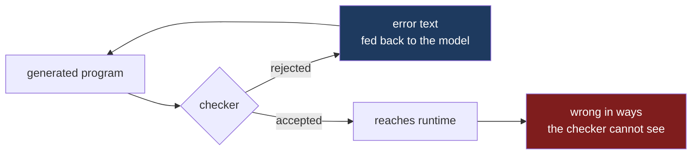

Working with models on real code, I keep noticing the same thing. The Rust I get back is better than the C++ I get back, and the Lean is better than either. Not marginally. The Rust compiles and does roughly what I asked; the C++ compiles and does something adjacent to what I asked, and I find out which on a Tuesday three weeks later.

The published benchmarks say the opposite, and clearly. Rust is a low-resource language as far as a pretrained model is concerned, underrepresented relative to Python by a wide margin, and it scores well below Python on the standard multilingual code benchmarks.[^1] Lean barely registers. If you ranked languages by how much of them a model has read, my experience runs backwards down the list.

Both observations are correct. Reconciling them is the interesting part, and the answer changes what I think a type system is for.

## What one-shot accuracy leaves out

A pass@1 number measures whether the first draft is right: one sample per problem, scored by whether it passes the reference tests.[^6] Nobody ships the first draft. The number I care about is different: of the programs that reach production, how many are wrong, and how much work did it take to get there.

The cleanest experiment I have found on this used Idris, which is a reasonable stand-in for the far end of the type-strength axis. Li and Krishnamachari gave GPT-5 fifty-six Exercism problems in Idris and measured it zero-shot against the same model on other languages.[^2]

| Language | Zero-shot | With compiler errors fed back |
|---|---|---|
| Python | 45 / 50 | — |
| Erlang | 35 / 47 | — |
| Idris | 22 / 56 | **54 / 56** |

Zero-shot, the result is what the benchmarks predict. Idris solves 39% where Python solves 90%. The model has not read much Idris and it shows.

Then the compiler goes in the loop, and Idris finishes at 96% — above where Python started. The ablation is the part worth sitting with. They also tried feeding the model documentation, and feeding it a guide to classifying Idris errors. Neither worked as well as handing back the local compilation errors. The compiler's own message, generated from the model's own broken code, was the most valuable signal available.

The feedback loop provides the reconciliation. Training data determines where the first draft lands. The type system determines whether the loop that follows converges on something correct or just on something that runs.

## The same shape at company scale

Fifty-six problems in a language nobody deploys is thin evidence for a claim about how software gets written. Some corroboration arrived last month from a direction I was not expecting.

David Tolnay published eight years of language adoption at Meta, drawn from the source-control tables that back the company's internal dashboards.[^5] The metric is a year-over-year ratio: within each ninety-day window, the fraction of developers who committed in a given language, divided by that same fraction twelve months earlier. Company growth and the seasonal swings in code output both cancel.

Five languages inflect together around February and March of 2026, and Tolnay dates the cause without hedging: "This timeframe correlates with the uptake in agentic coding among Meta engineers in Q1 of 2026." The five are TypeScript, Rust, Swift, JavaScript and Go. He discounts one of them himself, attributing the JavaScript growth to configuration files inside TypeScript projects rather than to new JavaScript work. That leaves four, all statically typed. His summary of everything else on the chart: "Other than TypeScript, Rust, Swift, JavaScript, and Go, every other language on the chart is uncorrelated or at best slightly correlated with AI adoption."

Two cautions, because this is easy to over-read and I nearly did.

C++ and Python are flat, and that is not evidence that models write them badly. A growth ratio divides by the base, and these are among the largest languages at Meta. A one percent move in C++ participation can exceed a doubling of Rust in absolute terms while still drawing a flat line, so flatness is consistent with C++ absorbing more engineering effort in 2026 than every surging language combined. Tolnay makes the same observation from the other side when he describes those languages as saturating their addressable market.

The unit is also a developer rather than a line of code, so someone who writes one file counts like someone who writes the language full time. That matters most at the top of the chart. Tolnay's own explanation for TypeScript's growth is that engineers and managers "are producing all kinds of dashboards and personal widgets in TypeScript that they never would have bothered to do without AI." Dabbling counts at full weight.

What survives both cautions is the one figure that is not a ratio — Meta engineers wrote twice as much first-party Rust this year as in the previous nine years combined — and the selection itself. Cheap generation applied broadly would have lifted the whole chart. The lift concentrated in languages whose compiler rejects a wrong program before it runs.

## C++ is the control group

If the thesis were "static typing helps," C++ would be fine. It is statically typed, aggressively so, with a type system elaborate enough to be Turing-complete at compile time. My experience with generated C++ is nonetheless closer to Python than to Rust, and I think that difference is the most informative data point I have.

The distinction is not static versus dynamic. It is how much a successful compile promises.

In Rust, a program that compiles has been checked for a specific and useful set of properties: no use-after-free, no data races between threads, no aliasing a mutable reference, every enum match exhausted, and errors carried in the return type, where reaching the success value means handling the failure case. The checker cannot be talked out of these. Defeating it requires writing `unsafe`, which is a lexically visible, greppable admission that the guarantee stops here.

In C++, a program that compiles has been checked that the names resolve and the overloads pick out. It has not been checked for use-after-free, iterator invalidation, data races, out-of-bounds access, or signed overflow. An implicit conversion can quietly change the meaning of a call. A `reinterpret_cast` will convert any pointer into any other pointer with no ceremony at all. Undefined behaviour offers no diagnostic, serving instead as a licence for the optimiser to assume the case never happens.

So "it compiles" carries far less information in C++ than in Rust, and it is the information content of that signal that determines how useful the compiler is as a reviewer. A checker that can be defeated silently is a checker whose approval means less.

Every type system is this diagram. What differs between languages is how much of the wrongness flows down the right-hand edge instead of the left. Python sends nearly everything right. C++ sends a great deal right, including most of the memory-safety and concurrency errors that matter. Rust pushes a large, well-defined class of it left. Lean pushes almost all of it left.

## Lean is the limit case

Lean is where the argument stops being about ergonomics and becomes about algorithms.

A Lean proof is checked by a kernel. It checks or it does not, and the answer is a decision rather than an opinion. That single property changes what you are allowed to do with an unreliable generator, because it makes generation searchable.

Sampling thirty-two candidate proofs and keeping the one that checks is a sound procedure. You get a correct proof or you get nothing, and you always know which. Delta Prover reaches 95.9% on miniF2F this way, using a general-purpose model with no fine-tuning at all, driving Lean 4 through decomposition and iterative repair against compiler feedback.[^3] Recent systems report figures in that range with the same basic shape: propose, check, repair, repeat.

Now try that in Python. Sample thirty-two implementations, run the tests, keep the ones that pass. What you have is thirty-two programs that agree with your test suite, which is a much weaker statement than thirty-two correct programs, and you have no way to distinguish the two. The oracle is partial, so the search is unsound. You are back to reading the code.

That is also what the benchmark scores at the top of this post are made of. pass@k counts a problem solved when some sample passes the reference tests, so the metric used to rank these languages is itself read through the weak oracle. It measures agreement with a test suite and reports it as correctness.

The metric's origin makes the point better than I can. pass@k comes from SPoC, a 2019 system that searched for a functionally correct program under a budget of a hundred compilations, using compiler errors to localise which line to re-translate. It reported that compilation errors accounted for 88.7% of program failures, and that searching this way lifted success from 25.6% to 44.7%.[^6] Compiler-guided search over candidates, demonstrated before language models entered the picture. The search survived into how we score models. The compiler that made it work did not.

A verifier you can call cheaply and trust completely turns a mediocre generator into a good one, because brute force becomes admissible. The availability of brute force explains why models are unreasonably good at Lean given how little Lean exists to have been trained on. The scarcity is real. The oracle compensates.

## What the checker still cannot see

Rust that compiles can still be wrong. It can compute the wrong thing correctly, with excellent memory safety, forever. Types constrain the shape of a computation, not its intent, and outside a dependently typed setting they only encode the part of the specification you chose to write down.

The self-repair literature is consistent about where the remaining difficulty lives: syntactic and type errors turn out to be far more tractable for a model to fix from feedback than logical or algorithmic ones.[^4] That finding is usually reported as a limitation. I read it as the mechanism. Moving an error from the second category into the first is what a stronger type system does, and it constitutes the whole of the benefit. An off-by-one in an index becomes a compile error when the index is a distinct type. A forgotten case becomes a compile error when the match must be exhaustive. A stale pointer becomes a compile error when lifetimes are tracked.

None of that makes the model smarter. It relocates a class of mistakes from the expensive category to the cheap one.

## Why this matters more for generated code than for mine

When I write a function, the code is a partial record of a model I hold in my head. The invariants I did not write down are still real, because I know them and I will maintain them. Review works reasonably well against that background, since a reviewer can ask what I was thinking and get a coherent answer.

A generated function comes with no such model, arriving instead as locally plausible text. Plausible-but-wrong text is the failure mode human review is worst at catching. Reviewers are good at spotting code that looks wrong. Generated code that is wrong usually looks right — surface plausibility makes the text useful when it happens to be correct.

The mental model that used to carry the unwritten invariants is gone, leaving a machine checker as the only cheap way to put constraints back. The machine remains indifferent to plausibility. It does not get tired at four in the afternoon, and it refuses to extend the benefit of the doubt to code that reads confidently.

This is the argument I made from a different direction in [an earlier post on provenance](): knowing where code came from tells you nothing about whether it is correct, and a signature on a program is not a proof about its behaviour. The conclusion is the same from both sides. As more code is generated, the value of properties a machine can check rises, and the value of properties resting on an author's understanding falls, because there is no author holding the understanding.

## The part I have not resolved

I would like this to be a measurement rather than an impression, and it is not one yet. My evidence is one controlled experiment on a language nobody deploys, a body of theorem-proving results whose success depends on a total oracle that ordinary programming does not have, an adoption curve that records what engineers reached for rather than whether it worked, and my own experience, which is uncontrolled and which knows what conclusion it prefers.

What I would want is the number nobody publishes: defects per thousand lines of generated code that reached production, cut by language, controlled for the same task and the same reviewer discipline. A pass@1 score on programming puzzles is a poor proxy, and it is the wrong end of the pipeline.

The mechanism is clear enough to act on regardless. A generator with a nonzero error rate needs a verifier, the strength of the type system sets how much of the specification the verifier can decide, and everything it cannot decide falls to a reviewer whose weakest moment is confident, plausible, wrong code. Choosing a language for a codebase that will be substantially machine-written is now partly a decision about how much of your specification you want the compiler to hold.

---

## References

[^1]: **Low-resource programming languages in code LLMs.** Rust is consistently classified among the low-resource languages for code generation, substantially underrepresented in pretraining data relative to Python, with correspondingly lower pass rates on multilingual benchmarks such as MultiPL-E. Reported figures vary between studies, so I have avoided quoting a single number. ([Survey: LLM-based code generation for low-resource and domain-specific languages](https://arxiv.org/pdf/2410.03981), [MultiPL-E](https://arxiv.org/pdf/2208.08227))

[^2]: **Compiler-Guided Inference-Time Adaptation: Improving GPT-5 Programming Performance in Idris.** Minda Li and Bhaskar Krishnamachari, February 2026. Zero-shot, GPT-5 solves 22 of 56 Exercism problems in Idris, against 45 of 50 in Python and 35 of 47 in Erlang. Of the refinement strategies tested — platform feedback, added documentation, error-classification guides, and local compilation errors — feeding back local compilation errors performed best, raising Idris to 54 of 56. ([arXiv:2602.11481](https://arxiv.org/abs/2602.11481))

[^3]: **Solving Formal Math Problems by Decomposition and Iterative Reflection.** Delta Prover drives Lean 4 from a general-purpose LLM with no model specialization, using reflective decomposition and iterative proof repair against compiler feedback, and reports 95.9% on miniF2F. ([arXiv:2507.15225](https://arxiv.org/abs/2507.15225))

[^4]: **Iterative feedback loops for LLM code correction.** Across iterative-refinement studies, models improve markedly when given compiler errors and failing test cases, and the residual difficulty concentrates in logical and algorithmic errors rather than syntactic or type errors. ([Unlocking LLM Code Correction with Iterative Feedback Loops](https://arxiv.org/pdf/2606.17514))

[^5]: **Programming language adoption patterns at Meta.** David Tolnay, 11 August 2026. Built from Meta's code review and source control tables covering all code changes submitted by employees. For each 90-day window the count of developers committing in a language is divided by the total committing in any language to give a market share, then divided by that language's share in the window ending twelve months earlier; the twelve-month spacing cancels seasonal variation in code output. ([x.com/dtolnay](https://x.com/dtolnay/article/2087229652293337160))

[^6]: **pass@k scheme is from Kulal et al., *SPoC: Search-based Pseudocode to Code* (2019), which searched the space of translations for a program passing its test cases, guided by compiler errors: "we propose to perform credit assignment based on signals from compilation errors, which constitute 88.7% of program failures," and "under a budget of 100 program compilations, performing search improves the synthesis success rate over using the top-one translation of the pseudocode from 25.6% to 44.7%." The Codex paper records the definition — "Kulal et al. 2019 evaluate functional correctness using the pass@k metric, where k code samples are generated per problem, a problem is considered solved if any sample passes the unit tests, and the total fraction of problems solved is reported" — and contributes the unbiased estimator now used to report it, because "computing pass@k in this way can have high variance." SPoC's own abstract does not use the name. ([SPoC, arXiv:1906.04908](https://arxiv.org/abs/1906.04908), [Evaluating Large Language Models Trained on Code, arXiv:2107.03374](https://arxiv.org/abs/2107.03374))

---

*Disclaimer: Researched and drafted with AI assistance (Claude Opus 5 and Gemini 3.1 Pro). Direction, technical judgment, and final edits are mine. The Idris and Lean figures are quoted from the linked papers, and the Meta figures from Tolnay's article, rather than reproduced by me; I have no access to the underlying data in any of the three cases. The comparison between generated Rust, C++ and Lean that opens this post is my own working experience and is not a controlled measurement; I have tried to be explicit about which claims rest on it.*
