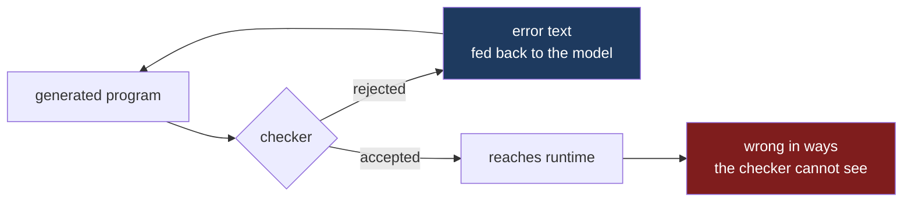

I keep noticing the same pattern working with models on real code. The Rust I get back is better than the C++ I get back, and the Lean is better than either. The Rust compiles and does what I asked. The C++ compiles and does something adjacent to what I asked, and I find out which three weeks later.

The published benchmarks say the opposite. Rust is a low-resource language for a pretrained model. It is underrepresented relative to Python by a wide margin, scoring below Python on the standard multilingual code benchmarks.[^1] Lean does not register. My experience runs backwards down the list if you rank languages by how much a model has read.

I was intrigued to find that my observations diverged from the benchmark numbers, so I started investigating more.

## What one-shot accuracy leaves out

A pass@1 number measures whether the first draft is right. It takes one sample per problem, scored by whether it passes the reference tests.[^6] Nobody ships the first draft. The number I care about is different. I want to know how many production programs are wrong, and how much work it took to get there.

The cleanest experiment I have found on this used Idris. Idris is a reasonable stand-in for the far end of the type-strength axis. Li and Krishnamachari gave GPT-5 fifty-six Exercism problems in Idris and measured it against the same model on other languages.[^2]

| Language | Zero-shot | With compiler errors fed back |
|---|---|---|
| Python | 45 / 50 | — |
| Erlang | 35 / 47 | — |
| Idris | 22 / 56 | **54 / 56** |

The zero-shot result is what the benchmarks predict. Idris solves 39% where Python solves 90%. The model has not read much Idris and it shows.

Idris finishes at 96% when the compiler goes in the loop. That is above where Python started. The ablation is the part worth sitting with. They tried feeding the model documentation, and feeding it a guide to classifying Idris errors. Neither worked as well as handing back the local compilation errors. The compiler's own message was the most valuable signal available. It was generated from the model's own broken code.

The feedback loop provides the reconciliation. Training data determines where the first draft lands. The type system determines whether the loop that follows converges on something correct or just on something that runs.

## The same shape at company scale

Fifty-six problems in a language nobody deploys is thin evidence for a claim about how software gets written. Corroboration arrived last month.

David Tolnay published eight years of language adoption at Meta, drawn from the source-control tables backing internal dashboards.[^5] The metric is a year-over-year ratio. It divides the fraction of developers who committed in a given language within each ninety-day window by that same fraction twelve months earlier. Company growth and seasonal swings in code output cancel.

Five languages inflect together around February and March of 2026. Tolnay dates the cause without hedging: "This timeframe correlates with the uptake in agentic coding among Meta engineers in Q1 of 2026." The five are TypeScript, Rust, Swift, JavaScript and Go. He attributes the JavaScript growth to configuration files inside TypeScript projects. Four statically typed languages remain. His summary of everything else on the chart is: "Other than TypeScript, Rust, Swift, JavaScript, and Go, every other language on the chart is uncorrelated or at best slightly correlated with AI adoption."

Two cautions apply.

C++ and Python are flat. A growth ratio divides by the base, and these are among the largest languages at Meta. Flatness is consistent with C++ absorbing more engineering effort in 2026 than every surging language combined, so flat C++ and Python is not evidence models write them badly.

The unit is a developer rather than a line of code. Someone who writes one file counts like someone who writes the language full time. Dabbling counts fully. Tolnay's own explanation for TypeScript's growth is that engineers and managers "are producing all kinds of dashboards and personal widgets in TypeScript that they never would have bothered to do without AI."

The figure that survives both cautions is not a ratio. Meta engineers wrote "twice as much first-party Rust this year as in the previous nine years combined". The selection itself also survives. Cheap generation applied broadly would have lifted the whole chart. The lift concentrated in languages whose compiler rejects a wrong program before it runs.

## C++ is the control group

C++ would settle the question if the thesis were "static typing helps". It is statically typed, and it rejects a whole category of error that Python finds at runtime or never. Against Python it is not close. What varies is how much a successful compile promises, and in C++ that is a dial.

A bare `g++ foo.cpp` leaves the dial near the bottom. It checks that names resolve. It does not check for use-after-free, data races, or signed overflow. Undefined behaviour offers no diagnostic.

The picture changes when you turn the dial up. `-Wall -Wextra -Werror` converts silent acceptance into a build failure. C++20 puts more of a specification into checkable form: `static_assert` for invariants, `if constexpr` in place of runtime branching, `consteval` for compile-time functions, and concepts so a bad template call fails at the call site rather than deep inside an instantiation. `[[nodiscard]]` turns an ignored result into a diagnostic.

None of that reaches Rust's guarantees. The checks are opt-in, and no combination of them proves the absence of a data race. C++ is the one language here where the strength of the oracle is something you choose. A model writing C++ gets whatever checker the project happens to have configured. The project usually has the weak one configured.

The information content of the compilation signal determines how useful the compiler is as a reviewer. Approval from a checker that was never switched on is worth nothing.

Every type system is this diagram. What differs between languages is how much of the wrongness flows down the right-hand edge instead of the left. Python sends nearly everything right. C++ spans a range set by its build flags. Rust pushes a well-defined class of it left. Lean pushes almost all of it left.

## Lean is the limit case

Lean is where the argument stops being about ergonomics and becomes about algorithms.

A Lean proof is checked by a kernel. It checks or it does not, and the answer is a decision. Lean's kernel is a total oracle, which makes sampling and filtering sound where tests make it unsound.

You get a correct proof or you get nothing when you sample thirty-two candidates. Delta Prover reaches 95.9% on miniF2F this way. It drives Lean 4 through decomposition and iterative repair against compiler feedback.[^3]

Try that in Python. Sample thirty-two candidates, run the tests, keep the ones that pass. You have thirty-two programs that agree with your test suite. You have no way to distinguish them from thirty-two correct programs. The oracle is partial, so the search is unsound. You must read the code.

The benchmark scores at the top of this post are made of this same unsound search. The pass@k metric measures agreement with a test suite and reports it as correctness.

The metric's origin makes the point. pass@k comes from SPoC. SPoC was a 2019 system that proposed "credit assignment based on signals from compilation errors, which constitute 88.7% of program failures". SPoC reported that "under a budget of 100 program compilations, performing search improves the synthesis success rate over using the top-one translation of the pseudocode from 25.6% to 44.7%".[^6] SPoC used a budget of a hundred compilations to guide a search over candidates. The search survived into how we score models. The compiler that made it work did not.

A type system is a total oracle for the fragment it encodes and silent about the rest. Rust decides memory safety completely. Sampling on that question and filtering on the checker is a sound procedure. It says nothing about whether the program computes the right thing. The question is which fragment of the specification your oracle decides.

A cheap verifier turns a mediocre generator into a good one. Brute force becomes admissible. The availability of brute force explains why models are good at Lean despite the lack of training data. The scarcity is real. The oracle compensates.

## What the checker still cannot see

Rust that compiles can still be wrong. It can compute the wrong thing correctly with excellent memory safety. Types constrain the shape of a computation instead of its intent. They only encode the part of the specification you chose to write down.

The self-repair literature is consistent about where the remaining difficulty lives. Syntactic and type errors are more tractable for a model to fix from feedback than logical or algorithmic ones.[^4] Reviewers report this finding as a limitation. I read it as the mechanism. Types do not catch logic errors. The value is relocating errors into the category models repair well. An off-by-one in an index becomes a compile error when the index is a distinct type. A forgotten case becomes a compile error when the match must be exhaustive.

This relocation does not make the model smarter. It moves mistakes from the expensive category to the cheap one.

## Why this matters more for generated code

The code is a partial record of a model I hold in my head when I write a function. The invariants I did not write down are still real. I know them and I will maintain them. Review works well against that background. A reviewer can ask what I was thinking and get a coherent answer.

Generated code arrives without the author's mental model. It arrives as locally plausible text. Plausible-but-wrong text is what human review is worst at catching. Reviewers are good at spotting code that looks wrong. Generated code that is wrong usually looks right.

The machine checker is the only cheap way to put constraints back. The machine remains indifferent to plausibility. It does not get tired at four in the afternoon, and it refuses to extend the benefit of the doubt to code that reads confidently.

I made this argument from a different direction in [an earlier post on provenance](). Knowing where code came from tells you nothing about whether it is correct. The conclusion is the same from both sides. The value of properties a machine can check rises as more code is generated. The value of properties resting on an author's understanding falls. There is no author holding the understanding.

## The part I have not resolved

No controlled measurement exists. My evidence is one controlled experiment on a language nobody deploys, a body of theorem-proving results depending on a total oracle that ordinary programming lacks, and an adoption curve recording what engineers reached for. My own experience is uncontrolled and knows what conclusion it prefers.

The number I want is unpublished. I want defects per thousand lines of generated code that reached production, cut by language, controlled for the task and the reviewer discipline. A pass@1 score on programming puzzles is a poor proxy at the wrong end of the pipeline.

The mechanism is clear enough to act on. A generator needs a verifier. The strength of the type system sets how much of the specification the verifier can decide. Everything it cannot decide falls to a reviewer whose weakest moment is plausible, wrong code. Choosing a language for a machine-written codebase is a decision about how much of your specification the compiler will hold.

---

## References

[^1]: **Low-resource programming languages in code LLMs.** Rust is consistently classified among the low-resource languages for code generation, substantially underrepresented in pretraining data relative to Python, with correspondingly lower pass rates on multilingual benchmarks such as MultiPL-E. Reported figures vary between studies, so I have avoided quoting a single number. ([Survey: LLM-based code generation for low-resource and domain-specific languages](https://arxiv.org/pdf/2410.03981), [MultiPL-E](https://arxiv.org/pdf/2208.08227))

[^2]: **Compiler-Guided Inference-Time Adaptation: Improving GPT-5 Programming Performance in Idris.** Minda Li and Bhaskar Krishnamachari, February 2026. Zero-shot, GPT-5 solves 22 of 56 Exercism problems in Idris, against 45 of 50 in Python and 35 of 47 in Erlang. Of the refinement strategies tested — platform feedback, added documentation, error-classification guides, and local compilation errors — feeding back local compilation errors performed best, raising Idris to 54 of 56. ([arXiv:2602.11481](https://arxiv.org/abs/2602.11481))

[^3]: **Solving Formal Math Problems by Decomposition and Iterative Reflection.** Delta Prover drives Lean 4 from a general-purpose LLM with no model specialization, using reflective decomposition and iterative proof repair against compiler feedback, and reports 95.9% on miniF2F. ([arXiv:2507.15225](https://arxiv.org/abs/2507.15225))

[^4]: **Iterative feedback loops for LLM code correction.** Across iterative-refinement studies, models improve markedly when given compiler errors and failing test cases, and the residual difficulty concentrates in logical and algorithmic errors rather than syntactic or type errors. ([Unlocking LLM Code Correction with Iterative Feedback Loops](https://arxiv.org/pdf/2606.17514))

[^5]: **Programming language adoption patterns at Meta.** David Tolnay, 11 August 2026. Built from Meta's code review and source control tables covering all code changes submitted by employees. For each 90-day window the count of developers committing in a language is divided by the total committing in any language to give a market share, then divided by that language's share in the window ending twelve months earlier; the twelve-month spacing cancels seasonal variation in code output. ([x.com/dtolnay](https://x.com/dtolnay/article/2087229652293337160))

[^6]: pass@k scheme is from Kulal et al., *SPoC: Search-based Pseudocode to Code* (2019), which searched the space of translations for a program passing its test cases, guided by compiler errors: "we propose to perform credit assignment based on signals from compilation errors, which constitute 88.7% of program failures," and "under a budget of 100 program compilations, performing search improves the synthesis success rate over using the top-one translation of the pseudocode from 25.6% to 44.7%." The Codex paper records the definition — "Kulal et al. 2019 evaluate functional correctness using the pass@k metric, where k code samples are generated per problem, a problem is considered solved if any sample passes the unit tests, and the total fraction of problems solved is reported" — and contributes the unbiased estimator now used to report it, because "computing pass@k in this way can have high variance." SPoC's own abstract does not use the name. ([SPoC, arXiv:1906.04908](https://arxiv.org/abs/1906.04908), [Evaluating Large Language Models Trained on Code, arXiv:2107.03374](https://arxiv.org/abs/2107.03374))

---

*Disclaimer: Researched and drafted with AI assistance (Claude Opus 5 and Gemini 3.1 Pro). Direction, technical judgment, and final edits are mine. The Idris and Lean figures are quoted from the linked papers, and the Meta figures from Tolnay's article, rather than reproduced by me; I have no access to the underlying data in any of the three cases. The comparison between generated Rust, C++ and Lean that opens this post is my own working experience and is not a controlled measurement; I have tried to be explicit about which claims rest on it.*
