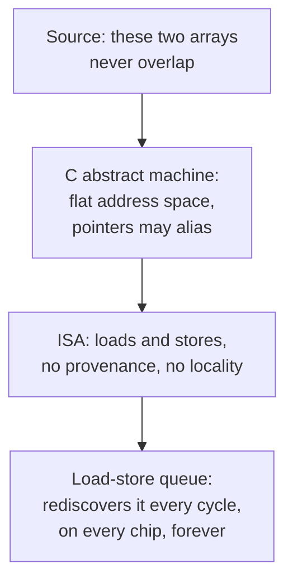

Pull up the die photo of any high-performance CPU from the last fifteen years and point at the parts that do arithmetic. They are small. The integer ALUs and the vector units are a modest slice of the core. Most of the area, and a larger share of the power budget, goes to machinery whose only job is to work out what the program meant.

The register renamer. The scheduler. The reorder buffer. The load-store queue. The branch predictor. The prefetcher. Not one of them computes a value the programmer asked for. They are there to reconstruct facts that were true in the source code and got thrown away on the way down.

That silicon is a compiler. It is a compiler that has to run again every single time the program runs, on every chip that was ever sold, burning power each time to rediscover things that were known for free at three in the afternoon when somebody wrote the loop.

I have spent my career on the other side of that, in compilers. We are, on the whole, pleasant and careful people. We invented graph-coloring register allocation, SSA, the polyhedral model, interprocedural analysis, a dozen kinds of alias analysis. The optimizers we built run under almost everything that matters. And we did all of it inside a fence somebody else put up.

## A chip is a compiler that never finishes

The mapping is not an analogy. It is the same set of algorithms, implemented in transistors instead of C++.

| Out-of-order core | Compiler pass |
| --- | --- |
| Decode into µops | Lowering the ISA into an IR |
| Register renaming | SSA construction |
| Reservation stations, wakeup/select | List scheduling over a dataflow graph |
| Reorder buffer | Restoring program order at commit |
| Load-store queue, memory disambiguation | Alias analysis |
| Branch predictor | Speculation driven by profile data |
| Stride and stream prefetchers | Loop access-pattern analysis |

Look at the dates. Tomasulo's algorithm gave every write a fresh tag so each value had exactly one definition, and published it in 1967.[^1] That is the SSA property. The compiler literature named SSA in 1988 and got an efficient construction for it in 1991.[^2] Hardware shipped the idea two decades before we wrote it down.

The load-store queue is the sharper case. It is a dynamic alias analyzer. It watches every in-flight load and store, compares addresses, and decides whether the load may proceed or has to wait for a store it might collide with. Later designs speculate: let the load go, track whether it was wrong, and roll back if a store lands on it. Intel and DEC both built dedicated predictor tables for exactly this.

We could not do that statically. Not because the analysis was beyond us. Because pointer aliasing in C is undecidable in the general case, and that is a theorem, not a complaint.[^3] The only reason the hardware can do it at all is that it cheats in a way a compiler cannot: it waits until the addresses are concrete.

So the load-store queue exists because the language would not tell us whether two pointers overlap. C99 added `restrict` to let the programmer say it out loud.[^4] That keyword is a confession. It is the language admitting that its own model destroyed something the programmer knew, and offering a way to put a small piece of it back, opt-in, unchecked, and famously easy to get wrong.

## Itanium was the experiment, and it ran to completion

If you want to know whether compiler engineers were the limiting factor, there is a controlled trial. Intel and HP built an architecture on the premise that the compiler could do the scheduling, and stripped out the hardware that would otherwise do it at runtime. EPIC gave the compiler explicit parallelism, predication, speculative loads with deferred exceptions, and a rotating register file.[^5] Everything a scheduler could want.

Some of the strongest compiler work of that era went into those toolchains. It did not land. The usual retelling blames the compiler teams, and that reading is wrong. The compiler could not statically resolve what a pointer would alias, what a branch would do, or which loads would miss, because the source language it was handed had no way to say any of it. The information was not hard to compute. It was absent.

Intel's response, and everyone else's, was to put the machinery back in silicon and pay for it forever. We settled for that. The alternative was to go argue with the people who design languages, and we did not.

## The model in the standard

Here is the fence. Open C11 and read §5.1.2.3. The abstract machine executes one instruction stream, in a flat address space, with no clock, no cache, no locality, and no second processor.[^6] Everything the optimizer is permitted to do is defined relative to that machine. C++ inherits the shape of it. So does most of what came after.

The user-facing consequence is that until 2011 the standard did not admit that threads existed. Concurrency was a library. Hans Boehm wrote the paper explaining why that cannot work, and the title says it: threads cannot be implemented as a library.[^7] A compiler obeying the C90 abstract machine is free to introduce speculative writes, reorder across a `pthread_mutex_lock`, or fuse loads in ways that break any pthreads program. It was not a bug in anyone's optimizer. It was the specification. C++11 and C11 fixed it by finally giving the language a memory model.[^8] Java got there earlier and had to be repaired once.[^9]

Hardware had store buffers and cache coherence protocols in the 1980s. It took the languages until the 2010s to concede that memory was not a flat array of bytes with one writer.

The cost model is the deeper problem. Languages assume uniform-cost RAM: every load costs the same. That has been false since the first cache. The theory people admitted it in 1988, when Aggarwal and Vitter published a complexity model where I/O between two levels of memory is the thing you count.[^10] Cache-oblivious algorithms followed in 1999.[^11] Complexity theory has had a working memory hierarchy for thirty-eight years. C++ still has no word for one.

The closest the C++ standard comes to admitting a cache exists is the pair `std::hardware_destructive_interference_size` and `std::hardware_constructive_interference_size`, added in C++17. Both are `constexpr`. That is the defect, and it is not a quality-of-implementation problem you can fix downstream.

A `constexpr` has one value, fixed when the translation unit is compiled, for every machine the resulting binary will ever run on. A cache line is 64 bytes on most x86 and [128 bytes on Apple Silicon](). There is no value to choose. And the moment you use it where it is meant to be used, in an `alignas` or a struct member, it becomes part of your ABI. A library and its consumer compiled with different tuning flags then disagree about layout, and neither one is told.

GCC will not let you use it quietly. `-Winterference-size` fires unless you pin the number yourself with `--param destructive-interference-size=N`.[^20] The compiler is asking the build system to answer a question the language claimed to have already answered. One constant, and it does not work.

Meanwhile: `new` gives you a pointer with no notion of which NUMA node it landed on. `std::thread` has no affinity. `std::execution::par` will happily run your algorithm in parallel and will not tell you where. `numactl` is a command-line tool that exists because the language has nothing to say.

Line the fixes up and the shape is hard to miss. `volatile` for memory that is not memory. `restrict` for aliasing. `alignas` for layout. `std::atomic` and a memory model for the existence of threads. `std::launder` for object identity the optimizer had assumed away. `std::assume_aligned` and `[[assume]]` for facts the compiler cannot prove and you have no other way to state. `hardware_destructive_interference_size` for caches.

Every one of them is the same move. The model deleted something the programmer knew, and rather than change the model, the committee added a way to say it out loud. Opt-in, unchecked, and usually a decade after the hardware needed it. `memory_order_consume` is the limit case: it went into C++11 to express dependency ordering, no implementation ever shipped it as specified, they all promote it to acquire, and the committee's own paper recommends discouraging its use.[^21] Patching, all of it. Thirty years of patching a machine that stopped existing.

## So the hardware vendors did the language design

When NVIDIA needed programmers to write code for a device with its own memory, it did not wait for a committee. CUDA in 2007 added `__global__`, `__device__`, `__host__` and `__shared__` to C++. OpenCL followed with four address-space qualifiers in the type system: `__global`, `__local`, `__constant`, `__private`.

Read that again as a compiler person. A GPU vendor extended the type system of C++ because the type system would not come to them. Address spaces, placement, and the host/device boundary are language features, and they were designed by hardware companies, shipped in vendor toolchains, under vendor semantics, on vendor timelines.

Every subsequent accelerator repeated it. Apple shipped a shading language. Google's TPU stack made the graph the program, because Python could not express a fixed-shape dataflow computation with a static schedule, so XLA turned the tracing of Python into the real front end. Tensor cores arrived and brought `wmma` intrinsics with them, because nothing in the language could name a 16x16 matrix multiply as a primitive operation.

Notice which machines are winning on FLOPS per watt. They are the ones that deleted the runtime compiler. GPUs are in-order, with multithreading instead of speculation. NPUs are systolic or VLIW. They are efficient precisely because they refuse to rediscover your program's structure at runtime, and they get away with it by demanding the information up front.

And every single time one of them demanded that information, a new language got invented to supply it. By the hardware vendor. Not by us.

## We knew how. We published it. We shipped none of it.

This is the part I find hardest to write, because the ideas were not missing.

Sequoia put the memory hierarchy in the language in 2006. Tasks declare their working sets, the compiler maps them onto a tree of memories, and the program is portable across machines with different hierarchies.[^12] X10 had `places` and `at(p)` in 2005: first-class locations in the type system, with the compiler checking what could be touched from where.[^13] Chapel had locales.[^14] Legion had logical regions with declared privileges and coherence, and got real machines to run real science codes.[^15] Cyclone put region-based memory management into a C-like language in 2002, and its ideas are visibly upstream of what Rust later shipped.[^16] Halide split the algorithm from the schedule so that locality decisions became a separate, searchable program.[^17]

That is two decades of compiler and language researchers building exactly the thing. DARPA funded three languages to do it. None of them is what people write today.

The standard reply is that adoption, not design, is the bottleneck. Nobody switches languages. Ecosystems win.

CUDA falsifies that. CUDA was an unlovely C++ dialect with a proprietary closed toolchain, a separate compiler driver, and semantics that leaked hardware details into user code. It required people to rewrite everything. They rewrote everything. It won the largest software migration of the last twenty years.

What CUDA had that Sequoia and X10 did not was a chip you could not otherwise reach. Adoption follows the machine. It does not follow the syntax, and it never followed the paper. The lesson is not that new languages fail. It is that they succeed when they are pointed at hardware people need and cannot get to any other way, and we kept pointing ours at benchmarks.

## What the compiler's job shrank to

Watch what happens in a modern ML stack and ask what the compiler is actually deciding.

The runtime of a transformer is dominated by a small number of operations. Those are hand-written. cuBLAS, CUTLASS, cuDNN, and the hand-tuned attention kernels are written by people working at the level of PTX and SASS, reasoning about register file pressure, shared memory banking, and tensor core operand layout. FlashAttention is the clearest example: the win came from restructuring the algorithm around what fits in SRAM and how many times it crosses the memory hierarchy, and the paper is explicit that IO-awareness is the contribution.[^18] No compiler produced it. No compiler was going to, because the language the model was written in could not express where anything lived.

What is left for the compiler is the glue. Fuse the pointwise ops, pick the layouts, decide where to insert a copy, and hand the expensive parts to a library somebody hand-tuned. That is genuinely useful work and I do not want to diminish it. But a profession that started out scheduling every instruction in the machine has ended up deciding where to put an asynchronous memcpy between two calls into somebody else's assembly.

This is what happens to a discipline whose mandate is set by an interface it does not control. The most important workload of the decade arrives, the hardware people build a machine for it, the kernel people hand-write the top twenty operations, and the remainder becomes the business of Python programmers and compiler writers.

## Two existence proofs

Chris Lattner is about as prolific as compiler engineers get: LLVM, Clang, Swift, MLIR. If the problem were fixable from inside a compiler, he had every tool required and two decades to try. He concluded the problem was the language and went and built one.

The interesting thing about Mojo is not any benchmark. It is the diagnosis. In PyTorch, a tensor's dtype, shape, layout and device are runtime fields on a Python object. By the time the compiler sees the program, the shape is an integer that will be known some time later, and the device is a string. You cannot specialize on what you cannot see. Mojo moves those into compile-time parameters, so the type carries them, adds value semantics and ownership so aliasing is declared rather than inferred, and sits directly on MLIR so that vendor-specific lowering is a first-class extension rather than a fork.[^19] Whether Mojo wins is a separate question. The move is the right one.

Rust is the other proof, from a different direction. Ownership and lifetimes did not make the optimizer smarter. They made an entire class of analysis unnecessary, because the programmer states what the compiler used to guess. `&mut T` means no aliasing, and that lowers to LLVM's `noalias`. The detail I like: that lowering had to be switched off more than once because LLVM miscompiled it. Decades of infrastructure had never been given a guarantee that strong, so the code paths that consumed it had gone untested.

That is the template. Move information out of analysis and into declaration. Everything else follows.

## What standing your ground looks like

Not a manifesto. Four concrete positions, for the next time you are in the room.

**Placement is a type, not an API call.** If a value lives in device memory, its type should say so, and a host thread touching it should be a compile error rather than a fault at three in the morning. We have known how to do this since region types. `cudaMemcpy` is a function call where a coercion belongs.

**Put the cost model in the language.** If two loads differ by two orders of magnitude in cost, the language should be able to distinguish them. Uniform-cost RAM stopped being a description of any real machine before most of us were born.

**Stop volunteering to recover what the source deleted.** Every time we build another heroic interprocedural analysis to rediscover a fact the programmer knew, we are subsidizing a language design that should have been fixed. The analysis is the symptom.

**Show up where syntax is decided.** The last two decades of mainstream language design gave us pattern matching, better inference, null safety, and formatters that end the brace-placement argument by decree. All of that is good work. Almost none of it is about where the data is. When compiler engineers attend standards meetings only to file bugs against optimization-blocking wording, the machine model goes unrepresented, and it goes unrepresented by the only people in the building who know what it costs.

I do not think this happened because compiler engineers were timid. The incentives are brutal in a specific way: you are hired to make existing code faster without breaking any of it, and there is a lot of existing code. Backward compatibility is not a side constraint, it is the job description. The person maintaining an optimizer for a forty-year-old language is structurally the wrong person to propose replacing it, and knows it.

Which means the ask lands on institutions rather than individuals. Fund the language work. Send compiler people to language committees with a mandate other than defending the status quo. Stop treating a new front end as a research toy and a new pass as engineering, when the front end is where the information is lost.

I got tired of making this argument in conference hallways, so I spent the last stretch building a language where placement and reachability are in the type system and a transfer between memories is a checked operation rather than a call into a vendor runtime. It is called Vx, it is early, and it is at [vxlang.org](https://vxlang.org). I am not claiming it is the answer. I am claiming that arguing about it in a language is more useful than arguing about it in a pass.

The silicon has been telling us what it needs for fifty years. It built a compiler out of transistors and ran it a quadrillion times because we would not hand it the facts. We had the facts. They were in the source code, and the language threw them away.

---

## References

[^1]: **An Efficient Algorithm for Exploiting Multiple Arithmetic Units.** R. M. Tomasulo, IBM Journal of Research and Development 11(1), 1967. Introduces reservation stations, the common data bus, and register renaming in the IBM System/360 Model 91. ([IEEE Xplore](https://ieeexplore.ieee.org/document/5392028))

[^2]: **Efficiently Computing Static Single Assignment Form and the Control Dependence Graph.** Cytron, Ferrante, Rosen, Wegman and Zadeck, ACM TOPLAS 13(4), 1991. The efficient dominance-frontier construction. SSA itself was introduced in Rosen, Wegman and Zadeck, *Global Value Numbers and Redundant Computations*, POPL 1988. ([TOPLAS](https://dl.acm.org/doi/10.1145/115372.115320))

[^3]: **The Undecidability of Aliasing.** G. Ramalingam, ACM TOPLAS 16(5), 1994. Shows that may-alias is undecidable for languages with dynamic storage, independent of the earlier result in William Landi, *Undecidability of Static Analysis*, ACM LOPLAS 1(4), 1992. ([TOPLAS](https://dl.acm.org/doi/10.1145/186025.186041))

[^4]: **ISO/IEC 9899:1999 (C99), §6.7.3.** The `restrict` type qualifier. The semantics are stated as a promise by the programmer and are not checked by the implementation. ([WG14 N1256 draft](https://www.open-std.org/jtc1/sc22/wg14/www/docs/n1256.pdf))

[^5]: **EPIC: Explicitly Parallel Instruction Computing.** Michael S. Schlansker and B. Ramakrishna Rau, IEEE Computer 33(2), 2000. The design rationale for moving scheduling responsibility from hardware to the compiler. ([IEEE Computer](https://ieeexplore.ieee.org/document/820051))

[^6]: **ISO/IEC 9899:2011 (C11), §5.1.2.3, "Program execution."** Defines the abstract machine and the as-if rule that bounds every optimization. ([WG14 N1570 draft](https://www.open-std.org/jtc1/sc22/wg14/www/docs/n1570.pdf))

[^7]: **Threads Cannot Be Implemented As a Library.** Hans-J. Boehm, PLDI 2005. Demonstrates concrete miscompilations of correct pthreads code by compilers correctly obeying a single-threaded language specification. ([HP Labs technical report](https://www.hpl.hp.com/techreports/2004/HPL-2004-209.pdf))

[^8]: **Foundations of the C++ Concurrency Memory Model.** Hans-J. Boehm and Sarita V. Adve, PLDI 2008. The design that became the C++11 and C11 memory models. ([PLDI 2008](https://dl.acm.org/doi/10.1145/1375581.1375591))

[^9]: **The Java Memory Model.** Jeremy Manson, William Pugh and Sarita V. Adve, POPL 2005. The JSR-133 revision, replacing the original model that was both too weak for compilers and too strong for programmers. ([POPL 2005](https://dl.acm.org/doi/10.1145/1040305.1040336))

[^10]: **The Input/Output Complexity of Sorting and Related Problems.** Alok Aggarwal and Jeffrey Scott Vitter, CACM 31(9), 1988. The external memory model, in which the cost counted is block transfers between two levels. ([CACM](https://dl.acm.org/doi/10.1145/48529.48535))

[^11]: **Cache-Oblivious Algorithms.** Frigo, Leiserson, Prokop and Ramachandran, FOCS 1999. Optimal memory-hierarchy behaviour without knowing the hierarchy's parameters. ([FOCS 1999](https://ieeexplore.ieee.org/document/814600))

[^12]: **Sequoia: Programming the Memory Hierarchy.** Fatahalian, Horn, Knight, Leem, Houston, Park, Erez, Ren, Aiken, Dally and Hanrahan, SC 2006. Tasks with explicitly declared working sets, mapped onto a machine-specific tree of memories. ([SC 2006](https://dl.acm.org/doi/10.1145/1188455.1188543))

[^13]: **X10: An Object-Oriented Approach to Non-Uniform Cluster Computing.** Charles, Grothoff, Saraswat, Donawa, Kielstra, Ebcioglu, von Praun and Sarkar, OOPSLA 2005. Introduces `places` as first-class locations with `at` for execution there. ([OOPSLA 2005](https://dl.acm.org/doi/10.1145/1094811.1094852))

[^14]: **Parallel Programmability and the Chapel Language.** Bradford L. Chamberlain, David Callahan and Hans P. Zima, International Journal of High Performance Computing Applications 21(3), 2007. Locales, domains, and distributions. ([IJHPCA](https://journals.sagepub.com/doi/10.1177/1094342007078442))

[^15]: **Legion: Expressing Locality and Independence with Logical Regions.** Michael Bauer, Sean Treichler, Elliott Slaughter and Alex Aiken, SC 2012. Logical regions with declared privileges and coherence, used to derive placement and scheduling. ([SC 2012](https://dl.acm.org/doi/10.5555/2388996.2389086))

[^16]: **Region-Based Memory Management in Cyclone.** Grossman, Morrisett, Jim, Hicks, Wang and Cheney, PLDI 2002. A safe C dialect with lexical regions and region polymorphism. ([PLDI 2002](https://dl.acm.org/doi/10.1145/512529.512563))

[^17]: **Halide: A Language and Compiler for Optimizing Parallelism, Locality, and Recomputation in Image Processing Pipelines.** Ragan-Kelley, Barnes, Adams, Paris, Durand and Amarasinghe, PLDI 2013. Separates the algorithm from the schedule so locality becomes a separately searchable program. ([PLDI 2013](https://dl.acm.org/doi/10.1145/2491956.2462176))

[^18]: **FlashAttention: Fast and Memory-Efficient Exact Attention with IO-Awareness.** Tri Dao, Daniel Y. Fu, Stefano Ermon, Atri Rudra and Christopher Ré, NeurIPS 2022. Tiling and recomputation chosen against the GPU memory hierarchy rather than the FLOP count. ([arXiv:2205.14135](https://arxiv.org/abs/2205.14135))

[^19]: **MLIR: Scaling Compiler Infrastructure for Domain Specific Computation.** Lattner, Amini, Bondhugula, Cohen, Davis, Pienaar, Riddle, Shpeisman, Vasilache and Zinenko, CGO 2021. The substrate Mojo is built on. Mojo's own language features, including compile-time parameters, value semantics and ownership, are documented in the Modular manual. ([CGO 2021](https://ieeexplore.ieee.org/document/9370308), [Mojo manual](https://docs.modular.com/mojo/manual/))

[^20]: **GCC, `-Winterference-size` and `--param destructive-interference-size`.** GCC warns on use of `std::hardware_destructive_interference_size` unless the value is pinned explicitly, because the value it would otherwise select varies with the tuning target and so is not safe to bake into an interface. ([GCC warning options](https://gcc.gnu.org/onlinedocs/gcc/C_002b_002b-Dialect-Options.html), [GCC optimize options](https://gcc.gnu.org/onlinedocs/gcc/Optimize-Options.html))

[^21]: **Temporarily discourage memory_order_consume.** Hans Boehm, P0371R1, 2016. Adopted for C++17. The paper's case is that the specification as written was not implemented by anyone, that implementations map consume onto acquire, and that the ordering should be discouraged until a workable definition exists. ([P0371R1](https://www.open-std.org/jtc1/sc22/wg21/docs/papers/2016/p0371r1.html))

---

*Disclaimer: Researched and drafted with AI assistance (Claude Opus 5). Direction, technical judgment, and final edits are mine; every claim is traceable to the sources cited above. The characterization of what compiler engineering has and has not achieved is my opinion, formed from working in it, and several people I respect disagree with it. Vx is my own project, and I have an obvious interest in the argument landing.*
